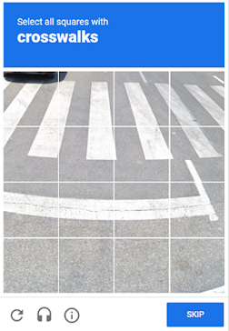

import Tabs from '@theme/Tabs';
import TabItem from '@theme/TabItem';
import ParamItem from '@theme/ParamItem';
import MethodItem from '@theme/MethodItem';
import MethodDescription from '@theme/MethodDescription';
import PriceBlock from '../../../../../src/theme/PriceBlock';
import PriceBlockWrap from '@theme/PriceBlockWrap';
import BlogLink from '@theme/BlogLink';
import { ArticleHead } from '../../../../../src/theme/ArticleHead';

<ArticleHead slug="no-captcha-task" />

# RecaptchaV2Task

<PriceBlockWrap>
  <PriceBlock title="RecaptchaV2Task" captchaId="rc2"/>
</PriceBlockWrap>

  

The object contains data for Google ReCaptcha2 solving task. To ensure the universality of the solution to this type of captcha, you need to use all the data used when automating the filling of the form on the target site, including proxies, browser UserAgent and cookies. This will help to avoid any problems when Google changes the code of its captcha.

This type of captcha might be solved a bit longer than usual image captcha, but this issue is compensated by the fact that  `g-recaptcha-response` value we send to you is valid for the next 60 seconds after we solves your ReCaptcha2.

<BlogLink url="https://capmonster.cloud/en/blog/re-captcha/how-to-bypass-recaptcha-v2-using-capmonster-cloud"/>

:::warning **Attention!**
CapMonster Cloud uses built-in proxies by default, which are suitable for most sites.
**If the token is rejected by the server**, you should retry using your own proxies — this increases the chance of successful verification.

Recommended procedure:

- First, solve the captcha without proxies.

- If the token is rejected by the target site, retry using your own proxies.

If you are using a proxy with IP authorization, make sure to whitelist the address **65.21.190.34**.
:::

## Request parameters

  <TabItem value="proxy" label="RecaptchaV2Task" className="bordered-panel">
    <ParamItem title="type" required type="string" />
    **RecaptchaV2Task**

     ---

    <ParamItem title="websiteURL" required type="string" />
    Address of a webpage with captcha.

     ---

    <ParamItem title="websiteKey" required type="string" />
    Recaptcha website key.<br />`<div class="g-recaptcha" data-sitekey="THIS_ONE"></div>`

     ---

    <ParamItem title="recaptchaDataSValue" type="string" />
    Some custom implementations may contain additional "data-s" parameter in ReCaptcha2 div, which is in fact a one-time token and must be grabbed every time you want to solve a ReCaptcha2.<br />`<div class="g-recaptcha" data-sitekey="some sitekey" data-s="THIS_ONE"></div>`

     ---

    <ParamItem title="userAgent" type="string" />
    Browser's User-Agent which is used in emulation. It is required that you use a signature of a modern browser, otherwise Google will ask you to "update your browser".

     ---

    <ParamItem title="cookies" type="string" />
    <p>Additional cookies which we must use during interaction with target page or Google.</p><p>**Format**: cookiename1=cookievalue1; cookiename2=cookievalue2</p>

     ---

    <ParamItem title="isInvisible" type="bool" />
    true if the captcha is invisible, i.e. has a hidden field for confirmation, no checkbox. If a bot is suspected, an additional check is called.

     ---

    <ParamItem title="proxyType" type="string" />
    **http** - regular http/https proxy;<br />**https** - try this option only if "http" doesn't work (required for some custom proxies);<br />**socks4** - socks4 proxy;<br />**socks5** - socks5 proxy.

     ---

    <ParamItem title="proxyAddress" type="string" />
    <p>
      IPv4/IPv6 proxy IP address. Not allowed:
      - using transparent proxies (where you can see the client's IP);
      - using proxies on local machines.
    </p>

     ---

    <ParamItem title="proxyPort" type="integer" />
    Proxy port.

     ---

    <ParamItem title="proxyLogin" type="string" />
    Proxy-server login.

     ---

    <ParamItem title="proxyPassword" type="string" />
    Proxy-server password.

  </TabItem>  

## Create task method

<Tabs className="full-width-tabs filled-tabs request-tabs" groupId="captcha-type">
	<TabItem value="proxyless" label="RecaptchaV2Task (without proxy)" default className="method-panel">
		<MethodItem>
			```http
			https://api.capmonster.cloud/createTask
			```
		</MethodItem>
		<MethodDescription>
			**Request**
			```json
			{
			  "clientKey":"API_KEY",
			  "task": {
				"type":"RecaptchaV2Task",
				"websiteURL":"https://lessons.zennolab.com/captchas/recaptcha/v2_simple.php?level=high",
				"websiteKey":"6Lcg7CMUAAAAANphynKgn9YAgA4tQ2KI_iqRyTwd"
			  }
			}
			```
			**Response**
			```json
			{
			  "errorId":0,
			  "taskId":407533072
			}
			```
		</MethodDescription>
	</TabItem>

	<TabItem value="proxy" label="RecaptchaV2Task (with proxy)" className="method-panel">
		<MethodItem>
			```http
			https://api.capmonster.cloud/createTask
			```
		</MethodItem>
		<MethodDescription>
			**Request**
			```json
			{
			  "clientKey":"API_KEY",
			  "task": {
				"type":"RecaptchaV2Task",
				"websiteURL":"https://lessons.zennolab.com/captchas/recaptcha/v2_simple.php?level=high",
				"websiteKey":"6Lcg7CMUAAAAANphynKgn9YAgA4tQ2KI_iqRyTwd",
				"proxyType":"http",
				"proxyAddress":"8.8.8.8",
				"proxyPort":8080,
				"proxyLogin":"proxyLoginHere",
				"proxyPassword":"proxyPasswordHere",
				"userAgent":"userAgentPlaceholder"
			  }
			}
			```
			**Response**
			```json
			{
			  "errorId":0,
			  "taskId":407533072
			}
			```
		</MethodDescription>
	</TabItem>  
</Tabs>

## Get task result method

:::warning **Warning!**
On some websites, it is important that the UserAgent matches the one used when solving the captcha. Therefore, if CapMonster Cloud returns a UserAgent along with the token, **always** apply it when submitting the form or confirming the solution on the target page.
:::

Use the [getTaskResult](../api/methods/get-task-result.md) method to request answer for ReCaptcha2. You will get response within 100 ms depending on service workload.

<TabItem value="proxyless" label="RecaptchaV2Task (without proxy)" default className="method-panel-full">
	<MethodItem>
		```http
		https://api.capmonster.cloud/getTaskResult
		```
	</MethodItem>
	<MethodDescription>
		**Request**
		```json
		{
		  "clientKey":"API_KEY",
		  "taskId": 407533072
		}
		```
		**Response**
		```json
		{
		  "errorId":0,
		  "status":"ready",
		  "solution": {
			"gRecaptchaResponse":"3AHJ_VuvYIBNBW5yyv0zRYJ75VkOKvhKj9_xGBJKnQimF72rfoq3Iy-DyGHMwLAo6a3"
		  }
		}
		```
   For some websites, the response may look like this (use the returned UserAgent when confirming the solution):
 
		```json
		{
		  "errorId":0,
		  "status":"ready",
		  "solution": {
			"userAgent": "Mozilla/5.0 (Windows NT 10.0; Win64; x64) AppleWebKit/537.36 (KHTML, like Gecko) Chrome/139.0.0.0 Safari/537.36", 
                "gRecaptchaResponse": "0cAFcWeA5Y3...hF8UWA", 
                "cookies": {"nocookies": "true"}}"
		  }
		}
		```

	</MethodDescription>
</TabItem>

<br />

|**Property**|**Type**|**Description**|
| :- | :- | :- |
|gRecaptchaResponse|String|Hash which should be inserted into Recaptcha2 submit form in `<textarea id="g-recaptcha-response" ..></textarea>` . It has a length of 500 to 2190 bytes.

## How to find all required parameters for task creation

### Manually

1. Open your website where the captcha appears in the browser.
2. Right-click on the captcha element and select **Inspect**.

#### websiteKey (data-sitekey)

**Elements** tab: look for a `<div class="g-recaptcha">` element on the page. Copy the value of the *data-sitekey* attribute, for example:


**Network** tab:

Open the **Network** tab and reload the page with the captcha. Look for a request like the one below (the **k** value is the *data-sitekey*):


#### recaptchaDataSValue (if used)

If the page contains a *data-s* attribute, find it in the HTML:


#### isInvisible

**Network** tab: if the captcha is invisible, the element will contain the attribute *size="invisible"*, for example:


### Automatically

A convenient way to automate the search for all necessary parameters.
Some parameters are regenerated every time the page loads, so you'll need to extract them through a browser — either regular or headless (e.g., using **Playwright**).
Since the values of dynamic parameters are short-lived, the captcha must be solved immediately after retrieving them.

:::warning **Important!**
The code snippets provided are basic examples for familiarization with extracting the required parameters. The exact implementation will depend on your captcha page, its structure, and the HTML elements/selectors it uses.
:::

<Tabs className="full-width-tabs filled-tabs request-tabs">
  <TabItem value="js" label="JavaScript" default className="method-panel">
    <details>
      <summary>Show Code (for browser)</summary>

      ```js
      (() => {
        const iframeEl = document.querySelector('iframe[src^="https://www.google.com/recaptcha/api2/anchor?"]');
        const captchaUrl = iframeEl?.getAttribute('src');

        if (captchaUrl) {
          const urlParams = new URLSearchParams(captchaUrl.split('?')[1]);
          
          const sitekey = urlParams.get('k');
          const size = urlParams.get('size');
          
          const isInvisible = size === 'invisible';

          const sitekeyEl = document.querySelector('[data-sitekey]');
          const datasEl = document.querySelector('[data-s]');
          const datas = datasEl?.getAttribute('data-s');

          console.log({
            sitekey: sitekey || sitekeyEl?.getAttribute('data-sitekey'),
            datas,
            isInvisible
          });
        }
      })();
      ```
    </details>

    <details>
      <summary>Show Code (Node.js)</summary>

      ```js
      import { chromium } from "playwright";

      (async () => {
        const browser = await chromium.launch({ headless: false });
        const page = await browser.newPage();

        await page.goto("https://example.com");

        await page.waitForSelector('iframe[src^="https://www.google.com/recaptcha/api2/anchor?"]');

        const captchaData = await page.evaluate(() => {
          const iframeEl = document.querySelector('iframe[src^=
          "https://www.google.com/recaptcha/api2/anchor?"]');
          const captchaUrl = iframeEl?.getAttribute("src");

          if (captchaUrl) {
            const urlParams = new URLSearchParams(captchaUrl.split("?")[1]);
            const sitekey = urlParams.get("k");
            const size = urlParams.get("size");
            const isInvisible = size === "invisible";

            const sitekeyEl = document.querySelector("[data-sitekey]");
            const datasEl = document.querySelector("[data-s]");
            const datas = datasEl?.getAttribute("data-s");

            return {
              sitekey: sitekey || sitekeyEl?.getAttribute("data-sitekey"),
              datas,
              isInvisible,
            };
          }
          return null;
        });

        console.log(captchaData);
        await browser.close();
      })();
      ```
    </details>
  </TabItem>

  <TabItem value="python" label="Python" className="method-panel">
    <details>
      <summary>Show Code</summary>

      ```python
      import asyncio
      from urllib.parse import urlparse, parse_qs
      from playwright.async_api import async_playwright

      def parse_recaptcha_url(url):
          parsed_url = urlparse(url)
          params = parse_qs(parsed_url.query)
          sitekey = params.get('k', [None])[0]
          size = params.get('size', [None])[0]
          return sitekey, size == 'invisible'

      async def main():
          async with async_playwright() as p:
              browser = await p.chromium.launch(headless=True)
              page = await browser.new_page()
              await page.goto("https://example.com", timeout=60000)
              captcha_url = await page.locator('iframe[
              src^="https://www.google.com/recaptcha/api2/anchor?"]').get_attribute('src')
              if captcha_url:
                  sitekey, is_invisible = parse_recaptcha_url(captcha_url)
                  print({"sitekey": sitekey, "isInvisible": is_invisible})
              await browser.close()

      asyncio.run(main())
      ```
    </details>
  </TabItem>

  <TabItem value="csharp" label="C#" className="method-panel">
    <details>
      <summary>Show Code</summary>

      ```csharp
      using Microsoft.Playwright;
      using System;
      using System.Linq;
      using System.Threading.Tasks;
      using System.Web;

      class Program
      {
          static (string sitekey, bool isInvisible) ParseRecaptchaUrl(string url)
          {
              var uri = new Uri(url);
              var queryParams = HttpUtility.ParseQueryString(uri.Query);
              return (queryParams["k"], queryParams["size"] == "invisible");
          }

          static async Task Main(string[] args)
          {
              var playwright = await Playwright.CreateAsync();
              var browser = await playwright.Chromium.LaunchAsync(
                new BrowserTypeLaunchOptions { Headless = true });
              var page = await browser.NewPageAsync();
              await page.GotoAsync("https://example.com", new PageGotoOptions { Timeout = 60000 });
              var captchaUrl = await page.Locator(
                "iframe[src^='https://www.google.com/recaptcha/api2/anchor?']").GetAttributeAsync("src");
              if (captchaUrl != null)
              {
                  var (sitekey, isInvisible) = ParseRecaptchaUrl(captchaUrl);
                  Console.WriteLine($"{{\"sitekey\": \"{sitekey}\", \"isInvisible\": {isInvisible}}}");
              }
              await browser.CloseAsync();
          }
      }
      ```
    </details>
  </TabItem>
</Tabs>

## Use the SDK Library

<Tabs className="full-width-tabs filled-tabs request-tabs" groupId="captcha-type">
  <TabItem value="js" label="JavaScript" default className="method-panel">
    ```js
    // https://github.com/ZennoLab/capmonstercloud-client-js

    import { CapMonsterCloudClientFactory, ClientOptions, RecaptchaV2Request } 
      from '@zennolab_com/capmonstercloud-client';

    document.addEventListener('DOMContentLoaded', async () => {

      const cmcClient = CapMonsterCloudClientFactory.Create(
        new ClientOptions({ clientKey: '<your capmonster.cloud API key>' })
      );

      console.log(await cmcClient.getBalance());

      const recaptchaV2Request = new RecaptchaV2Request({
        websiteURL: 'https://lessons.zennolab.com/captchas/recaptcha/v2_simple.php?level=high', // URL of the page with the captcha
        websiteKey: '6Lcg7CMUAAAAANphynKgn9YAgA4tQ2KI_iqRyTwd', // Replace with the correct value
      });

      // Option with proxy (if required)
      // Uncomment the block below and fill in the proxy details

      /*
      const recaptchaV2Request = new RecaptchaV2Request({
        websiteURL: 'https://lessons.zennolab.com/captchas/recaptcha/v2_simple.php?level=high',
        websiteKey: '6Lcg7CMUAAAAANphynKgn9YAgA4tQ2KI_iqRyTwd',
        proxyType: 'http',           // Proxy type: http, https, socks4, socks5
        proxyAddress: '8.8.8.8',     
        proxyPort: 8080,             
        proxyLogin: 'proxyLoginHere',
        proxyPassword: 'proxyPasswordHere',
        userAgent: 'userAgentPlaceholder',
      });
      */

      console.log(await cmcClient.Solve(recaptchaV2Request));
    });
    ```
    <BlogLink url="https://capmonster.cloud/en/blog/re-1/javascript-recaptcha-v2"/>
  </TabItem>

  <TabItem value="python" label="Python" className="method-panel">
    ```python
    # https://github.com/ZennoLab/capmonstercloud-client-python

    import asyncio
    from capmonstercloudclient import CapMonsterClient, ClientOptions
    from capmonstercloudclient.requests import RecaptchaV2Request

    # Enter your CapMonster Cloud API key
    client_options = ClientOptions(api_key="your_api_key")  
    cap_monster_client = CapMonsterClient(options=client_options)

    # Option 1: Without proxy

    recaptcha2_request = RecaptchaV2Request(
        websiteUrl="https://lessons.zennolab.com/captchas/recaptcha/v2_simple.php?level=high",  # URL of the page with the captcha
        websiteKey="6Lcg7CMUAAAAANphynKgn9YAgA4tQ2KI_iqRyTwd"  # Replace with the correct value
    )

    # Option 2: With proxy
    # Uncomment if you need to use a proxy

    # recaptcha2_request = RecaptchaV2Request(
    #     websiteUrl="https://lessons.zennolab.com/captchas/recaptcha/v2_simple.php?level=high",
    #     websiteKey="6Lcg7CMUAAAAANphynKgn9YAgA4tQ2KI_iqRyTwd",
    #     proxyType="http",                
    #     proxyAddress="8.8.8.8",         
    #     proxyPort=8080,                 
    #     proxyLogin="proxyLoginHere",     
    #     proxyPassword="proxyPasswordHere", 
    #     userAgent="userAgentPlaceholder"
    # )

    async def solve_captcha():
        return await cap_monster_client.solve_captcha(recaptcha2_request)

    # Run
    response = asyncio.run(solve_captcha())
    print(response)
    ```
    <BlogLink url="https://capmonster.cloud/en/blog/re-1/python-recaptcha-v2"/>
  </TabItem>

  <TabItem value="csharp" label="C#" className="method-panel">
    ```csharp
    // https://github.com/ZennoLab/capmonstercloud-client-dotnet

    using System;
    using System.Threading.Tasks;
    using Zennolab.CapMonsterCloud;
    using Zennolab.CapMonsterCloud.Requests;

    class Program
    {
        static async Task Main(string[] args)
        {
            // Your CapMonster Cloud API key
            var clientOptions = new ClientOptions
            {
                ClientKey = "your_api_key"
            };

            var cmCloudClient = CapMonsterCloudClientFactory.Create(clientOptions);

            // Option 1: Without proxy

            var recaptchaV2Request = new RecaptchaV2Request
            {
                WebsiteUrl = "https://lessons.zennolab.com/captchas/recaptcha/v2_simple.php?level=high", // URL of the page with the captcha
                WebsiteKey = "6Lcg7CMUAAAAANphynKgn9YAgA4tQ2KI_iqRyTwd"  // Replace with the correct value
            };

            // Option 2: With proxy
            // Uncomment if you need to use a proxy
            /*
            var recaptchaV2Request = new RecaptchaV2Request
            {
                WebsiteUrl = "https://lessons.zennolab.com/captchas/recaptcha/v2_simple.php?level=high",
                WebsiteKey = "6Lcg7CMUAAAAANphynKgn9YAgA4tQ2KI_iqRyTwd",

                Proxy = new ProxyContainer(
                    "8.8.8.8",        
                    8080,              
                    ProxyType.Http,    
                    "proxyLoginHere", 
                    "proxyPasswordHere"
                )
            };
            */

            var recaptchaV2Result = await cmCloudClient.SolveAsync(recaptchaV2Request);

            Console.WriteLine("Captcha solution: " + recaptchaV2Result.Solution.Value);
        }
    }
    ```
    <BlogLink url="https://capmonster.cloud/en/blog/re-1/c-recaptcha-v2"/>
  </TabItem>
</Tabs>
