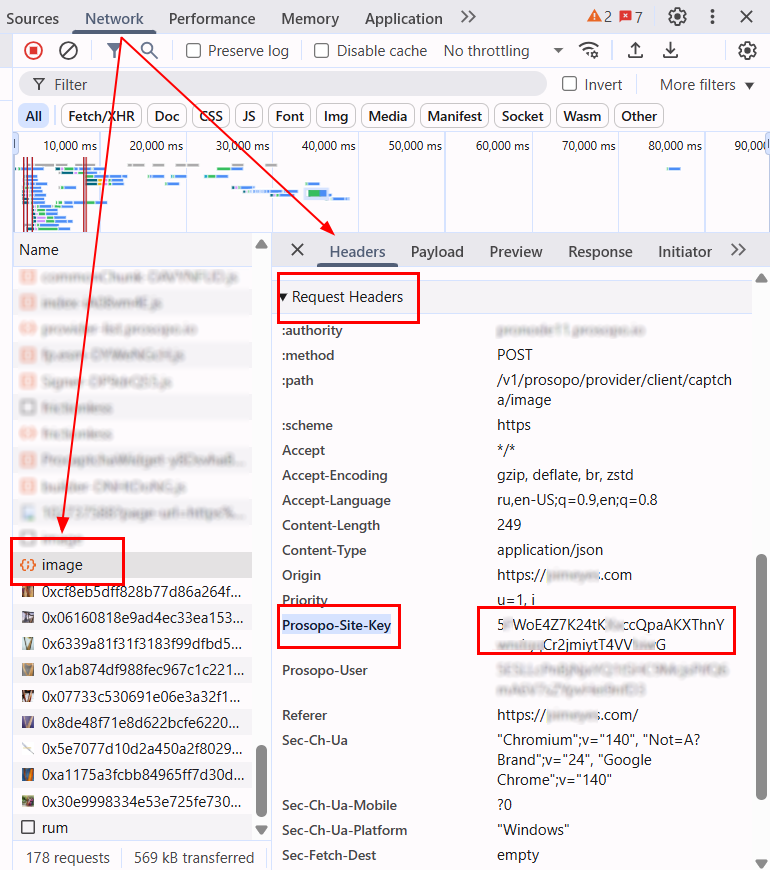

import Tabs from '@theme/Tabs';
import TabItem from '@theme/TabItem';
import ParamItem from '@theme/ParamItem';
import MethodItem from '@theme/MethodItem';
import MethodDescription from '@theme/MethodDescription'
import PriceBlock from '../../../../../src/theme/PriceBlock';
import PriceBlockWrap from '@theme/PriceBlockWrap';


# Prosopo Procaptcha

<PriceBlockWrap>
  <PriceBlock title="Prosopo captcha" captchaId="prosopo"/>
</PriceBlockWrap>


:::warning **Attention!**
CapMonster Cloud uses built-in proxies by default — their cost is already included in the service. You only need to specify your own proxies in cases where the website does not accept the token or access to the built-in services is restricted.

If you are using a proxy with IP authorization, make sure to whitelist the address **65.21.190.34**.
:::

The token-based automatic CAPTCHA solving method Prosopo Procaptcha.

## Request parameters

  <TabItem value="proxy" label="ProsopoTask (with proxy)" default className="bordered-panel">

    <ParamItem title="type" required type="string" />
    **ProsopoTask**

    ---

    <ParamItem title="websiteURL" required type="string" />
    The full URL of the CAPTCHA page.

    ---

    <ParamItem title="websiteKey" required type="string" />
    The value of the `siteKey` parameter found on the page.
	
	---

    <ParamItem title="proxyType" type="string" />
    **http** - regular http/https proxy;<br />**https** - try this option only if "http" doesn't work (required for some custom proxies);<br />**socks4** - socks4 proxy;<br />**socks5** - socks5 proxy.
	
	---

    <ParamItem title="proxyAddress" type="string" />
    <p>
      IPv4/IPv6 proxy IP address. Not allowed:
      - using transparent proxies (where you can see the client's IP);
      - using proxies on local machines.
    </p>

    ---

    <ParamItem title="proxyPort" type="integer" />
    Proxy port.

    ---

    <ParamItem title="proxyLogin" type="string" />
    Proxy-server login.

    ---

    <ParamItem title="proxyPassword" type="string" />
    Proxy-server password.

  </TabItem>


## Create task method

<Tabs className="full-width-tabs filled-tabs request-tabs" groupId="captcha-type">
  <TabItem value="proxyless" label="ProsopoTask (without proxy)" default className="method-panel">
	<MethodItem>
		```http
		https://api.capmonster.cloud/createTask
		```
	</MethodItem>
	<MethodDescription>
		**Request**
		```json
		{
			"clientKey": "API_KEY",
			"task": 
			{
				"type": "ProsopoTask",
				"websiteURL": "https://www.example.com",
				"websiteKey": "5EZU3LG31uzq1Mwi8inwqxmfvFDpj7VzwDnZwj4Q3syyxBwV"
			}
		}
		```
		**Response**
		```json
		{
			"errorId":0,
			"taskId":407533077
		}
		```
	</MethodDescription>
  </TabItem>
  
  <TabItem value="proxy" label="ProsopoTask (with proxy)" default className="method-panel">
	<MethodItem>
		```http
		https://api.capmonster.cloud/createTask
		```
	</MethodItem>
	<MethodDescription>
		**Request**
		```json
		{
			"clientKey": "API_KEY",
			"task": 
			{
				"type": "ProsopoTask",
				"websiteURL": "https://www.example.com",
				"websiteKey": "5EZU3LG31uzq1Mwi8inwqxmfvFDpj7VzwDnZwj4Q3syyxBwV",
				"proxyType":"http",
				"proxyAddress":"8.8.8.8",
				"proxyPort":8080,
				"proxyLogin":"proxyLoginHere",
				"proxyPassword":"proxyPasswordHere"
			}
		}
		```
		**Response**
		```json
		{
			"errorId":0,
			"taskId":407533077
		}
		```
	</MethodDescription>
  </TabItem>
</Tabs>


## Get task result method
Use the method [getTaskResult](../api/methods/get-task-result.md) to obtain the Prosopo solution.

<TabItem value="proxyless" label="CustomTask (without proxy)" default className="method-panel-full">
	<MethodItem>
		```http
		https://api.capmonster.cloud/getTaskResult
		```
	</MethodItem>
	<MethodDescription>
		**Request**
		```json
		{
			"clientKey":"API_KEY",
			"taskId": 407533077
		}
		```
		**Response**
		```json
		{
			"errorId":0,
			"status":"ready",
			"solution": 
			{
				"token": "0x00016c68747470733a2f2f70726f6e6f6465332e70726f736f706f2e696fc0354550516f4d5a454463354c704e376774784d4d7a5950547a4136..."
			}
		}
		```
	</MethodDescription>
</TabItem>

## How to find the websiteKey

1. Open the site where the Prosopo captcha is triggered.

2. Go to **Developer Tools** (**DevTools**) → **Network**, reload the page, and look for a request that loads an `image` (for example, an API request like `https://example.prosopo.io/v1/prosopo/provider/client/captcha/image`).

3. In **Request Headers**, find the `Prosopo-Site-Key` parameter, copy its value, and use it when creating the request.




## Use the SDK library

<Tabs className="full-width-tabs filled-tabs request-tabs" groupId="captcha-type">

  <TabItem value="js" label="JavaScript" default className="method-panel">

  ```js
  // https://github.com/ZennoLab/capmonstercloud-client-js

  import { CapMonsterCloudClientFactory, ClientOptions, ProsopoRequest } from '@zennolab_com/capmonstercloud-client';

  document.addEventListener('DOMContentLoaded', async () => {
    const cmcClient = CapMonsterCloudClientFactory.Create(
      new ClientOptions({ clientKey: '<your capmonster.cloud API key>' })
    );

    console.log(await cmcClient.getBalance());

    const prosopoRequest = new ProsopoRequest({
      websiteURL: 'https://www.example.com', // Page URL with captcha 
      websiteKey: '5EZU3LG31uzq1Mwi8inwqxmfvFDpj7VzwDnZwj4Q3syyxBwV' //Replace with correct value
      /*
      // If you need to use a proxy:
      proxy: {
        type: 'http',
        address: '127.0.0.1',
        port: 8000,
        login: 'user',
        password: 'password'
      }
      */
    });

    console.log(await cmcClient.Solve(prosopoRequest));
  });
````

  </TabItem>

  <TabItem value="python" label="Python" default className="method-panel">

```python
# https://github.com/ZennoLab/capmonstercloud-client-python

import asyncio
from capmonstercloudclient import CapMonsterClient, ClientOptions
from capmonstercloudclient.requests import ProsopoTaskRequest

# Your CapMonster Cloud API key
client_options = ClientOptions(api_key="API_KEY")
cap_monster_client = CapMonsterClient(options=client_options)

# Option 1: without proxy
prosopo_request = ProsopoTaskRequest(
    websiteUrl="https://www.example.com",  # Page URL with captcha 
    websiteKey="5EZU3LG31uzq1Mwi8inwqxmfvFDpj7VzwDnZwj4Q3syyxBwV"  # Replace with correct value
)

# Option 2: with proxy
# Uncomment if needed
# prosopo_request = ProsopoTaskRequest(
#     websiteUrl="https://www.example.com",
#     websiteKey="5EZU3LG31uzq1Mwi8inwqxmfvFDpj7VzwDnZwj4Q3syyxBwV",
#     proxyType="http",
#     proxyAddress="123.45.67.89",
#     proxyPort=8080,
#     proxyLogin="proxyUser",
#     proxyPassword="proxyPass"
# )

async def solve_captcha():
    return await cap_monster_client.solve_captcha(prosopo_request)

responses = asyncio.run(solve_captcha())
print(responses)
```

  </TabItem>

  <TabItem value="csharp" label="C#" className="method-panel">

```csharp
// https://github.com/ZennoLab/capmonstercloud-client-dotnet

using System;
using System.Text.Json;
using System.Threading.Tasks;
using Zennolab.CapMonsterCloud;
using Zennolab.CapMonsterCloud.Requests;

class Program
{
    static async Task Main(string[] args)
    {
        // Your CapMonster Cloud API key
        var clientOptions = new ClientOptions
        {
            ClientKey = "your_api_key" // Your CapMonster Cloud API key
        };

        var cmCloudClient = CapMonsterCloudClientFactory.Create(clientOptions);

        // Option 1: Without proxy
        var prosopoRequest = new ProsopoTaskRequest
        {
            WebsiteUrl = "https://example.com", // Page URL with captcha 
            WebsiteKey = "5DCKg3w9AvDW92uBzRWrvTiWsu573bTzYmFny8EkXQZxsBib" // Replace with correct value
        };

        // Option 2: With proxy
        // Uncomment if you need to use a proxy
        /*
        var prosopoRequest = new ProsopoTaskRequest
        {
            WebsiteUrl = "https://www.example.com",
            WebsiteKey = "5EZU3LG31uzq1Mwi8inwqxmfvFDpj7VzwDnZwj4Q3syyxBwV",
            Proxy = new ProxyContainer(
                "123.45.67.89",
                8080,
                ProxyType.Http,
                "proxyLogin",
                "proxyPassword"
            )
        };
        */

        var prosopoResult = await cmCloudClient.SolveAsync(prosopoRequest);

        Console.WriteLine("Prosopo Solution: " + JsonSerializer.Serialize(prosopoResult.Solution.Value));
    }
}
```

  </TabItem>

</Tabs>
