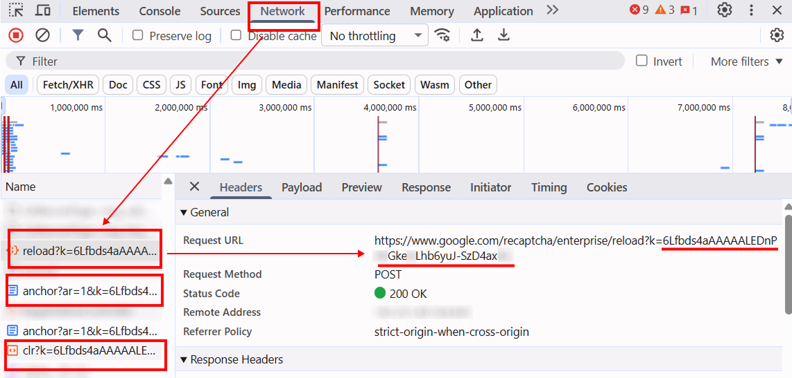

import Tabs from '@theme/Tabs';
import TabItem from '@theme/TabItem';
import ParamItem from '@theme/ParamItem';
import MethodItem from '@theme/MethodItem';
import MethodDescription from '@theme/MethodDescription'
import PriceBlock from '../../../../../src/theme/PriceBlock';
import PriceBlockWrap from '@theme/PriceBlockWrap';
import BlogLink from '@theme/BlogLink';
import { ArticleHead } from '../../../../../src/theme/ArticleHead';

<ArticleHead slug="captchas/recaptcha-v3-enterprise-task" />

# reCAPTCHA v3 Enterprise

<PriceBlockWrap>
  <PriceBlock title="RecaptchaV3Enterprise" captchaId="rc3e"/>
</PriceBlockWrap>


:::warning **Attention!**
The task is executed through our own proxy servers. There are no additional costs for proxies — their usage is already included in the service price.
:::

This section contains a description of the task for solving reCAPTCHA v3 Enterprise by Google.

reCAPTCHA v3 Enterprise operates entirely in the background and does not require the user to perform any actions. The system analyzes behavioral and technical signals from the page visitor and generates a risk assessment for each request. Based on this information, the site decides whether the action is allowed, using a trust score that typically ranges from **0.1** to **0.9**.

## Request parameters

<TabItem value="proxyless" label="RecaptchaV3EnterpriseTaskProxyless (without proxy)" default className="bordered-panel">
    <ParamItem title="type" required type="string" />
    **RecaptchaV3EnterpriseTask**

    ---

    <ParamItem title="websiteURL" required type="string" />
    Address of a webpage with Google ReCaptcha.

    ---

    <ParamItem title="websiteKey" required type="string" />
    The ReCaptcha v3 site key on the target page.
    <br/>https://www.google.com/recaptcha/enterprise.js?render=THIS_ONE

    ---

    <ParamItem title="minScore" type="double" />
    Can have a value from **0.1** to **0.9**

    ---

    <ParamItem title="pageAction" type="string" />
    <p>The `action` parameter value passed by the ReCaptcha widget to Google, which is visible to the site owner during server-side verification. Default value: *verify*</p>
    <p>Example in HTML:
    <br/>*`grecaptcha.execute('site_key', {action:'login_test'})`*.</p>
</TabItem>

## Create task method

<TabItem value="proxyless" label="RecaptchaV3EnterpriseTaskProxyless (without proxy)" default className="method-panel">
	<MethodItem>
		```http
		https://api.capmonster.cloud/createTask
		```
	</MethodItem>
	<MethodDescription>
		**Request**
		```json
		{
		  "clientKey":"API_KEY",
		  "task": {
			"type":"RecaptchaV3EnterpriseTask",
			"websiteURL":"https://example.com",
			"websiteKey":"6Le0xVgUAAAAAIt20XEB4rVhYOODgTl00d4TuRTE",
			"minScore": 0.7
		  }
		}
		```
		**Response**
		```json
		{
		  "errorId":0,
		  "taskId":407533072
		}
		```
	</MethodDescription>
</TabItem>

:::warning **Warning!**
On some websites, it is important that the UserAgent matches the one used when solving the captcha. Therefore, if CapMonster Cloud returns a UserAgent along with the token, **always** apply it when submitting the form or confirming the solution on the target page.
:::

Use the [getTaskResult](../api/methods/get-task-result.mdx) to request answer for ReCaptcha3. You will get response within 10 - 30 sec period depending on service workload.

<TabItem value="proxyless" label="GeeTestTaskProxyless (without proxy)" default className="method-panel-full">
	<MethodItem>
		```http
		https://api.capmonster.cloud/getTaskResult
		```
	</MethodItem>
	<MethodDescription>
		**Request**
		```json
		{
		  "clientKey":"API_KEY",
		  "taskId": 407533072
		}
		```
		**Response**
		```json
		{
		  "errorId":0,
		  "status":"ready",
		  "solution": {
			"gRecaptchaResponse":"3AHJ_VuvYIBNBW5yyv0zRYJ75VkOKvhKj9_xGBJKnQimF72rfoq3Iy-DyGHMwLAo6a3"
		  }
		}
		```
    For some websites, the response may look approximately like the following. When confirming the solution, you should use the UserAgent provided in the response, even if it differs from the current browser UserAgent:

    ```json
		{
		  "errorId":0,
		  "status":"ready",
		  "solution": {
			"gRecaptchaResponse":"3AHJ_VuvYIBNBW5yyv0zRYJ75VkOKvhKj9_xGBJKnQimF72rfoq3Iy-DyGHMwLAo6a3",
			"userAgent": "Mozilla/5.0 (Macintosh; Intel Mac OS X 10_15_7) AppleWebKit/537.36 (KHTML, like Gecko) Chrome/138.0.0.0 Safari/537.36"
		  }
		}
		```
	</MethodDescription>
</TabItem>

<br />

|**Property**|**Type**|**Description**|
| :- | :- | :- |
|gRecaptchaResponse|String|Hash which should be inserted into Recaptcha3 submit form in `<textarea id="g-recaptcha-response" ></textarea>`. It has a length of 500 to 2190 bytes.|

## Differences between **reCAPTCHA v3 Enterprise** and standard **reCAPTCHA v3**

| Feature                        | reCAPTCHA v3                                              | reCAPTCHA v3 Enterprise                                                                                          |
| ------------------------------ | --------------------------------------------------------- | ---------------------------------------------------------------------------------------------------------------- |
| **Script URL**                 | `https://www.google.com/recaptcha/api.js?render=site_key` | `https://www.google.com/recaptcha/enterprise.js?render=site_key`                                                 |
| **Identification on the site** | iframe and script use standard v3 URLs                    | iframe and script include `enterprise` in the URL (`/enterprise.js`, `/enterprise/anchor`, `/enterprise/reload`) |

**Practical way to identify:**

1. Open the page with the captcha and enable **DevTools → Network**.
2. Locate the reCAPTCHA scripts:

   * If the URL contains `/enterprise.js` → it’s **v3 Enterprise**.
   * If the URL contains `/api.js` → it’s standard **v3**.
3. You can also inspect the reCAPTCHA iframe: in Enterprise, the iframe URL contains `/enterprise/anchor`, whereas in standard v3 it contains `/anchor`.

## How to find the `websiteKey` for creating a task

### Manually

1. Open the page on your website where the captcha is displayed.
2. Open **Developer Tools** in your browser and go to the **Network** tab.
3. Reload the page and pay attention to requests, for example:

   * `https://www.google.com/recaptcha/enterprise/anchor?ar=1&k=`
   * `https://www.google.com/recaptcha/enterprise.js?render=`
   * `https://www.google.com/recaptcha/enterprise/reload?k=`
   * `https://www.google.com/recaptcha/enterprise/clr?k=`
4. The **k** parameter in these URLs corresponds to the **websiteKey**.



### Automatically

To automate parameter extraction, you can retrieve them via a **browser** (regular or headless, e.g., using **Playwright**) or directly from **HTTP requests**. Since dynamic parameter values are short-lived, it is recommended to use them immediately after retrieval.

:::warning **Important!**
The provided code snippets are basic examples for learning how to extract the required parameters. The exact implementation will depend on your captcha page, its structure, and the HTML elements and selectors used.
:::

<Tabs className="full-width-tabs filled-tabs request-tabs">
  <TabItem value="js" label="JavaScript" default className="method-panel">
    <details>
      <summary>Show code (for browser console)</summary>

      ```js
      const iframe = document.querySelector('iframe[src*="recaptcha"]');

      if (iframe) {
        const src = iframe.src;
        const k = new URL(src).searchParams.get('k');
        console.log('Site key:', k);
      } else {
        console.log('reCAPTCHA iframe not found');
      }
      ```
    </details>

    <details>
      <summary>Show code (Node.js)</summary>

```js
// In this example, we use Playwright

const { chromium } = require("playwright");

(async () => {
  const browser = await chromium.launch({ headless: false });
  const page = await browser.newPage();

  // Replace with your target URL
  await page.goto("https://example.com/", {
    waitUntil: "load",
  });

  await page.waitForSelector('iframe[src*="recaptcha"]', { timeout: 10000 });

  const k = await page.evaluate(() => {
    const iframe = document.querySelector('iframe[src*="recaptcha"]');
    if (!iframe) return null;
    return new URL(iframe.src).searchParams.get("k");
  });

  console.log("Site key:", k);

  await browser.close();
})();
```
    </details>
  </TabItem>

  <TabItem value="python" label="Python" className="method-panel">
    <details>
      <summary>Show code</summary>

```python
# In this example, we use Playwright

from playwright.sync_api import sync_playwright

with sync_playwright() as p:
    browser = p.chromium.launch(headless=False)
    page = browser.new_page()

    # Replace with your target URL
    page.goto("https://www.example.com/", wait_until="load")

    page.wait_for_selector('iframe[src*="recaptcha"]', timeout=10000)

    k = page.evaluate("""
    () => {
        const iframe = document.querySelector('iframe[src*="recaptcha"]');
        if (!iframe) return null;
        return new URL(iframe.src).searchParams.get("k");
    }
    """)

    print("Site key:", k)
    browser.close()
      ```
    </details>
  </TabItem>

  <TabItem value="csharp" label="C#" className="method-panel">
    <details>
      <summary>Show code</summary>

```csharp
// In this example, we use Playwright

using Microsoft.Playwright;
using System;
using System.Threading.Tasks;

class Program
{
    public static async Task Main()
    {
        using var playwright = await Playwright.CreateAsync();
        await using var browser = await playwright.Chromium.LaunchAsync(new BrowserTypeLaunchOptions { Headless = false });
        var page = await browser.NewPageAsync();

        // Replace with your target URL
        await page.GotoAsync("https://example.com/", new PageGotoOptions { WaitUntil = WaitUntilState.Load });

        await page.WaitForSelectorAsync("iframe[src*='recaptcha']", new PageWaitForSelectorOptions { Timeout = 10000 });

        var k = await page.EvaluateAsync<string>(@"() => {
            const iframe = document.querySelector('iframe[src*=""recaptcha""]');
            if (!iframe) return null;
            return new URL(iframe.src).searchParams.get('k');
        }");

        Console.WriteLine("Site key: " + k);
        await browser.CloseAsync();
    }
}
```
    </details>
  </TabItem>
</Tabs>