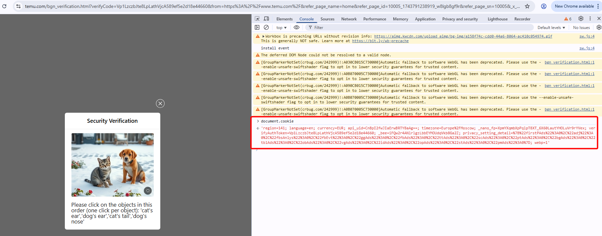

import Tabs from '@theme/Tabs';
import TabItem from '@theme/TabItem';
import ParamItem from '@theme/ParamItem';
import MethodItem from '@theme/MethodItem';
import MethodDescription from '@theme/MethodDescription'
import PriceBlock from '../../../../../src/theme/PriceBlock';
import PriceBlockWrap from '@theme/PriceBlockWrap';
import BlogLink from '@theme/BlogLink';

# Temu

<PriceBlockWrap>
  <PriceBlock title="Temu captcha" captchaId="temu"/>
</PriceBlockWrap>

## Request parameters

<TabItem value="proxyless" label="CustomTask (without proxy)" default className="bordered-panel">
    <ParamItem title="type" required type="string" />
    **CustomTask**

    ---

    <ParamItem title="class" required type="string" />
    **Temu**

    ---

    <ParamItem title="websiteURL" required type="string" />
    The full URL of the page where the CAPTCHA is loaded ( https://www.temu.com/bgn_verification.html?....... )

    ---
    <ParamItem title="metadata.cookie" required="required" type="string" />
    Cookies obtained via `document.cookie` on the page where the CAPTCHA is loaded

    ---

    <ParamItem title="userAgent" type="string" />
    The User-Agent of the browser. <br /> 
	**Only pass the current UA. The current one is**: userAgentPlaceholder
</TabItem>

### How to obtain the metadata.cookie parameter
The value for the `metadata.cookie` parameter can be obtained on the CAPTCHA page via the `document.cookie` property.
 


## Create task method

<TabItem value="proxyless" label="CustomTask (without proxy)" default className="method-panel">
	<MethodItem>
		```http
		https://api.capmonster.cloud/createTask
		```
	</MethodItem>
	<MethodDescription>
		**Request**
		```json
		{
			"clientKey": "API_KEY",
			"task": {
				"type": "CustomTask",
				"class": "Temu",
				"websiteURL": "https://www.temu.com/bgn_verification.html?verifyCode=7PRQIzDznoFE67ecZYtRTw394f6185143a4af80&from=https%3A%2F%2Fwww.temu.com%2F&refer_page_name=home&refer_page_id=10005_1743074140645_cwb6un82rq&refer_page_sn=10005&_x_sessn_id=xmp1zuyv7y",
				"userAgent": "userAgentPlaceholder",
				"metadata": {
					"cookie": "region=141; language=en; currency=EUR; api_uid=CnBpI2fwFW2BogBITHVYAg==; timezone=Europe%2FMoscow; _nano_fp=XpmYXqmJnqX8npXblT_T6~7rkpA2LDnz2BPFuT5m; privacy_setting_detail=%7B%22firstPAds%22%3A0%2C%22adj%22%3A0%2C%22fbsAnlys%22%3A0%2C%22fbEvt%22%3A0%2C%22ggAds%22%3A0%2C%22fbAds%22%3A0%2C%22ttAds%22%3A0%2C%22scAds%22%3A0%2C%22ptAds%22%3A0%2C%22bgAds%22%3A0%2C%22tblAds%22%3A0%2C%22obAds%22%3A0%2C%22vgAds%22%3A0%2C%22idAds%22%3A0%2C%22opAds%22%3A0%2C%22stAds%22%3A0%2C%22pmAds%22%3A0%7D; webp=1; _bee=pgoBlKp038lBhEyoQ4yXnuNrw1X5va2U; verifyAuthToken=QkZmx2TJFbSuuRVD_MKJmA0b84fe3df183da8ab"
				}
			}
		}
		```
		**Response**
		```json
		{
		  "errorId":0,
		  "taskId":407533072
		}
		```
	</MethodDescription>
</TabItem>


## Get task result method
Use the [getTaskResult](../api/methods/get-task-result.md) method to obtain the Temu solution.
 
**Important!** After receiving the solution, you must clear the cookies and set the newly obtained cookies. 

<TabItem value="proxyless" label="CustomTask (without proxy)" default className="method-panel-full">
	<MethodItem>
		```http
		https://api.capmonster.cloud/getTaskResult
		```
	</MethodItem>
	<MethodDescription>
		**Request**
		```json
		{
		  "clientKey":"API_KEY",
		  "taskId": 407533072
		}
		```
		**Response**
		```json
		{
			"errorId": 0,
			"status": "ready",
			"solution": {
				"domains": {
					"www.temu.com": {
						"cookies": {
							"privacy_setting_detail": "%7B%22firstPAds%22%3A1%2C%22adj%22%3A1%2C%22fbsAnlys%22%3A1%2C%22fbEvt%22%3A1%2C%22ggAds%22%3A1%2C%22fbAds%22%3A1%2C%22ttAds%22%3A1%2C%22scAds%22%3A1%2C%22ptAds%22%3A1%2C%22bgAds%22%3A1%2C%22tblAds%22%3A1%2C%22obAds%22%3A1%2C%22vgAds%22%3A1%2C%22idAds%22%3A1%2C%22opAds%22%3A1%2C%22stAds%22%3A1%2C%22pmAds%22%3A1%7D",
							"region": "211",
							"language": "en",
							"currency": "USD",
							"api_uid": "Chgx+mflQkR0G1THhRQIAg",
							"webp": "1",
							"_nano_fp": "XpmYXq98nqUaXpdano_AT7Nbb0dRwziAaAq~s8do",
							"verifyAuthToken": "8VhdGgRPTJaJ0t6msEcXlA598e207617867ac4b",
							"timezone": "America/Buenos_Aires",
							"_bee": "FJBIpQvZnnUGDlamFfP08tIpG1Uyiap2"
						}
					}
				}
			},
		}
		```
	</MethodDescription>
</TabItem>