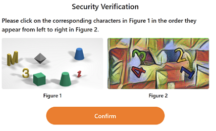

import Tabs from '@theme/Tabs';
import TabItem from '@theme/TabItem';
import ParamItem from '@theme/ParamItem';
import MethodItem from '@theme/MethodItem';
import MethodDescription from '@theme/MethodDescription'
import PriceBlock from '../../../../../src/theme/PriceBlock';
import PriceBlockWrap from '@theme/PriceBlockWrap';

import { ArticleHead } from '../../../../../src/theme/ArticleHead';

<ArticleHead slug="captchas/temu-task" />


# Temu

<PriceBlockWrap>
  <PriceBlock title="Temu captcha" captchaId="temu"/>
</PriceBlockWrap>

## Examples of tasks

<Tabs className="full-width-tabs">  
  <TabItem value="temu" label="Slider" default>  
      
  </TabItem>  
  <TabItem value="temu1" label="Click">  
      
  </TabItem>  
</Tabs>  

:::warning **Attention!**
CapMonster Cloud uses built-in proxies by default — their cost is already included in the service. You only need to specify your own proxies in cases where the website does not accept the token or access to the built-in services is restricted.

If you are using a proxy with IP authorization, make sure to whitelist the address **65.21.190.34**.
:::

## Request parameters

<TabItem value="proxyless" label="CustomTask (without proxy)" default className="bordered-panel">
    <ParamItem title="type" required type="string" />
    **CustomTask**

    ---

    <ParamItem title="class" required type="string" />
    **Temu**

    ---

    <ParamItem title="websiteURL" required type="string" />
    The full URL of the page where the CAPTCHA is loaded ( https://www.example.com/bgn_verification.html?....... )

    ---
    <ParamItem title="cookie (inside metadata)" required="required" type="string" />
    Cookies obtained via `document.cookie` on the page where the CAPTCHA is loaded

    ---
    <ParamItem title="userAgent" type="string" />
Browser User-Agent.  
  **Pass only a valid UA from Windows OS. Currently it is**: `userAgentPlaceholder`

---

<ParamItem title="proxyType" type="string" />
**http** - regular http/https proxy;<br />
**https** - try this option only if "http" does not work (required for some custom proxies);<br />
**socks4** - socks4 proxy;<br />
**socks5** - socks5 proxy.

---

<ParamItem title="proxyAddress" type="string" />
<p>
Proxy IPv4/IPv6 IP address. Not allowed:  
- use of transparent proxies (where the client IP is visible);  
- use of proxies on local machines.
</p>

---

<ParamItem title="proxyPort" type="integer" />
Proxy port.

---

<ParamItem title="proxyLogin" type="string" />
Proxy server login.

---

<ParamItem title="proxyPassword" type="string" />
Proxy server password.

</TabItem> 

## Create task method

<Tabs className="full-width-tabs filled-tabs request-tabs" groupId="captcha-type">
  <TabItem value="proxyless" label="CustomTask (without proxy)" default className="method-panel">
    <MethodItem>
      ```http
      https://api.capmonster.cloud/createTask
      ```
    </MethodItem>
    <MethodDescription>

    **Request**

    ```json
    {
      "clientKey": "API_KEY",
      "task": {
        "type": "CustomTask",
        "class": "Temu",
        "websiteURL": "https://www.example.com/bgn_verification.html?verifyCode=7PRQIzDznoFE67ecZYtRTw394f6185143a4af80&from=https%3A%2F%2Fwww.example.com%2F&refer_page_name=home&refer_page_id=10005_1743074140645_cwb6un82rq&refer_page_sn=10005&_x_sessn_id=xmp1zuyv7y",
        "userAgent": "userAgentPlaceholder",
        "metadata": {
          "cookie": "region=141; language=en; currency=EUR; api_uid=CnBpI2fwFW2BogBITHVYAg==; timezone=Europe%2FMoscow; _nano_fp=XpmYXqmJnqX8npXblT_T6~7rkpA2LDnz2BPFuT5m; privacy_setting_detail=%7B%22firstPAds%22%3A0%2C%22adj%22%3A0%2C%22fbsAnlys%22%3A0%2C%22fbEvt%22%3A0%2C%22ggAds%22%3A0%2C%22fbAds%22%3A0%2C%22ttAds%22%3A0%2C%22scAds%22%3A0%2C%22ptAds%22%3A0%2C%22bgAds%22%3A0%2C%22tblAds%22%3A0%2C%22obAds%22%3A0%2C%22vgAds%22%3A0%2C%22idAds%22%3A0%2C%22opAds%22%3A0%2C%22stAds%22%3A0%2C%22pmAds%22%3A0%7D; webp=1; _bee=pgoBlKp038lBhEyoQ4yXnuNrw1X5va2U; verifyAuthToken=QkZmx2TJFbSuuRVD_MKJmA0b84fe3df183da8ab"
        }
      }
    }
    ```

    **Response**

    ```json
    {
      "errorId": 0,
      "taskId": 407533072
    }
    ```

    </MethodDescription>
  </TabItem>

  <TabItem value="proxy" label="CustomTask (with proxy)" className="method-panel">
    <MethodItem>
      ```http
      https://api.capmonster.cloud/createTask
      ```
    </MethodItem>
    <MethodDescription>

    **Request**

    ```json
    {
      "clientKey": "API_KEY",
      "task": {
        "type": "CustomTask",
        "class": "Temu",
        "websiteURL": "https://www.example.com/bgn_verification.html?verifyCode=7PRQIzDznoFE67ecZYtRTw394f6185143a4af80&from=https%3A%2F%2Fwww.example.com%2F&refer_page_name=home&refer_page_id=10005_1743074140645_cwb6un82rq&refer_page_sn=10005&_x_sessn_id=xmp1zuyv7y",
        "userAgent": "userAgentPlaceholder",
        "metadata": {
          "cookie": "region=141; language=en; currency=EUR; api_uid=CnBpI2fwFW2BogBITHVYAg==; timezone=Europe%2FMoscow; _nano_fp=XpmYXqmJnqX8npXblT_T6~7rkpA2LDnz2BPFuT5m; privacy_setting_detail=%7B%22firstPAds%22%3A0%2C%22adj%22%3A0%2C%22fbsAnlys%22%3A0%2C%22fbEvt%22%3A0%2C%22ggAds%22%3A0%2C%22fbAds%22%3A0%2C%22ttAds%22%3A0%2C%22scAds%22%3A0%2C%22ptAds%22%3A0%2C%22bgAds%22%3A0%2C%22tblAds%22%3A0%2C%22obAds%22%3A0%2C%22vgAds%22%3A0%2C%22idAds%22%3A0%2C%22opAds%22%3A0%2C%22stAds%22%3A0%2C%22pmAds%22%3A0%7D; webp=1; _bee=pgoBlKp038lBhEyoQ4yXnuNrw1X5va2U; verifyAuthToken=QkZmx2TJFbSuuRVD_MKJmA0b84fe3df183da8ab"
        },
        "proxyType": "http",
        "proxyAddress": "8.8.8.8",
        "proxyPort": 8080,
        "proxyLogin": "proxyLoginHere",
        "proxyPassword": "proxyPasswordHere"
      }
    }
    ```

    **Response**

    ```json
    {
      "errorId": 0,
      "taskId": 407533072
    }
    ```

    </MethodDescription>
  </TabItem>
</Tabs>


## Get task result method
Use the [getTaskResult](../api/methods/get-task-result.md) method to obtain the Temu solution.
 
**Important!** After receiving the solution, you must clear the cookies and set the newly obtained cookies. 

<TabItem value="proxyless" label="CustomTask (without proxy)" default className="method-panel-full">
	<MethodItem>
		```http
		https://api.capmonster.cloud/getTaskResult
		```
	</MethodItem>
	<MethodDescription>
		**Request**
		```json
		{
		  "clientKey":"API_KEY",
		  "taskId": 407533072
		}
		```
		**Response**
		```json
		{
			"errorId": 0,
			"status": "ready",
			"solution": {
				"domains": {
					"www.example.com": {
						"cookies": {
							"privacy_setting_detail": "%7B%22firstPAds%22%3A1%2C%22adj%22%3A1%2C%22fbsAnlys%22%3A1%2C%22fbEvt%22%3A1%2C%22ggAds%22%3A1%2C%22fbAds%22%3A1%2C%22ttAds%22%3A1%2C%22scAds%22%3A1%2C%22ptAds%22%3A1%2C%22bgAds%22%3A1%2C%22tblAds%22%3A1%2C%22obAds%22%3A1%2C%22vgAds%22%3A1%2C%22idAds%22%3A1%2C%22opAds%22%3A1%2C%22stAds%22%3A1%2C%22pmAds%22%3A1%7D",
							"region": "211",
							"language": "en",
							"currency": "USD",
							"api_uid": "Chgx+mflQkR0G1THhRQIAg",
							"webp": "1",
							"_nano_fp": "XpmYXq98nqUaXpdano_AT7Nbb0dRwziAaAq~s8do",
							"verifyAuthToken": "8VhdGgRPTJaJ0t6msEcXlA598e207617867ac4b",
							"timezone": "America/Buenos_Aires",
							"_bee": "FJBIpQvZnnUGDlamFfP08tIpG1Uyiap2"
						}
					}
				}
			},
		}
		```
	</MethodDescription>
</TabItem>

## How to obtain the cookie (inside metadata) parameter
The value for the `cookie` parameter can be obtained on the CAPTCHA page via the `document.cookie` property.


## How to find all required parameters for task creation

### Automatically

A convenient way to automate the search for all necessary parameters.
Some parameters are regenerated every time the page loads, so you'll need to extract them through a browser — either regular or headless (e.g., using **Playwright**).
Since the values of dynamic parameters are short-lived, the captcha must be solved immediately after retrieving them.

:::warning **Important!**
The code snippets provided are basic examples for familiarization with extracting the required parameters. The exact implementation will depend on your captcha page, its structure, and the HTML elements/selectors it uses.
:::

<Tabs className="full-width-tabs filled-tabs request-tabs">
  <TabItem value="js" label="JavaScript" default className="method-panel">
    <details>
      <summary>Show code (Node.js)</summary>

      ```js
      import { chromium } from 'playwright';

      (async () => {
        const browser = await chromium.launch();
        const page = await browser.newPage();

        await page.goto('https://example.com');

        // Get cookies
        const cookies = await page.context().cookies();
        console.log('Cookies:', cookies);

        await browser.close();
      })();
      ```
    </details>
  </TabItem>

  <TabItem value="python" label="Python" className="method-panel">
    <details>
      <summary>Show code</summary>

      ```python
      import asyncio
      from playwright.async_api import async_playwright

      async def run():
          async with async_playwright() as p:
              browser = await p.chromium.launch()
              page = await browser.new_page()

              await page.goto('https://example.com')

              # Get cookies
              cookies = await page.context.cookies()
              print('Cookies:', cookies)

              await browser.close()

      asyncio.run(run())
      ```
    </details>
  </TabItem>

  <TabItem value="csharp" label="C#" className="method-panel">
    <details>
      <summary>Show code</summary>

      ```csharp
      using System;
      using System.Linq;
      using System.Threading.Tasks;
      using Microsoft.Playwright;

      class Program
      {
          public static async Task Main()
          {
              using var playwright = await Playwright.CreateAsync();
              var browser = await playwright.Chromium.LaunchAsync(new BrowserTypeLaunchOptions
              {
                  Headless = true
              });

              var context = await browser.NewContextAsync();
              var page = await context.NewPageAsync();

              await page.GotoAsync("https://example.com");

              var cookies = await context.CookiesAsync();
              Console.WriteLine("Cookies:");
              foreach (var cookie in cookies)
              {
                  Console.WriteLine($"{cookie.Name}: {cookie.Value}");
              }

              await browser.CloseAsync();
          }
      }
      ```
    </details>
  </TabItem>
</Tabs>

## Use the SDK library

<Tabs className="full-width-tabs filled-tabs request-tabs" groupId="captcha-type">

  <TabItem value="js" label="JavaScript" default className="method-panel">

  ```js
  // https://github.com/ZennoLab/capmonstercloud-client-js

  import { CapMonsterCloudClientFactory, ClientOptions, TemuRequest } from '@zennolab_com/capmonstercloud-client';

  document.addEventListener('DOMContentLoaded', async () => {
    const cmcClient = CapMonsterCloudClientFactory.Create(
      new ClientOptions({ clientKey: '<your capmonster.cloud API key>' })
    );

    console.log(await cmcClient.getBalance());

    const temuRequest = new TemuRequest({
      class: 'Temu',
      websiteURL: 'https://www.example.com/bgn_verification.html?verifyCode=', // Page URL with captcha 
      userAgent: 'userAgentPlaceholder', // Use the current UserAgent
      metadata: {
        cookie: 'region=141; language=en; currency=EUR; api_uid=CnBpI2fwFW2BogBITHVYAg==; timezone=Europe%2FMoscow; _nano_fp=XpmYXqmJnqX8npXblT_T6~7rkpA2LDnz2BPFuT5m; privacy_setting_detail=%7B%22firstPAds%22%3A0%2C%22adj%22%3A0%2C%22fbsAnlys%22%3A0%2C%22fbEvt%22%3A0%2C%22ggAds%22%3A0%2C%22fbAds%22%3A0%2C%22ttAds%22%3A0%2C%22scAds%22%3A0%2C%22ptAds%22%3A0%2C%22bgAds%22%3A0%2C%22tblAds%22%3A0%2C%22obAds%22%3A0%2C%22vgAds%22%3A0%2C%22idAds%22%3A0%2C%22opAds%22%3A0%2C%22stAds%22%3A0%2C%22pmAds%22%3A0%7D; webp=1; _bee=pgoBlKp038lBhEyoQ4yXnuNrw1X5va2U; verifyAuthToken=QkZmx2TJFbSuuRVD_MKJmA0b84fe3df183da8ab'
      },
      /*
      // If you need to use a proxy:
      proxy: {
        type: 'http',
        address: '127.0.0.1',
        port: 8000,
        login: 'user',
        password: 'password'
      }
      */
    });

    console.log(await cmcClient.Solve(temuRequest));
  });
````

  </TabItem>

  <TabItem value="python" label="Python" default className="method-panel">

```python
# https://github.com/ZennoLab/capmonstercloud-client-python

import asyncio
from capmonstercloudclient import CapMonsterClient, ClientOptions
from capmonstercloudclient.requests import TemuCustomTaskRequest

client_options = ClientOptions(api_key="API_KEY")  # Your CapMonster Cloud API key
cap_monster_client = CapMonsterClient(options=client_options)

# Option 1: Without proxy
temu_request = TemuCustomTaskRequest(
    websiteUrl="https://www.example.com/bgn_verification.html?verifyCode=", # Page URL with captcha 
    userAgent="userAgentPlaceholder",  # Use the current UserAgent
    metadata={
        "cookie": "region=141; language=en; currency=EUR; api_uid=CnBpI2fwFW2BogBITHVYAg==; timezone=Europe%2FMoscow; _nano_fp=XpmYXqmJnqX8npXblT_T6~7rkpA2LDnz2BPFuT5m; privacy_setting_detail=%7B%22firstPAds%22%3A0%2C%22adj%22%3A0%2C%22fbsAnlys%22%3A0%2C%22fbEvt%22%3A0%2C%22ggAds%22%3A0%2C%22fbAds%22%3A0%2C%22ttAds%22%3A0%2C%22scAds%22%3A0%2C%22ptAds%22%3A0%2C%22bgAds%22%3A0%2C%22tblAds%22%3A0%2C%22obAds%22%3A0%2C%22vgAds%22%3A0%2C%22idAds%22%3A0%2C%22opAds%22%3A0%2C%22stAds%22%3A0%2C%22pmAds%22%3A0%7D; webp=1; _bee=pgoBlKp038lBhEyoQ4yXnuNrw1X5va2U; verifyAuthToken=QkZmx2TJFbSuuRVD_MKJmA0b84fe3df183da8ab"
    }
)

# Option 2: With proxy
# Uncomment if you need to use a proxy
# temu_request = TemuCustomTaskRequest(
#     websiteUrl="https://www.example.com/bgn_verification.html?verifyCode=",
#     userAgent="userAgentPlaceholder",
#     metadata={ "cookie": "..." },
#     proxyType="http",
#     proxyAddress="123.45.67.89",
#     proxyPort=8080,
#     proxyLogin="proxyUser",
#     proxyPassword="proxyPass"
# )

async def solve_captcha():
    return await cap_monster_client.solve_captcha(temu_request)

responses = asyncio.run(solve_captcha())
print(responses)
```

  </TabItem>

  <TabItem value="csharp" label="C#" className="method-panel">

```csharp
// https://github.com/ZennoLab/capmonstercloud-client-dotnet

using System;
using System.Threading.Tasks;
using Zennolab.CapMonsterCloud;
using Zennolab.CapMonsterCloud.Requests;

class Program
{
    static async Task Main(string[] args)
    {
        // Your CapMonster Cloud API key
        var clientOptions = new ClientOptions
        {
            ClientKey = "your_api_key" // Your CapMonster Cloud API key
        };

        var cmCloudClient = CapMonsterCloudClientFactory.Create(clientOptions);

        // Option 1: Temu without proxy
        var temuRequest = new TemuCustomTaskRequest(
            cookie: "region=141; language=en; currency=EUR; api_uid=CnBpI2fwFW2BogBITHVYAg==; timezone=Europe%2FMoscow; _nano_fp=XpmYXqmJnqX8npXblT_T6~7rkpA2LDnz2BPFuT5m; privacy_setting_detail=%7B%22firstPAds%22%3A0%2C%22adj%22%3A0%2C%22fbsAnlys%22%3A0%2C%22fbEvt%22%3A0%2C%22ggAds%22%3A0%2C%22fbAds%22%3A0%2C%22ttAds%22%3A0%2C%22scAds%22%3A0%2C%22ptAds%22%3A0%2C%22bgAds%22%3A0%2C%22tblAds%22%3A0%2C%22obAds%22%3A0%2C%22vgAds%22%3A0%2C%22idAds%22%3A0%2C%22opAds%22%3A0%2C%22stAds%22%3A0%2C%22pmAds%22%3A0%7D; webp=1; _bee=pgoBlKp038lBhEyoQ4yXnuNrw1X5va2U; verifyAuthToken=QkZmx2TJFbSuuRVD_MKJmA0b84fe3df183da8ab"
        )
        {
            WebsiteUrl = "https://www.example.com/bgn_verification.html?verifyCode=", // Page URL with captcha 
            UserAgent = "userAgentPlaceholder" // Use the current UserAgent
        };

        // Option 2: Temu with proxy
        // Uncomment if you need to use a proxy
        /*
        var temuRequest = new TemuCustomTaskRequest(
            cookie: "...long cookie..."
        )
        {
            WebsiteUrl = "https://www.example.com/bgn_verification.html?verifyCode=",
            UserAgent = "userAgentPlaceholder",
            Proxy = new ProxyContainer(
                "123.45.67.89",
                8080,
                ProxyType.Http,
                "proxyLogin",
                "proxyPassword"
            )
        };
        */

        var temuResult = await cmCloudClient.SolveAsync(temuRequest);

        Console.WriteLine("Temu Solution: " + temuResult.Solution.Domains);
    }
}
```

  </TabItem>

</Tabs>