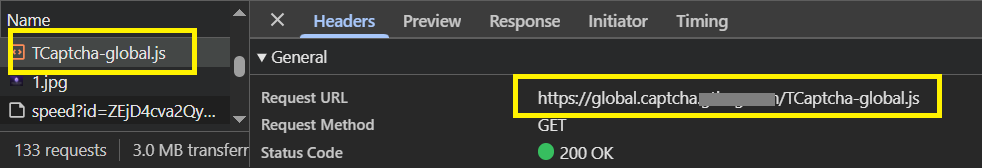

import Tabs from '@theme/Tabs';
import TabItem from '@theme/TabItem';
import ParamItem from '@theme/ParamItem';
import MethodItem from '@theme/MethodItem';
import MethodDescription from '@theme/MethodDescription'
import PriceBlock from '../../../../../src/theme/PriceBlock';
import PriceBlockWrap from '@theme/PriceBlockWrap';
import BlogLink from '@theme/BlogLink';
import { ArticleHead } from '../../../../../src/theme/ArticleHead';

<ArticleHead slug="captchas/tendi" />

# TenDI - Tencent captcha

<PriceBlockWrap>
  <PriceBlock title="Tencent captcha" captchaId="tencent"/>
</PriceBlockWrap>


<BlogLink url="https://capmonster.cloud/en/blog/ten-1/what-is-tencent-captcha-and-how-do-i-bypass-it"/>

:::warning **Attention!**
CapMonster Cloud uses built-in proxies by default — their cost is already included in the service. You only need to specify your own proxies in cases where the website does not accept the token or access to the built-in services is restricted.

If you are using a proxy with IP authorization, make sure to whitelist the address **65.21.190.34**.
:::

## Request parameters
<TabItem value="proxyless" label="RecaptchaV2EnterpriseTaskProxyless (without proxy)" default className="bordered-panel">
    <ParamItem title="type" required type="string" />
    **CustomTask**

    ---

    <ParamItem title="class" required type="string" />
    **TenDI**

    ---

    <ParamItem title="websiteURL" required type="string" />
    The address of the main page where the captcha is solved.

    ---

    <ParamItem title="websiteKey" required type="string" />
    captchaAppId. For example `"websiteKey": "189123456"` - is a unique parameter for your site. You can take it from an html page with a captcha or from traffic (see description below).

    ---
    <ParamItem title="captchaUrl (inside metadata)" type="string" />
    Link to the captcha script. It usually ends with `TCaptcha.js` or `TCaptcha-global.js`. You can find it in the list of requests (see example below).

    ---

    <ParamItem title="userAgent" type="string" />
    Browser User-Agent.  
  **Pass only a valid UA from Windows OS. Currently it is**: `userAgentPlaceholder`
	
     ---

    <ParamItem title="proxyType" type="string" />
    **http** - regular http/https proxy;<br />**https** - try this option only if "http" doesn't work (required for some custom proxies);<br />**socks4** - socks4 proxy;<br />**socks5** - socks5 proxy.

     ---

    <ParamItem title="proxyAddress" type="string" />
    <p>
      IPv4/IPv6 proxy IP address. Not allowed:
      - using transparent proxies (where you can see the client's IP);
      - using proxies on local machines.
    </p>

     ---

    <ParamItem title="proxyPort" type="integer" />
    Proxy port.

     ---

    <ParamItem title="proxyLogin" type="string" />
    Proxy-server login.

     ---

    <ParamItem title="proxyPassword" type="string" />
    Proxy-server password.

</TabItem>

## Create task method
<Tabs className="full-width-tabs filled-tabs request-tabs" groupId="captcha-type">

  <TabItem value="proxyless" label="CustomTask (without proxy)" default className="method-panel">
    <MethodItem>
      ```http
      https://api.capmonster.cloud/createTask
      ```
    </MethodItem>
    <MethodDescription>
      **Request**
      ```json
      {
        "clientKey": "API_KEY",
        "task": {
          "type": "CustomTask",
          "class": "TenDI",
          "websiteURL": "https://example.com",
          "websiteKey": "189123456",
          "userAgent": "userAgentPlaceholder",
          "metadata": {
            "captchaUrl": "https://global.captcha.example.com/TCaptcha-global.js"
          }
        }
      }
      ```

      **Response**
      ```json
      {
        "errorId": 0,
        "taskId": 407533072
      }
      ```
    </MethodDescription>
  </TabItem>

  <TabItem value="proxy" label="CustomTask (with proxy)" className="method-panel">
    <MethodItem>
      ```http
      https://api.capmonster.cloud/createTask
      ```
    </MethodItem>
    <MethodDescription>
      **Request**
      ```json
      {
        "clientKey": "API_KEY",
        "task": {
          "type": "CustomTask",
          "class": "TenDI",
          "websiteURL": "https://example.com",
          "websiteKey": "189123456",
          "userAgent": "userAgentPlaceholder",
          "metadata": {
            "captchaUrl": "https://global.captcha.example.com/TCaptcha-global.js"
          },
          "proxyType": "http",
          "proxyAddress": "8.8.8.8",
          "proxyPort": 8080,
          "proxyLogin": "proxyLoginHere",
          "proxyPassword": "proxyPasswordHere"
        }
      }
      ```

      **Response**
      ```json
      {
        "errorId": 0,
        "taskId": 407533072
      }
      ```
    </MethodDescription>
  </TabItem>

</Tabs>

## Get task result method
Use the [getTaskResult](../api/methods/get-task-result.mdx) method to get the TenDI solution.

<TabItem value="proxyless" label="GeeTestTaskProxyless (without proxy)" default className="method-panel-full">
	<MethodItem>
		```http
		https://api.capmonster.cloud/getTaskResult
		```
	</MethodItem>
	<MethodDescription>
		**Request**
		```json
		{
		  "clientKey":"API_KEY",
		  "taskId": 407533072
		}
		```
		**Response**
		```json
		{
			"errorId":0,
			"status":"ready",
			"solution": {
			   "data": {
					"randstr": "@EcL",
					"ticket": "tr03lHUhdnuW3neJZu.....7LrIbs*"
				},
				"headers": {
					"User-Agent": "userAgentPlaceholder"
				}
			}
		}
		```
	</MethodDescription>
</TabItem>

## How to get websiteKey (captchaAppId)
Turn on the *Developer Tools*, go to the **Network** tab, activate the captcha and look at the requests. Some of them will contain the parameter value you need. In this case `websiteKey=aid`
 

## How to get captchaUrl
Open *Developer Tools*, go to the **Network** tab, trigger the captcha, and inspect the network requests. Among them, you will find `TCaptcha.js` or `TCaptcha-global.js`, where you can find a link like this:



## How to find all required parameters for task creation

### Automatically

A convenient way to automate the search for all necessary parameters.
Some parameters are regenerated every time the page loads, so you'll need to extract them through a browser — either regular or headless (e.g., using **Playwright**).
Since the values of dynamic parameters are short-lived, the captcha must be solved immediately after retrieving them.

:::warning **Important!**
The code snippets provided are basic examples for familiarization with extracting the required parameters. The exact implementation will depend on your captcha page, its structure, and the HTML elements/selectors it uses.
:::

<Tabs className="full-width-tabs filled-tabs request-tabs">
  <TabItem value="js" label="JavaScript" default className="method-panel">
    <details>
      <summary>Show code (Node.js)</summary>
      ```js
      import { chromium } from "playwright";

      (async () => {
        const browser = await chromium.launch({ headless: false });
        const page = await browser.newPage();

        // Intercept requests
        page.on("request", (request) => {
          const url = request.url();
          if (
            url.startsWith("https://sg.captcha.qcloud.com/cap_union_prehandle?aid=")
          ) {
            const parsedUrl = new URL(url);
            const aid = parsedUrl.searchParams.get("aid");
            console.log("Extracted aid:", aid);
          }
        });

        await page.goto("https://www.example.com/", { waitUntil: "load" });

        await page.waitForTimeout(5000);

        await browser.close();
      })();
      ```
    </details>
  </TabItem>

  <TabItem value="python" label="Python" className="method-panel">
    <details>
      <summary>Show code</summary>
      ```python
      import asyncio
      from playwright.async_api import async_playwright

      async def main():
          async with async_playwright() as p:
              browser = await p.chromium.launch(headless=False)
              page = await browser.new_page()

              # Intercept requests
              page.on("request", lambda request: handle_request(request))

              await page.goto("https://www.example.com/", wait_until="load")

              await asyncio.sleep(5)

              await browser.close()

      def handle_request(request):
          url = request.url
          if url.startswith("https://sg.captcha.qcloud.com/cap_union_prehandle?aid="):
              parsed_url = request.url.split('?')[1]
              params = dict(param.split('=') for param in parsed_url.split('&') if '=' in param)
              aid = params.get('aid')
              print("Extracted aid:", aid)

      asyncio.run(main())
      ```
    </details>
  </TabItem>

  <TabItem value="csharp" label="C#" className="method-panel">
    <details>
      <summary>Show code</summary>
      ```csharp
      using System;
      using System.Threading.Tasks;
      using Microsoft.Playwright;

      class Program
      {
          public static async Task Main()
          {
              using var playwright = await Playwright.CreateAsync();
              await using var browser = await playwright.Chromium.LaunchAsync(new BrowserTypeLaunchOptions {
                 Headless = false });
              var page = await browser.NewPageAsync();

              // Intercept requests
              page.Request += (_, request) =>
              {
                  var url = request.Url;
                  if (url.StartsWith("https://sg.captcha.qcloud.com/cap_union_prehandle?aid="))
                  {
                      var uri = new Uri(url);
                      var queryParams = System.Web.HttpUtility.ParseQueryString(uri.Query);
                      var aid = queryParams.Get("aid");
                      Console.WriteLine("Extracted aid: " + aid);
                  }
              };

              await page.GotoAsync("https://www.example.com/", new PageGotoOptions {
               WaitUntil = WaitUntilState.Load });

              await Task.Delay(5000);

              await browser.CloseAsync();
          }
      }
      ```
    </details>
  </TabItem>
</Tabs>

## Use the SDK Library

<Tabs className="full-width-tabs filled-tabs request-tabs" groupId="captcha-type">

  <TabItem value="js" label="JavaScript" default className="method-panel">
<details>
      <summary>Show code (for browser)</summary>
  ```js
  // https://github.com/ZennoLab/capmonstercloud-client-js

  import {
    CapMonsterCloudClientFactory,
    ClientOptions,
    TenDIRequest
  } from '@zennolab_com/capmonstercloud-client';

  const API_KEY = "YOUR_API_KEY"; // Specify your CapMonster Cloud API key

  document.addEventListener("DOMContentLoaded", async () => {
    const client = CapMonsterCloudClientFactory.Create(
      new ClientOptions({ clientKey: API_KEY })
    );

    // Basic example without proxy
    // CapMonster Cloud automatically uses its own proxies
    let tenDIRequest = new TenDIRequest({
      websiteURL: "https://example.com", // URL of the page with Tencent (TenDI) captcha
      websiteKey: "183268248"            // TencentCaptcha appid (replace with a valid value)
    });

    // Example of using your own proxy
    // Uncomment this block if you want to use your own proxy
    /*
    const proxy = {
      proxyType: "http",
      proxyAddress: "123.45.67.89",
      proxyPort: 8080,
      proxyLogin: "username",
      proxyPassword: "password"
    };

    tenDIRequest = new TenDIRequest({
      websiteURL: "https://example.com",
      websiteKey: "183268248",
      userAgent: "userAgentPlaceholder",
      proxy
    });
    */

    // Optionally, you can check the balance
    const balance = await client.getBalance();
    console.log("Balance:", balance);

    const result = await client.Solve(tenDIRequest);
    console.log("Solution:", result);
  });
```
</details>
<details>
      <summary>Show code (Node.js)</summary>
```javascript
// https://github.com/ZennoLab/capmonstercloud-client-js

import { 
  CapMonsterCloudClientFactory, 
  ClientOptions, 
  TenDIRequest 
} from '@zennolab_com/capmonstercloud-client';

const API_KEY = "YOUR_API_KEY"; // Specify your CapMonster Cloud API key

async function solveTenDI() {
  const client = CapMonsterCloudClientFactory.Create(
    new ClientOptions({ clientKey: API_KEY })
  );

  // Basic example without proxy
  // CapMonster Cloud automatically uses its own proxies
  let tenDIRequest = new TenDIRequest({
    websiteURL: "https://example.com", // URL of the page with the captcha
    websiteKey: "183268248"            // Replace with a valid value
  });

  // Example of using your own proxy
  // Uncomment this block if you want to use your own proxy

  /*
  const proxy = {
    proxyType: "http",
    proxyAddress: "123.45.67.89",
    proxyPort: 8080,
    proxyLogin: "username",
    proxyPassword: "password"
  };

  tenDIRequest = new TenDIRequest({
    websiteURL: "https://example.com",
    websiteKey: "websiteKey",
    proxy,
    userAgent: "userAgentPlaceholder"
  });
  */

  // Optionally, you can check the balance
  const balance = await client.getBalance();
  console.log("Balance:", balance);

  const result = await client.Solve(tenDIRequest);
  console.log("Solution:", result);
}

solveTenDI().catch(console.error);
```
</details>

  </TabItem>

  <TabItem value="python" label="Python" className="method-panel">
<details>
      <summary>Show code</summary>
```python
# https://github.com/ZennoLab/capmonstercloud-client-python

import asyncio
from capmonstercloudclient import CapMonsterClient, ClientOptions
from capmonstercloudclient.requests import TenDiCustomTaskRequest
# from capmonstercloudclient.requests.baseRequestWithProxy import ProxyInfo  # Uncomment if you plan to use a proxy

API_KEY = "YOUR_API_KEY"  # Specify your CapMonster Cloud API key

async def solve_tendi_custom():
    client_options = ClientOptions(api_key=API_KEY)
    cap_monster_client = CapMonsterClient(options=client_options)

    # Basic example without proxy
    # CapMonster Cloud automatically uses its own proxies
    tendi_request = TenDiCustomTaskRequest(
        websiteUrl="https://example.com",  # URL of the page with Tencent (TenDI) captcha
        websiteKey="189956587",            # TencentCaptcha appid
        userAgent="userAgentPlaceholder"
    )

    # Example of using your own proxy
    # Uncomment this block if you want to use a proxy
    #
    # proxy = ProxyInfo(
    #     proxyType="http",
    #     proxyAddress="123.45.67.89",
    #     proxyPort=8080,
    #     proxyLogin="username",
    #     proxyPassword="password"
    # )
    #
    # tendi_request = TenDiCustomTaskRequest(
    #     websiteUrl="https://example.com",
    #     websiteKey="189956587",
    #     userAgent="userAgentPlaceholder",
    #     proxy=proxy
    # )

    # Optionally, you can check the balance
    balance = await cap_monster_client.get_balance()
    print("Balance:", balance)

    result = await cap_monster_client.solve_captcha(tendi_request)
    print("Solution:", result)

asyncio.run(solve_tendi_custom())
```
</details>
  </TabItem>

  <TabItem value="csharp" label="C#" className="method-panel">
<details>
      <summary>Show code</summary>
```csharp
// https://github.com/ZennoLab/capmonstercloud-client-dotnet

using System;
using System.Threading.Tasks;
using Zennolab.CapMonsterCloud;
using Zennolab.CapMonsterCloud.Requests;

class Program
{
    static async Task Main(string[] args)
    {
        // Specify your CapMonster Cloud API key
        var clientOptions = new ClientOptions
        {
            ClientKey = "YOUR_API_KEY"
        };

        var cmCloudClient = CapMonsterCloudClientFactory.Create(clientOptions);

        // Optionally, you can check the balance
        var balance = await cmCloudClient.GetBalanceAsync();
        Console.WriteLine("Balance: " + balance);

        // Basic example without proxy
        // CapMonster Cloud automatically uses its own proxies
        var tenDiRequest = new TenDiCustomTaskRequest
        {
            WebsiteUrl = "https://example.com",   // URL of the page with the captcha
            WebsiteKey = "189956587",             // TencentCaptcha appid
            UserAgent = "userAgentPlaceholder"
        };

        // Example of using your own proxy
        // Uncomment this block if you want to use your own proxy
        /*
        var tenDiRequest = new TenDiCustomTaskRequest
        {
            WebsiteUrl = "https://example.com",
            WebsiteKey = "189956587",
            UserAgent = "userAgentPlaceholder",

            Proxy = new ProxyContainer(
                "123.45.67.89",
                8080,
                ProxyType.Http,
                "username",
                "password"
            )
        };
        */

        var tenDiResult = await cmCloudClient.SolveAsync(tenDiRequest);

        Console.WriteLine("Solution Data: " + string.Join(", ", tenDiResult.Solution.Data));
        Console.WriteLine("Solution Headers: " + string.Join(", ", tenDiResult.Solution.Headers));
    }
}
```
</details>
  </TabItem>

</Tabs>