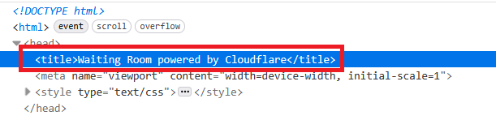

import Tabs from '@theme/Tabs';
import TabItem from '@theme/TabItem';
import ParamItem from '@theme/ParamItem';
import MethodItem from '@theme/MethodItem';
import MethodDescription from '@theme/MethodDescription'
import PriceBlock from '../../../../../src/theme/PriceBlock'
import PriceBlockWrap from '@theme/PriceBlockWrap';
import BlogLink from '@theme/BlogLink';

# Cloudflare TurnstileTask | Challenge | Waiting Room

<PriceBlockWrap>
  <PriceBlock title="TurnstileTask" captchaId="cf-turnstile"/>
</PriceBlockWrap>


All Turnstile subtypes are automatically supported: **manual**, **non-interactive**, and **invisible**. Therefore, you do not need to specify a subtype for a standard captcha.

<BlogLink url="https://capmonster.cloud/en/blog/Cloudflare/what-is-cloudflare-captcha"/>
<BlogLink url="https://capmonster.cloud/en/blog/Cloudflare/how-cloudflare-bot-challenge-and-turnstile-protect-web-traffic"/>

:::info Important:
Before getting started, review all three captcha solving options and choose the one that best fits your needs.
:::

## Option 1. Turnstile (token)

You are required to solve a **regular** Turnstile captcha, like [this one](https://zenno.link/zl-support). Please note that captchas on Cloudflare pages may look identical. See [how to distinguish a regular Turnstile from a Cloudflare Challenge](#how-to-distinguish-a-standard-turnstile-from-cloudflare-challenge).


:::warning **Attention!**
* CapMonster Cloud uses built-in proxies by default — their cost is already included in the service. You only need to specify your own proxies in cases where the website does not accept the token or access to the built-in services is restricted.

* If you are using a proxy with IP authorization, make sure to whitelist the address **65.21.190.34**.

* After solving, you will receive a **token** to confirm captcha completion.
:::

#### Request parameters
<TabItem value="proxyless" label="TurnstileTask (without proxy)" default className="bordered-panel">
  <ParamItem title="type" required type="string" />
  **TurnstileTask**

  ---

  <ParamItem title="websiteURL" required type="string" />
  The URL of the page where the captcha is solved

  ---

  <ParamItem title="websiteKey" required type="string" />
  Turnstile site key

  ---

  <ParamItem title="pageAction" type="string" />
  The `action` field found in the callback function when the captcha is loaded

  ---

  <ParamItem title="data" type="string" />
  The value of the *data* field, taken from the `cData` parameter.

  ---

  <ParamItem title="proxyType" type="string" />
  **http** - standard http/https proxy;<br />
  **https** - try this if "http" doesn't work (needed for some custom proxies);<br />
  **socks4** - socks4 proxy;<br />
  **socks5** - socks5 proxy.

  ---

  <ParamItem title="proxyAddress" type="string" />
  <p>
    IP address of the proxy (IPv4/IPv6). Not allowed:
    - using transparent proxies (those exposing the client IP);
    - using local machine proxies.
  </p>

  ---

  <ParamItem title="proxyPort" type="integer" />
  Proxy port.

  ---

  <ParamItem title="proxyLogin" type="string" />
  Proxy login.

  ---

  <ParamItem title="proxyPassword" type="string" />
  Proxy password.

</TabItem>

---

## Option 2. Challenge (token)

:::warning **Attention!**
* CapMonster Cloud uses built-in proxies by default — their cost is already included in the service. You only need to specify your own proxies in cases where the website does not accept the token or access to the built-in services is restricted.

* If you are using a proxy with IP authorization, make sure to whitelist the address **65.21.190.34**.

* After solving, you will receive a **token** to confirm captcha completion.
:::

#### Request parameters
<TabItem value="proxyless" label="RecaptchaV2EnterpriseTaskProxyless (without proxy)" default className="bordered-panel">
  <ParamItem title="type" required type="string" />
  **TurnstileTask**

  ---

  <ParamItem title="websiteURL" required type="string" />
  The URL of the page where the captcha is solved

  ---

  <ParamItem title="websiteKey" required type="string" />
  Turnstile site key

  ---

  <ParamItem title="cloudflareTaskType" required type="string" />
  **token**

  ---

  <ParamItem title="pageAction" required type="string" />
  The `action` field found in the callback function. If using *cloudflareTaskType*, `action` is usually “managed” or “non-interactive”.

  ---

  <ParamItem title="userAgent" required type="string" />
  Browser User-Agent.  
  **Pass only a valid UA from Windows OS. Currently it is**: `userAgentPlaceholder`

  ---

  <ParamItem title="data" required type="string" />
  The value of the *data* field, taken from `cData`.

  ---

  <ParamItem title="pageData" required type="string" />
  The value of *pageData*, taken from `chlPageData`.

  ---

  <ParamItem title="apiJsUrl" type="string" />
  String containing the captcha script URL.

  ---

  <ParamItem title="proxyType" type="string" />
  **http** - standard http/https proxy;<br />
  **https** - try this if "http" doesn't work (needed for some custom proxies);<br />
  **socks4** - socks4 proxy;<br />
  **socks5** - socks5 proxy.

  ---

  <ParamItem title="proxyAddress" type="string" />
  <p>
    IP address of the proxy (IPv4/IPv6). Not allowed:
    - using transparent proxies (those exposing the client IP);
    - using local machine proxies.
  </p>

  ---

  <ParamItem title="proxyPort" type="integer" />
  Proxy port.

  ---

  <ParamItem title="proxyLogin" type="string" />
  Proxy login.

  ---

  <ParamItem title="proxyPassword" type="string" />
  Proxy password.

</TabItem>

<br />

These parameters are in the object passed to `window.turnstile.render(el, paramsObj)` when creating the captcha. You can retrieve them, for example, by executing JavaScript before loading other scripts:

```js
(function () {
  const obj = {
    render: function () {
      const { action, cData, chlPageData } = arguments[1];
        const params = [
          ["action", action],
          ["data", cData],
          ["pageData", chlPageData],
        ];
        console.table(params)
    }
  };

  Object.defineProperty(window, "turnstile", {
    get: () => {
      return obj;
    },
  });
})();
````

When `window.turnstile.render(el, paramsObj)` is called, the captcha loads on the page, and upon successful solving, the `callback` function passes the solution information.

`window.turnstile.render(el, paramsObj):`

* `el`: DOM element to insert the captcha.
* `paramsObj`: Object containing captcha information and solving instructions. Usually includes *sitekey*, *action*, *cData*, *chlPageData*, *callback*.
* `callback`: Function called after captcha is successfully solved.

---

## Option 3. Challenge (cookie)

:::warning **Attention!**

* Use **your own proxies** for this task.

* After solving, you will receive **special cookies** to add to your browser.
:::

#### Request parameters

<TabItem value="proxyless" label="RecaptchaV2EnterpriseTaskProxyless (without proxy)" default className="bordered-panel">
  <ParamItem title="type" required type="string" />
  **TurnstileTask**

---

  <ParamItem title="websiteURL" required type="string" />
  The URL of the page where the captcha is solved

---

  <ParamItem title="websiteKey" required type="string" />
  Turnstile site key (any string is acceptable)

---

  <ParamItem title="cloudflareTaskType" required type="string" />
  **cf_clearance**

---

  <ParamItem title="htmlPageBase64" required type="string" />
  Base64-encoded HTML page of "Just a moment" shown with 403 response.<br/>
  Example to get `htmlPageBase64`:
  ```js
  var htmlContent = document.documentElement.outerHTML;
  var htmlBase64 = btoa(unescape(encodeURIComponent(htmlContent)));
  console.log(htmlBase64);
  ```

---

  <ParamItem title="userAgent" required type="string" />
  Browser User-Agent.<br />
  **Provide only the current Windows UA:** userAgentPlaceholder

---

  <ParamItem title="proxyType" required type="string" />
  **http** - regular HTTP/HTTPS proxy;<br />
  **https** - use if http doesn’t work (required for some custom proxies);<br />
  **socks4** - SOCKS4 proxy;<br />
  **socks5** - SOCKS5 proxy.

---

  <ParamItem title="proxyAddress" required type="string" />
  <p>
    Proxy IP address (IPv4/IPv6). Not allowed:
    - Transparent proxies
    - Local machine proxies
  </p>

---

  <ParamItem title="proxyPort" required type="integer" />
  Proxy port.

---

  <ParamItem title="proxyLogin" required type="string" />
  Proxy login.

---

  <ParamItem title="proxyPassword" required type="string" />
  Proxy password.

</TabItem>

---

## Option 4. Waiting Room (cookie)

:::warning **Attention!**

* Use **your own proxies** for this task.

* After solving, you will receive **special cookies** to add to your browser.
:::

This is a new Cloudflare protection mechanism: the user must wait on average \~3 minutes before accessing the resource:


You can also identify this Cloudflare type via the page header:



---

#### Request parameters

<TabItem value="proxyless" label="RecaptchaV2EnterpriseTaskProxyless (without proxy)" default className="bordered-panel">
  <ParamItem title="type" required type="string" />
  **TurnstileTask**

---

  <ParamItem title="websiteURL" required type="string" />
  The URL of the page containing the check

---

  <ParamItem title="websiteKey" required type="string" />
  Cloudflare site key

---

  <ParamItem title="cloudflareTaskType" required type="string" />
  **wait_room**

---

  <ParamItem title="htmlPageBase64" required type="string" />
  Base64-encoded HTML page containing `<title>Waiting Room powered by Cloudflare</title>`

---

  <ParamItem title="userAgent" required type="string" />
  Browser User-Agent.<br />
  **Provide only the current Windows UA:** userAgentPlaceholder

---

  <ParamItem title="proxyType" required type="string" />
  **http** - regular HTTP/HTTPS proxy;<br />
  **https** - use if http doesn’t work (required for some custom proxies);<br />
  **socks4** - SOCKS4 proxy;<br />
  **socks5** - SOCKS5 proxy.

---

  <ParamItem title="proxyAddress" required type="string" />
  <p>
    Proxy IP address (IPv4/IPv6). Not allowed:
    - Transparent proxies
    - Local machine proxies
  </p>

---

  <ParamItem title="proxyPort" required type="integer" />
  Proxy port.

---

  <ParamItem title="proxyLogin" required type="string" />
  Proxy login.

---

  <ParamItem title="proxyPassword" required type="string" />
  Proxy password.

</TabItem>
---

## Request examples

### Option 1. Turnstile (token)
<Tabs className="full-width-tabs filled-tabs request-tabs" groupId="captcha-type">

  <TabItem value="proxyless" label="TurnstileTask (without proxy)" default className="method-panel">
    <MethodItem>
      ```http
      https://api.capmonster.cloud/createTask
      ```
    </MethodItem>
    <MethodDescription>
      **Request**
      ```json
      {
        "clientKey": "API_KEY",
        "task": {
          "type": "TurnstileTask",
          "websiteURL": "http://tsmanaged.zlsupport.com",
          "websiteKey": "0x4AAAAAAABUYP0XeMJF0xoy"
        }
      }
      ```

      **Response**
      ```json
      {
        "errorId": 0,
        "taskId": 407533072
      }
      ```
    </MethodDescription>
  </TabItem>

  <TabItem value="proxy" label="TurnstileTask (with proxy)" className="method-panel">
    <MethodItem>
      ```http
      https://api.capmonster.cloud/createTask
      ```
    </MethodItem>
    <MethodDescription>
      **Request**
      ```json
      {
        "clientKey": "API_KEY",
        "task": {
          "type": "TurnstileTask",
          "websiteURL": "http://tsmanaged.zlsupport.com",
          "websiteKey": "0x4AAAAAAABUYP0XeMJF0xoy",
          "proxyType": "http",
          "proxyAddress": "8.8.8.8",
          "proxyPort": 8080,
          "proxyLogin": "proxyLoginHere",
          "proxyPassword": "proxyPasswordHere"
        }
      }
      ```

      **Response**
      ```json
      {
        "errorId": 0,
        "taskId": 407533072
      }
      ```
    </MethodDescription>
  </TabItem>

</Tabs>

---
### Option 2. Challenge (token)

<Tabs className="full-width-tabs filled-tabs request-tabs" groupId="captcha-type">

  <TabItem value="proxyless" label="TurnstileTask (without proxy)" default className="method-panel">
    <MethodItem>
      ```http
      https://api.capmonster.cloud/createTask
      ```
    </MethodItem>
    <MethodDescription>
      **Request**
      ```json
      {
        "clientKey": "API_KEY",
        "task": {
          "type": "TurnstileTask",
          "websiteURL": "https://example.com",
          "websiteKey": "0x4AAAAAAADnPIDROrmt1Wwj",
          "cloudflareTaskType": "token",
          "userAgent": "userAgentPlaceholder",
          "pageAction": "managed",
          "pageData": "HUHDWUHuhuwfiweh32..uh2uhuhyugYUG=",
          "data": "874291f4retD1366"
        }
      }
      ```

      **Response**
      ```json
      {
        "errorId": 0,
        "taskId": 407533072
      }
      ```
    </MethodDescription>
  </TabItem>

  <TabItem value="proxy" label="TurnstileTask (with proxy)" className="method-panel">
    <MethodItem>
      ```http
      https://api.capmonster.cloud/createTask
      ```
    </MethodItem>
    <MethodDescription>
      **Request**
      ```json
      {
        "clientKey": "API_KEY",
        "task": {
          "type": "TurnstileTask",
          "websiteURL": "https://example.com",
          "websiteKey": "0x4AAAAAAADnPIDROrmt1Wwj",
          "cloudflareTaskType": "token",
          "userAgent": "userAgentPlaceholder",
          "pageAction": "managed",
          "pageData": "HUHDWUHuhuwfiweh32..uh2uhuhyugYUG=",
          "data": "874291f4retD1366",
          "proxyType": "http",
          "proxyAddress": "8.8.8.8",
          "proxyPort": 8080,
          "proxyLogin": "proxyLoginHere",
          "proxyPassword": "proxyPasswordHere"
        }
      }
      ```

      **Response**
      ```json
      {
        "errorId": 0,
        "taskId": 407533072
      }
      ```
    </MethodDescription>
  </TabItem>

</Tabs>

---
### Option 3. Challenge (cookie)
<TabItem value="proxyless" label="TurnstileTask (without proxy)" default className="method-panel">
	<MethodItem>
		```http
		https://api.capmonster.cloud/createTask
		```
	</MethodItem>
	<MethodDescription>
		**Request**
		```json 
		{
		  "clientKey":"API_KEY",
		  "task": {
			"type":"TurnstileTask",
			"websiteURL":"https://example.com",
			"websiteKey":"xxxxxxxxxx",
			"cloudflareTaskType": "cf_clearance",
			"htmlPageBase64": "PCFET0NUWVBFIGh0...vYm9keT48L2h0bWw+",
			"userAgent": "userAgentPlaceholder",
			"proxyType":"http",
			"proxyAddress":"8.8.8.8",
			"proxyPort":8080,
			"proxyLogin":"proxyLoginHere",
			"proxyPassword":"proxyPasswordHere"
		  }
		}
		```
		**Response**
		```json
		{
		  "errorId":0,
		  "taskId":407533072
		}
		```
	</MethodDescription>
</TabItem>
---
### Option 4. Waiting Room (cookie)
<TabItem value="proxyless" label="TurnstileTask (without proxy)" default className="method-panel">
	<MethodItem>
		```http
		https://api.capmonster.cloud/createTask
		```
	</MethodItem>
	<MethodDescription>
		**Request**
		```json 
		{
		  "clientKey":"API_KEY",
		  "task": {
			"type":"TurnstileTask",
			"websiteURL":"https://example.com",
			"websiteKey":"xxxxxxxxxx",
			"cloudflareTaskType": "wait_room",
			"htmlPageBase64": "PCFET0NUWVBFIGh0...vYm9keT48L2h0bWw+",
			"userAgent": "userAgentPlaceholder",
			"proxyType":"http",
			"proxyAddress":"8.8.8.8",
			"proxyPort":8080,
			"proxyLogin":"proxyLoginHere",
			"proxyPassword":"proxyPasswordHere"
		  }
		}
		```
		**Response**
		```json
		{
		  "errorId":0,
		  "taskId":407533072
		}
		```
	</MethodDescription>
</TabItem>
---
## Get task result method
Use the [getTaskResult](../api/methods/get-task-result.md) method to retrieve the Turnstile solution. Depending on system load, the response can take between 5 and 20 seconds.

|**Property**|**Type**|**Description**|
| :- | :- | :- |
|cf_clearance|String|Special Cloudflare cookies that you can set in your browser|
|token|String|Use this token when calling the callback function|
---
## How to distinguish a standard Turnstile from Cloudflare Challenge
Cloudflare verification types can appear in different ways.

**Standard Turnstile:**

 

**Stylized variants:**

<figure>


<figcaption>The challenge is seamlessly integrated into the website</figcaption>

</figure>

<figure>

 
<figcaption>Looks like a normal Turnstile captcha, but it is actually a Cloudflare challenge</figcaption>

</figure>

To confirm Challenge presence, open developer tools, inspect network traffic, and check the page source for typical signs:

- The first request to the site returns a 403 status code:


- The form with id **challenge-form** has an **action** attribute (not to be confused with Turnstile captcha action) containing the parameter `__cf_chl_f_tk=`:


- The page contains two similar `<script>` tags that create new values in the `window` object:

 

<details>
        <summary>Example implementation using Selenium on Node.js</summary>

```js
const { Builder } = require('selenium-webdriver');
const chrome = require('selenium-webdriver/chrome');

(async function example() {
  const options = new chrome.Options();
  options.addArguments('--auto-open-devtools-for-tabs')

  const driver = new Builder()
    .forBrowser('chrome')
    .setChromeOptions(options)
    .build();

  try {
    driver.executeScript(`
    window.turnstile = new Proxy(window.turnstile, {
      get(target, prop) {
        if (prop === 'render') {
          return function(a, b) {
            let p = {
              type: "TurnstileTask",
              websiteKey: b.sitekey,
              websiteURL: window.location.href,
              data: b.cData,
              pagedata: b.chlPageData,
              action: b.action,
              userAgent: navigator.userAgent
          }
          
          console.log(JSON.stringify(p))
          window.params = p;
          window.turnstileCallback = b.callback;
            return target.render.apply(this, arguments);
          }
        }
        return target[prop];
      }
    });
    `)

    driver.get('SITE WITH CAPTCHA');
    
    const params = await driver.executeScript(`
      return new Promise((resolve, reject) => {
        setTimeout(() => {
          resolve(window.params)
        }, 2000)
      })
    `);

    if (params) {
      const data = {
        clientKey: 'API KEY',
        task: {
          type: 'TurnstileTask',
          websiteURL: params.websiteURL,
          websiteKey: params.websiteKey,
          data: params.data,
          action: params.action
        }
      }

      const createResult = await fetch('https://api.capmonster.cloud/createTask', {
        method: 'post',
        body: JSON.stringify(data)
      });

      const createTaskResult = await createResult.json()

      if (createTaskResult.taskId) {
        const asyncDelay = (timeout) =>
          new Promise(resolve => {
              setTimeout(() => {
                  resolve();
              }, timeout);
          });
        
        const getTaskResult = async (taskId) => {
          const taskResult = await fetch('https://api.capmonster.cloud/getTaskResult', {
            method: 'post',
            body: JSON.stringify({
              "clientKey":"API KEY",
              "taskId": createTaskResult.taskId
            })
          });
          const taskResponse = await taskResult.json();
          if (taskResponse.status === 'processing') {
            await asyncDelay(5000);
            return await getTaskResult(taskId)
          }
          return taskResponse;
        }
       
        const taskRes = await getTaskResult(createTaskResult.taskId)

        if (taskRes.solution) {
          await driver.executeScript(`
            window.turnstileCallback(${taskRes.solution.token});
          `);
        }
      }
      
    }

    //DO SOMETHING
  } finally {
    await driver.quit();
  }
})();
````
</details>

## How to find all required parameters for task creation

### Manually

1. Open your website where the captcha appears in the browser.
2. Right-click on the captcha element and select **Inspect**.

#### Option 1.

#### websiteKey

Can be found in **Elements**:


You can also use a console command by opening the captcha URL (starting with `https://challenges.cloudflare.com/cdn-cgi/challenge-platform/h/g…`) in a separate tab:

`console.log(window._cf_chl_opt.chlApiSitekey);`

*chlApiSitekey* is the sitekey.

#### pageAction

*Action* and *sitekey* can also be found in the *callback* function:


For **Options 2** and **3**, it's better to extract the parameters automatically:

### Automatically

A convenient way to automate the search for all necessary parameters.
Some parameters are regenerated every time the page loads, so you'll need to extract them through a browser — either regular or headless (e.g., using **Playwright**).
Since the values of dynamic parameters are short-lived, the captcha must be solved immediately after retrieving them.

:::warning **Important!**
The code snippets provided are basic examples for familiarization with extracting the required parameters. The exact implementation will depend on your captcha page, its structure, and the HTML elements/selectors it uses.
:::

<Tabs className="full-width-tabs filled-tabs request-tabs">
  <TabItem value="js" label="JavaScript" default className="method-panel">
    <details>
      <summary>For Option 1: Turnstile (token) – in the browser</summary>

      ```js
      // Function to check for the presence of window.onloadTurnstileCallback
      const checkTurnstileCallback = () => {
        return new Promise((resolve, reject) => {
          const timeout = setTimeout(() => reject('Callback timeout'), 30000);

          const interval = setInterval(() => {
            if (window.onloadTurnstileCallback !== undefined) {
              clearInterval(interval);
              clearTimeout(timeout);

              const callbackDetails = window.onloadTurnstileCallback.toString();
              const sitekeyMatch = callbackDetails.match(/sitekey: ['"]([^'"]+)['"]/);
              const actionMatch = callbackDetails.match(/action: ['"]([^'"]+)['"]/);

              resolve({
                sitekey: sitekeyMatch ? sitekeyMatch[1] : null,
                action: actionMatch ? actionMatch[1] : null,
              });
            }
          }, 500);
        });
      };

      // Try to find any element with data-sitekey
      const turnstileElement = document.querySelector('[data-sitekey]');

      if (turnstileElement) {
        // Extract the data-sitekey attribute value
        const sitekey = turnstileElement.getAttribute("data-sitekey");
        console.log("Turnstile Sitekey (from element):", sitekey);
      } else {
        console.log("Turnstile element not found. Checking via callback...");

        // If the element is not found, check via window.onloadTurnstileCallback
        checkTurnstileCallback()
          .then((data) => {
            console.log("Turnstile Params (from callback):", data);
          })
          .catch((error) => {
            console.error(error);
          });
      }
      ```
    </details>

    <details>
      <summary>For Option 2: Challenge (token) – Node.js</summary>

      ```js
      import { chromium } from "playwright";

      (async () => {
        const browser = await chromium.launch({ headless: false });
        const page = await browser.newPage();

        let params = null;

        try {
          while (!params) {
            await page.goto("https://example.com");

            await page.evaluate(() => {
              window.turnstile = new Proxy(window.turnstile, {
                get(target, prop) {
                  if (prop === "render") {
                    return function (a, b) {
                      const p = {
                        websiteKey: b.sitekey,
                        websiteURL: window.location.href,
                        data: b.cData,
                        pagedata: b.chlPageData,
                        action: b.action,
                        userAgent: navigator.userAgent,
                      };
                      window.params = p;
                      return target.render.apply(this, arguments);
                    };
                  }
                  return target[prop];
                },
              });
            });

            params = await page.evaluate(() => {
              return new Promise((resolve) => {
                setTimeout(() => resolve(window.params || null), 5000);
              });
            });

            if (!params) {
              await page.waitForTimeout(3000);
            }
          }

          console.log("Turnstile Params:", params);
        } finally {
          await browser.close();
        }
      })();
      ```
    </details>

    <details>
      <summary>For Option 3: Challenge (cookie `cf_clearance`) – Node.js</summary>

      ```js
      import { chromium } from "playwright";
      import { Buffer } from "buffer";

      (async () => {
        const browser = await chromium.launch({ headless: false });
        const page = await browser.newPage();

        let websiteKey = null;

        while (!websiteKey) {
          await page.goto("https://example.com");

          await page.evaluate(() => {
            window.turnstile = new Proxy(window.turnstile, {
              get(target, prop) {
                if (prop === "render") {
                  return function (a, b) {
                    window.websiteKey = b.sitekey;
                    return target.render.apply(this, arguments);
                  };
                }
                return target[prop];
              },
            });
          });

          websiteKey = await page.evaluate(() => {
            return new Promise((resolve) => {
              setTimeout(() => resolve(window.websiteKey || null), 5000);
            });
          });

          if (!websiteKey) {
            await page.waitForTimeout(3000);
          }
        }

        const html = await page.content();
        const htmlPageBase64 = Buffer.from(html).toString("base64");

        const result = {
          websiteKey,
          htmlPageBase64,
        };

        console.log(result);

        await browser.close();
      })();
      ```
    </details>
  </TabItem>

  <TabItem value="python" label="Python" className="method-panel">
    <details>
      <summary>For Option 1: Turnstile (token)</summary>

      ```python
      import asyncio
      from playwright.async_api import async_playwright

      async def run():
          async with async_playwright() as p:
              browser = await p.chromium.launch(headless=False)
              context = await browser.new_context()
              page = await context.new_page()

              await page.goto("https://example.com")  # Replace with your website

              # Try to find an element with data-sitekey
              element = await page.query_selector('[data-sitekey]')
              if element:
                  sitekey = await element.get_attribute("data-sitekey")
                  print("Turnstile Sitekey (from element):", sitekey)
              else:
                  print("Turnstile element not found. Checking via callback...")

                  try:
                      result = await page.evaluate('''() => {
                          return new Promise((resolve, reject) => {
                              const timeout = setTimeout(() => reject('Callback timeout'), 30000);
                              const interval = setInterval(() => {
                                  if (window.onloadTurnstileCallback !== undefined) {
                                      clearInterval(interval);
                                      clearTimeout(timeout);
                                      const cbStr = window.onloadTurnstileCallback.toString();
                                      const sitekeyMatch = cbStr.match(/sitekey: ['"]([^'"]+)['"]/);
                                      const actionMatch = cbStr.match(/action: ['"]([^'"]+)['"]/);
                                      resolve({
                                          sitekey: sitekeyMatch ? sitekeyMatch[1] : null,
                                          action: actionMatch ? actionMatch[1] : null,
                                      });
                                  }
                              }, 500);
                          });
                      }''')
                      print("Turnstile Params (from callback):", result)
                  except Exception as e:
                      print("Error:", e)

              await browser.close()

      asyncio.run(run())
      ```
    </details>

    <details>
      <summary>For Option 2: Challenge (token)</summary>

      ```python
      import asyncio
      from playwright.async_api import async_playwright

      async def extract_turnstile_params():
          async with async_playwright() as p:
              browser = await p.chromium.launch(headless=False)
              page = await browser.new_page()

              params = None

              while not params:
                  await page.goto("https://example.com")

                  await page.evaluate("""
                      window.turnstile = new Proxy(window.turnstile, {
                        get(target, prop) {
                          if (prop === "render") {
                            return function(a, b) {
                              const p = {
                                websiteKey: b.sitekey,
                                websiteURL: window.location.href,
                                data: b.cData,
                                pagedata: b.chlPageData,
                                action: b.action,
                                userAgent: navigator.userAgent
                              };
                              window.params = p;
                              return target.render.apply(this, arguments);
                            };
                          }
                          return target[prop];
                        }
                      });
                  """)

                  await page.wait_for_timeout(5000)

                  params = await page.evaluate("window.params || null")

                  if not params:
                      await page.wait_for_timeout(3000)

              print("Turnstile Params:", params)

              await browser.close()

      asyncio.run(extract_turnstile_params())
      ```
    </details>

    <details>
      <summary>For Option 3: Challenge (cookie `cf_clearance`)</summary>

      ```python
      import asyncio
      import base64
      from playwright.async_api import async_playwright

      async def main():
          async with async_playwright() as p:
              browser = await p.chromium.launch(headless=False)
              page = await browser.new_page()

              website_key = None

              while not website_key:
                  await page.goto("https://example.com")

                  await page.evaluate("""
                      () => {
                          window.turnstile = new Proxy(window.turnstile, {
                              get(target, prop) {
                                  if (prop === 'render') {
                                      return function(a, b) {
                                          window.websiteKey = b.sitekey;
                                          return target.render.apply(this, arguments);
                                      };
                                  }
                                  return target[prop];
                              }
                          });
                      }
                  """)

                  website_key = await page.evaluate("""
                      () => new Promise(resolve => {
                          setTimeout(() => resolve(window.websiteKey || null), 5000);
                      })
                  """)

                  if not website_key:
                      await page.wait_for_timeout(3000)

              html = await page.content()
              html_base64 = base64.b64encode(html.encode("utf-8")).decode("utf-8")

              result = {
                  "websiteKey": website_key,
                  "htmlPageBase64": html_base64
              }

              print(result)

              await browser.close()

      asyncio.run(main())
      ```
    </details>
  </TabItem>

  <TabItem value="csharp" label="C#" className="method-panel">
    <details>
      <summary>For Option 1: Turnstile (token)</summary>

      ```csharp
      using System;
      using System.Text.RegularExpressions;
      using System.Threading.Tasks;
      using Microsoft.Playwright;

      class Program
      {
          public static async Task Main()
          {
              using var playwright = await Playwright.CreateAsync();
              var browser = await playwright.Chromium.LaunchAsync(new BrowserTypeLaunchOptions
              {
                  Headless = false
              });

              var context = await browser.NewContextAsync();
              var page = await context.NewPageAsync();

              await page.GotoAsync("https://example.com"); // Replace with the target URL

              var element = await page.QuerySelectorAsync("[data-sitekey]");

              if (element != null)
              {
                  var sitekey = await element.GetAttributeAsync("data-sitekey");
                  Console.WriteLine($"Turnstile Sitekey (from element): {sitekey}");
              }
              else
              {
                  Console.WriteLine("Turnstile element not found. Checking via callback...");

                  try
                  {
                      var result = await page.EvaluateAsync(@"() => {
                          return new Promise((resolve, reject) => {
                              const timeout = setTimeout(() => reject('Callback timeout'), 30000);
                              const interval = setInterval(() => {
                                  if (window.onloadTurnstileCallback !== undefined) {
                                      clearInterval(interval);
                                      clearTimeout(timeout);
                                      const cbStr = window.onloadTurnstileCallback.toString();
                                      const sitekeyMatch = cbStr.match(/sitekey: ['""]([^'""]+)['""]/);
                                      const actionMatch = cbStr.match(/action: ['""]([^'""]+)['""]/);
                                      resolve({
                                          sitekey: sitekeyMatch ? sitekeyMatch[1] : null,
                                          action: actionMatch ? actionMatch[1] : null
                                      });
                                  }
                              }, 500);
                          });
                      }");

                      Console.WriteLine("Turnstile Params (from callback): " + result?.ToString());
                  }
                  catch (Exception ex)
                  {
                      Console.WriteLine("Error: " + ex.Message);
                  }
              }

              await browser.CloseAsync();
          }
      }
      ```
    </details>

    <details>
      <summary>For Option 2: Challenge (token)</summary>

      ```csharp
      using Microsoft.Playwright;
      using System.Text.Json;

      class Program
      {
          public static async Task Main()
          {
              using var playwright = await Playwright.CreateAsync();
              var browser = await playwright.Chromium.LaunchAsync(new BrowserTypeLaunchOptions
              {
                  Headless = false
              });

              var page = await browser.NewPageAsync();
              object? parameters = null;

              while (parameters == null)
              {
                  await page.GotoAsync("https://example.com");

                  await page.EvaluateAsync(@"() => {
                      window.turnstile = new Proxy(window.turnstile, {
                          get(target, prop) {
                              if (prop === 'render') {
                                  return function(a, b) {
                                      const p = {
                                          websiteKey: b.sitekey,
                                          websiteURL: window.location.href,
                                          data: b.cData,
                                          pagedata: b.chlPageData,
                                          action: b.action,
                                          userAgent: navigator.userAgent
                                      };
                                      window.params = p;
                                      return target.render.apply(this, arguments);
                                  };
                              }
                              return target[prop];
                          }
                      });
                  }");

                  parameters = await page.EvaluateAsync(@"() => new Promise(resolve => {
                      setTimeout(() => resolve(window.params || null), 5000);
                  })");

                  if (parameters == null)
                  {
                      await page.WaitForTimeoutAsync(3000);
                  }
              }

              Console.WriteLine("Turnstile Params:");
              Console.WriteLine(JsonSerializer.Serialize(parameters, new JsonSerializerOptions { WriteIndented = true }));

              await browser.CloseAsync();
          }
      }
      ```
    </details>

    <details>
      <summary>For Option 3: Challenge (cookie `cf_clearance`)</summary>

      ```csharp
      using System;
      using System.Text;
      using System.Threading.Tasks;
      using Microsoft.Playwright;

      class Program
      {
          public static async Task Main()
          {
              using var playwright = await Playwright.CreateAsync();
              var browser = await playwright.Chromium.LaunchAsync(
                new BrowserTypeLaunchOptions { Headless = false });
              var page = await browser.NewPageAsync();

              string websiteKey = null;

              while (websiteKey == null)
              {
                  await page.GotoAsync("https://example.com");

                  await page.EvaluateAsync(@"() => {
                      window.turnstile = new Proxy(window.turnstile, {
                          get(target, prop) {
                              if (prop === 'render') {
                                  return function(a, b) {
                                      window.websiteKey = b.sitekey;
                                      return target.render.apply(this, arguments);
                                  };
                              }
                              return target[prop];
                          }
                      });
                  }");

                  websiteKey = await page.EvaluateAsync<string>(@"() => 
                  new Promise(resolve => {
                      setTimeout(() => resolve(window.websiteKey || null), 5000);
                  })");

                  if (websiteKey == null)
                  {
                      await page.WaitForTimeoutAsync(3000);
                  }
              }

              var html = await page.ContentAsync();
              var htmlBase64 = Convert.ToBase64String(Encoding.UTF8.GetBytes(html));

              Console.WriteLine($"websiteKey: {websiteKey}");
              Console.WriteLine($"htmlPageBase64: {htmlBase64}");

              await browser.CloseAsync();
          }
      }
      ```
    </details>
  </TabItem>
</Tabs>

## Use the SDK Library

<Tabs className="full-width-tabs filled-tabs request-tabs" groupId="captcha-type">
  <TabItem value="js" label="JavaScript" default className="method-panel">

<details>
<summary> Option 1. Turnstile (token)</summary>

```js
// https://github.com/ZennoLab/capmonstercloud-client-js

// Turnstile 1 without proxy
import { CapMonsterCloudClientFactory, ClientOptions, TurnstileRequest } from '@zennolab_com/capmonstercloud-client';

document.addEventListener('DOMContentLoaded', async () => {
  const cmcClient = CapMonsterCloudClientFactory.Create(
    new ClientOptions({ clientKey: '<your capmonster.cloud API key>' }) // Your CapMonster Cloud API key
  );
  console.log(await cmcClient.getBalance());

  const turnstileRequest = new TurnstileRequest({
    websiteURL: 'http://tsmanaged.zlsupport.com', // Page URL with captcha
    websiteKey: '0x4AAAAAAABUYP0XeMJF0xoy',       // Replace with correct value
  });

  // Turnstile 1 with proxy
  /*
  const turnstileRequest = new TurnstileRequest({
    websiteURL: 'http://tsmanaged.zlsupport.com', 
    websiteKey: '0x4AAAAAAABUYP0XeMJF0xoy',
    proxyType: 'https',
    proxyAddress: '8.8.8.8',
    proxyPort: 8080,
    proxyLogin: 'proxyLogin',
    proxyPassword: 'proxyPassword',
  })
  */

  console.log(await cmcClient.Solve(turnstileRequest));
});
````

</details>

<details>
<summary>Option 2. Challenge (token)</summary>

```js
// Cloudflare Challenge token

import { CapMonsterCloudClientFactory, ClientOptions, TurnstileRequest } from '@zennolab_com/capmonstercloud-client';

document.addEventListener('DOMContentLoaded', async () => {
  const cmcClient = CapMonsterCloudClientFactory.Create(
    new ClientOptions({ clientKey: '<your capmonster.cloud API key>' }) 
  );
  console.log(await cmcClient.getBalance());

  const turnstileRequest = new TurnstileRequest({
    websiteURL: 'https://example.com', // Page URL with captcha
    websiteKey: '0x4AAAAAAABUYP0XeMJF0xoy', // Replace with correct value
    data: 'YOUR_DATA_HERE',
    pageAction: 'managed',
    cloudflareTaskType: 'token',
    pageData: 'YOUR_PAGE_DATA_HERE',
    userAgent: 'userAgentPlaceholder',
  });

  // Example with proxy (uncomment if needed)
  /*
  const turnstileRequest = new TurnstileRequest({
    websiteURL: 'https://example.com',
    websiteKey: '0x4AAAAAAABUYP0XeMJF0xoy',
    data: 'YOUR_DATA_HERE',
    pageAction: 'managed',
    cloudflareTaskType: 'token',
    pageData: 'YOUR_PAGE_DATA_HERE',
    userAgent: 'userAgentPlaceholder',

    // Proxy settings
    proxyType: 'http',              
    proxyAddress: '123.45.67.89',   
    proxyPort: 8080,                
    proxyLogin: 'username',         
    proxyPassword: 'password'       
  });
  */

  console.log(await cmcClient.Solve(turnstileRequest));
});
```

</details>

<details>
<summary>Option 3. Challenge (cookie `cf_clearance`)</summary>

```js
// Cloudflare Challenge cf_clearance

import { CapMonsterCloudClientFactory, ClientOptions, TurnstileRequest } from '@zennolab_com/capmonstercloud-client';

document.addEventListener('DOMContentLoaded', async () => {
  const cmcClient = CapMonsterCloudClientFactory.Create(
    new ClientOptions({ clientKey: '<your capmonster.cloud API key>' })
  );

  console.log(await cmcClient.getBalance());

  const turnstileRequest = new TurnstileRequest({
    websiteURL: 'https://tsinvisble.zlsupport.com', // Page URL with captcha
    websiteKey: '0x4AAAAAAABUY0VLtOUMAHxE', // Replace with correct value
    cloudflareTaskType: 'cf_clearance',
    proxyType: 'http',           
    proxyAddress: '8.8.8.8',      
    proxyPort: 8080,       
    proxyLogin: 'proxyLoginHere', 
    proxyPassword: 'proxyPasswordHere',                  
    htmlPageBase64: 'htmlPageBase64Here', 
    userAgent: 'userAgentPlaceholder'
  });

  console.log(await cmcClient.Solve(turnstileRequest));
});
```

</details>
  </TabItem>

  <TabItem value="python" label="Python" className="method-panel">

<details>
<summary>Option 1. Turnstile (token)</summary>

```python
# https://github.com/ZennoLab/capmonstercloud-client-python

import asyncio
from capmonstercloudclient import CapMonsterClient, ClientOptions
from capmonstercloudclient.requests import TurnstileRequest

client_options = ClientOptions(api_key="your_api_key")  # Your CapMonster Cloud API key
cap_monster_client = CapMonsterClient(options=client_options)

# Option 1: without proxy
turnstile_request = TurnstileRequest(
    websiteURL="http://tsmanaged.zlsupport.com", # Page URL with captcha  
    websiteKey="0x4AAAAAAABUYP0XeMJF0xoy" # Replace with correct value
)

# Option 2: with proxy
# turnstile_request = TurnstileRequest(
#     websiteURL="http://tsmanaged.zlsupport.com",
#     websiteKey="0x4AAAAAAABUYP0XeMJF0xoy",
#     proxyType="http",     
#     proxyAddress="123.45.67.89", 
#     proxyPort=8080,             
#     proxyLogin="username",      
#     proxyPassword="password"    
# )

async def solve_captcha():
    return await cap_monster_client.solve_captcha(turnstile_request)

responses = asyncio.run(solve_captcha())
print(responses)
```

</details>

<details>
<summary>Option 2. Challenge (token)</summary>

```python
# Cloudflare Challenge (token)

import asyncio
from capmonstercloudclient import CapMonsterClient, ClientOptions
from capmonstercloudclient.requests import TurnstileRequest

client_options = ClientOptions(api_key="your_api_key") # Your CapMonster Cloud API key
cap_monster_client = CapMonsterClient(options=client_options)

turnstile_request = TurnstileRequest(
    websiteURL="http://tsmanaged.zlsupport.com", # Page URL with captcha 
    websiteKey="0x4AAAAAAABUYP0XeMJF0xoy",  # Replace with correct value
    data="YOUR_DATA_HERE",                
    pageAction="managed",                  
    cloudflareTaskType="token",            
    pageData="YOUR_PAGE_DATA_HERE",        
    userAgent="userAgentPlaceholder"        
)

# Example with proxy (uncomment if needed)
# turnstile_request = TurnstileRequest(
#     websiteURL="http://tsmanaged.zlsupport.com",
#     websiteKey="0x4AAAAAAABUYP0XeMJF0xoy",
#     data="YOUR_DATA_HERE",
#     pageAction="managed",
#     cloudflareTaskType="token",
#     pageData="YOUR_PAGE_DATA_HERE",
#     userAgent="userAgentPlaceholder",
#     proxyType="http",               
#     proxyAddress="123.45.67.89",    
#     proxyPort=8080,                 
#     proxyLogin="username",          
#     proxyPassword="password"        
# )

async def solve_captcha():
    balance = await cap_monster_client.get_balance()
    print("Balance:", balance)
    return await cap_monster_client.solve_captcha(turnstile_request)

responses = asyncio.run(solve_captcha())
print(responses)
```

</details>

<details>
<summary>Option 3. Challenge (cookie `cf_clearance`)</summary>

```python
# Cloudflare Challenge (cookie cf_clearance) - solved with your proxy

import asyncio
from capmonstercloudclient import CapMonsterClient, ClientOptions
from capmonstercloudclient.requests import TurnstileRequest

client_options = ClientOptions(api_key="your_api_key") # Your CapMonster Cloud API key
cap_monster_client = CapMonsterClient(options=client_options)

turnstile_request = TurnstileRequest(
    websiteURL="https://example.com",  # Page URL with captcha 
    websiteKey="0x4AAAAAAABUYP0XeMJF0xoy", # Replace with correct value
    cloudflareTaskType="cf_clearance",
    userAgent="userAgentPlaceholder", # Use the current UserAgent
    htmlPageBase64="htmlPageBase64Here",
    proxyType="http",  
    proxyAddress="8.8.8.8",
    proxyPort=8000,
    proxyLogin="proxyLoginHere",
    proxyPassword="proxyPasswordHere"
)

async def solve_captcha():
    return await cap_monster_client.solve_captcha(turnstile_request)

responses = asyncio.run(solve_captcha())
print(responses)
```

</details>
  </TabItem>

  <TabItem value="csharp" label="C#" className="method-panel">

<details>
<summary>Option 1. Turnstile (token) </summary>

```csharp
// https://github.com/ZennoLab/capmonstercloud-client-dotnet

using System;
using System.Threading.Tasks;
using Zennolab.CapMonsterCloud;
using Zennolab.CapMonsterCloud.Requests;

class Program
{
    static async Task Main(string[] args)
    {
        var clientOptions = new ClientOptions
        {
            ClientKey = "your_api_key" // Your CapMonster Cloud API key
        };

        var cmCloudClient = CapMonsterCloudClientFactory.Create(clientOptions);

        var turnstileRequest = new TurnstileRequest
        {
            WebsiteUrl = "http://tsmanaged.zlsupport.com", // Page URL with captcha 
            WebsiteKey = "0x4AAAAAAABUYP0XeMJF0xoy"    //  Replace with correct value
        };

        // With proxy
        /*
        var turnstileRequest = new TurnstileRequest
        {
            WebsiteUrl = "http://tsmanaged.zlsupport.com",
            WebsiteKey = "0x4AAAAAAABUYP0XeMJF0xoy",

            Proxy = new ProxyContainer(
                "8.8.8.8",           
                8080,                
                ProxyType.Http,      
                "proxyLoginHere",    
                "proxyPasswordHere"  
            )
        };
        */

        var turnstileResult = await cmCloudClient.SolveAsync(turnstileRequest);

        Console.WriteLine("Turnstile solution: " + turnstileResult.Solution.Value);
    }
}
```

</details>

<details>
<summary>Option 2. Challenge (token)</summary>

```csharp
// Cloudflare Challenge (token)

using System;
using System.Threading.Tasks;
using Zennolab.CapMonsterCloud;
using Zennolab.CapMonsterCloud.Requests;

class Program
{
static async Task Main(string[] args)
{
    var clientOptions = new ClientOptions
    {
        ClientKey = "your_api_key" // Your CapMonster Cloud API key
    };

    var cmCloudClient = CapMonsterCloudClientFactory.Create(clientOptions);

    var turnstileRequest = new TurnstileRequest
    {
        WebsiteUrl = "https://example.com",   //  Page URL with captcha     
        WebsiteKey = "0x4AAAAAAABUYP0XeMJF0xoy",  // Replace with correct value   
        Data = "data_here",                               
        PageAction = "managed",                           
        CloudflareTaskType = "token",                     
        PageData = "pagedata_here",                       
        UserAgent = "userAgentPlaceholder"  // Use the current UserAgent   
    };

    // With proxy
    /*
    var turnstileRequest = new TurnstileRequest
    {
        WebsiteUrl = "https://example.com",
        WebsiteKey = "0x4AAAAAAABUYP0XeMJF0xoy",
        Data = "data_here",
        PageAction = "managed",
        CloudflareTaskType = "token",
        PageData = "pagedata_here",
        UserAgent = "userAgentPlaceholder",

        Proxy = new ProxyContainer(
            "8.8.8.8",           
            8080,                
            ProxyType.Http,      
            "proxyLoginHere",    
            "proxyPasswordHere"  
        )
    };
    */

    var turnstileResult = await cmCloudClient.SolveAsync(turnstileRequest);

    Console.WriteLine("Turnstile solution: " + turnstileResult.Solution.Value);
}
}
```

</details>

<details>
<summary>Option 3. Challenge (cookie `cf_clearance`)</summary>

```csharp
// Cloudflare Challenge (cookie cf_clearance) - solved with your proxy

using Zennolab.CapMonsterCloud;
using Zennolab.CapMonsterCloud.Requests;

class Program
{
    static async Task Main(string[] args)
    {
        var clientOptions = new ClientOptions
        {
            ClientKey = "your_api_key" // Your CapMonster Cloud API key
        };

        var cmCloudClient = CapMonsterCloudClientFactory.Create(clientOptions);

        var turnstileRequest = new TurnstileRequest
        {
            WebsiteUrl = "https://example.com",  // Page URL with captcha        
            WebsiteKey = "0x4AAAAAAADnPIDROrmt1Wwj", // Replace with correct value 
            CloudflareTaskType = "cf_clearance",                                    
            HtmlPageBase64 = "htmlPageBase64Here",        
            UserAgent = "userAgentPlaceholder", // Use the current UserAgent

            Proxy = new ProxyContainer(
                "8.8.8.8",       
                8000,            
                ProxyType.Http,  
                "proxyLoginHere", 
                "proxyPasswordHere" 
            )
        };

        var turnstileResult = await cmCloudClient.SolveAsync(turnstileRequest);

        Console.WriteLine("Captcha solved. cf_clearance cookie: " + turnstileResult.Solution.Clearance);
    }
}
```

</details>
  </TabItem>
</Tabs>

