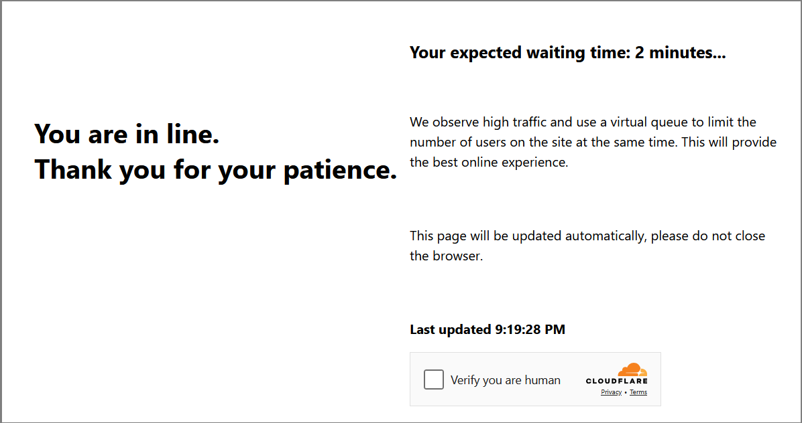

import Tabs from '@theme/Tabs';
import TabItem from '@theme/TabItem';
import ParamItem from '@theme/ParamItem';
import MethodItem from '@theme/MethodItem';
import MethodDescription from '@theme/MethodDescription'
import PriceBlock from '../../../../../src/theme/PriceBlock'
import PriceBlockWrap from '@theme/PriceBlockWrap';
import BlogLink from '@theme/BlogLink';
import { ArticleHead } from '../../../../../src/theme/ArticleHead';

<ArticleHead slug="captchas/turnstile-waitroom-task" />

# Cloudflare Waiting Room

<PriceBlockWrap>
  <PriceBlock title="Cloudflare Waiting Room" captchaId="cf-turnstile"/>
</PriceBlockWrap>

This is a new Cloudflare protection mechanism: the user must wait on average \~3 minutes before accessing the resource:



You can also identify this Cloudflare type via the page header:


<BlogLink url="https://capmonster.cloud/en/blog/Cloudflare/what-is-cloudflare-captcha"/>
<BlogLink url="https://capmonster.cloud/en/blog/Cloudflare/how-cloudflare-bot-challenge-and-turnstile-protect-web-traffic"/>

## Request parameters

:::warning **Attention!**

* Use **your own proxies** for this task.

* After solving, you will receive **special cookies** to add to your browser.
:::

<TabItem value="proxyless" label="RecaptchaV2EnterpriseTaskProxyless (without proxy)" default className="bordered-panel">
  <ParamItem title="type" required type="string" />
  **TurnstileTask**

---

  <ParamItem title="websiteURL" required type="string" />
  The URL of the page containing the check

---

  <ParamItem title="websiteKey" required type="string" />
  Cloudflare site key

---

  <ParamItem title="cloudflareTaskType" required type="string" />
  **wait_room**

---

  <ParamItem title="htmlPageBase64" required type="string" />
  Base64-encoded HTML page containing `<title>Waiting Room powered by Cloudflare</title>`

---

  <ParamItem title="userAgent" required type="string" />
  Browser User-Agent.<br />
  **Provide only the current Windows UA:** userAgentPlaceholder

---

  <ParamItem title="proxyType" required type="string" />
  **http** - regular HTTP/HTTPS proxy;<br />
  **https** - use if http doesn’t work (required for some custom proxies);<br />
  **socks4** - SOCKS4 proxy;<br />
  **socks5** - SOCKS5 proxy.

---

  <ParamItem title="proxyAddress" required type="string" />
  <p>
    Proxy IP address (IPv4/IPv6). Not allowed:
    - Transparent proxies
    - Local machine proxies
  </p>

---

  <ParamItem title="proxyPort" required type="integer" />
  Proxy port.

---

  <ParamItem title="proxyLogin" required type="string" />
  Proxy login.

---

  <ParamItem title="proxyPassword" required type="string" />
  Proxy password.

</TabItem>
---

## Create task method

<TabItem value="proxyless" label="TurnstileTask (without proxy)" default className="method-panel">
	<MethodItem>
		```http
		https://api.capmonster.cloud/createTask
		```
	</MethodItem>
	<MethodDescription>
		**Request**
		```json 
		{
		  "clientKey":"API_KEY",
		  "task": {
			"type":"TurnstileTask",
			"websiteURL":"https://example.com",
			"websiteKey":"xxxxxxxxxx",
			"cloudflareTaskType": "wait_room",
			"htmlPageBase64": "PCFET0NUWVBFIGh0...vYm9keT48L2h0bWw+",
			"userAgent": "userAgentPlaceholder",
			"proxyType":"http",
			"proxyAddress":"8.8.8.8",
			"proxyPort":8080,
			"proxyLogin":"proxyLoginHere",
			"proxyPassword":"proxyPasswordHere"
		  }
		}
		```
		**Response**
		```json
		{
		  "errorId":0,
		  "taskId":407533072
		}
		```
	</MethodDescription>
</TabItem>
---
## Get task result method
Use the [getTaskResult](../api/methods/get-task-result) method to retrieve the Waiting Room solution. Depending on system load, the response can take between 5 and 20 seconds.

<TabItem value="proxyless" label="TurnstileTask (proxyless)" default className="method-panel-full">
  <MethodItem>
    ```http
    https://api.capmonster.cloud/getTaskResult
    ```
  </MethodItem>
  <MethodDescription>
    **Request**
    ```json
    {
      "clientKey": "API_KEY",
      "taskId": 407533072
    }
    ```

    **Response**
    ```json
    {
      "errorId": 0,
      "status": "ready",
      "solution": {
        "cf_clearance": "1tarGvbY2_ZhQdYxpSBloao.FoOn9VtcJtmb_IQ_hCE-1761217338-1.2.1.1-vyVPoLYIGX0VCJomVuLjF7n0kdM0PXaPjpDsRcohxGr7hb2CE7WfcHpmQZ70goqEjdWxPsDhSVaKNTz9opxWguiNdWEEq_.SceWXIqfP7tnEb69f3bP0mixNqcWy_5P_9INpoAEqr1k7aYU0r45PT4gPr5pwHxedVySyLRdoBXIJasdTE52YOQ3NPdGWTwQ_3h2n_wYqqIvf0kCSAvimRrmsgZxomlyejwqPI6ZHi.w"
      }
    }
    ```
  </MethodDescription>
</TabItem>

|**Property**|**Type**|**Description**|
| :- | :- | :- |
|cf_clearance|String|Special Cloudflare cookies that you can set in your browser|
