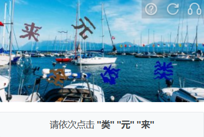
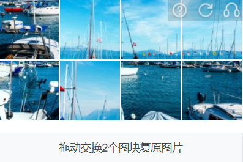
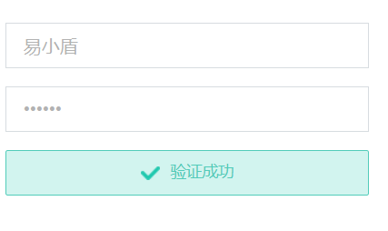
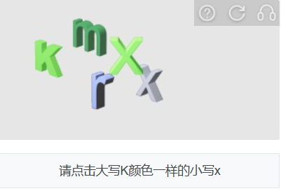
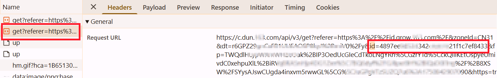
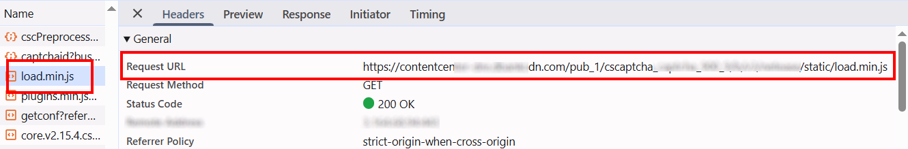
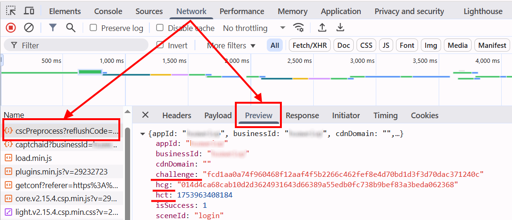

import Tabs from '@theme/Tabs';
import TabItem from '@theme/TabItem';
import ParamItem from '@theme/ParamItem';
import MethodItem from '@theme/MethodItem';
import MethodDescription from '@theme/MethodDescription'
import PriceBlock from '@theme/PriceBlock';
import PriceBlockWrap from '@theme/PriceBlockWrap';
import { ArticleHead } from '../../../../../src/theme/ArticleHead';

<ArticleHead slug="captchas/yidun-task" />

# Yidun - NECaptcha

<PriceBlockWrap>
  <PriceBlock title="Yidun task" captchaId="yidun"/>
</PriceBlockWrap>

## Examples of tasks

<Tabs className="full-width-tabs">
  <TabItem value="jigsaw" label="Jigsaw" default>
    
  </TabItem>
  <TabItem value="picture-click" label="Picture-click">
    
  </TabItem>
  <TabItem value="avoid" label="Avoid">
    
  </TabItem>
  <TabItem value="icon-click" label="Icon-click">
    
  </TabItem>
  <TabItem value="inference" label="Inference">
    
  </TabItem>
  <TabItem value="sense" label="Sense">
    
  </TabItem>
  <TabItem value="space-inference" label="Space-inference">
    
  </TabItem>
</Tabs>

:::warning **Attention!**
CapMonster Cloud uses built-in proxies by default — their cost is already included in the service. You only need to specify your own proxies in cases where the website does not accept the token or access to the built-in services is restricted.

If you are using a proxy with IP authorization, make sure to whitelist the address **65.21.190.34**.
:::

## Request parameters

<TabItem value="proxy" label="YidunTask (with proxy)" className="bordered-panel">

  <ParamItem title="type" required type="string" />
  **YidunTask**

  ---

  <ParamItem title="websiteURL" required type="string" />
  Full URL of the page with the captcha.

  ---

  <ParamItem title="websiteKey" required type="string" />
  The `siteKey` value found on the page (*see example below on how to find it*).

  ---

  <ParamItem title="userAgent" type="string" />
  Browser User-Agent.  
  **Pass only a valid UA from Windows OS. Currently it is**: `userAgentPlaceholder`

  ---

  <ParamItem title="yidunGetLib" type="string" optional />
  Path to the JavaScript file responsible for loading the captcha on the page.  
  **Important**: specify the full URL (https://...).  
  Recommended if fields like `challenge`, `hcg`, or `hct` are present on the site.

  ---

  <ParamItem title="yidunApiServerSubdomain" type="string" optional />
  Subdomain of the Yidun API server.  
  **Important**: must differ from the standard domains `c.dun.163.com` and `c-v6.dun.163.com`.  
  You can include or omit `https://`.  
  Required when using a custom server (often in Enterprise versions).

  ---

  <ParamItem title="challenge" type="string" optional />
  Unique identifier of the current captcha.  
  Typically passed in network requests during initialization or rendering of the captcha.  
  Indicates Enterprise captcha.

  ---

  <ParamItem title="hcg" type="string" optional />
  Captcha hash used in the request.  
  Can be obtained together with `challenge`.

  ---

  <ParamItem title="hct" type="integer" optional />
  Numeric timestamp used in Enterprise version validation.

  ---

  <ParamItem title="proxyType" type="string" />
  **http** - standard http/https proxy;<br />
  **https** - try this if "http" doesn't work (needed for some custom proxies);<br />
  **socks4** - socks4 proxy;<br />
  **socks5** - socks5 proxy.

  ---

  <ParamItem title="proxyAddress" type="string" />
  <p>
    IP address of the proxy (IPv4/IPv6). Not allowed:
    - using transparent proxies (those exposing the client IP);
    - using local machine proxies.
  </p>

  ---

  <ParamItem title="proxyPort" type="integer" />
  Proxy port.

  ---

  <ParamItem title="proxyLogin" type="string" />
  Proxy login.

  ---

  <ParamItem title="proxyPassword" type="string" />
  Proxy password.

  ---

</TabItem>

## Create task method

<Tabs className="full-width-tabs filled-tabs request-tabs" groupId="captcha-type">
  <TabItem value="proxyless" label="YidunTask (without proxy)" default className="method-panel">
    <MethodItem>
      ```http
      https://api.capmonster.cloud/createTask
      ```
    </MethodItem>
    <MethodDescription>
      **Request**
      ```json
      {
        "clientKey": "API_KEY",
        "task": 
        {
          "type": "YidunTask",
          "websiteURL": "https://www.example.com",
          "websiteKey": "6cw0f0485d5d46auacf9b735d20218a5",
          "userAgent": "userAgentPlaceholder"
        }
      }
      ```
      **Response**
      ```json
      {
        "errorId":0,
        "taskId":407533077
      }
      ```
    </MethodDescription>
  </TabItem>

  <TabItem value="proxy" label="YidunTask (with proxy)" className="method-panel">
    <MethodItem>
      ```http
      https://api.capmonster.cloud/createTask
      ```
    </MethodItem>
    <MethodDescription>
      **Request**
      ```json
      {
        "clientKey": "API_KEY",
        "task": 
        {
          "type": "YidunTask",
          "websiteURL": "https://www.example.com",
          "websiteKey": "6cw0f0485d5d46auacf9b735d20218a5",
          "userAgent": "userAgentPlaceholder",
          "proxyType":"http",
          "proxyAddress":"8.8.8.8",
          "proxyPort":8080,
          "proxyLogin":"proxyLoginHere",
          "proxyPassword":"proxyPasswordHere"
        }
      }
      ```
      **Response**
      ```json
      {
        "errorId":0,
        "taskId":407533077
      }
      ```
    </MethodDescription>
  </TabItem>
</Tabs>

## Get task result method

Use the [getTaskResult](../api/methods/get-task-result.mdx) method to retrieve the Yidun captcha solution.

<TabItem value="proxyless" label="CustomTask (without proxy)" default className="method-panel-full">
  <MethodItem>
    ```http
    https://api.capmonster.cloud/getTaskResult
    ```
  </MethodItem>
  <MethodDescription>
  **Request**
  ```json
  {
    "clientKey": "API_KEY",
    "taskId": 407533077
  }
````

**Response**

```json
{
  "errorId": 0,
  "errorCode": null,
  "errorDescription": null,
  "solution": {
    "token": "CN31_9AwsPmaYcJameP_09rA0vkVMQsPij...RXTlFJFc3"
  },
  "status": "ready"
}
```

  </MethodDescription>
</TabItem>

### When are `yidunGetLib` and `yidunApiServerSubdomain` needed?

If you find the `challenge`, `hcg`, and `hct` parameters in network requests on the page (**Network tab**), this means the Enterprise (or Business) version of Yidun is in use. You should also provide `yidunGetLib` and `yidunApiServerSubdomain` to solve it correctly.

<details>
  <summary>Example task</summary>

```json
{
  "type": "YidunTask",
  "websiteURL": "https://id7.cloud.example.com/IframeLogin.html",
  "websiteKey": "0f123r2a6am56431yg17n8rz6grz0ym6",
  "userAgent": "Mozilla/5.0 (Windows NT 10.0; Win64; x64) AppleWebKit/537.36 (KHTML, like Gecko) Chrome/138.0.0.0 Safari/537.36",
  "yidunGetLib": "https://example.com/captcha/b/v3//static/load.min.js",
  "yidunApiServerSubdomain": "csc-captcha-example.com",
  "challenge": "abc55382321547556267884cc3ba57c3d8a7c14f541fd9c6a7f1ce3173d3b9a1",
  "hcg": "9a217825f3dcfac3d34e551e93819d610dec931e5e2a2236edf0e1f3f320c191",
  "hct": 1751469954806
}
```

</details>

---
## How to find `websiteURL` and `websiteKey`

Open *Developer Tools*, activate the captcha, go to the **Network** tab, and find a request that starts with `get?referer=` or `check?referer=`. The value of *referer* is your `websiteURL`.


Sometimes, the `referer` is URL-encoded, such as: *https%3A%2F%2Fid.example.com%2F*. To decode it into a readable address, you can use the browser console:


The value of *id* is the `websiteKey`.



---

**For Yidun Enterprise:**

`websiteURL`, `websiteKey`, and `yidunApiServerSubdomain` can be found the same way as regular Yidun captcha - in requests starting with `get?referer=` or `check?referer=`


---

**`yidunGetLib`**

This is the path to the JavaScript file responsible for loading the captcha on the page.
You can find it in the network tab - it’s usually named something like `load.min.js`.



---

**`challenge`**, **`hcg`**, **`hct`**

All these parameters can be found in network requests. Typically, the relevant request starts with `cscPreprocess?reflushCode=`.



## Use the SDK library

<Tabs className="full-width-tabs filled-tabs request-tabs" groupId="captcha-type">

  <TabItem value="js" label="JavaScript" default className="method-panel">
<details>
      <summary>Show code (for browser)</summary>
```js
// https://github.com/ZennoLab/capmonstercloud-client-js

import { CapMonsterCloudClientFactory, ClientOptions, YidunRequest } from '@zennolab_com/capmonstercloud-client';

const API_KEY = "YOUR_API_KEY"; // Specify your CapMonster Cloud API key

document.addEventListener("DOMContentLoaded", async () => {
    const client = CapMonsterCloudClientFactory.Create(
        new ClientOptions({ clientKey: API_KEY })
    );

    // Basic example without proxy
    // CapMonster Cloud automatically uses its own proxies
    let yidunRequest = new YidunRequest({
        websiteURL: "https://www.example.com",     // URL of the page with captcha
        websiteKey: "6cw0f0485d5d46auacf9b735d20218a5",
        userAgent: "userAgentPlaceholder"
    });

    // Example of using your own proxy
    // Uncomment this block if you want to use your own proxy
    /*
    const proxy = {
        proxyType: "http",
        proxyAddress: "123.45.67.89",
        proxyPort: 8080,
        proxyLogin: "username",
        proxyPassword: "password"
    };

    yidunRequest = new YidunRequest({
        websiteURL: "https://www.example.com",                 
        websiteKey: "6cw0f0485d5d46auacf9b735d20218a5",
        userAgent: "userAgentPlaceholder",
        proxy
    });
    */

    // Optionally, you can check the balance
    const balance = await client.getBalance();
    console.log("Balance:", balance);

    const result = await client.Solve(yidunRequest);
    console.log("Solution:", result);
});
```
</details>

<details>
      <summary>Show code (Node.js)</summary>
```javascript
// https://github.com/ZennoLab/capmonstercloud-client-js

import { CapMonsterCloudClientFactory, ClientOptions, YidunRequest } from '@zennolab_com/capmonstercloud-client';

const API_KEY = "YOUR_API_KEY"; // Specify your CapMonster Cloud API key

async function solveYidun() {
    const client = CapMonsterCloudClientFactory.Create(
        new ClientOptions({ clientKey: API_KEY })
    );

    // Basic example without proxy
    // CapMonster Cloud automatically uses its own proxies
    let yidunRequest = new YidunRequest({
        websiteURL: "https://www.example.com",   // URL of the page with captcha
        websiteKey: "6cw0f0485d5d46auacf9b735d20218a5",
        userAgent: "userAgentPlaceholder"
    });

    // Example of using your own proxy
    // Uncomment this block if you want to use your own proxy

    /*
    const proxy = {
        proxyType: "http",
        proxyAddress: "123.45.67.89",
        proxyPort: 8080,
        proxyLogin: "username",
        proxyPassword: "password"
    };

    yidunRequest = new YidunRequest({
        websiteURL: "https://www.example.com",    // URL of the page with captcha
        websiteKey: "6cw0f0485d5d46auacf9b735d20218a5",
        userAgent: "userAgentPlaceholder",
        proxy
    });
    */

    // Optionally, you can check the balance
    const balance = await client.getBalance();
    console.log("Balance:", balance);

    const result = await client.Solve(yidunRequest);
    console.log("Solution:", result);
}

solveYidun().catch(err => console.error("Error:", err));
```
</details>

  </TabItem>

  <TabItem value="python" label="Python" default className="method-panel">
<details>
      <summary>Show code</summary>
```python
# https://github.com/ZennoLab/capmonstercloud-client-python

import asyncio
from capmonstercloudclient import CapMonsterClient, ClientOptions
from capmonstercloudclient.requests import YidunRequest
# from capmonstercloudclient.requests.baseRequestWithProxy import ProxyInfo  # Uncomment if you plan to use a proxy

API_KEY = "YOUR_API_KEY"  # Specify your CapMonster Cloud API key

async def solve_yidun_captcha():
    client_options = ClientOptions(api_key=API_KEY)
    cap_monster_client = CapMonsterClient(options=client_options)

    # Basic example without proxy
    # CapMonster Cloud automatically uses its own proxies
    yidun_request = YidunRequest(
        websiteUrl="https://www.example.com",  # URL of the page with captcha
        websiteKey="6cw0f0485d5d46auacf9b735d20218a5",
        userAgent="userAgentPlaceholder"  # Use a valid UserAgent
    )

    # Example of using your own proxy
    # Uncomment this block if you want to use your own proxy

    # proxy = ProxyInfo(
    #     proxyType="http",
    #     proxyAddress="123.45.67.89",
    #     proxyPort=8080,
    #     proxyLogin="username",
    #     proxyPassword="password"
    # )
    #
    # yidun_request = YidunRequest(
    #     websiteUrl="https://www.example.com",
    #     websiteKey="6cw0f0485d5d46auacf9b735d20218a5",
    #     userAgent="userAgentPlaceholder",
    #     proxy=proxy
    # )

    # Optionally, you can check the balance
    balance = await cap_monster_client.get_balance()
    print("Balance:", balance)

    result = await cap_monster_client.solve_captcha(yidun_request)
    print("Solution:", result)

asyncio.run(solve_yidun_captcha())
```
</details>
  </TabItem>

  <TabItem value="csharp" label="C#" className="method-panel">
<details>
      <summary>Show code</summary>
```csharp
// https://github.com/ZennoLab/capmonstercloud-client-dotnet

using System;
using System.Threading.Tasks;
using Zennolab.CapMonsterCloud;
using Zennolab.CapMonsterCloud.Requests;

class Program
{
    static async Task Main(string[] args)
    {
        // Your CapMonster Cloud API key
        var clientOptions = new ClientOptions
        {
            ClientKey = "YOUR_API_KEY"
        };

        var cmCloudClient = CapMonsterCloudClientFactory.Create(clientOptions);

        // Basic example without proxy
        // CapMonster Cloud automatically uses its own proxies
        var yidunRequest = new YidunTaskRequest
        {
            WebsiteUrl = "https://example.com",   // URL of the page with captcha
            WebsiteKey = "7ce0f0475b5d46acacf9b732a29218d9",
            UserAgent = "userAgentPlaceholder"
        };

        // Example of using your own proxy
        // Uncomment this block if you want to use your own proxy

        /*
        var yidunRequest = new YidunTaskRequest
        {
            WebsiteUrl = "https://example.com",
            WebsiteKey = "6ce0f0475b5d46acacf9b732d29218d8",
            UserAgent = "userAgentPlaceholder",

            Proxy = new ProxyContainer(
                "123.45.67.89",  
                8080,              
                ProxyType.Http,    
                "username",       
                "password"     
            )
        };
        */

        // Optionally, you can check the balance
        var balance = await cmCloudClient.GetBalanceAsync();
        Console.WriteLine("Balance: " + balance);

        var yidunResult = await cmCloudClient.SolveAsync(yidunRequest);

        Console.WriteLine("Solution: " + yidunResult.Solution.Value);
    }
}
```
</details>
  </TabItem>

</Tabs>
