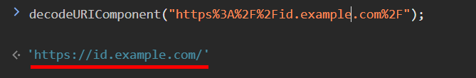

import Tabs from '@theme/Tabs';
import TabItem from '@theme/TabItem';
import ParamItem from '@theme/ParamItem';
import MethodItem from '@theme/MethodItem';
import MethodDescription from '@theme/MethodDescription'
import PriceBlock from '@theme/PriceBlock';
import PriceBlockWrap from '@theme/PriceBlockWrap';

# Yidun - NECaptcha

<PriceBlockWrap>
  <PriceBlock title="Yidun task" name="yidunToken"/>
</PriceBlockWrap>


:::warning **Warning!**
This task will be executed using our proxy servers.
:::

## Request Parameters

<TabItem value="proxy" label="YidunTask (with proxy)" className="bordered-panel">
  <ParamItem title="type" required type="string" />
  **YidunTask**

  ---

  <ParamItem title="websiteURL" required type="string" />
  Full URL of the page containing the CAPTCHA.

  ---

  <ParamItem title="websiteKey" required type="string" />
  The value of the `siteKey` parameter found on the page (*see the example below on how to find it*).

  ---

  <ParamItem title="userAgent" type="string" />
  Browser User-Agent. <br />
  **You must provide a valid User-Agent from a Windows OS. The currently recommended one is**: userAgentPlaceholder

  ---

  <ParamItem title="proxyType" type="string" />
  **http** – standard HTTP/HTTPS proxy;<br />
  **https** – try this only if "http" doesn't work (required for some custom proxies);<br />
  **socks4** – SOCKS4 proxy;<br />
  **socks5** – SOCKS5 proxy.

  ---

  <ParamItem title="proxyAddress" type="string" />
  <p>
    Proxy IP address (IPv4/IPv6). The following are not allowed:
    - using hostnames;
    - using transparent proxies (where the client IP is visible);
    - using proxies from local machines.
  </p>

  ---

  <ParamItem title="proxyPort" type="integer" />
  Proxy port.

  ---

  <ParamItem title="proxyLogin" type="string" />
  Proxy server login.

  ---

  <ParamItem title="proxyPassword" type="string" />
  Proxy server password.

</TabItem>

### How to Get websiteURL and websiteKey
Open the *Developer Tools*, activate the captcha, go to the **Network** tab, and find the request that starts with `get?referer=` or `check?referer=`. The value of *referer* is the `websiteURL`.


Sometimes the `referer` in the URL is encoded, for example: *https%3A%2F%2Fid.example.com%2F*. To get a readable address, you need to decode it, for example, using the browser console:



The value of *id* is the `websiteKey`.


## Create Task Method

<Tabs className="full-width-tabs filled-tabs request-tabs" groupId="captcha-type">
  <TabItem value="proxyless" label="YidunTask (proxyless)" default className="method-panel">
    <MethodItem>
      ```http
      https://api.capmonster.cloud/createTask
      ```
    </MethodItem>
    <MethodDescription>

    **Request**
    ```json
    {
      "clientKey": "API_KEY",
      "task": {
        "type": "YidunTask",
        "websiteURL": "https://www.example.com",
        "websiteKey": "6cw0f0485d5d46auacf9b735d20218a5",
        "userAgent": "userAgentPlaceholder"
      }
    }
    ```

    **Response**
    ```json
    {
      "errorId": 0,
      "taskId": 407533077
    }
    ```
    </MethodDescription>
  </TabItem>

  <TabItem value="proxy" label="YidunTask (with proxy)" default className="method-panel">
    <MethodItem>
      ```http
      https://api.capmonster.cloud/createTask
      ```
    </MethodItem>
    <MethodDescription>

    **Request**
    ```json
    {
      "clientKey": "API_KEY",
      "task": {
        "type": "YidunTask",
        "websiteURL": "https://www.example.com",
        "websiteKey": "6cw0f0485d5d46auacf9b735d20218a5",
        "userAgent": "userAgentPlaceholder",
        "proxyType": "http",
        "proxyAddress": "8.8.8.8",
        "proxyPort": 8080,
        "proxyLogin": "proxyLoginHere",
        "proxyPassword": "proxyPasswordHere"
      }
    }
    ```

    **Response**
    ```json
    {
      "errorId": 0,
      "taskId": 407533077
    }
    ```
    </MethodDescription>
  </TabItem>
</Tabs>

## Get Task Result Method

Use the [getTaskResult](../api/methods/get-task-result.md) method to retrieve the solution for the Yidun CAPTCHA.

<TabItem value="proxyless" label="CustomTask (proxyless)" default className="method-panel-full">
  <MethodItem>
    ```http
    https://api.capmonster.cloud/getTaskResult
    ```
  </MethodItem>
  <MethodDescription>

  **Request**
  ```json
  {
    "clientKey": "API_KEY",
    "taskId": 407533077
  }
  ```

  **Response**
  ```json
  {
    "errorId": 0,
    "errorCode": null,
    "errorDescription": null,
    "solution": {
      "token": "CN31_9AwsPmaYcJameP_09rA0vkVMQsPij...RXTlFJFc3"
    },
    "status": "ready"
  }
  ```
  </MethodDescription>
</TabItem>
