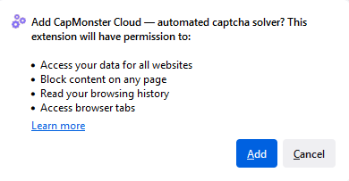
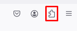
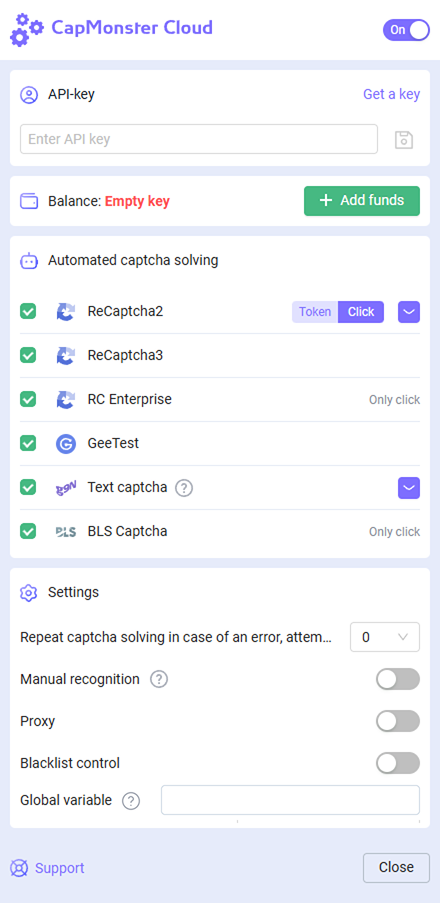
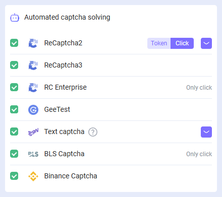

---
sidebar_position: 1
sidebar_label: Firefox browser extension
---

# Firefox browser extension

## Description
With this extension, you can recognize captchas automatically directly in the browser.

The extension works in the Mozilla Firefox browser.

-----
## Automatic installation
1. Open the [Firefox Add-ons Web Store](https://addons.mozilla.org/en-US/firefox/addon/capmonster-cloud/).
2. Click **Add to Firefox**.
3. Confirm adding the extension by clicking the "Add" button in the modal window.
   

To get started with the extension, click on its icon to the right of the address bar. Go to the [settings](extension-firefox.md#settings).

*If for some reason it was not possible to install the extension from the Firefox Add-ons Web Store, use the instructions for manual installation.*

    
Manual installation

1. Download the [archive with the extension](https://drive.google.com/file/d/1Aa-aE9IW095ggFWDmZQrVcAQD1q5BIpv/view?usp=drive_link).

1. Open the Firefox browser and go to work with extensions:
   
   
1. Click the gear button, in the drop-down list that opens, select "Install add-on from file..."
   
   
1. Select the downloaded archive with the extension.

1. After downloading the extension, go to "Manage Your Extensions" and click on the installed extension. 
   
   
1. Go to the "Permissions" tab and make sure that all permissions are granted.
   

    
Manual update of the extension

If you are installing the extension over the previous version, then when you update the original extension files, you also need to click the update button on the "Extensions" page (how to open this page is described above in the "Manual installation" section).

-----
## Settings

    
How to pin the extension

By default, a newly installed extension is automatically pinned to the browser panel. 
   

After launching the extension you’ll see this window:

### API key
Enter API key in the corresponding field(1), press save button(2). If you entered the correct key, your balance will be displayed below(3).

### Automated captcha solving
Here you can select the types of captchas that the extension will recognize automatically.

:::info !

You may need to reload the page with captcha for the changes to take effect!

:::
### Repeat captcha solving in case of an error
If the first attempt to solve the captcha is failed, the extension will send repeated tasks until the captcha is not solved, or until the limit specified in this setting will not be reached.
### Proxy
 

Here you can specify the proxy that will be sent along with the recognition task.

The "Login" and "Password" are optional.
### Blacklist control
Using the blacklist you can configure the extension to ignore captchas on specific websites.

After enabling this option, a field for entering sites will appear:

Domains must be specified along with the protocol (https:// or http://).
You can use masks:

- ? - any one character except period
- \* - any number of any characters

Examples:

|**Filter**|**Description**|
| :-: | :-: |
|`https://zennolab.com`|Prohibition of the extension on the site `https://zennolab.com`|
|`https://*.zennolab.com`|Prohibition of the extension on all subdomains `https://zennolab.com`|
|`https://www.google.*`|Prohibiting the extension from working on Google in all zones (ru, com, com.ua, etc.)|

When errors occur in solving captchas, see the [error glossary](/api/api-errors.md).