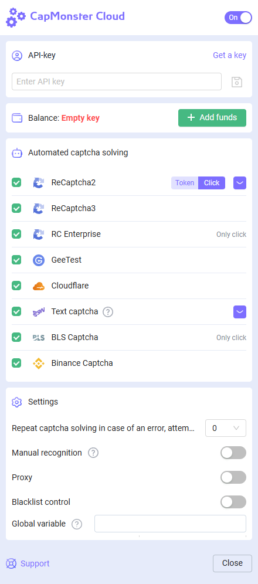

# Chrome browser extension
## Description
With this extension, you can recognize captchas automatically directly in the browser.

The extension works in the Google Chrome browser.

-----
## Automatic installation
**Important!** You cannot install extensions in incognito mode and guest mode.

1. Open the [Chrome Web Store](https://chrome.google.com/webstore/detail/capmonster-cloud-%E2%80%94-automa/pabjfbciaedomjjfelfafejkppknjleh?hl=en).
2. Click **Install**.

To get started with the extension, click on its icon to the right of the address bar. Go to the [settings](extension-main.md#settings).

*If for some reason it was not possible to install the extension from the Chrome Web Store, use the instructions for manual installation.*

    
Manual installation

1. Download the [archive with the extension](https://zenno.link/chrome-actual-build).

2. Unpack it to any folder. 
   
   **WARNING**: the folder shouldn’t be deleted, otherwise the extension stop working.
3. In the Google Chrome browser open the “Extension” page. There are several ways to do this:
   1. Type chrome://extensions in the address bar of a browser and press Enter.
   2. From the menu: click the three vertical dots in the upper right corner (near the profile picture), then "More Tools", then "Extensions".

  

   3. Or go to the Google Chrome settings and select "Extensions" (at the very bottom) in the right menu.

  

4. Enable “Developer Mode”.
5. Then click on “Load unpacked”.

  

6. Find and choose the folder where you unpacked the extension.
7. After that the extension should appear in the list of the installed extensions.

  

    
Manual update of the extension

If you are installing the extension over the previous version, then when you update the original extension files, you also need to click the update button on the "Extensions" page (how to open this page is described above in the "Manual installation" section).

-----
## Settings

    
How to pin the extension

By default the installed extension is hidden. To pin it you have to click on the “Pin” button:

After launching the extension you’ll see this window:

### API key
Enter API key in the corresponding field(1), press save button(2). If you entered the correct key, your balance will be displayed below(3).

### Automated captcha solving
Here you can select the types of captchas that the extension will recognize automatically.

:::info !

You may need to reload the page with captcha for the changes to take effect!

:::
### Repeat captcha solving in case of an error
If the first attempt to solve the captcha is failed, the extension will send repeated tasks until the captcha is not solved, or until the limit specified in this setting will not be reached.
### Proxy
 

Here you can specify the proxy that will be sent along with the recognition task.

The "Login" and "Password" are optional.
### Blacklist control
Using the blacklist you can configure the extension to ignore captchas on specific websites.

After enabling this option, a field for entering sites will appear:

Domains must be specified along with the protocol (https:// or http://).
You can use masks:

- ? - any one character except period
- \* - any number of any characters

Examples:

|**Filter**|**Description**|
| :-: | :-: |
|`https://zennolab.com`|Prohibition of the extension on the site `https://zennolab.com`|
|`https://*.zennolab.com`|Prohibition of the extension on all subdomains `https://zennolab.com`|
|`https://www.google.*`|Prohibiting the extension from working on Google in all zones (ru, com, com.ua, etc.)|

When errors occur in solving captchas, see the [error glossary](/api/api-errors.md).

## Captcha parameter mapping

The **CapMonster Cloud** extension provides a convenient way to view the parameters of various captcha types required for correct task submission and successful solving. The displayed data helps ensure that the parameters you send are accurate and can be used as examples when forming your API requests.

### Supported captcha types and their parameters

| Captcha type                 | Displayed parameters                                                                 |
|-----------------------------|----------------------------------------------------------------------------------------|
| **reCAPTCHA V2**            | `class`, `imageUrls`, `Task` (inside `metadata`), `Grid` (inside `metadata`), `recognizingThreshold`, `userAgent`, `type` |
| **reCAPTCHA V2 Invisible**  | `class`, `imageUrls`, `Task` (inside `metadata`), `Grid` (inside `metadata`), `recognizingThreshold`, `userAgent`, `type` |
| **reCAPTCHA V2 Enterprise** | `class`, `imageUrls`, `Task` (inside `metadata`), `Grid` (inside `metadata`), `recognizingThreshold`, `userAgent`, `type` |
| **GeeTest v3**              | `websiteURL`, `gt`, `challenge`, `userAgent`, `type`                                  |
| **GeeTest v4**              | `websiteURL`, `gt` (`captcha_id`), `userAgent`, `version`, `type`                     |
| **Cloudflare Turnstile**    | `websiteURL`, `websiteKey`, `userAgent`, `type`                                       |
| **Cloudflare Challenge**    | `websiteURL`, `websiteKey`, `userAgent`, `pageAction`, `data`, `pageData`, `cloudflareTaskType`, `type` |
| **ImageToText**             | `body` (in `base64` format), `type`                                                   |
| **BLS**                     | `class`, `imagesBase64`, `Task` (inside `metadata`), `TaskArgument` (inside `metadata`), `type` |
| **Binance**                 | `websiteURL`, `websiteKey`, `validateId`, `userAgent`, `type`                         |

To use this feature, activate the extension, open the captcha page (make sure the captcha type is supported and selected for solving), then follow these steps:

1. Open **Developer Tools** (DevTools) and go to the **CapMonster Cloud tab**:  
   
   

2. Reload the page.

Captcha parameters will be displayed automatically:  

