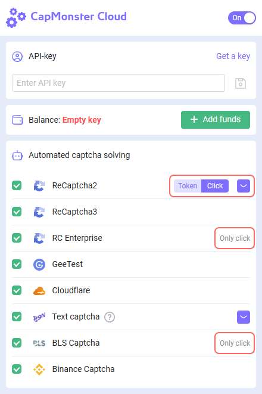

# Instructions for installing the CapMonster Cloud extension in the ProjectMaker browser

:::info

The extension only works with the Chromium browser!

:::

## Method #1: Installation using a CRX file.
1. Download [CRX file CapMonster Cloud](https://chrome.google.com/webstore/detail/capmonster-cloud-%E2%80%94-automa/pabjfbciaedomjjfelfafejkppknjleh?hl=en);

:::info
[Here](https://zennolab.atlassian.net/wiki/spaces/EN/pages/2082930692/Works+with+Extensions#How-to-download-browser-extension-as-a-.crx-file) you can find instructions for installing the CRX file.
:::

2. Open ProjectMaker;

3. Add the **Add extension** action;

    1. Specify the path to the CRX file in the action settings;

4. Add the **Activate extension** action;

5. In the action settings, set the extension ID **pabjfbciaedomjjfelfafejkppknjleh**;

6. In the extension window that opens, enter the API-key from your CapMonster Cloud personal account.

## Method #2: Installation via the Chrome Web Store.
1. Open ProjectMaker;
2. Go to the extension page `<https://chrome.google.com/webstore/detail/capmonster-cloud-%E2%80%94-automa/pabjfbciaedomjjfelfafejkppknjleh?hl=en>`;
3. Click the **Install** button and install the extension;
4. Add **Activate extension** action;

    1. In the action settings, insert the extension ID **pabjfbciaedomjjfelfafejkppknjleh**;

5. In the extension window that opens, enter the API-key from your CapMonster Cloud personal account.
:::info
The new version of the CapMonster Cloud extension has the ability to solve `reCAPTCHA2`, `reCAPTCHA Enterprise` by clicks.
:::
 
:::caution
Please note that when installing the extension the solving type for `reCAPTCHA2`, `reCAPTCHA Enterprise` is set **Click** by default.
:::
To make the use of CapMonster Cloud extension in the ProjectMaker easier, we’ve prepared a project to automate the installation of the extension, entering the API-key and choosing the solving type `reCAPTCHA2`, `reCAPTCHA Enterprise`.

***Minimum version of ZennoPoster 7.6.1***

:::caution
When installing the CapMonster Cloud extension via a CRX file, you need to keep the extension version up to date. In case of a version update, you need to re-download the current CRX file and reinstall it.
:::
:::caution
When using the CapMonster Cloud extension, you need to remove captcha recognition actions from your project.
:::