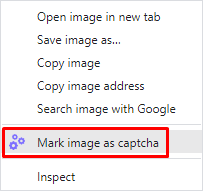

---
sidebar_position: 1
draft: true
---

# Solving text captchas
## **Description**
We've added the ability to recognize text captchas in our browser extension.

 
## **How it works**
### **Actions in the browser**
1\. Right-click on the captcha and select "Mark image as captcha" from the pop-up menu.

2\. Right-click on the field for entering the answer and select "Select an input for the captcha result" in the menu that opens..

3\. The result is automatically written in the field for entering the answer.

 
### **Recognition automation using software**
To automate the process of recognizing text captchas in the browser, you should:
1. Assign the `cm-image-to-text-source="id"` attribute to the element with the image;
1. Assign the `cm-image-to-text-input-result="id"` attribute to the element with the input.

Where "id" is the captcha identifier (arbitrary value).
:::info 
At the same time captchas and inputs corresponding to each other should have the same id.

You can solve several captchas on the page in parallel, the main thing is that the id within one set is unique and the id of the captcha and input match each other.
:::
