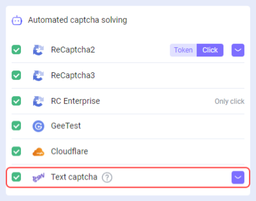
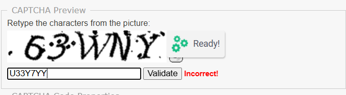

---
sidebar_position: 2
sidebar_label: Solving text captchas
---

import { ArticleHead } from '../../../../../src/theme/ArticleHead';

<ArticleHead slug="extension/text-captcha-solve" />

# Solving text captchas
## Description
We've added the ability to recognize text captchas in our browser extension.

 

## How it works

### Actions in the browser
1\. Right-click on the captcha and select **Mark image as captcha** from the pop-up menu.

2\. Right-click on the field for entering the answer and select **Select an input for the captcha result** in the menu that opens..

3\. The result is automatically written in the field for entering the answer.

 
### Recognition automation using software
To automate the process of recognizing text captchas in the browser (e.g., using *Developer Tool* or *Selenium*)  you need:
1. Assign the `cm-image-to-text-source=**id**` attribute to the element with the image:

 

2. Assign the `cm-image-to-text-input-result=**id**` attribute to the element with the input:

 

Where **id** is the captcha identifier (arbitrary value).
:::info 
At the same time captchas and inputs corresponding to each other should have the same id.

You can solve several captchas on the page in parallel, the main thing is that the id within one set is unique and the id of the captcha and input match each other.
:::

## What to do if the Text CAPTCHA is solved incorrectly

If the text captcha is being solved incorrectly through the extension, follow these steps:

1. Select the appropriate module from the available list (see [Passing module name](/docs/api/module-name)).
2. If the required module is not available, create your own (see [Creating a user module](/docs/api/user-module)) and wait until it is ready.
3. In the extension, open **Text captcha** → **Settings** (purple button with an arrow).

4. Enter the module name and click **+ Add Module**.

This ensures the CAPTCHA is solved correctly using the selected or custom module.
