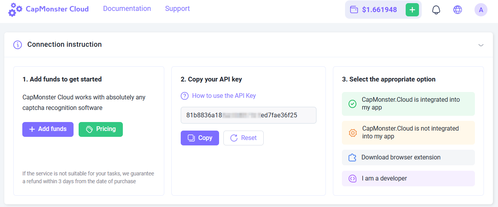
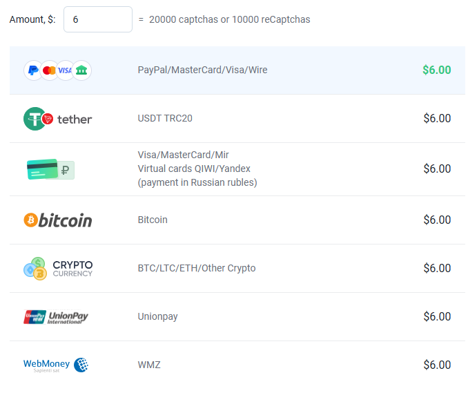
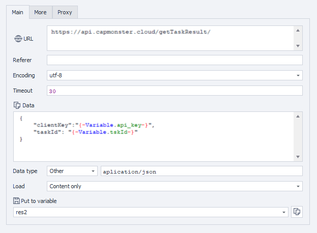

---
sidebar_position: 1
# id: my-home-doc
# slug: /
---

# Getting started

This section contains instructions on how to get started with the service and describes the main methods of submitting captchas and recognizing them.

## Step 1. Create an account

Before solving captchas, register at [CapMonster Cloud](https://capmonster.cloud/) in any convenient way. Then go to your [Dashboard](https://capmonster.cloud/Dashboard), where you’ll find all the necessary information — your current balance, API key, and statistics on solved and unsolved tasks.



## Step 2. Top up your balance

The service supports several payment methods.



Now you can solve captchas automatically using the [browser extension](../docs/extension) or by creating tasks via API.

## Methods of sending and receiving results

:::info Method address
```http
https://api.capmonster.cloud
```
Request format: `JSON POST`.
Response is always in the `JSON` format.
:::

**To solve a captcha, you need to:**

1. Create a captcha task using [createTask](api/methods/create-task.md).
2. Wait for some time. Depending on system load, the response is usually received within **300** ms to **6** s.
3. Request the captcha solution using [getTaskResult](api/methods/get-task-result.md). If the captcha is not solved yet, go back to step 2.

Additional method:

* [Get](api/methods/get-balance.md) the current account balance.

### Code examples

For your convenience, we’ve created ready-to-use libraries for quick integration of the CapMonster Cloud API into your code. Solve various types of captchas at the lowest prices on the market!

|**Language**|**Link to the repository**|
| :- | :- | 
|С#|- [Nuget](https://www.nuget.org/packages/Zennolab.CapMonsterCloud.Client)<br /> - [Github](https://github.com/ZennoLab/capmonstercloud-client-dotnet) |
|Python|- [PyPl](https://pypi.org/project/capmonstercloudclient/)<br /> - [Github](https://github.com/ZennoLab/capmonstercloud-client-python)|
|JS|- [Npm](https://www.npmjs.com/package/@zennolab_com/capmonstercloud-client)<br /> - [Github](https://github.com/ZennoLab/capmonstercloud-client-js)|
|GO|- [Pkg.go.dev](https://pkg.go.dev/github.com/ZennoLab/capmonstercloud-client-go)<br /> - [Github](https://github.com/ZennoLab/capmonstercloud-client-go)|
|PHP|- [Packagist](https://packagist.org/packages/zennolab/capmonstercloud.client)<br /> - [Github](https://github.com/ZennoLab/capmonstercloud-client-php)|

## Captcha recognition methods

### 1. Via token

This is the basic method of captcha recognition, where you need to:

* Manually find the parameters on the page, such as:

  * `sitekey` (or `websiteKey`) — the unique captcha identifier
  * `websiteURL` — the address of the page where the captcha is displayed
* Analyze the JavaScript code and network requests to extract these values
* Send a task to CapMonster Cloud with the required parameters
* Receive a **token** in response — a unique code confirming the captcha solution
* Perform **autosubmit** — send the token to the site to confirm captcha completion

> Suitable for developers who are ready to manually analyze the code and build the logic for submitting the solution.

---

### 2. Via clicks

This method simulates user actions (mouse movement, clicks, selecting images). It’s available through the browser extension and API. With this method, you can solve reCAPTCHA and complex image-based captchas.

This method is useful if:

* the website uses a non-standard captcha implementation;
* parameters are encrypted or dynamically inserted;
* the submit function is hidden deep inside scripts.

---

You can also apply the click method in [ZennoPoster](https://zennolab.com/en/products/zennoposter/). To do this, simply install our CapMonster Cloud extension (see section [CapMonster Cloud Extension Installation in ProjectMaker Browser](extension/install-instruction.md)) into a Chromium-based project, enter your API key, and use the extension the same way as in the Chrome system browser.

## Token submission examples in ZennoPoster

There are several ways to pass a captcha token in ZennoPoster, for example, using ready-made **ProjectMaker actions** or with **HTTP requests**.

### Using ProjectMaker actions

1. Integrate CapMonster Cloud in ProjectMaker (**Settings** → **Captchas** → Select `CapMonster Cloud` module, enter your API key).

2. Add actions **Clear cookies** → **Navigate to page** (for example, for reCaptcha v.2 — [https://lessons.zennolab.com/captchas/recaptcha/v2_simple.php?level=high](https://lessons.zennolab.com/captchas/recaptcha/v2_simple.php?level=high)) → **Recognize ReCaptcha**.

3. In the **Recognize ReCaptcha** action properties, select the `CapMonsterCloud.dll` module, specify the captcha type (`reCAPTCHA v.2`), and recognition method (**In tab** or **Via sitekey**):


4. When choosing **Via sitekey**, enter the captcha data (`sitekey`) and URL (the page address where the captcha is located):

> *How to find the parameters for reCAPTCHA v.2 you can learn [here](./captchas/no-captcha-task#how-to-find-all-required-parameters-to-create-a-task).*

---


**reCAPTCHA v.3**

1. Add actions **Clear cookies** → **Navigate to page** (for example, [https://lessons.zennolab.com/captchas/recaptcha/v3.php?level=beta](https://lessons.zennolab.com/captchas/recaptcha/v3.php?level=beta)) → **Recognize ReCaptcha**.

2. In the action properties, select the CapMonsterCloud.dll module, specify captcha type (reCAPTCHA v.3), method (**In tab** or **Via Sitekey**), and also provide `Action` and `minScore`.

> *How to find the parameters for reCAPTCHA v.3 you can learn [here](./captchas/recaptcha-v3-task#how-to-find-all-required-parameters-to-create-a-task).*

---


<!-- ### hCaptcha

1. Add the “Recognize hCaptcha” action into your project after navigating to the page with the captcha;

2. In the “Recognize hCaptcha” action properties, choose the method (In tab or Via Sitekey). If using Sitekey, enter the sitekey and captcha page URL:

 -->

### Using HTTP requests

For some types of captchas, there are no ready-made ProjectMaker actions, so you need to use the extension or compose requests manually to solve the captcha.

1. Add **Variable Processing** action (**Add action** → **Data** → **Variable Processing**), choose **Set Value**, and enter your CapMonster Cloud API key:


2. Add **HTTP** → **POST request** action (if necessary, specify proxy details):


3. Add **JSON/XML Processing** action (**Add action** → **Data** → **JSON/XML Processing**), choose **Parsing**, type — JSON, and for parsing text select **Set Value from Variable**:


4. Add **Variable Processing** action and set the value to `{-Json.taskId-}`:


5. Form a new POST request to get the result:



6. Add a **Parsing** action in **JSON/XML Processing**:


7. Insert the received token into the required captcha form (after analyzing the page code) using the **Set Value** action:


