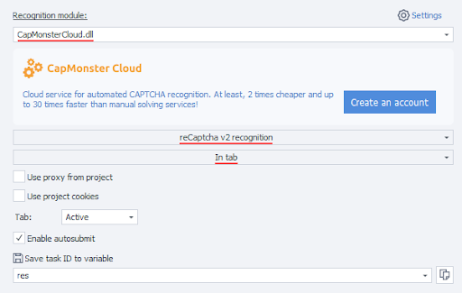

---
sidebar_position: 0
sidebar_label: Getting Started
---

import UserAgent from '@site/src/components/UserAgent';


# Getting Started

In this section you can learn how to send captchas to CapMonster Cloud and methods for recognizing them.

:::info Method address
```http
https://api.capmonster.cloud
```
Request format: `JSON POST`.
Response is always in the `JSON` format.
:::


**To solve a captcha, you need:**

1. Create captcha task via [createTask](api/methods/create-task.md) method which will return task ID.
2. Wait for a while. Depending on the system load, you will receive an answer after a time in the range from 300ms to 6s.
3. Request captcha solution with [getTaskResult](api/methods/get-task-result.md). If captchas are not solved yet, go to step #2. 

Additional method:

- [Check](api/methods/get-balance.md) account balance.

### Code examples

For your convenience, we’ve created ready-made libraries for fast integration the CapMonster.Cloud API into your code. Recognize reCAPTCHA, hCaptcha and other types of captcha at the lowest prices on the market!

|**Language**|**Link to the repository**|
| :- | :- | 
|С#|- [Nuget](https://www.nuget.org/packages/Zennolab.CapMonsterCloud.Client)<br /> - [Github](https://github.com/ZennoLab/capmonstercloud-client-dotnet) |
|Python|- [PyPl](https://pypi.org/project/capmonstercloudclient/)<br /> - [Github](https://github.com/ZennoLab/capmonstercloud-client-python)|
|JS|- [Npm](https://www.npmjs.com/package/@zennolab_com/capmonstercloud-client)<br /> - [Github](https://github.com/ZennoLab/capmonstercloud-client-js)|
|GO|- [Pkg.go.dev](https://pkg.go.dev/github.com/ZennoLab/capmonstercloud-client-go)<br /> - [Github](https://github.com/ZennoLab/capmonstercloud-client-go)|
|PHP|- [Packagist](https://packagist.org/packages/zennolab/capmonstercloud.client)<br /> - [Github](https://github.com/ZennoLab/capmonstercloud-client-php)|


<UserAgent color="red"/>

## Recognition methods

There are 2 captcha recognition methods in CapMonster Cloud service:

1. Token method.
2. Click method.

The first method (**via token**) is the initial basic method of recognition, where you have to manually search for parameters and functions in the code of the sites pages, and then construct queries using these parameters or script and perform autosubmit to send the token and signal to the site that the captcha has been solved and the correct input needs to be verified. Token is a unique combination of characters, a response from the server that is generated as a result of a successful captcha solution and is used to validate it. Autosubmit - a function that automatically sends the token to the captcha form and confirms the solution. 

The search parameters are, for example, SiteKey (websiteKey) - a unique identifier that is used to link the captcha and the target site, website URL - the address of the page where the captcha is located. 

After analyzing the page code and making a request, the captcha data is sent to the CapMonster Cloud service for recognition. As a result of successful solving, the site that initiated the request receives a token for further sub-mining. The user can use this method in his code, having correctly formulated the task to send to the server, receive the result, and confirm the solution of the captcha. 

The second method (**via clicks**) allows complex captchas to be recognized the way a real person does, using real clicks. This proves to the site that the captcha is recognized manually by a human, not a bot. This method is used in a browser extension for Chrome or Firefox. 

Another important advantage of this method of recognition is that it is not necessary to independently search for parameters to send to the service and perform autosubmit. It is not a secret that at this step you can face a rather serious and time-consuming task (especially for beginners in programming) of searching for parameters and functions in scripts and data in requests, HTML layout of sites, and structure of scripts through which submit (confirmation of captcha solution) is usually implemented.

This problem is often aggravated by the fact that sites may use different non-standard ways of parameter setting and submit function implementation. For example, if many third-party parameters are used in requests or if these parameters are encrypted. Click method of solution in most cases allows you to bypass such difficulties without additional complex research and experimentation. 

There is also a great opportunity to apply the click method in ZennoPoster. To do this, just install our CapMonster Cloud extension (see section [Instructions for installing CapMonster Cloud extension in ProjectMaker browser](extension/install-instruction.md)) into a project with Chromium engine, enter the API key, and use the extension to work with the project in the same way as it is usually done in the Chrome system browser. 

## Token submit examples in Zennoposter

Using actions:

1. Integrate CapMonster Cloud into ProjectMaker (Settings - Captchas - Select CapMonster Cloud module, enter your API key);

2. Add actions Clear Cookies - Go to page (for example, for reCaptcha v.2 captcha type - [https://lessons.zennolab.com/captchas/recaptcha/v2_simple.php?level=high](https://lessons.zennolab.com/captchas/recaptcha/v2_simple.php?level=high)) - Recognize ReCaptcha;

3. In the Properties of the Recognize ReCaptcha action, select the CapMonsterCloud.dll module, specify the reCaptcha v.2 captcha type and the method of solving **In tab** or **Via SiteKey**:



4. If you choose the **Via SiteKey** method, specify the captcha data (sitekey) and url - address of the page where you want to solve the captcha: 


### reCaptcha v.3

1. Add actions Clear cookies - Go to page (e.g. [https://lessons.zennolab.com/captchas/recaptcha/v3.php?level=beta](https://lessons.zennolab.com/captchas/recaptcha/v3.php?level=beta)) - Recognize ReCaptcha;

2. In the Properties of the Recognize ReCaptcha action, select the CapMonsterCloud.dll module, specify the reCaptcha v.3 captcha type, the method In Tab or Via SiteKey, also specify Action and minScore:


### hCaptcha 

1. Add the action "Recognize hCaptcha" to your project, where you have already navigated to the page with the captcha;

2. In the Properties of the Recognize hCaptcha action, select the In Tab or Via SiteKey method (when selecting this method, you will need to specify the SiteKey and the URL where the captcha is located):


### Via HTTP requests

For some captcha types, there are no ready-made actions in ProjectMaker, in which case you will need to use an extension or compose your queries to solve the captcha. 

1. "Variable Processing" ("Add Action" - "Data" - "Variable Processing"), select "Set Value" in the properties and write your CapMonster Cloud API key in the value.


2. "Add Action" - "HTTP" - "POST request" (additionally add your proxy values if needed):


3. Add a "Process JSON/XML" action ("Add action" - "Data" - "Process JSON/XML"), in the properties select "parsing", type "Json" and for right-click parsing text select "Set value from variable": 


4. Add "Variable Processing" action, set \{-Json.taskId-\} in it: 


5. Generate a new POST request to get the result:


6. Add the value "parsing" in the "JSON/XML Processing" action: 


7. Next, you need to substitute the token value into the desired captcha form (by examining the page code) using the "Set Value" action, for example: 

