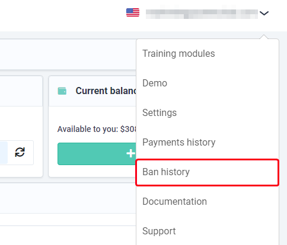

# Motivos para bloqueio
##  **Como descobrir o motivo do bloqueio?**
Em caso de bloqueio, você verá uma notificação em sua [conta pessoal](https://capmonster.cloud/Dashboard).
O histórico de bloqueios está disponível nas configurações.

 
##  **Os principais motivos para receber um bloqueio são:**

- **KeyDoesntExist** (múltiplas solicitações sem chave / com chave inválida)
- **ZeroBalance** (múltiplas solicitações com saldo zero)
- **WrongTaskId**
  - ao exceder o limite de 120 solicitações por tarefa
  - múltiplas solicitações para `getTaskResult` com `TaskId` incorreto
- **BadProxy** (múltiplas solicitações com proxy banido)

Os usuários recebem bloqueios por ações repetidas por um período limitado.
##  **Quando o bloqueio será removido?**

A duração do bloqueio é de 10 minutos, desde que você não continue a violar as regras descritas acima.

  

    Estou sendo bloqueado constantemente. O que devo fazer?
  

O motivo é que seu aplicativo/script envia várias solicitações incorretas à API. 

**Eu sou um usuário**

Se você não for o desenvolvedor do aplicativo/script que envia os captchas, entre em contato com o suporte deles e explique que o serviço de reconhecimento de captcha está bloqueando você por múltiplas solicitações incorretas (leia a explicação dos motivos para receber um bloqueio).

**Eu sou um desenvolvedor**

Se você for desenvolvedor, faça alterações conforme as regras e limites:

- Certifique-se de que seu aplicativo ou script está enviando solicitações corretas à API. Verifique se todos os parâmetros estão corretos, incluindo chaves, `TaskIds` e outros dados necessários.

- Respeite os limites no número de solicitações por tarefa e outras restrições impostas pelo serviço de reconhecimento de captcha. Se seu aplicativo enviar muitas solicitações, isso pode levar ao bloqueio.

- Certifique-se de usar servidores proxy confiáveis para evitar bloqueios devido ao uso de proxies banidos.

Para ver exemplos de consultas válidas, consulte [Tipos de Captcha](https://docs.capmonster.cloud/docs/captchas). 

