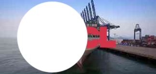

import Tabs from '@theme/Tabs';
import TabItem from '@theme/TabItem';
import ParamItem from '@theme/ParamItem';
import MethodItem from '@theme/MethodItem';
import MethodDescription from '@theme/MethodDescription'


# ComplexImageTask Recognition

## Parâmetros de solicitação
<TabItem value="proxyless" label="ComplexImageTask (sem proxy)" default className="bordered-panel">
    <ParamItem title="type" required type="string" />
    **ComplexImageTask**

    ---

    <ParamItem title="class" required type="string" />
    **recognition**

    ---

    <ParamItem title="imagesBase64" required type="array" />
    Array de imagens codificadas em base64.
    Exemplo: [ “/9j/4AAQSkZJRgABAQEAAAAAAAD…”]

    ---

    <ParamItem title="metadata.Task" required type="string" />
    Valores possíveis: `oocl_rotate_new` e outros <br />
    Nome da tarefa (<u>em inglês</u>).

  </TabItem>

## Tipos de tarefas disponíveis
### Criar tarefa `oocl_rotate_new`

Na solicitação, passamos duas imagens: fundo e círculo.

<TabItem value="proxyless" label="RecaptchaV2TaskProxyless (sem proxy)" default className="method-panel">
<MethodItem>
  ```http
  https://api.capmonster.cloud/createTask
  ```
</MethodItem>
<MethodDescription>
**Solicitação**
```json
{
    "clientKey": "API_KEY",
    "task": {
        "type": "ComplexImageTask",
        "class": "recognition",
        "imagesBase64": [
			"{background_base64}",
			"{circle_base64}"
		],
        "metadata": {
            "Task": "oocl_rotate_new"
        }
    }
}
```

Exemplo de fundo (*background_base64*):



Exemplo de círculo (*circle_base64*):


**Resposta**
```json
{
  "errorId":0,
  "taskId":407533072
}
```

</MethodDescription>
</TabItem>


### Obter resultado da tarefa `oocl_rotate_new`

<TabItem value="proxyless" label="GeeTestTaskProxyless (sem proxy)" default className="method-panel-full">
    <MethodItem>
```http
https://api.capmonster.cloud/getTaskResult
```
    </MethodItem>
    <MethodDescription>
**Solicitação**
```json
{
  "clientKey":"API_KEY",
  "taskId": 407533072
}
```
**Resposta**
Graus pelos quais o círculo deve ser girado no sentido horário.
```json
{
  "errorId":0,
  "status":"ready",
  "errorCode":null,
  "errorDescription":null,
  "solution": {
      "answer":[130.90909]
  },
   "metadata": {
      "AnswerType":"NumericArray"
  }
}
```
  </MethodDescription>
  </TabItem>


### Criar tarefa `oocl_rotate_double_new`

Na solicitação, passamos três imagens: fundo, anel, círculo.
<TabItem value="proxyless" label="ComplexImageTask (sem proxy)" default className="method-panel">
<MethodItem>
  ```http
  https://api.capmonster.cloud/createTask
  ```
</MethodItem>
<MethodDescription>
**Solicitação**
```json
{ 
    "clientKey": "API_KEY",
    "task": {
        "type": "ComplexImageTask",
        "class": "recognition",
        "imagesBase64": [
			"{background_base64}",
			"{ring_base64}",
			"{circle_base64}"
		],
        "metadata": {
            "Task": "oocl_rotate_double_new"
        }
    }
}
```

Fundo (*background_base64*):


Anel (*ring_base64*):


Círculo (*circle_base64*):


**Resposta**
```json
{
  "errorId":0,
  "taskId":407533072
}
```

</MethodDescription>
</TabItem>


### Obter resultado da tarefa `oocl_rotate_double_new`

<TabItem value="proxyless" label="ComplexImageTask (sem proxy)" default className="method-panel-full">
    <MethodItem>
```http
https://api.capmonster.cloud/getTaskResult
```
    </MethodItem>
    <MethodDescription>
**Solicitação**
```json
{
  "clientKey":"API_KEY",
  "taskId": 407533072
}
```
**Resposta**
Graus pelos quais o anel deve ser girado no sentido anti-horário e o círculo no sentido horário.
```json
{
  "errorId":0,
  "status":"ready",
  "errorCode":null,
  "errorDescription":null,
  "solution": {
      "answer":[130.90909]
  },
   "metadata": {
      "AnswerType":"NumericArray"
  }
}
```

  </MethodDescription>
  </TabItem>
  
### Criar tarefa `betpunch_3x3_rotate`

Na solicitação, passamos nove imagens. As imagens devem ser passadas na seguinte ordem:


<TabItem value="proxyless" label="ComplexImageTask (sem proxy)" default className="method-panel">
<MethodItem>
  ```http
  https://api.capmonster.cloud/createTask
  ```
</MethodItem>
<MethodDescription>
**Solicitação**
```json
{ 
    "clientKey": "API_KEY",
    "task": {
        "type": "ComplexImageTask",
        "class": "recognition",
        "imagesBase64": [
			"{image_1_Base64}",
			"{image_2_Base64}",
			"{image_3_Base64}",
			"{image_4_Base64}",
			"{image_5_Base64}",
			"{image_6_Base64}",
			"{image_7_Base64}",
			"{image_8_Base64}",
			"{image_9_Base64}",
		],
        "metadata": {
            "Task": "betpunch_3x3_rotate"
        }
    }
}
```

**Resposta**
```json
{
  "errorId":0,
  "taskId":407533072
}
```

</MethodDescription>
</TabItem>


### Obter resultado da tarefa `betpunch_3x3_rotate`

<TabItem value="proxyless" label="ComplexImageTask (sem proxy)" default className="method-panel-full">
    <MethodItem>
```http
https://api.capmonster.cloud/getTaskResult
```
    </MethodItem>
    <MethodDescription>
**Solicitação**
```json
{
  "clientKey":"API_KEY",
  "taskId": 407533072
}
```
**Resposta**
"answer":[X,X,X,X,X,X,X,X,X], onde X é um valor inteiro de 1 a 4 para cada imagem. 4 - significa que a imagem não precisa ser girada; 1-3 - o número de rotações no sentido anti-horário da imagem.
```json
{
	"errorId":0,
	"status":"ready",
	"errorCode":null,
	"errorDescription":null,
	"solution":
	{
		"answer":[4,4,4,4,4,3,1,2,2],
		"metadata":{"AnswerType":"NumericArray"}
	}
}
```

  </MethodDescription>
  </TabItem>