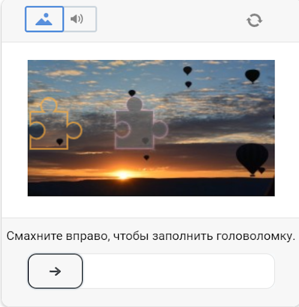

import Tabs from '@theme/Tabs';
import TabItem from '@theme/TabItem';
import ParamItem from '@theme/ParamItem';
import MethodItem from '@theme/MethodItem';
import MethodDescription from '@theme/MethodDescription'

# DataDome

Esse tipo de captcha basicamente exige que o usuário resolva um quebra-cabeça movendo um controle deslizante para confirmar.



:::warning **Atenção!**
Essa tarefa será realizada utilizando nossos servidores proxy. Use os cookies recebidos em seu projeto para passar automaticamente o captcha.
:::


## Parâmetros de solicitação
<TabItem value="proxyless" label="RecaptchaV2EnterpriseTaskProxyless (sem proxy)" default className="bordered-panel">
    <ParamItem title="type" required type="string" />
    **CustomTask**

    ---

    <ParamItem title="class" required type="string" />
    **DataDome**

    ---

    <ParamItem title="websiteURL" required type="string" />
    O endereço da página principal onde o captcha é resolvido.

    ---

    <ParamItem title="metadata.htmlPageBase64" required="required (se metadata.captchaUrl não for preenchido)" type="string" />
    Objeto que contém dados adicionais sobre o captcha: `"htmlPageBase64": "..."` - uma página HTML codificada em base64 que vem com um código 403 e um cabeçalho Set-Cookie: datadome="..." em resposta a uma solicitação get para o site de destino.

    ---

    <ParamItem title="metadata.captchaUrl" required="required (se metadata.htmlPageBase64 não for preenchido)" type="string" />
    `"captchaUrl"` - link para o captcha. Geralmente se parece com isso: `"https://geo.captcha-delivery.com/captcha/?initialCid=..."`.

    ---

    <ParamItem title="metadata.datadomeCookie" required type="string" />
    Seus cookies do datadome. Você pode obtê-los na página usando "document.cookie" ou no cabeçalho da solicitação Set-Cookie: "datadome=..." (ver exemplo de solicitação /createTask)

    ---

    <ParamItem title="userAgent" type="string" />
    Browser User-Agent.<br /> **Passe apenas o UA real do Windows OS. O atual é**: userAgentPlaceholder

  </TabItem>

## Criar tarefa


<TabItem value="proxyless" label="RecaptchaV2TaskProxyless (sem proxy)" default className="method-panel">
<MethodItem>
  ```http
  https://api.capmonster.cloud/createTask
  ```
</MethodItem>
<MethodDescription>
**Solicitação**
```json
{
    "clientKey": "API_KEY",
    "task": {
        "type": "CustomTask",
        "class": "DataDome",
        "websiteURL": "https://www.leboncoin.fr/",
        "userAgent": "MuserAgentPlaceholder",
        "metadata": {
            "htmlPageBase64": "PGh0bWw+PGhlYWQ+PHRpdGxlPmJs...PC9odG1sPg==",
            "datadomeCookie": "datadome=VYUWrgJ9ap4zmXq8Mgbp...64emvUPeON45z"
        }
    }
}
```
**Resposta**
```json
{
  "errorId":0,
  "taskId":407533072
}
```

</MethodDescription>
</TabItem>

## Obter resultado da tarefa
Use o método [getTaskResult](../api/methods/get-task-result.md) para obter a solução do DataDome.

<TabItem value="proxyless" label="GeeTestTaskProxyless (sem proxy)" default className="method-panel-full">
    <MethodItem>
```http
https://api.capmonster.cloud/getTaskResult
```
    </MethodItem>
    <MethodDescription>
**Solicitação**
```json
{
  "clientKey":"API_KEY",
  "taskId": 407533072
}
```
**Resposta**
```json
{
    "errorId":0,
    "status":"ready",
    "solution": {
        "domains": {
            "site.com": {
                "cookies": {
                    "datadome": "t355hfeuUFbsWpoMzXyIWL_ewfwgre25345323rwgregeFEkG5iju9esKVfWMzuLAjcfCIJUIHU7332At1l~HY78g782hidwfeO4K2ZP_CFHYUFEgygfiYGfGYEUfgyefWrXG6_3sy; Max-Age=31536000; Domain=.site.com; Path=/; Secure; SameSite=Lax"
                }
            }
        }
    }
}
```
  </MethodDescription>
  </TabItem>


## Usar biblioteca SDK

<Tabs className="full-width-tabs filled-tabs request-tabs" groupId="captcha-type">
  <TabItem value="js" label="JavaScript" default className="method-panel">

```js
// https://github.com/ZennoLab/capmonstercloud-client-js

import { CapMonsterCloudClientFactory, ClientOptions, DataDomeRequest } from '@zennolab_com/capmonstercloud-client';

document.addEventListener('DOMContentLoaded', async () => {
  const cmcClient = CapMonsterCloudClientFactory.Create(new ClientOptions({ clientKey: '<your capmonster.cloud API key>' }));
  console.log(await cmcClient.getBalance());

  const dataDomeRequest = new DataDomeRequest({
    websiteURL: 'site.com',
    userAgent: 'Mozilla/5.0 (Windows NT 10.0; Win64; x64) AppleWebKit/537.36 (KHTML, like Gecko) Chrome/120.0.0.0 Safari/537.36',
    metadata: {
      captchaUrl: 'https://geo.captcha-delivery.com/captcha/?initialCid=12434324',
      datadomeCookie: '',
    },
  });

  console.log(await cmcClient.Solve(dataDomeRequest));
});
```
  </TabItem>
  
</Tabs>

