---
sidebar_position: 3
sidebar_label: FunCaptchaTask
draft: true
---

# FunCaptchaTask
Este tipo de tarefa resolve o FunCaptcha. Seu aplicativo envia o endereço do site, chave pública e proxy.

O resultado da solução da tarefa é um token para o formulário de envio.

:::warning **Atenção!**
Se o proxy for autorizado por IP, certifique-se de adicionar **116.203.55.208** à lista de permissões.
:::

## **Estrutura do Objeto**

|**Parâmetro**|**Tipo**|**Obrigatório**|**Valor**|
| :- | :- | :- | :- |
|type|String|sim|**FunCaptchaTaskProxyless** ou **FunCaptchaTask** (ao usar proxy).|
|websiteURL|String|sim|Endereço da página com FunCaptcha.|
|funcaptchaApiJSSubdomain|String|não|Um subdomínio especial do funcaptcha.com, de onde o widget JS deve ser carregado. Pode ser encontrado em um elemento chamado `fc-token` - o valor após o `surl`. É necessário se você usar um domínio diferente de `client-api.arkoselabs.com`.|
|websitePublicKey|String|sim|Chave do FunCaptcha.<br/> `<div id="funcaptcha" data-pkey="AQUELA_CHAVE"></div>`|
|data|String|não|Parâmetro adicional que pode ser exigido pela implementação do FunCaptcha.<br/> Use esta propriedade para enviar o valor "blob" como uma matriz em formato string. Veja o exemplo de como pode ser: `{"blob":"AQUI_VAI_O_VALOR_DO_blob"}`*|
|proxyType|String|sim (se estiver usando **FunCaptchaTask**)|Tipo do proxy<br/>**http** - proxy http/https usual;<br/>**https** - use isso apenas se "http" não funcionar (requerido por alguns servidores proxy personalizados);<br />**socks4** - proxy socks4;<br />**socks5** - proxy socks5.|
|proxyAddress|String|sim (se estiver usando **FunCaptchaTask**)|<p>Endereço IP do proxy IPv4/IPv6. Não é permitido usar:</p><p>- nomes de host em vez de IPs</p><p>- proxies transparentes (onde o IP do cliente é visível)</p><p>- proxies de redes locais (192.., 10.., 127...).</p>|
|proxyPort|Integer|sim (se estiver usando **FunCaptchaTask**)|Porta do proxy.|
|proxyLogin|String|não|Login do proxy.|
|proxyPassword|String|não|Senha do proxy.|
|userAgent|String|sim|User-Agent do navegador usado na emulação.|
|cookies|String|não|<p>Cookies adicionais que devem ser usados durante a interação com a página de destino.</p><p>**Formato**: cookiename1=cookievalue1; cookiename2=cookievalue2</p>|

## **Exemplo de Requisição**

:::info Método
```http
https://api.capmonster.cloud/createTask
```
:::

### FunCaptchaTask (Com proxy)
```json
{
  "clientKey":"API_KEY",
  "task": {
    "type":"FunCaptchaTask",
    "websiteURL":"http://meusite.com/",
    "funcaptchaApiJSSubdomain":"meusite-api.funcaptcha.com",
    "data": "{\"blob\":\"dyXvXANMbHj1iDyz.Qj97JtSqR2n%2BuoY1V%2FbdgbrG7p%2FmKiqdU9AwJ6MifEt0np4vfYn6TTJDJEfZDlcz9Q1XMn9przeOV%2FCr2%2FIpi%2FC1s%3D\"}",
    "websitePublicKey":"69A21A01-CC7B-B9C6-0F9A-E7FA06677FFC",
    "proxyType":"http",
    "proxyAddress":"8.8.8.8",
    "proxyPort":8080,
    "proxyLogin":"proxyLoginAqui",
    "proxyPassword":"proxySenhaAqui",
    "userAgent":"userAgentPlaceholder"
  }
}
```
### FunCaptchaTaskProxyless (sem proxy)
```json
{
  "clientKey":"API_KEY",
  "task": {
    "type":"FunCaptchaTaskProxyless",
    "websiteURL":"http://meusite.com/",
    "funcaptchaApiJSSubdomain":"meusite-api.funcaptcha.com",
    "data": "{\"blob\":\"dyXvXANMbHj1iDyz.Qj97JtSqR2n%2BuoY1V%2FbdgbrG7p%2FmKiqdU9AwJ6MifEt0np4vfYn6TTJDJEfZDlcz9Q1XMn9przeOV%2FCr2%2FIpi%2FC1s%3D\"}",
    "websitePublicKey":"69A21A01-CC7B-B9C6-0F9A-E7FA06677FFC"
  }
}
```

**Exemplo de Resposta**

```json
{
  "errorId":0,
  "taskId":407533072

}
```

## **Obtendo o resultado**

:::info Método
```http
https://api.capmonster.cloud/getTaskResult
```
:::

Use o método [getTaskResult](../api/methods/get-task-result.md) para solicitar a resposta do FunCaptcha. Você receberá a resposta dentro de um período de 10 - 30 segundos, dependendo da carga de trabalho do serviço.

|**Propriedade**|**Tipo**|**Descrição**|
| :- | :- | :- |
|token|String|Token FunCaptcha que precisa ser inserido no formulário.|

**Exemplo:**
```json
{
  "errorId":0,
  "status":"ready",
  "solution": {
    "token":"36859d1086acb06e7.08293101|r=ap-southeast-1|metabgclr=%23ffffff|guitextcolor=%23555555|metaiconclr=%23cccccc|meta=3|pk=69A21A01-CC7B-B9C6-0F9A-E7FA06677FFC|injs=https://funcaptcha.com/fc/api/nojs/?pkey=69A21A01-CC7B-B9C6-0F9A-E7FA06677FFC|rid=11|cdn\_url=https://cdn.funcaptcha.com/fc|surl=https://funcaptcha.com"
  }
}
```

## Tipos de tarefas suportadas

|**Tipo**|**Descrição**|  
| :- | :- |  
|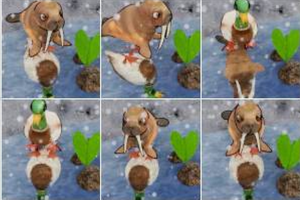|Escolha a imagem com o reflexo correspondente|  
|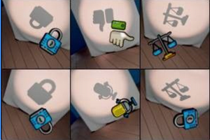|Escolha a sombra com uma silhueta de objeto diferente|  
|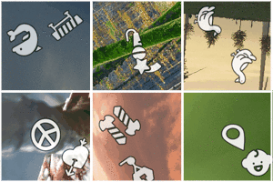|Escolha um quadrado que mostra dois objetos idênticos|  
|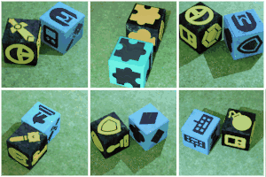|Escolha o par de dados com o mesmo ícone voltado para cima|  
|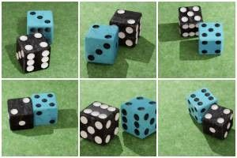|Escolha o par de dados cujas faces superiores somam 4|  
|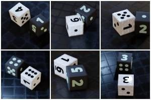|Escolha o par de dados cujas faces superiores somam 5|  
|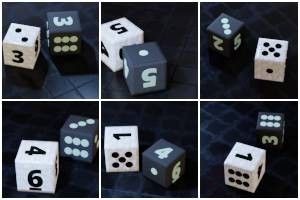|Escolha o par de dados cujas faces superiores somam 6|  
|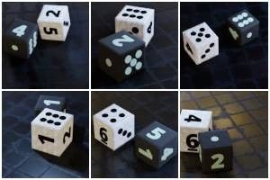|Escolha o par de dados cujas faces superiores somam 7|  
|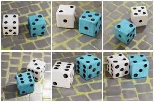|Escolha o par de dados cujas faces superiores somam 8|  
|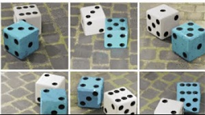|Escolha o par de dados cujas faces superiores somam 10|  
|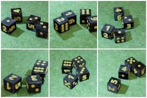|Escolha o par de dados cujas faces superiores somam 14|  
|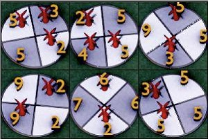|Escolha a imagem onde os dardos somam 8/10/12/14|  
|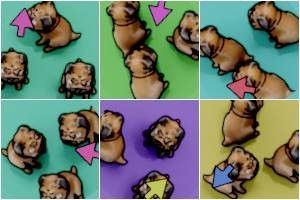|Escolha a imagem onde todos os animais estão caminhando na mesma direção da seta|  
|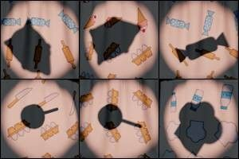|Escolha a sombra que corresponde aos ícones no topo da imagem|  
|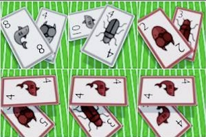|Escolha as cartas correspondentes|  
|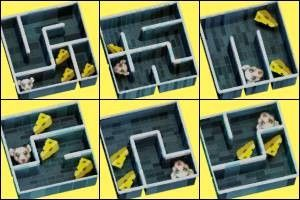|Escolha o rato que pode alcançar todos os queijos no labirinto|  
|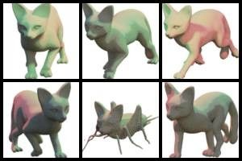|Selecione o animal com a cabeça errada|  
|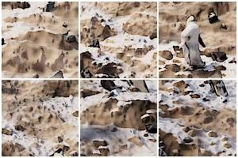|Escolha o pinguim|  
|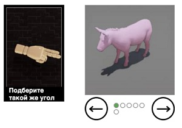|Use as setas para girar o animal para a direção da mão|  
|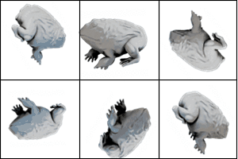|Escolha a imagem que está na posição correta|  
|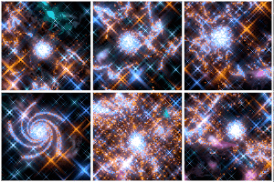|Escolha a galáxia espiral|  
|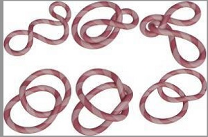|Escolha a imagem com apenas uma corda|  
|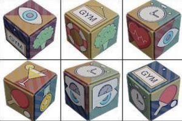|Escolha o cubo com ícones divididos ao meio|  
|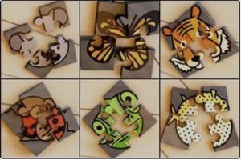|Escolha o quebra-cabeça com as peças erradas|  
|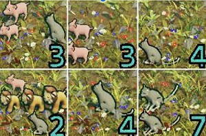|Escolha a imagem onde o número corresponde à quantidade de animais|  
|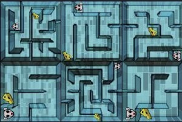|Escolha o rato que não consegue alcançar o queijo|  
|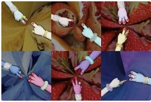|Escolha a imagem onde o total de dedos somam 3|  
|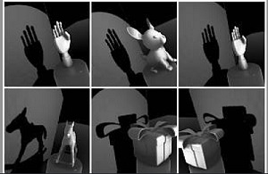|Escolha a sombra errada|  
|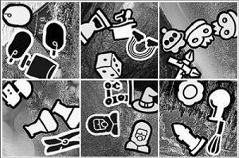|Escolha um quadrado que mostra três objetos idênticos|  
|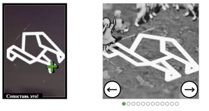|Use as setas para mover a pessoa até o local indicado pela cruz|  
|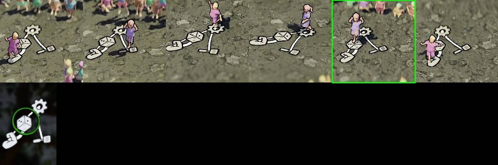|Use as setas para mover a pessoa até o ícone indicado pelo círculo colorido|  
|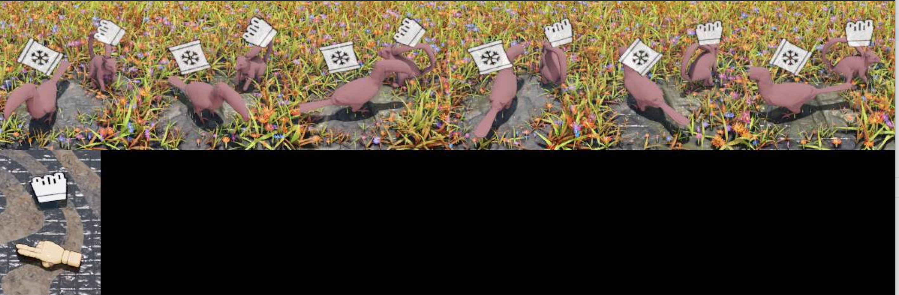|Use as setas para girar o animal com o mesmo ícone para que fique na direção da mão|  
|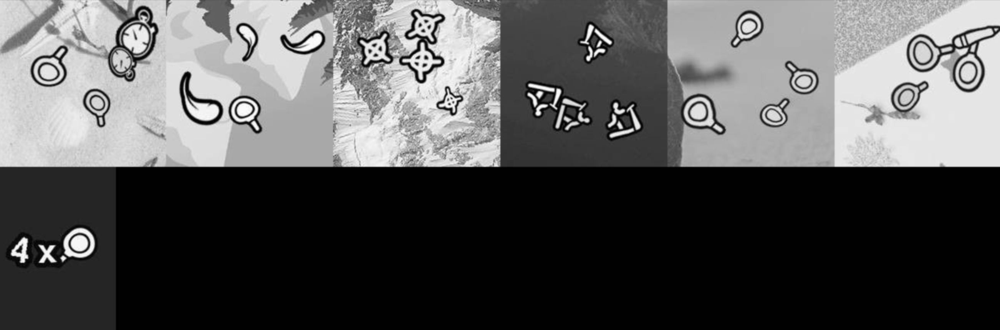|Use as setas para ajustar o número de objetos até corresponder à imagem à esquerda|  
|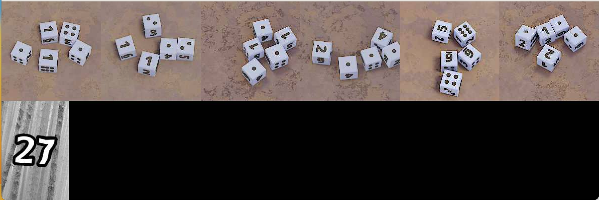|Altere os dados até que o número corresponda à imagem à esquerda|  
|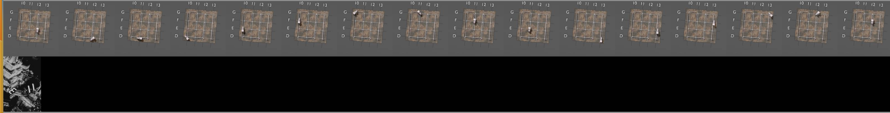|Use as setas para mover o trem até as coordenadas indicadas na imagem à esquerda|  
|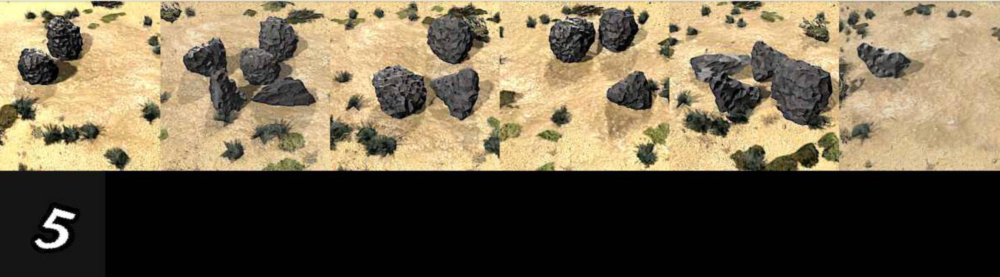|Ajuste o número de pedras para corresponder ao número à esquerda|  
|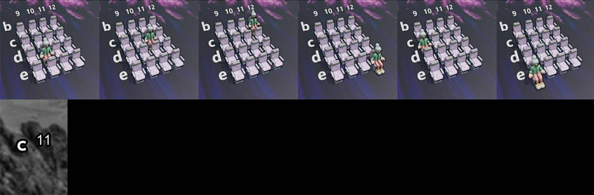|Use as setas para mover a pessoa até o assento indicado|  
|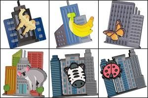|Escolha o coala|  
|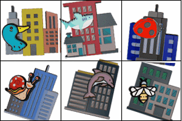|Escolha a joaninha|  
|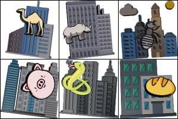|Escolha o porco|  
|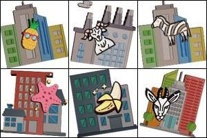|Escolha a zebra|  
|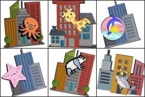|Escolha o tubarão|  
|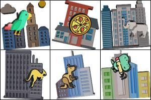|Escolha o dinossauro|  
|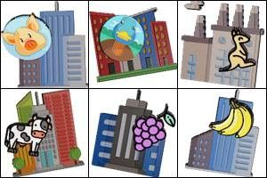|Escolha o pato|  
|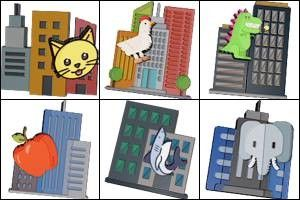|Escolha a galinha|  
|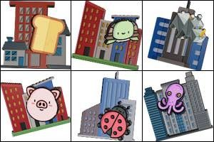|Escolha o rinoceronte|  
|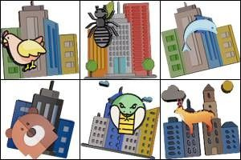|Escolha o golfinho|  
|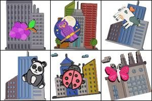|Escolha as uvas|  
|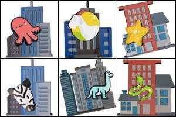|Escolha a cabra|  
|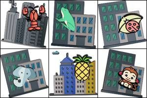|Escolha o elefante|  
||Escolha a foca|  
||Escolha o urso|  
||Escolha o rato|  
||Escolha a borboleta|  
||Escolha o macaco|  
||Escolha o pão|  
||Escolha a lagosta|  
||Escolha o canguru|  
||Escolha o cervo|  
||Escolha a maçã|  
||Escolha a formiga|  
||Escolha a cobra|  
||Escolha o sorvete|  
||Escolha a coruja|  
||Escolha as calças|  
||Escolha o cacto|  
||Escolha a calculadora|  
||Escolha o sapato|  
||Escolha a tesoura|  
||Escolha o leão|  
||Escolha o caranguejo|  
||Escolha o donut|  
||Escolha o cachorro|  
||Escolha a abelha|  
||Escolha a banana|  
||Escolha o papagaio|  
||Escolha o polvo|  
||Escolha o lápis|  
||Escolha a lâmpada|  
||Escolha o cadeado|  
||Escolha a tartaruga|  
||Escolha o camelo|  
||Escolha o cavalo|  
||Escolha a pizza|  
||Escolha o morcego|  
||Escolha a melancia|  
||Escolha o controle|  
||Escolha o coelho|  
||Escolha o abacaxi|  
||Escolha o caracol|  
||Escolha os óculos|  
||Escolha a chave|  
||Escolha o cachorro-quente|  
||Escolha o capacete|  
||Escolha a meia|  
||Escolha a estrela-do-mar|  
||Escolha o sapo|  
||Escolha a impressora|  
||Escolha o guarda-chuva|  
||Escolha a girafa|  
||Escolha a nave espacial|  
||Escolha o barco|  
||Escolha a sombra errada|  
||Escolha o helicóptero|  
||Escolha a geladeira|  
||Escolha o sofá|  
||Escolha o dinheiro|  
||Escolha o cogumelo|  
||Escolha a cerca|  
||Escolha o carro|  
||Escolha o relógio de pulso|  
||Escolha o alienígena|  
||Escolha o ventilador|  
||Escolha a coroa|  
||Escolha o hambúrguer|  
||Escolha o trem|  
||Escolha o troféu|  
||Escolha o aquário|  
||Escolha a âncora|  
||Escolha a torradeira|  
||Escolha o grampeador|  
||Escolha a bicicleta|  
||Escolha o violão|  
||Escolha o fogo|  
||Escolha a flor|  
||Escolha o boneco de neve|  
||Escolha a bola|  
||Escolha o anel|  
||Escolha a câmera|  
||Tipo de captcha onde você precisa girar a imagem|  