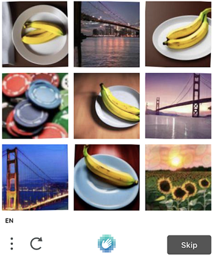
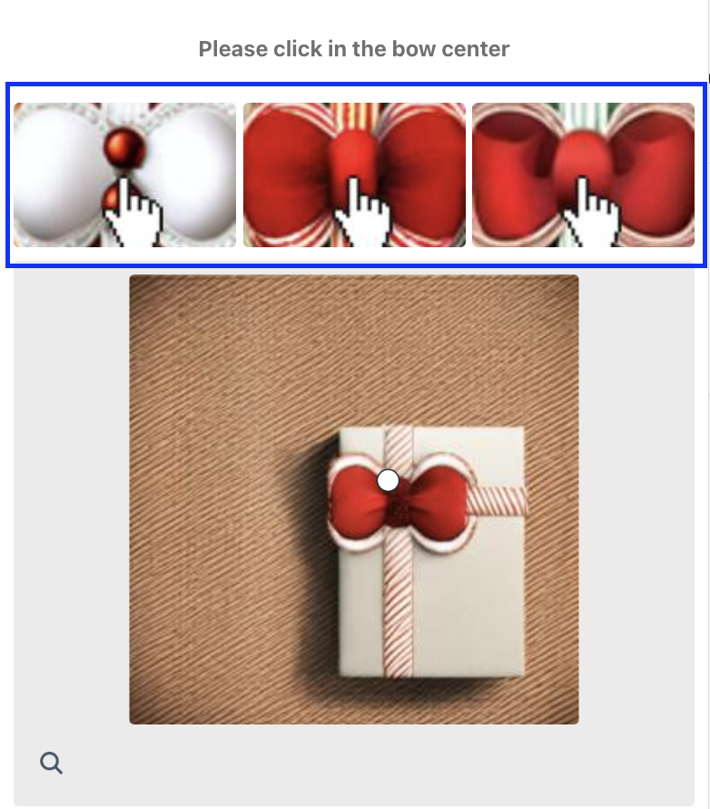
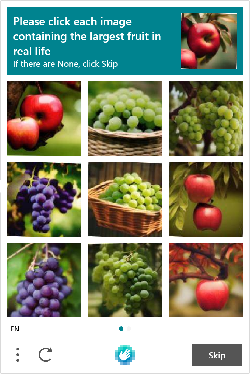

---
sidebar_position: 8  
sidebar_label: ComplexImageTask HCaptcha
---

import Tabs from '@theme/Tabs';  
import TabItem from '@theme/TabItem';  
import ParamItem from '@theme/ParamItem';  
import MethodItem from '@theme/MethodItem';  
import MethodDescription from '@theme/MethodDescription'


# ComplexImageTask HCaptcha

No ComplexImageTask, você precisará realizar ações como sobrepor objetos à imagem, rotacionar/modificar objetos para atender a certos critérios, buscar/reconhecer objetos, e assim por diante. 

O objeto contém dados sobre a tarefa para resolver o hCaptcha.

## Parâmetros da solicitação
<TabItem value="proxyless" label="RecaptchaV2EnterpriseTaskProxyless (sem proxy)" default className="bordered-panel">
    <ParamItem title="type" required type="string" />
    **ComplexImageTask**

    ---

    <ParamItem title="class" required type="string" />
    **hcaptcha**

    ---

    <ParamItem title="imageUrls" required="obrigatório (se imagesBase64 não estiver preenchido)" type="array" />
    Lista com endereços de imagens. Máximo de 18 elementos.  
    Exemplo: [ "[https://i.postimg.cc/kg71cbRt/image-1.jpg](https://i.postimg.cc/kg71cbRt/image-1.jpg)",…]

    ---

    <ParamItem title="imagesBase64" required="obrigatório (se imageUrls não estiver preenchido)" type="array" />
    Lista com imagens no formato base64. Máximo de 18 elementos.  
    Exemplo: [ "/9j/4AAQSkZJRgABAQEAAAAAAAD…" ]

    ---

    <ParamItem title="metadata.Task" required="obrigatório (se metadata.TaskDefinition não estiver preenchido)" type="string" />
    Valores possíveis: `Please click on the panda` e outros.  
    Nome da tarefa (<u>em inglês</u>).

    ---

    <ParamItem title="exampleImageUrls" type="array" />
    Lista com endereços de imagens. Deve conter 1 elemento.  
    Exemplo: [ "[https://i.postimg.cc/GmBgwnDm/4type-example-image.png](https://i.postimg.cc/GmBgwnDm/4type-example-image.png)" ]

    ---

    <ParamItem title="exampleImagesBase64" type="array" />
    Lista com imagens no formato base64. Deve conter 1 elemento.  
    Exemplo: [ "/9j/4AAQSkZJRgABAQEAAAAAAAD…" ]

    ---

    <ParamItem title="metadata.Classes" required type="array" />
    Uma lista com valores de string localizados na metade direita do captcha (na mesma ordem que na imagem).  
    Valores possíveis: ["shark", "chicken", "goat", "hedgehog"] e outros.


    ---

    <ParamItem title="userAgent" type="string" />
    O User-Agent do navegador para usar ao carregar imagens se links forem passados em imageUrls. É obrigatório usar uma assinatura moderna do navegador, caso contrário o Google retornará um erro solicitando uma atualização do navegador.

    ---

    <ParamItem title="websiteURL" type="string" />
    URL da página onde o captcha está sendo resolvido.
  </TabItem>


## Solicitação de resposta
:::info Método
```http
https://api.capmonster.cloud/getTaskResult
```
:::
Use o método [getTaskResult](../api/methods/get-task-result.md) para obter a solução do captcha. Dependendo da carga do sistema, você receberá uma resposta em um intervalo de 300ms a 6s.

### Estrutura do objeto de solução
| **Propriedade** | **Tipo** | **Descrição** |
| :- | :- | :- |
| answer | Array de objetos | Lista de respostas para cada uma das imagens enviadas. |
| metadata.AnswerType | string | Tipo da resposta retornada. |

### Tipo de resposta em grade
| **Formato de resposta** | **Exemplo de resposta** | **Descrição** |
| :- | :- | :- |
| Array de booleanos | `[true, false, true]` | Lista com valores booleanos, onde `true` indica que você precisa clicar na imagem correspondente a esta posição. |

**Exemplo de resposta:**
```json
{
  "errorId": 0,
  "status": "ready",
  "solution": {
    "answer": [ false, true ],
    "metadata": { "AnswerType": "Grid" }
  }
}
```

### Tipo de resposta por coordenadas
| **Formato de resposta** | **Exemplo de resposta** | **Descrição** |
| :- | :- | :- |
| Array de objetos | `[{ "X":371, "Y":505.0000112 }, { "X":5, "Y":101.2 }]` | Uma lista com coordenadas para clicar na imagem correspondente. |

**Exemplo de resposta:**
```json
{
  "errorId": 0,
  "status": "ready",
  "solution": { 
    "answer": [ { "X":371, "Y":505.0000112 }, { "X":5, "Y":101.2 } ],
    "metadata": { "AnswerType": "Coordinate" }
  }
}
```

## Exemplo de imagem (primeiro tipo)



:::info Escolha o tipo correto de tarefa
Este tipo de tarefa não contém uma imagem de referência, como [o quarto tipo](#image-example-fourth-type).
:::


### Criar tarefa


<TabItem value="proxyless" label="RecaptchaV2TaskProxyless (sem proxy)" default className="method-panel">
<MethodItem>
  ```http
  https://api.capmonster.cloud/createTask
  ```
</MethodItem>
<MethodDescription>
**Solicitação**
```json
{
  "clientKey":"API_KEY",
  "task": {
    "type": "ComplexImageTask",
    "class": "hcaptcha",
    "imageUrls": ["https://i.postimg.cc/kg71cbRt/image-1.jpg", "https://i.postimg.cc/6381Zx2j/image.jpg"],
    "metadata": {
      "Task": "Please click each image containing a mountain"
    },
    "userAgent": "userAgentPlaceholder",
    "websiteUrl": "https://lessons.zennolab.com/captchas/recaptcha/v2_simple.php?level=middle"
  }
}
```
**Resposta**
```json
{
  "errorId": 0,
  "taskId": 407533072
}
```

</MethodDescription>
</TabItem>


### Obter resultado da tarefa
Tipo de resposta recebida - [**Grid**](#grid-response-type).

<TabItem value="proxyless" label="GeeTestTaskProxyless (sem proxy)" default className="method-panel-full">
    <MethodItem>
```http
https://api.capmonster.cloud/getTaskResult
```
    </MethodItem>
    <MethodDescription>
**Solicitação**
```json
{
  "clientKey": "API_KEY",
  "taskId": 407533072
}
```
**Resposta**
```json
{
  "errorId": 0,
  "status": "ready",
  "solution": {
    "answer": [false, true],
    "metadata": {"AnswerType": "Grid"}
  }
}
```
  </MethodDescription>
  </TabItem>

### Preços

| **Nome** | **Custo por 1000 imagens, $** |
| :-: | :-: |
| hCaptcha | 0,02 |

## Exemplo de imagem (segundo tipo)
|  |  |  |
| :-: | :-: | :-: |

:::info Compartilhe imagens de referência para melhores resultados
As imagens que estão no cabeçalho da tarefa, se houver, devem ser passadas no parâmetro `exampleImagesBase64` ou `exampleImageUrls`.



:::


### Criar tarefa


<TabItem value="proxyless" label="RecaptchaV2TaskProxyless (sem proxy)" default className="method-panel">
<MethodItem>
  ```http
  https://api.capmonster.cloud/createTask
  ```
</MethodItem>
<MethodDescription>
**Solicitação**
```json
{
  "clientKey":"API_KEY",
  "task": {
    "type": "ComplexImageTask",
    "class": "hcaptcha",
    "exampleImagesBase64":[“/9j/4AAQSkZJRgABAQEAAAAAAAD…”, “/9j/4AAQSkZJRgABAQEAAAAAAAD…”, “/9j/4AAQSkZJRgABAQEAAAAAAAD…”],
    "imagesBase64": [ “/9j/4AAQSkZJRgABAQEAAAAAAAD…” ],
    "metadata": {
      "Task": "Please click on the panda",
    },
    "userAgent": "userAgentPlaceholder",
  }
}
```
**Resposta**
```json
{
  "errorId":0,
  "taskId":407533072
}
```

</MethodDescription>
</TabItem>


### Obter resultado da tarefa
Tipo de resposta recebida - [**Coordenada**](#coordinate-response-type).

<TabItem value="proxyless" label="GeeTestTaskProxyless (sem proxy)" default className="method-panel-full">
    <MethodItem>
```http
https://api.capmonster.cloud/getTaskResult
```
    </MethodItem>
    <MethodDescription>
**Solicitação**
```json
{
  "clientKey":"API_KEY",
  "taskId": 407533072
}
```
**Resposta**
```json
{
  "errorId":0,
  "status":"ready",
  "solution": { 
    "answer": [ { "X":371, "Y":505.0000112 } ],
    "metadata": { "AnswerType": "Coordinate" }
  }
}
```
  </MethodDescription>
  </TabItem>

### Preços:

|**Nome** |**Custo por 1000 imagens, $**|
| :-: | :-: |
|hCaptcha|0,02|

## Exemplo de imagem (terceiro tipo)

 

Este tipo de captcha deve conter o campo **metadata.Classes**.


### Criar tarefa


<TabItem value="proxyless" label="RecaptchaV2TaskProxyless (sem proxy)" default className="method-panel">
<MethodItem>
  ```http
  https://api.capmonster.cloud/createTask
  ```
</MethodItem>
<MethodDescription>
**Solicitação**
```json
{
  "clientKey":"API_KEY",
  "task": {
    "type": "ComplexImageTask",
    "class": "hcaptcha",
    "imagesBase64": [ “/9j/4AAQSkZJRgABAQEAAAAAAAD…” ],
    "metadata": {
      "Task": "Qual animal é mostrado na imagem abaixo?",
      "Classes": [ "tubarão", "galinha", "cabra", "ouriço" ]
    },
    "userAgent": "userAgentPlaceholder"
  }
}
```
**Resposta**
```json
{
  "errorId":0,
  "taskId":407533072
}
```

</MethodDescription>
</TabItem>


### Obter resultado da tarefa
Tipo de resposta recebida - [**Grid**](#grid-response-type).

<TabItem value="proxyless" label="GeeTestTaskProxyless (sem proxy)" default className="method-panel-full">
    <MethodItem>
```http
https://api.capmonster.cloud/getTaskResult
```
    </MethodItem>
    <MethodDescription>
**Solicitação**
```json
{
  "clientKey":"API_KEY",
  "taskId": 407533072
}
```
**Resposta**
```json
{
  "errorId":0,
  "status":"ready",
  "solution": { 
    "answer": [ false, false, true, false ],
    "metadata": { "AnswerType": "Grid" }
  }
}
```
  </MethodDescription>
  </TabItem>
 
### Preços:

|**Nome** |**Custo por 1000 imagens, $**|
| :-: | :-: |
|hCaptcha|0,02|

## Exemplo de imagem (quarto tipo)



Para esta solicitação, o campo **exampleImageUrls** ou **exampleImagesBase64** é obrigatório. Ele deve conter uma imagem.

O campo **imageUrls** ou **imagesBase64** deve conter 9 imagens.


### Criar tarefa


<TabItem value="proxyless" label="RecaptchaV2TaskProxyless (sem proxy)" default className="method-panel">
<MethodItem>
  ```http
  https://api.capmonster.cloud/createTask
  ```
</MethodItem>
<MethodDescription>
**Solicitação**
```json
{
  "clientKey":"API_KEY",
  "task": {
    "type": "ComplexImageTask",
    "class": "hcaptcha",
    "imageUrls": [
      "https://i.postimg.cc/bwVVWbkG/4type-00.jpg",
      "https://i.postimg.cc/nzBdXP57/4type-01.jpg",
      "https://i.postimg.cc/zf9tXrd8/4type-02.jpg",
      "https://i.postimg.cc/2yY0hxRt/4type-03.jpg",
      "https://i.postimg.cc/rFQfRWhh/4type-04.jpg",
      "https://i.postimg.cc/Jz0PNnvR/4type-05.jpg",
      "https://i.postimg.cc/h48ygNVR/4type-06.jpg",
      "https://i.postimg.cc/yY1yXdtk/4type-07.jpg",
      "https://i.postimg.cc/Prt6qKMp/4type-08.jpg"
     ],
    "exampleImageUrls": [ "https://i.postimg.cc/MpLtdwJV/4type-example.jpg" ],
    "metadata": {
      "Task": "Por favor, selecione todas as imagens que parecem mais quentes em comparação com as outras"
    }
  }
}
```
**Resposta**
```json
{
  "errorId":0,
  "taskId":407533072
}
```

</MethodDescription>
</TabItem>


### Obter resultado da tarefa
Tipo de resposta recebida - [**Grid**](#grid-response-type).

<TabItem value="proxyless" label="GeeTestTaskProxyless (sem proxy)" default className="method-panel-full">
    <MethodItem>
```http
https://api.capmonster.cloud/getTaskResult
```
    </MethodItem>
    <MethodDescription>
**Solicitação**
```json
{
  "clientKey":"API_KEY",
  "taskId": 407533072
}
```
**Resposta**
```json
{
  "errorId":0,
  "status":"ready",
  "solution": { 
    "answer": [ true, false, false, false, false, true, false, false, true ],
    "metadata": { "AnswerType": "Grid" }
  }
}
```
  </MethodDescription>
  </TabItem>

### Preços

|**Nome** |**Custo por 1000 imagens, $**|
| :-: | :-: |
|hCaptcha|0,02|

## Usar biblioteca SDK

<Tabs className="full-width-tabs filled-tabs request-tabs" groupId="captcha-type">
  <TabItem value="js" label="JavaScript" default className="method-panel">

```js
// https://github.com/ZennoLab/capmonstercloud-client-js

import { CapMonsterCloudClientFactory, ClientOptions, ComplexImageHCaptchaRequest } from '@zennolab_com/capmonstercloud-client';

document.addEventListener('DOMContentLoaded', async () => {
  const cmcClient = CapMonsterCloudClientFactory.Create(new ClientOptions({ clientKey: '<your capmonster.cloud API key>' }));
  console.log(await cmcClient.getBalance());

  const complexImageHCaptchaRequest = new ComplexImageHCaptchaRequest({
    imageUrls: ['https://i.postimg.cc/kg71cbRt/image-1.jpg', 'https://i.postimg.cc/6381Zx2j/image.jpg'],
    metaData: {
      Task: 'Por favor, clique em cada imagem que contém uma montanha',
    },
    websiteURL: 'https://lessons.zennolab.com/captchas/recaptcha/v2_simple.php?level=middle',
    exampleImagesBase64: ['imagem em base64'],
    exampleImageUrls: ['https://i.postimg.cc/kg71cbRt/image-1.jpg'],
  });

  console.log(await cmcClient.Solve(complexImageHCaptchaRequest));
});
```
  </TabItem>
  
</Tabs> 