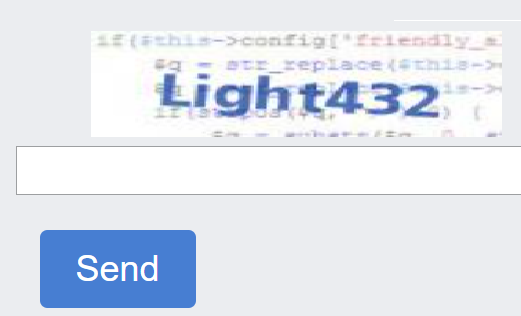

---
sidebar_position: 10
sidebar_label: ImageToTextTask
---

import Tabs from '@theme/Tabs';
import TabItem from '@theme/TabItem';
import ParamItem from '@theme/ParamItem';
import MethodItem from '@theme/MethodItem';
import MethodDescription from '@theme/MethodDescription'
import PriceBlock from '@theme/PriceBlock';
import PriceBlockWrap from '@theme/PriceBlockWrap';

# ImageToTextTask

<PriceBlockWrap>
  <PriceBlock title="Text Captcha" name="textCaptchaToken"/>
</PriceBlockWrap>

Este é um captcha regular, que é uma imagem com texto a ser inserido na linha correspondente.




## Parâmetros da solicitação
<TabItem value="proxyless" label="RecaptchaV2EnterpriseTaskProxyless (sem proxy)" default className="bordered-panel">
<ParamItem title="type" required type="string" />
**ImageToTextTask**

---

<ParamItem title="body" required type="string" />
Corpo do arquivo codificado em base64*. Certifique-se de enviá-lo sem quebras de linha.

---

<ParamItem title="capMonsterModule" type="string" />
Nome do módulo de reconhecimento, por exemplo, “yandex“. Forma alternativa de passar o nome do módulo e a lista de todos os módulos disponíveis que você pode encontrar [aqui](../api/module-name.md). <br />
Exemplo: yandex, special e outros.

---

<ParamItem title="recognizingThreshold" type="integer" />
Limite de reconhecimento de captcha com valor possível de 0 a 100. Por exemplo, se o recognizingThreshold foi definido como 90 e a tarefa foi resolvida com uma confiança de 80, você não será cobrado. Nesse caso, o usuário receberá uma resposta ERROR_CAPTCHA_UNSOLVABLE.

---

<ParamItem title="case" type="boolean" />
true - se o captcha for sensível a maiúsculas e minúsculas.

---

<ParamItem title="numeric" type="integer" />
1 - se o captcha contiver apenas números. <br />
Valores possíveis: 0, 1

---

<ParamItem title="math" type="boolean" />
false — indefinido;<br />true — se o captcha exigir uma operação matemática (por exemplo: captcha 2 + 6 = retornará o valor 8).
</TabItem>

<br />

*Base64 é um método de codificação de dados que permite representar dados binários como texto. Aqui está um exemplo de obtenção de uma imagem captcha em formato base64 usando o console nas *Ferramentas de Desenvolvedor*:

```javascript
const captchaUrl = 'https://example.com/captcha.jpg';

function loadAndEncodeCaptchaToBase64(url) {
    fetch(url)
        .then(response => response.blob())
        .then(blob => {
            const reader = new FileReader();
            reader.readAsDataURL(blob);

            reader.onloadend = function() {
                const base64Data = reader.result;                
                console.log('Base64 Encoded Captcha:', base64Data);
                          
						  };
        })
        .catch(error => {
            console.error('Error occurred while loading or encoding the captcha:', error);
        });
}

loadAndEncodeCaptchaToBase64(captchaUrl);

```


## Criar tarefa


<TabItem value="proxyless" label="RecaptchaV2TaskProxyless (sem proxy)" default className="method-panel">
<MethodItem>
  ```http
  https://api.capmonster.cloud/createTask
  ```
</MethodItem>
<MethodDescription>
**Solicitação**
```json
{
  "clientKey":"API_KEY",
  "task": {
    "type":"ImageToTextTask",
    "body":"BASE64_BODY_HERE!"
  }
}
```
**Resposta**
```json
{
  "errorId":0,
  "taskId":407533072
}
```

</MethodDescription>
</TabItem>

## Obter resultado da tarefa
Use o método [getTaskResult](../api/methods/get-task-result.md) para obter a solução do captcha. Dependendo da carga do sistema, você receberá uma resposta em um intervalo de 300ms a 6s.

<TabItem value="proxyless" label="GeeTestTaskProxyless (sem proxy)" default className="method-panel-full">
<MethodItem>
```http
https://api.capmonster.cloud/getTaskResult
```
</MethodItem>
<MethodDescription>
**Solicitação**
```json
{
  "clientKey":"API_KEY",
  "taskId": 407533072
}
```
**Resposta**
```json
{
  "errorId":0,
  "status":"ready",
  "solution": {
    "text":"answer"
  }
}
```
</MethodDescription>
</TabItem>

<br />

|**Propriedade**|**Tipo**|**Descrição**|
| :-: | :-: | :-: |
|text|String|Resposta do captcha|

## Usar biblioteca SDK

<Tabs className="full-width-tabs filled-tabs request-tabs" groupId="captcha-type">
  <TabItem value="js" label="JavaScript" default className="method-panel">
    ```js
    // https://github.com/ZennoLab/capmonstercloud-client-js

    import { CapMonsterCloudClientFactory, ClientOptions, ImageToTextRequest } from '@zennolab_com/capmonstercloud-client';

    document.addEventListener('DOMContentLoaded', async () => {
      const cmcClient = CapMonsterCloudClientFactory.Create(new ClientOptions({ clientKey: '<your capmonster.cloud API key>' }));
      console.log(await cmcClient.getBalance());

      const imageToTextRequest = new ImageToTextRequest({
        body: 'some base64 body',
        CapMonsterModule: CapMonsterModules.YandexWave,
        Case: true,
        numeric: 1,
        recognizingThreshold: 65,
        math: false,
      });

      console.log(await cmcClient.Solve(imageToTextRequest));
    });
    ```
  </TabItem>

  <TabItem value="python" label="Python" className="method-panel">
    ```python
    # https://github.com/ZennoLab/capmonstercloud-client-python

    import asyncio
    import base64
    from capmonstercloudclient import CapMonsterClient, ClientOptions
    from capmonstercloudclient.requests import ImageToTextRequest

    client_options = ClientOptions(api_key="your_api_key")  # Replace with your CapMonsterCloud API key
    cap_monster_client = CapMonsterClient(options=client_options)

    image_base64 = "/9j/4AAQSkZJRgABAQAAAQABAAD/2wBDAAgGBgc…wwzqR4U/yZ//Z"

    image_bytes = base64.b64decode(image_base64)

    image_to_text_request = ImageToTextRequest(
        image_bytes=image_bytes,
        module_name=None,  # Optional, can specify a module name if needed
        threshold=50,      # Optional, set a threshold value between 1 and 100
        case=True,         # Optional, specify whether case sensitivity is required
        numeric=0,         # Optional, set numeric flag (0 or 1)
        math=False         # Optional, specify whether math operations are involved
    )

    async def solve_captcha():
        return await cap_monster_client.solve_captcha(image_to_text_request)

    responses = asyncio.run(solve_captcha())
    print(responses)
    ```
  </TabItem>

  <TabItem value="csharp" label="C#" className="method-panel">
    ```csharp
    // https://github.com/ZennoLab/capmonstercloud-client-dotnet

    using Zennolab.CapMonsterCloud.Requests;
    using Zennolab.CapMonsterCloud;

    class Program
    {
        static async Task Main(string[] args)
        {
            var clientOptions = new ClientOptions
            {
                ClientKey = "your_api_key" // Replace with your CapMonster Cloud API key
            };

            var cmCloudClient = CapMonsterCloudClientFactory.Create(clientOptions);

            var imageToTextRequest = new ImageToTextRequest
            {
                Body = "/9j/4AAQSkZJRgABAQAAAQABAAD/2wBDAAgGBgcGBQgHBwcJCQgKDBQNDAsLDBkSEw8UHRofHh0aHBwgJC4nICIsIxwcKDcpLDAxNDQ0Hyc5PTgyPC4zNDL/2wBDAQkJCQwLDBgNDRgyIRwhMjIyMjIyMjIyMjIyMj", // Base64 encoded image
                CapMonsterModule = "None",  // Optional, can specify a module name if needed
                RecognizingThreshold = 70, // Optional, set a threshold value between 1 and 100
                CaseSensitive = true, // Optional, specify whether case sensitivity is required
                Numeric = false, 
                Math = false
            };

            var imageToTextResult = await cmCloudClient.SolveAsync(imageToTextRequest);

            Console.WriteLine("Captcha Solved: " + imageToTextResult.Solution.Value);
        }
    }
    ```
  </TabItem>
</Tabs>