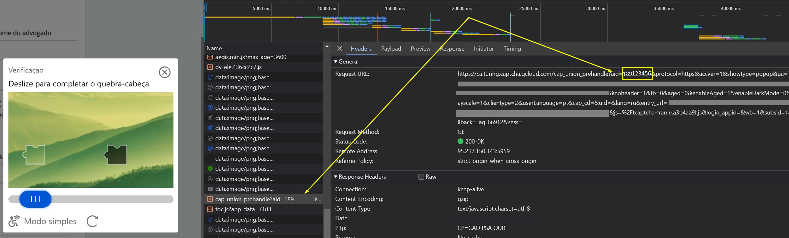

import Tabs from '@theme/Tabs';
import TabItem from '@theme/TabItem';
import ParamItem from '@theme/ParamItem';
import MethodItem from '@theme/MethodItem';
import MethodDescription from '@theme/MethodDescription'
import PriceBlock from '@theme/PriceBlock';
import PriceBlockWrap from '@theme/PriceBlockWrap';


# TenDI - Captcha da Tencent

<PriceBlockWrap>
  <PriceBlock title="Tencent captcha" name="tencentToken"/>
</PriceBlockWrap>

:::warning **Atenção!**
Essa tarefa será realizada usando nossos servidores proxy.
:::

## Parâmetros da solicitação

<TabItem value="proxyless" label="RecaptchaV2EnterpriseTaskProxyless (sem proxy)" default className="bordered-panel">
    <ParamItem title="type" required type="string" />
    **CustomTask**

    ---

    <ParamItem title="class" required type="string" />
    **TenDI**

    ---

    <ParamItem title="websiteURL" required type="string" />
    O endereço da página principal onde o captcha é resolvido.

    ---

    <ParamItem title="websiteKey" required type="string" />
    captchaAppId. Por exemplo, `"websiteKey": "189123456"` é um parâmetro único para seu site. Você pode obtê-lo de uma página HTML com captcha ou a partir do tráfego (veja a descrição abaixo).

    ---

    <ParamItem title="userAgent" type="string" />
    O User-Agent do navegador. **Passe apenas o UA real de um sistema operacional Windows. Atualmente, a versão é**: `userAgentPlaceholder`

</TabItem>

### Como obter websiteKey (captchaAppId)
Ative as ferramentas de desenvolvedor, vá para a aba "Network", ative o captcha e veja as solicitações. Algumas delas conterão o valor do parâmetro que você precisa. Nesse caso, `websiteKey=aid`  
 

## Método de criação da tarefa

<TabItem value="proxyless" label="RecaptchaV2TaskProxyless (sem proxy)" default className="method-panel">
<MethodItem>
  ```http
  https://api.capmonster.cloud/createTask
  ```
</MethodItem>
<MethodDescription>
**Solicitação**
```json
{
    "clientKey": "API_KEY",
    "task": {
        "type": "CustomTask",
        "class": "TenDI",
        "websiteURL": "https://domain.com",
        "websiteKey": "189123456",
        "userAgent": "userAgentPlaceholder"
    }
}
```
**Resposta**
```json
{
  "errorId":0,
  "taskId":407533072
}
```

</MethodDescription>
</TabItem>

## Método de obter resultado da tarefa
Use o método [getTaskResult](../api/methods/get-task-result.md) para obter a solução do TenDI.

<TabItem value="proxyless" label="GeeTestTaskProxyless (sem proxy)" default className="method-panel-full">
    <MethodItem>
```http
https://api.capmonster.cloud/getTaskResult
```
    </MethodItem>
    <MethodDescription>
**Solicitação**
```json
{
  "clientKey":"API_KEY",
  "taskId": 407533072
}
```
**Resposta**
```json
{
    "errorId":0,
    "status":"ready",
    "solution": {
       "data": {
            "randstr": "@EcL",
            "ticket": "tr03lHUhdnuW3neJZu.....7LrIbs*"
        },
        "headers": {
            "User-Agent": "userAgentPlaceholder"
        }
    }
}
```
  </MethodDescription>
  </TabItem>