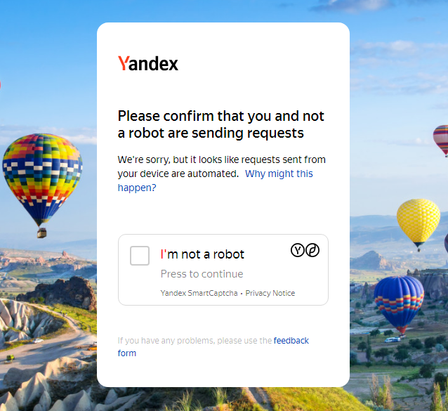
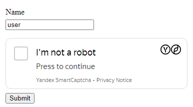

# YandexSmartCaptchaTask

:::info
Atenção! Esse captcha possui dois tipos:

1. Para serviços Yandex.

2. Para sites externos.

Os métodos para resolução são **diferentes**.
:::

## Captcha no serviços do Yandex

Esse tipo de captcha é aberto em uma página separada (por exemplo, https://ya.ru/showcaptcha?...).

<details>
  <summary>Exemplo</summary>


</details>

Para criar uma solicitação para resolver esse tipo de captcha, você precisará dos seguintes dados:

|**Parâmetro**|**Tipo**|**Obrigatório**|**Descrição**|
| :- | :- | :- | :- |
|type|String|Sim|**YandexSmartCaptchaTaskProxyless**|
|websiteURL|String|Sim|Endereço da página onde o captcha está sendo resolvido. Ex: https://ya.ru/showcaptcha?...|
|websiteKey|String|Sim|**yandex**|
|htmlPageBase64|String|Sim|Página HTML codificada em Base64 com o captcha.|
|userAgent|String|Sim|User-Agent de um navegador Chromium.|

Como resposta, você receberá o seguinte objeto:

|**Parâmetro**|**Tipo**|**Descrição**|
| :- | :- | :- |
|cookies|Object|Contém um objeto com cookies que devem ser definidos no navegador ou nos headers da solicitação (atualmente apenas os cookies "spravka").|
|redirectedUrl|String|URL para qual você deve ir com os cookies configurados. Normalmente contém a página solicitada inicialmente.|
|referrer|String|O referrer que **DEVE** ser usado ao acessar o URL redirecionado.|

## Captcha em sites externos

Esse tipo de captcha é semelhante a outros captchas comuns com um widget de checkbox:

<details>
  <summary>Exemplo</summary>


</details>

Esse tipo de captcha é perfeitamente resolvido por meio de token. A solicitação para resolver esse tipo de captcha parece bastante comum:

|**Parâmetro**|**Tipo**|**Obrigatório**|**Descrição**|
| :- | :- | :- | :- |
|type|String|Sim|**YandexSmartCaptchaTaskProxyless**|
|websiteURL|String|Sim|Endereço da página onde o captcha é resolvido.|
|websiteKey|String|Sim|O sitekey com o qual o captcha é gerado. Normalmente obtido do código da página.|

Resposta:

|**Parâmetro**|**Tipo**|**Descrição**|
| :- | :- | :- |
|token|String|O valor do token que deve ser inserido no campo "smart-token" na página do captcha.|

## Exemplos de solicitações

### Captcha em serviços do Yandex

**Criação da solicitação:**

:::info Método
```http
https://api.capmonster.cloud/createTask
```
:::

```json
{
   "clientKey":"API_KEY",
   "task":{
      "type":"YandexSmartCaptchaTaskProxyless",
      "websiteURL":"https://ya.ru/showcaptcha?cc=1&mt=C934C537A3644...",
      "websiteKey":"yandex",
      "userAgent":"userAgentPlaceholder",
      "htmlPageBase64":"PGhlYWQ+PG1ldGEgaHR0cC1lcXVpdj0iWC1VQS1Db...0L2phdmFzY3JpcHQiPjwvc2NyaXB0PjwvYm9keT4="
   }
}
```

Resposta:

```json
{
    "errorId":0,
    "taskId":407533072
}
```

**Obtenção do resultado:**

Use o método [getTaskResult](../api/methods/get-task-result.md) para obter a solução.

```json
{
	"clientKey": "API_KEY",
	"taskId": 407533072
}
```

Resposta:

```json
{
	"errorId": 0,
	"errorCode": null,
	"errorDescription": null,
	"solution": {
		"cookies": {
			"spravka": "dD0xNjkzMjI1MTE0OTZF...0ZDJlNDhiYjcxNTBjZWYzYzg2ODdhOQ=="
		},
		"redirectedUrl": "https://ya.ru/?nr=1&redirect_ts=169...87.00000",
		"referrer": "https://ya.ru/checkcaptcha?key=c57865...",
	},
	"status": "ready",
}
```

### Captcha em sites externos

**Criação da solicitação:**

:::info Método
```http
https://api.capmonster.cloud/createTask
```
:::

```json
{
   "clientKey":"API_KEY",
   "task":{
      "type":"YandexSmartCaptchaTaskProxyless",
      "websiteURL":"https://example.com/captcha",
      "websiteKey":"FEXfAbHQsToo9...1DgdxjtNB9"
   }
}
```

Resposta:

```json
{
    "errorId":0,
    "taskId":407533072
}
```

**Obtenção do resultado:**

Use o método [getTaskResult](../api/methods/get-task-result.md) para obter a solução.

```json
{
	"clientKey": "API_KEY",
	"taskId": 407533072
}
```

Resposta:

```json
{
	"errorId": 0,
	"errorCode": null,
	"errorDescription": null,
	"solution": {
		"token": "dD0xNjkzMjI1OT...mNjMTExMTM5ZmVkMDRlMg=="
	},
	"status": "ready"
}
```