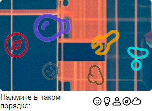
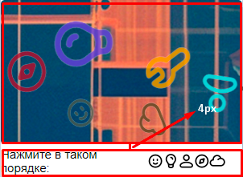
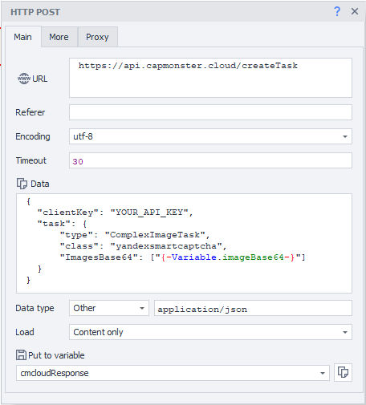

# ComplexImageTask YSC

O objeto contém dados sobre a solução da Yandex SmartCaptcha.

**Exemplo de imagem**



## **Estrutura do Objeto**

|**Parâmetro**|**Tipo**|**Obrigatório**|**Valores possíveis**|**Descrição**|
| :- | :- | :- | :- |:- |
|type|String|sim|ComplexImageTask|Define o tipo de objeto da tarefa.|
|class|String|sim|yandexsmartcaptcha|Define a classe do objeto da tarefa.|
|imagesBase64|Array|sim|[ “iVBORw0KGgoAAAANSUhEUgAAASwLbb” ]|Lista com uma imagem em formato base64.|

## **Exemplo de solicitação**

:::info Método
```http
https://api.capmonster.cloud/createTask
```
:::

```json
{
    "clientKey": "API_KEY",
    "task": {
        "type": "ComplexImageTask",
        "class": "yandexsmartcaptcha",
        "imagesBase64": ["iVBORw0KGgoAAAANSUhEUgAAASwLbb..."]
    }
}
```

**Exemplo de resposta**
```json
{
    "errorId":0,
    "taskId":407533072
}
```

## **Obtendo o resultado**

Use o método [getTaskResult](../api/methods/get-task-result.md) para obter a solução da captcha. Dependendo da carga do sistema, você receberá uma resposta em um intervalo de tempo entre 300ms e 6s.

|**Propriedade**|**Tipo**|**Descrição**|
| :- | :- | :- | 
|answer|Array|Lista de coordenadas.|
|metadata|Null|Não fornece informações úteis.|

**Exemplo**

```json
{
	"solution": {
		"answer": [
			{
				"X": 98,
				"Y": 140
			},
			{
				"X": 103,
				"Y": 54
			},
			{
				"X": 273,
				"Y": 117
			},
			{
				"X": 32,
				"Y": 89
			},
			{
				"X": 189,
				"Y": 149
			}
		],
		"metadata": null
	},
	"cost": 0.0002,
	"status": "ready",
	"errorId": 0,
	"errorCode": null,
	"errorDescription": null
}
```

## **Preços**

|**Nome**|**Custo por 1000 imagens, $**|
| :- | :- | 
|**Yandex SmartCaptcha** (clique)|0.2|

## **Formato da imagem**
A captcha com a tarefa é enviada em uma única imagem. O tamanho nos serviços do Yandex é 300x220, em sites externos é 320x220.<br/> 
A distância da imagem ao contêiner com o texto da tarefa deve ser de 4px (margin-top). O original é 13px.



## **Usando ZennoPoster**

Precisamos preparar uma tarefa, tirar um screenshot do elemento e enviá-lo para o CapMonster Cloud para reconhecimento.<br/>

Para preparar uma tarefa de envio e receber a imagem em base64, você pode usar o seguinte trecho de código em C#: <br/>

```csharp
// Vamos encontrar o elemento com a tarefa (destacado pela moldura vermelha inferior na captura de tela acima)
HtmlElement taskContainer = instance.ActiveTab.FindElementByXPath("//div[@class=\"AdvancedCaptcha-SilhouetteTask\"]", 0);
// Definir o estilo apropriado
taskContainer.SetAttribute("style", "margin-top: 4px;");

// Encontrar o contêiner com a imagem principal
HtmlElement image = instance.ActiveTab.FindElementByXPath("//div[@class=\"AdvancedCaptcha AdvancedCaptcha_silhouette\"]", 0);
// Obter base64 do tamanho necessário
return image.DrawPartToBitmap(0, 0, 300, 220, false);
```

Se você salvar o resultado da execução da ação na variável *imageBase64*, o envio de uma solicitação POST para */createTask* ficará assim:

<details>
    <summary>Configuração da ação "POST-request" para enviar captchas para o CapMonster Cloud</summary>


</details>

Após receber o resultado, você pode usar o seguinte trecho de código em C# para clicar nas coordenadas:

```csharp
// Obtendo o valor da variável onde o resultado foi colocado
// de /getTaskResult
string jsonStr = project.Variables["cmcloudTaskResult"].Value;
// Carregar JSON
project.Json.FromString(jsonStr);

// Encontrar o contêiner com a tarefa e obter suas coordenadas
HtmlElement imageContainer = instance.ActiveTab.FindElementByXPath("//div[@class=\"AdvancedCaptcha AdvancedCaptcha_silhouette\"]", 0);
int imageContainerX = int.Parse(imageContainer.GetAttribute("left"));
int imageContainerY = int.Parse(imageContainer.GetAttribute("top"));

for (int i = 0; i < project.Json.solution.answer.Count; ++i) {
	int X = Convert.ToInt32(project.Json.solution.answer[i].X);
	int Y = Convert.ToInt32(project.Json.solution.answer[i].Y);
	
	// É necessário adicionar as coordenadas do serviço às coordenadas do elemento,
	// porque enviamos não a página inteira para reconhecimento,
	// mas um contêiner específico com a captcha
	instance.ActiveTab.FullEmulationMouseMove(imageContainerX + X, imageContainerY + Y);
	instance.ActiveTab.FullEmulationMouseClick("left", "click");
}

// Enviar captcha
HtmlElement submitBtn = instance.ActiveTab.GetDocumentByAddress("0").FindElementByTag("form", 0).FindChildByAttribute("span", "class", "CaptchaButton-SubmitContent", "regexp", 0);
instance.ActiveTab.FullEmulationMouseMoveToHtmlElement(submitBtn);
instance.ActiveTab.FullEmulationMouseClick("left", "click");
```

[Projeto final de teste](https://drive.google.com/drive/folders/1QNNcBXBGjGZMc6AQ7bdYtr4YEQEumxT4) (não se esqueça de inserir sua chave de API do CapMonster.Cloud).<br/>


## **Usando outros programas**

A maioria dos frameworks de automação (Selenium/Puppeteer/Playwright, etc.) oferece opções para criar um screenshot.<br/>

Por exemplo, dessa forma você pode obter uma imagem com a tarefa no Playwright:

```csharp
// Definir o estilo necessário no elemento
const taskTextContainer = await page.locator('//div[@class="AdvancedCaptcha-SilhouetteTask"]');
await taskTextContainer.evaluate((element) => {
  element.style.marginTop = "4px";
}, {}, { timeout: 5000 });

// Obter a imagem 
const taskContainer = await page.locator('//div[@class="AdvancedCaptcha AdvancedCaptcha_silhouette"]');
const imageWithExtraStuff = await screenshotContainer.screenshot({ scale: "css", timeout: 5000});
```

Depois, você precisará cortar a imagem. Para isso, você pode usar a [biblioteca sharp](https://www.npmjs.com/package/sharp):

```csharp
const sharpImageFull = sharp(imageWithExtraStuff);
const sharpImageCropped = sharpImageFull
  .trim({ background: "#FFFFFF", threshold: 0 })
  .extract({ top: 0, left: 0, height: 220, width: 300 });
```