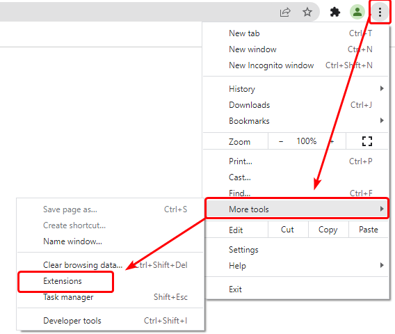
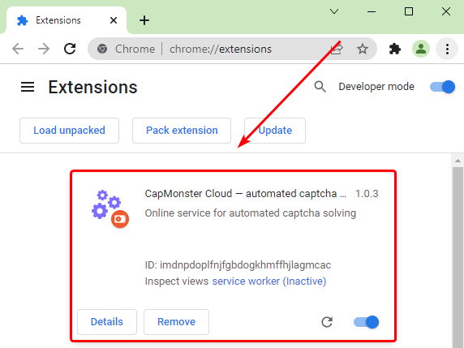
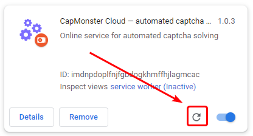
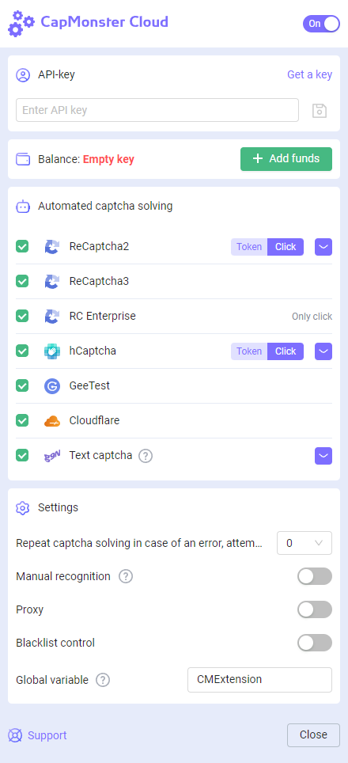
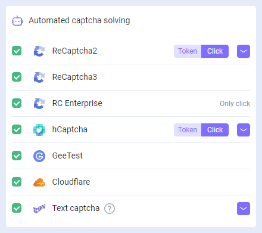
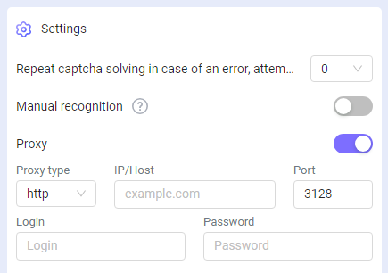
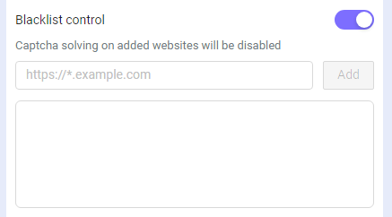

---
sidebar_position: 0
---

# Extensão do navegador Chrome
## **Descrição**
Com esta extensão, você pode reconhecer captchas automaticamente diretamente no navegador.

A extensão funciona no navegador Google Chrome.

-----
## **Instalação automática**
**Importante!** Não é possível instalar extensões no modo de navegação anônima e no modo visitante.

1. Abra a [Chrome Web Store](https://chrome.google.com/webstore/detail/capmonster-cloud-%E2%80%94-automa/pabjfbciaedomjjfelfafejkppknjleh?hl=en).
2. Clique em **Instalar**.

Para começar a usar a extensão, clique em seu ícone à direita da barra de endereços. Vá para as [configurações](extension-main.md#configurações).

*Se por algum motivo não for possível instalar a extensão pela Chrome Web Store, use as instruções para instalação manual.*

    
Instalação manual

1. Baixe o [arquivo com a extensão](https://drive.google.com/file/d/10xXeDqllYo6Ilvr5lUXEVIFw283QzPFL/view?usp=drive_link).

2. Descompacte-o para qualquer pasta.
   
   **ATENÇÃO**: a pasta não deve ser excluída, caso contrário, a extensão deixará de funcionar.
3. No navegador Google Chrome, abra a página “Extensões”. Existem várias maneiras de fazer isso:
   1. Digite chrome://extensions na barra de endereços do navegador e pressione Enter.
   2. No menu: clique nos três pontos verticais no canto superior direito (perto da foto do perfil), depois em "Mais Ferramentas", e em seguida "Extensões".

  

   3. Ou vá para as configurações do Google Chrome e selecione "Extensões" (na parte inferior) no menu à direita.

  

4. Ative o “Modo de desenvolvedor”.
5. Em seguida, clique em “Carregar sem compactação”.

  

6. Encontre e escolha a pasta onde você descompactou a extensão.
7. Depois disso, a extensão deve aparecer na lista das extensões instaladas.

  

    
Atualização manual da extensão

Se você estiver instalando a extensão sobre a versão anterior, ao atualizar os arquivos originais da extensão, também precisará clicar no botão de atualização na página "Extensões" (como abrir esta página está descrito acima na seção "Instalação manual").

-----
## **Configurações**

    
Como fixar a extensão

Por padrão, a extensão instalada é ocultada. Para fixá-la, você deve clicar no botão “Fixar”:

Após iniciar a extensão, você verá esta janela:

### **Chave API**
Insira a chave da API no campo correspondente (1), pressione o botão salvar (2). Se você inseriu a chave correta, seu saldo será exibido abaixo (3).

### **Solução automática de captchas**
Aqui você pode selecionar os tipos de captchas que a extensão reconhecerá automaticamente.

:::info !

Pode ser necessário recarregar a página com captcha para que as alterações tenham efeito!

:::
### **Repetir solução de captcha em caso de erro**
Se a primeira tentativa de resolver o captcha falhar, a extensão enviará tarefas repetidas até que o captcha seja resolvido, ou até que o limite especificado nesta configuração seja atingido.
### **Proxy**
 

Aqui você pode especificar o proxy que será enviado junto com a tarefa de reconhecimento.

O "Login" e a "Senha" são opcionais.
### **Controle de lista negra**
Usando a lista negra, você pode configurar a extensão para ignorar captchas em sites específicos.

Após ativar esta opção, aparecerá um campo para inserir os sites:

Os domínios devem ser especificados junto com o protocolo (https:// ou http://).
Você pode usar máscaras:

- ? - qualquer um caractere, exceto ponto final
- \* - qualquer número de caracteres

Exemplos:

|**Filtro**|**Descrição**|
| :-: | :-: |
|`https://zennolab.com`|Proibição da extensão no site `https://zennolab.com`|
|`https://*.zennolab.com`|Proibição da extensão em todos os subdomínios `https://zennolab.com`|
|`https://www.google.*`|Proibição da extensão de funcionar no Google em todas as zonas (ru, com, com.ua, etc.)|

Quando erros ocorrerem na solução de captchas, veja o [glossário de erros](/api/api-errors.md).
