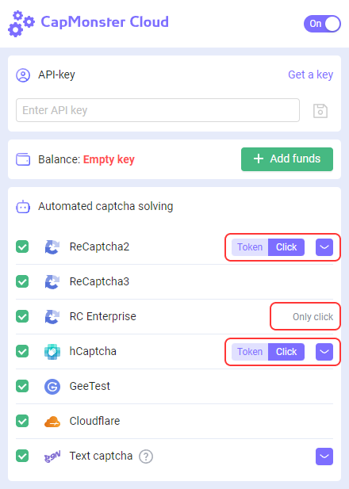

---
sidebar_position: 4
sidebar_label: Instruções para instalar a extensão no navegador ProjectMaker
---

# Instruções para instalar a extensão CapMonster Cloud no navegador ProjectMaker

:::info

A extensão só funciona com o navegador Chromium!

:::

## Método #1: Instalação usando um arquivo CRX.
1. Baixe o [arquivo CRX CapMonster Cloud](https://chrome.google.com/webstore/detail/capmonster-cloud-%E2%80%94-automa/pabjfbciaedomjjfelfafejkppknjleh?hl=en);

:::info
[Aqui](https://zennolab.atlassian.net/wiki/spaces/RU/pages/2081423361#%D0%9A%D0%B0%D0%BA-%D1%81%D0%BA%D0%B0%D1%87%D0%B0%D1%82%D1%8C-crx-%D1%84%D0%B0%D0%B9%D0%BB-%D1%80%D0%B0%D1%81%D1%88%D0%B8%D1%80%D0%B5%D0%BD%D0%B8%D1%8F) você pode encontrar instruções para instalar o arquivo CRX.
:::

2. Abra o ProjectMaker;

3. Adicione a ação “Adicionar extensão”;

    1. Especifique o caminho para o arquivo CRX nas configurações da ação;

4. Adicione a ação “Ativar extensão”;

5. Nas configurações da ação, defina o ID da extensão “pabjfbciaedomjjfelfafejkppknjleh”;

6. Na janela da extensão que abrir, insira a chave API da sua conta pessoal do CapMonster Cloud.
## Método #2: Instalação via Chrome Web Store.
1. Abra o ProjectMaker;
2. Vá para a página da extensão `<https://chrome.google.com/webstore/detail/capmonster-cloud-%E2%80%94-automa/pabjfbciaedomjjfelfafejkppknjleh?hl=en>`;
3. Clique no botão “Instalar” e instale a extensão;
4. Adicione a ação “Ativar extensão”;

    1. Nas configurações da ação, insira o ID da extensão “pabjfbciaedomjjfelfafejkppknjleh”;

5. Na janela da extensão que abrir, insira a chave API da sua conta pessoal do CapMonster Cloud.
:::info
A nova versão da extensão CapMonster Cloud tem a capacidade de resolver reCAPTCHA2, reCAPTCHA Enterprise e hCaptcha por cliques.
:::
 
:::caution
Observe que ao instalar a extensão, o tipo de solução para reCAPTCHA2, reCAPTCHA Enterprise e hCaptcha é definido como “Clique” por padrão.
:::
Para facilitar o uso da extensão CapMonster Cloud no ProjectMaker, preparamos um projeto para automatizar a instalação da extensão, inserção da chave API e escolha do tipo de solução reCAPTCHA2, reCAPTCHA Enterprise e hCaptcha.

***Versão mínima do ZennoPoster 7.6.1***

:::caution
Ao instalar a extensão CapMonster Cloud via um arquivo CRX, você precisa manter a versão da extensão atualizada. Em caso de atualização de versão, será necessário baixar novamente o arquivo CRX atual e reinstalá-lo.
:::
:::caution
Ao usar a extensão CapMonster Cloud, você precisa remover as ações de reconhecimento de captcha do seu projeto.
:::