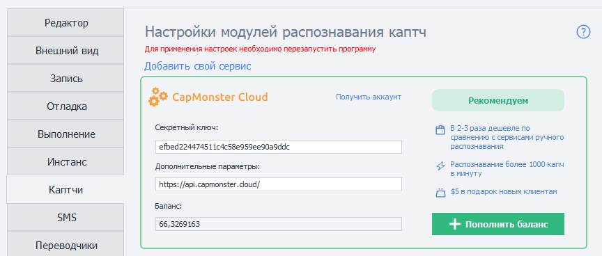
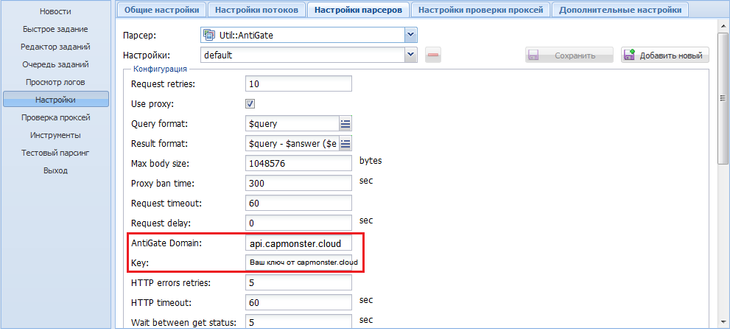

# Como conectar o CapMonster.cloud a um programa?
CapMonster.cloud é compatível com todos os solucionadores de captchas. Para conectar CapMonster.cloud ao seu programa, siga o guia abaixo.
## **Conectando a programas que suportam CapMonster.Cloud**
<details>
   <summary>ZennoPoster</summary>


</details>

<details>
   <summary>KeyCollector</summary>

Selecione “Use CapMonster.cloud” e insira sua chave de API pessoal.


</details>

<details>
   <summary>A-Parser</summary>

Para resolver um reCAPTCHA, selecione Util::ReCaptcha2 e especifique a chave para o campo Provedor.


Para resolver captchas padrão, selecione “Util::Antigate” e especifique “api.capmonster.cloud” como o valor para “Antigate domain”. No campo "key", especifique sua chave de API pessoal.


</details>

<details>
   <summary>MailBot by Tavel</summary>


</details>

## **Conectando a programas onde você pode especificar um domínio**
Copie o domínio [api.capmonster.cloud](https://api.capmonster.cloud) e a chave para CapMonster.cloud.

Esse método funciona para:

<details>
   <summary>ZennoDroid</summary>


</details>

## **Conectando a outros programas em 3 etapas**
1. No seu programa, selecione um dos solucionadores de captchas que suportamos:
   `Anti-Captcha (v1.0, v2.0), RuCaptcha, RipCaptcha, 2Captcha, BypassCaptcha, DeathByCaptcha`.
1. Em seguida, insira sua chave de API pessoal do CapMonsterCloud no campo relevante do programa de onde você enviará os captchas.
   1. **Nota para DeathByCaptcha:** Para identificar um usuário, a API do DeathByCaptcha usa um nome de usuário e uma senha, não uma chave de API. Nesse caso, insira a chave de API do CapMonsterCloud no campo de senha. Coloque qualquer valor no campo de nome de usuário.
1. Última etapa: faça a correspondência do nosso IP com outro serviço para que CapMonster.Cloud possa obter captchas dos serviços mencionados. Para isso, selecione seu sistema operacional, abra o spoiler e siga as instruções.

<details>
   <summary>Eu tenho Windows</summary>

Vá para: C:\Windows\System32\drivers\etc\ e encontre o arquivo **hosts**. Abra-o com o Bloco de Notas e adicione as seguintes linhas ao final do documento:

```
# capmonster.cloud begin

65.21.216.235 rucaptcha.com

65.21.216.235 ripcaptcha.com

65.21.216.235 imacros2.rucaptcha.com

65.21.216.235 2captcha.com

65.21.216.235 imacros2.2captcha.com

65.21.216.235 dc.antigate.com

65.21.216.235 anti-captcha.net

65.21.216.235 antigate.com

65.21.216.235 anticaptcha.com

65.21.216.235 www.anti-captcha.net

65.21.216.235 www.antigate.com

65.21.216.235 www.anticaptcha.com

65.21.216.235 anti-captcha.com

65.21.216.235 api.anti-captcha.com

65.21.216.235 bypasscaptcha.com

65.21.216.235 www.bypasscaptcha.com

65.21.216.235 api.dbcapi.me

65.21.216.235 api.deathbycaptcha.com

65.21.216.235 api.deathbycaptcha.eu

65.21.216.235 api.dbc.me

# capmonster.cloud end
```
Salve.
:::info
Em alguns casos, pode ser necessário ter direitos de administrador para salvar o arquivo. Nesse caso, você precisará seguir estas instruções simples:

1. Comece a digitar "Bloco de Notas" na barra de pesquisa da barra de tarefas. Assim que o resultado for encontrado, clique com o botão direito do mouse sobre ele e clique em "Executar como administrador".

   

1. No menu superior do Bloco de Notas, clique em Arquivo — Abrir e especifique o caminho para "hosts": *C:\Windows\System32\drivers\etc.* Se houver vários arquivos com esse nome na pasta, abra o arquivo que não possui extensão.
1. Faça as alterações no arquivo "hosts" e depois salve o arquivo no menu.
:::

Tente visitar qualquer um desses domínios. Se tudo estiver correto, uma página em branco será aberta. Se você não conseguiu, entre em contato com [suporte](https://helpdesk.zennolab.com/conversation/new), nós ajudaremos com todas as configurações!
</details>

<details>
   <summary>Eu tenho MacOS</summary>

Abra o Terminal via Spotlight ou Launchpad.


Na janela do aplicativo, insira o comando para abrir o editor de texto Nano: `sudo nano /etc/hosts`

Após inserir o comando, clique Enter, digite sua senha de administrador e pressione Enter novamente.

:::info
O processo de digitação da senha de administrador não é exibido. Apenas insira a senha, clique Enter e você estará no sistema.
:::

Agora você está no editor de texto Nano.

:::info
Nem o mouse nem o trackpad funcionam aqui. Você só pode usar o teclado.
:::

Adicione as seguintes linhas ao final do documento:

```
# capmonster.cloud begin

65.21.216.235 rucaptcha.com

65.21.216.235 ripcaptcha.com

65.21.216.235 imacros2.rucaptcha.com

65.21.216.235 2captcha.com

65.21.216.235 imacros2.2captcha.com

65.21.216.235 dc.antigate.com

65.21.216.235 anti-captcha.net

65.21.216.235 antigate.com

65.21.216.235 anticaptcha.com

65.21.216.235 www.anti-captcha.net

65.21.216.235 www.antigate.com

65.21.216.235 www.anticaptcha.com

65.21.216.235 anti-captcha.com

65.21.216.235 api.anti-captcha.com

65.21.216.235 bypasscaptcha.com

65.21.216.235 www.bypasscaptcha.com

65.21.216.235 api.dbcapi.me

65.21.216.235 api.deathbycaptcha.com

65.21.216.235 api.deathbycaptcha.eu

65.21.216.235 api.dbc.me

# capmonster.cloud end
```

Após fazer as alterações, clique em Ctrl+O para aplicá-las. Em seguida, clique em Ctrl+X e Enter para sair do editor.

Para ver as alterações, limpe o cache de DNS. Para isso, insira o comando: `sudo killall -HUP mDNSResponder`. Isso limpará o cache de DNS no seu Mac, e o sistema operacional verá as alterações no arquivo Hosts.

Tente visitar qualquer um desses domínios. Se tudo estiver correto, uma página em branco será aberta. Se você não conseguiu, entre em contato com [suporte](https://helpdesk.zennolab.com/conversation/new), nós ajudaremos com todas as configurações.
</details>

<details>
   <summary>Eu tenho Linux</summary>

Na janela do aplicativo, insira o comando para abrir o editor de texto Nano: `sudo nano /etc/hosts`

Após inserir o comando, clique Enter. Agora você está no editor de texto Nano.

Adicione as seguintes linhas ao final do documento:
```
# capmonster.cloud begin

65.21.216.235 rucaptcha.com

65.21.216.235 ripcaptcha.com

65.21.216.235 imacros2.rucaptcha.com

65.21.216.235 2captcha.com

65.21.216.235 imacros2.2captcha.com

65.21.216.235 dc.antigate.com

65.21.216.235 anti-captcha.net

65.21.216.235 antigate.com

65.21.216.235 anticaptcha.com

65.21.216.235 www.anti-captcha.net

65.21.216.235 www.antigate.com

65.21.216.235 www.anticaptcha.com

65.21.216.235 anti-captcha.com

65.21.216.235 api.anti-captcha.com

65.21.216.235 bypasscaptcha.com

65.21.216.235 www.bypasscaptcha.com

65.21.216.235 api.dbcapi.me

65.21.216.235 api.deathbycaptcha.com

65.21.216.235 api.deathbycaptcha.eu

65.21.216.235 api.dbc.me

# capmonster.cloud end
```

Após fazer as alterações, clique em Ctrl+X e depois Y para aplicá-las.

Tente visitar qualquer um desses domínios. Se tudo estiver correto, uma página em branco será aberta. Se você não conseguiu, entre em contato com [suporte](https://helpdesk.zennolab.com/conversation/new), nós ajudaremos com todas as configurações.
</details>

Este método funciona para muitos aplicativos, incluindo os seguintes:

- BroBot
- Жукладочник
- Определяйка
- Scripts PHP
- Словоёб
- Add2Board
- AddNews
- AddSite
- Advego Plagiatus
- All-in-One Checker
- AllSubmitter
- Botsapp for VK
- BotZilla
- BrowserAutomationStudio
- CheckCheck
- ComparseR
- Dark Sender
- DVChecker
- eTXT Антиплагиат
- FastTrust
- GSA Search Engine Ranker (GSA SER)
- VKCH
- Human Emulator
- Hwaddurl
- LInviter VK
- LSender VK PRO
- LSSender
- MagadanLite
- MailBot Tavel
- Majento PositionMeter
- MultiCaptchaBot
- Netpeak Checker
- Page Weight
- Poster PRO
- Private Keeper
- Quick Sender
- Register-mail
- ScrapeBox
- SELKA
- Semonitor
- Sender.Services
- SEO PowerSuite
- SERP Parser
- Sobot
- Staf4 Registrator
- TOBBOT
- TOPBOT
- TopSite
- TrafficLinks
- VkButton
- VKClient
- Web Parser
- Xneolinks
- X Parser Light
- XSEOchecker
- XseoN
- E outros...

:::info

Se você não conseguiu conectar o CapMonster.Cloud ao seu aplicativo, entre em contato com [suporte](https://helpdesk.zennolab.com/conversation/new), nós ajudaremos com todas as configurações.

:::

## **Erros de conexão frequentes. Como evitá-los?**

**Problemas de rede**: Se você estiver com problemas para se conectar ao CapMonster.Cloud, verifique sua conexão com a Internet. Uma rede instável ou problemas de roteamento podem causar falhas no serviço.

**Erro de configuração do programa**: Configurações incorretas do programa podem causar erros ao usar o CapMonster.Cloud. Verifique as configurações do seu software e certifique-se de que todos os parâmetros estão configurados corretamente para funcionar com o serviço.

**Limites excedidos**: Você pode ter excedido os limites de uso do serviço CapMonster.Cloud. Verifique sua conta para ver se há limites ativos e se eles não estão esgotados.

**Problemas de autenticação**: Certifique-se de que sua chave de API foi copiada e colada corretamente nas configurações do seu software.

**Erros nas configurações de proxy**: Se você usa um servidor proxy para se conectar à Internet, verifique se as configurações do proxy estão corretas em seu software e se não bloqueiam o acesso ao CapMonster.Cloud.
