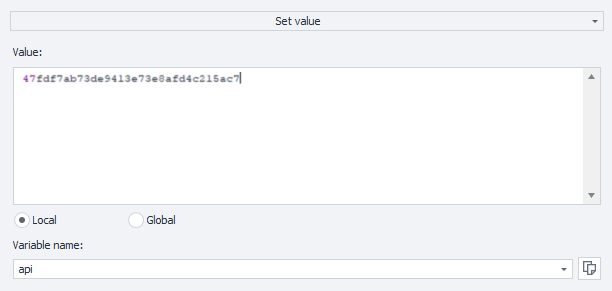
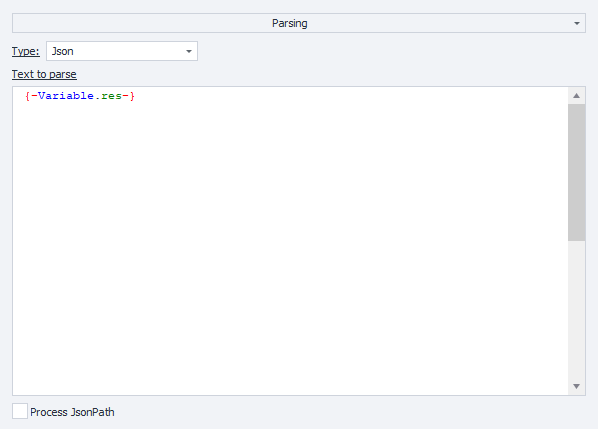
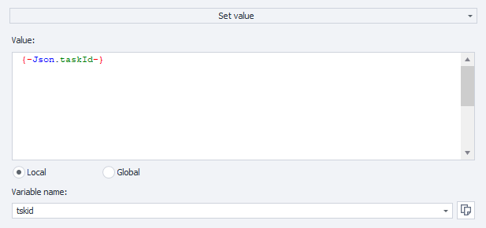
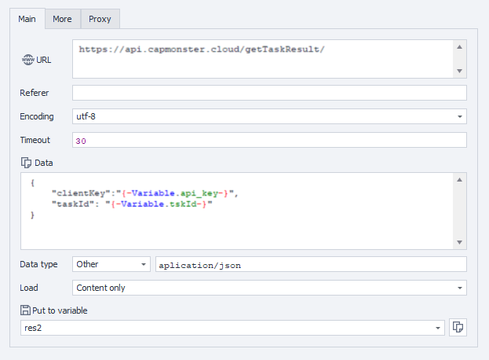
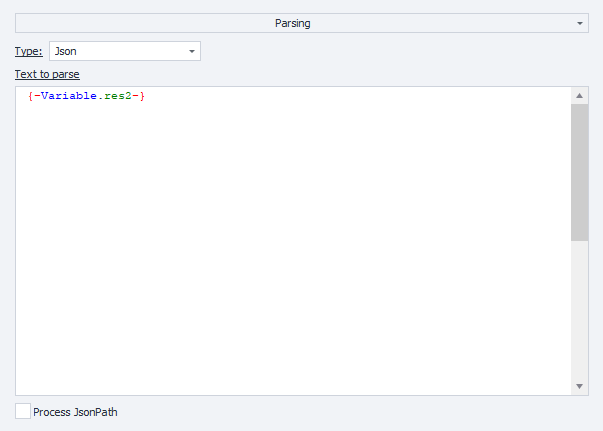

---
sidebar_position: 0
---


# Começando

Nesta seção, você pode aprender como enviar captchas para o CapMonster Cloud e os métodos para reconhecê-los.

:::info Endereço do método
```http
https://api.capmonster.cloud
```
Formato da solicitação: `JSON POST`.
A resposta é sempre no formato `JSON`.
:::


**Para resolver um captcha, você precisa:**

1. Criar uma tarefa de captcha através do método [createTask](api/methods/create-task.md), que retornará um ID de tarefa.
2. Aguardar um momento. Dependendo da carga do sistema, você receberá uma resposta após um tempo que varia de 300ms a 6s.
3. Solicitar a solução do captcha com [getTaskResult](api/methods/get-task-result.md). Se os captchas não forem resolvidos ainda, volte para o passo #2.

Método adicional:

- [Check](api/methods/get-balance.md) saldo da conta.

### Exemplos de código

Para sua conveniência, criamos bibliotecas prontas para rápida integração da API do CapMonster.Cloud em seu código. Reconheça reCAPTCHA, hCaptcha e outros tipos de captcha pelos menores preços do mercado!

|**Linguagem**|**Link para o repositório**|
| :- | :- | 
|C#|- [Nuget](https://www.nuget.org/packages/Zennolab.CapMonsterCloud.Client)<br /> - [Github](https://github.com/ZennoLab/capmonstercloud-client-dotnet) |
|Python|- [PyPl](https://pypi.org/project/capmonstercloudclient/)<br /> - [Github](https://github.com/ZennoLab/capmonstercloud-client-python)|
|JS|- [Npm](https://www.npmjs.com/package/@zennolab_com/capmonstercloud-client)<br /> - [Github](https://github.com/ZennoLab/capmonstercloud-client-js)|
|GO|- [Pkg.go.dev](https://pkg.go.dev/github.com/ZennoLab/capmonstercloud-client-go)<br /> - [Github](https://github.com/ZennoLab/capmonstercloud-client-go)|
|PHP|- [Packagist](https://packagist.org/packages/zennolab/capmonstercloud.client)<br /> - [Github](https://github.com/ZennoLab/capmonstercloud-client-php)|


## Métodos de reconhecimento

Existem 2 métodos de reconhecimento de captcha no serviço CapMonster Cloud:

1. Método token.
2. Método clique.

O primeiro método (**via token**) é o método básico inicial de reconhecimento, onde você deve buscar manualmente parâmetros e funções no código das páginas dos sites e, em seguida, construir consultas usando esses parâmetros ou scripts e realizar autosubmit para enviar o token e sinalizar ao site que o captcha foi resolvido e a entrada correta precisa ser verificada. O token é uma combinação única de caracteres, uma resposta do servidor gerada como resultado de uma solução de captcha bem-sucedida e usada para validá-la. Autosubmit - uma função que envia automaticamente o token para o formulário de captcha e confirma a solução.

Os parâmetros de busca são, por exemplo, SiteKey (websiteKey) - um identificador único que é usado para vincular o captcha e o site de destino, URL do site - o endereço da página onde o captcha está localizado.

Após analisar o código da página e fazer uma solicitação, os dados do captcha são enviados para o serviço CapMonster Cloud para reconhecimento. Como resultado da solução bem-sucedida, o site que iniciou a solicitação recebe um token para mineração posterior. O usuário pode usar esse método em seu código, tendo formulado corretamente a tarefa a ser enviada ao servidor, receber o resultado e confirmar a solução do captcha.

O segundo método (**via cliques**) permite que captchas complexos sejam reconhecidos da maneira como uma pessoa real faz, usando cliques reais. Isso prova ao site que o captcha foi reconhecido manualmente por um humano, não por um bot. Este método é usado em uma extensão de navegador para Chrome ou Firefox.

Outra vantagem importante desse método de reconhecimento é que não é necessário buscar parâmetros para enviar ao serviço e realizar autosubmit. Não é segredo que nesta etapa você pode enfrentar uma tarefa bastante séria e demorada (especialmente para iniciantes em programação) de busca por parâmetros e funções em scripts e dados em solicitações, layout HTML de sites e estrutura de scripts através dos quais a submissão (confirmação da solução do captcha) é geralmente implementada.

Esse problema é frequentemente agravado pelo fato de que os sites podem usar diferentes maneiras não padrão de configuração de parâmetros e implementação da função de submissão. Por exemplo, se muitos parâmetros de terceiros forem usados nas solicitações ou se esses parâmetros forem criptografados. O método de clique de solução, na maioria dos casos, permite que você contorne essas dificuldades sem pesquisas e experimentações adicionais complexas.

Há também uma grande oportunidade de aplicar o método de clique no ZennoPoster. Para isso, basta instalar nossa extensão CapMonster Cloud (veja a seção [Instruções para instalar a extensão CapMonster Cloud no navegador ProjectMaker](extension/install-instruction.md)) em um projeto com o mecanismo Chromium, inserir a chave da API e usar a extensão para trabalhar com o projeto da mesma forma que é feito no navegador do sistema Chrome.

## Exemplos de submissão de token no Zennoposter

Usando ações:

1. Integre o CapMonster Cloud ao ProjectMaker (Configurações - Captchas - Selecione o módulo CapMonster Cloud, insira sua chave da API);

2. Adicione ações Limpar Cookies - Ir para página (por exemplo, para o tipo de captcha reCaptcha v.2 - [https://lessons.zennolab.com/captchas/recaptcha/v2_simple.php?level=high](https://lessons.zennolab.com/captchas/recaptcha/v2_simple.php?level=high)) - Reconhecer ReCaptcha;

3. Nas Propriedades da ação Reconhecer ReCaptcha, selecione o módulo CapMonsterCloud.dll, especifique o tipo de captcha reCaptcha v.2 e o método de solução **No tab** ou **Via SiteKey**:


4. Se você escolher o método **Via SiteKey**, especifique os dados do captcha (sitekey) e a URL - endereço da página onde deseja resolver o captcha: 


### reCaptcha v.3

1. Adicione ações Limpar cookies - Ir para página (por exemplo, [https://lessons.zennolab.com/captchas/recaptcha/v3.php?level=beta](https://lessons.zennolab.com/captchas/recaptcha/v3.php?level=beta)) - Reconhecer ReCaptcha;

2. Nas Propriedades da ação Reconhecer ReCaptcha, selecione o módulo CapMonsterCloud.dll, especifique o tipo de captcha reCaptcha v.3, o método No Tab ou Via SiteKey, e também especifique Ação e minScore:


### hCaptcha 

1. Adicione a ação "Reconhecer hCaptcha" ao seu projeto, onde você já navegou até a página com o captcha;

2. Nas Propriedades da ação Reconhecer hCaptcha, selecione o método No Tab ou Via SiteKey (ao selecionar esse método, você precisará especificar o SiteKey e a URL onde o captcha está localizado):


### Via solicitações HTTP

Para alguns tipos de captcha, não há ações prontas no ProjectMaker, nesse caso você precisará usar uma extensão ou compor suas consultas para resolver o captcha.

1. "Processamento de Variáveis" ("Adicionar Ação" - "Dados" - "Processamento de Variáveis"), selecione "Definir Valor" nas propriedades e escreva sua chave da API do CapMonster Cloud no valor.



2. "Adicionar Ação" - "HTTP" - "Solicitação POST" (adicione seus valores de proxy, se necessário):


3. Adicione uma ação "Processar JSON/XML" ("Adicionar ação" - "Dados" - "Processar JSON/XML"), nas propriedades selecione "análise", tipo "Json" e para análise de texto de clique direito selecione "Definir valor a partir da variável": 



4. Adicione uma ação de "Processamento de Variáveis", defina \{-Json.taskId-\} nela: 



5. Gere uma nova solicitação POST para obter o resultado:



6. Adicione o valor "análise" na ação "Processamento JSON/XML": 



7. Em seguida, você precisa substituir o valor do token no formulário de captcha desejado (examinando o código da página) usando a ação "Definir Valor", por exemplo: 

