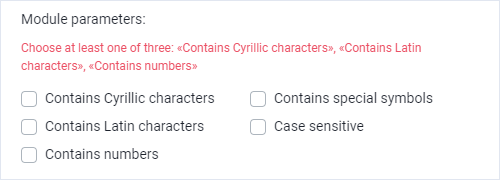
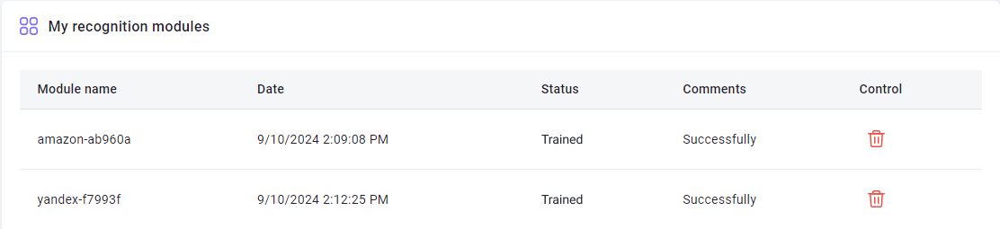

import { ArticleHead } from '../../../../../src/theme/ArticleHead';

<ArticleHead slug="api/user-module" />

# Criando um módulo de usuário


## Descrição

A função de criação de módulo personalizado permite treinar o sistema para reconhecer um tipo específico de captcha. Isso aumenta a velocidade e a precisão no reconhecimento de captchas não padrão e reduz a probabilidade de erros.

Para acessar a [página de treinamento do módulo](https://capmonster.cloud/UserModules), clique no seu e-mail no canto superior direito do site e selecione a opção correspondente no menu.


---

## Como funciona

O processo resumido é o seguinte:

1. Você coleta os captchas e os compacta em um arquivo.
2. Envia o arquivo para nós, indicando o nome do módulo.
3. Realiza um depósito de US$10 no saldo (os fundos permanecem na conta e não são debitados).
4. Nós criamos o módulo.
5. Você envia tarefas de reconhecimento, especificando o nome do módulo criado.

Abaixo, cada etapa é descrita com mais detalhes.

---

### 1. Coletando captchas

#### Quantos captchas você precisa?

Na página de [Treinamento de Módulos](https://capmonster.cloud/UserModules), marque os tipos de caracteres que aparecem no seu captcha. Em seguida, será exibida uma indicação de quantos captchas você precisa coletar e enviar:


#### Formatos de imagem suportados

- jpg
- jpeg
- png

#### Como coletar captchas?

Vamos olhar o exemplo com o [ZennoPoster](https://zennolab.atlassian.net/wiki/spaces/EN/pages/924581921/ZennoPoster).

Imagine que você está registrando contas em um site e ele possui um captcha para o qual você deseja criar um módulo. Existem várias opções:

- Provavelmente, você já tem um projeto em funcionamento para este site, o que significa que já está resolvendo este captcha. Na ação [Reconhecer captcha](https://zennolab.atlassian.net/wiki/spaces/EN/pages/924582077/Recognize+captcha), na guia *Mais*, você pode encontrar a opção [Salvar](https://zennolab.atlassian.net/wiki/spaces/EN/pages/924582077/Recognize+captcha#Saving), que foi criada para esses casos.
- Você pode seguir um caminho mais simples: vá para a página do captcha. Sempre há um botão de Atualizar. Envie o captcha para o solucionador ou [resolva manualmente](https://zennolab.atlassian.net/wiki/spaces/EN/pages/924484621/Entering+captchas+manually) (anteriormente definido na ação [Salvar](https://zennolab.atlassian.net/wiki/spaces/EN/pages/924582077/Recognize+captcha#Saving)), atualize o captcha e envie-o para solução novamente. Repita esses passos até coletar captchas suficientes.

:::warning
Não execute a coleta de captchas em dezenas ou centenas de threads! Poucos sites gostariam disso.
:::

---

### 2. Enviando o arquivo de captchas


#### 2.1. Nome

Primeiro, defina o nome do módulo (apenas caracteres latinos).


:::warning
O nome do módulo não deve conter a palavra **captcha**.
:::

#### 2.2. Tipos de símbolos

Marque os tipos de símbolos que seu captcha contém.

O que você marcar aqui afeta o número de captchas que você precisará fazer upload para treinar o módulo.

Você pode escolher uma ou várias opções das sugeridas.



:::info
Você deve marcar pelo menos uma das seguintes opções: "Contém caracteres cirílicos", "Contém caracteres latinos", "Contém números".
:::

#### 2.3. Localização das respostas

Especifique onde as respostas dos captchas estão localizadas.


É bem simples:

- **Nenhum** - selecione se você não tiver respostas para os captchas (neste caso, o treinamento do módulo pode demorar mais).
- **Localizado nos nomes dos arquivos** - selecione se o nome de cada imagem de captcha é a resposta correspondente (às vezes, as respostas de captcha não podem ser salvas no nome do arquivo: sistemas operacionais não permitem alguns símbolos em nomes de arquivos).
- **Localizado em um arquivo separado no arquivo** - selecione se as respostas estão salvas em um arquivo (deve ser um arquivo de texto simples—.txt).
  - Nome do arquivo: answers.txt
  - Deve estar localizado dentro do arquivo com os captchas
  - Formato - CaptchaFileName:CaptchaAnswer, cada captcha em uma nova linha. Exemplo:

```
captcha1.png:d9li1

captcha2.png:2zhnw

captcha3.png:99loe
```

#### 2.4. Enviando o arquivo

Depois de especificar o nome do módulo, selecionar os tipos de símbolos e a localização das respostas, você precisa enviar o arquivo zip com os captchas e nos enviar.


#### 2.5. Pagamento

- Se você fez tudo corretamente, sua solicitação aparecerá na tabela com o status **Validado**.
- Depois disso, você precisa depositar $10 por módulo.

:::note
Os fundos alocados para o treinamento não são debitados, mas permanecem no saldo. Você pode gastá-los na resolução de qualquer captcha, a qualquer momento.
:::

- Após o depósito bem-sucedido, o status do **primeiro** módulo enviado mudará para **Pago**.

---

### 3. Status

#### Validado


Você recebe esse status após enviar o formulário (desde que você tenha feito tudo corretamente).

:::note
Módulos com esse status podem ser excluídos. Se você enviou o módulo, mas percebeu que enviou um arquivo errado ou deu um nome ruim para o módulo, você pode excluí-lo, fazer as alterações e enviá-lo novamente.
:::

#### Pago


Seu pagamento pelo módulo foi aceito.

#### ValidadoEmProfundidade


Trabalhos preparatórios.

#### Anotado


Marcação de captcha concluída. O treinamento está em andamento.

#### Treinado



O módulo está pronto! Agora você pode enviar captchas para ele.

### 4. Enviando captchas para um módulo específico

Existem várias maneiras de especificar um módulo que resolverá os captchas:

- [Adicione o argumento CapMonsterModule com o nome do módulo ao enviar uma solicitação /createTask](../captchas/image-to-text.mdx) (se você interagir diretamente com nossa API)
- [Especifique um nome de módulo na chave API](module-name.mdx) (muito prático quando você usa programas de terceiros e não pode modificar as solicitações)

---

## Perguntas Frequentes

<details>
    <summary>Quanto tempo leva o treinamento do módulo?</summary>

Geralmente leva um dia.

**Nota:** O treinamento ocorre em dias úteis, de segunda a sexta-feira. Se você enviar uma solicitação na sexta-feira, o treinamento será concluído no início da próxima semana.

</details>

<details>
    <summary>Quero treinar vários módulos ao mesmo tempo, como posso fazer isso corretamente?</summary>

O algoritmo é simples: você apenas faz upload do arquivo de captchas e paga por ele. Depois, você faz upload do segundo arquivo e paga por ele. Você faz isso para todos os arquivos.

O treinamento leva um dia por módulo.

</details>

<details>
    <summary>Vejo o sinal "Erro" na coluna "Comentário" ao lado do meu módulo. O que devo fazer?</summary>


Não entre em pânico Apenas espere um pouco.

Se nada mudar em um dia, [entre em contato com o suporte](https://helpdesk.zennolab.com) e nós definitivamente o ajudaremos.

</details>

<details>
    <summary>Enviei um arquivo errado, posso reenviá-lo?</summary>

Se você não pagou pelo módulo e ele tem o status **Validado**, você pode excluí-lo. Você pode encontrar mais informações na descrição do status **Validado**.

</details>

<details>
    <summary>O que é a coluna “Gerenciar” na tabela? Não tenho nada lá</summary>

Você verá o botão "Excluir" nesta coluna. Mas ele só está disponível para os módulos com o status **Validado**.

Para módulos com outros status, essa coluna permanece vazia.

</details>

<details>
    <summary>Por que alguns símbolos foram adicionados ao nome do meu módulo?</summary>

Isso é feito para tornar o nome do módulo único. Alguns usuários do sistema podem escolher o mesmo nome para seu módulo

</details>

<details>
    <summary>Posso obter um módulo treinado para o programa CapMonster2?</summary>

Não. O módulo treinado está disponível apenas no CapMonster.Cloud.

</details>

<details>
    <summary>Não estou satisfeito com a qualidade do treinamento. O que fazer?</summary>

Por favor, [entre em contato com nosso serviço de suporte](https://helpdesk.zennolab.com/).

</details>

<details>
    <summary>Tenho uma pergunta que não está coberta aqui. Onde devo entrar em contato?</summary>

Por favor, [entre em contato com nosso serviço de suporte](https://helpdesk.zennolab.com/).

</details>