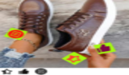
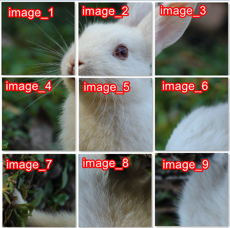
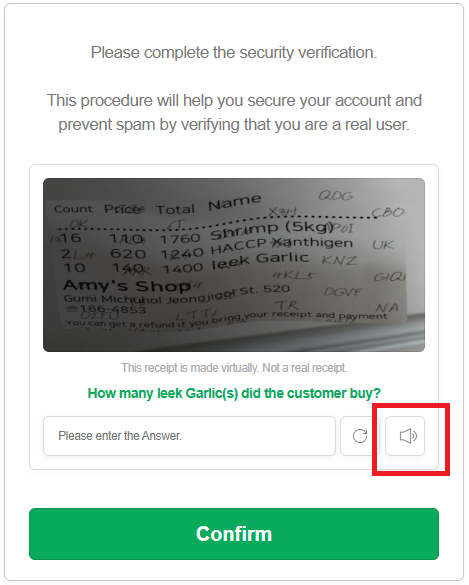
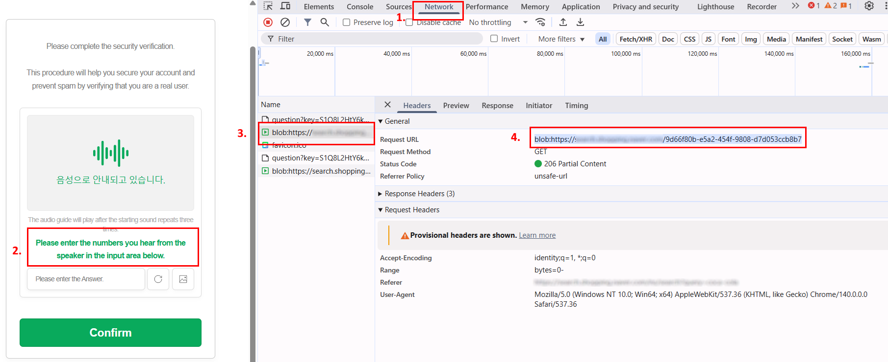
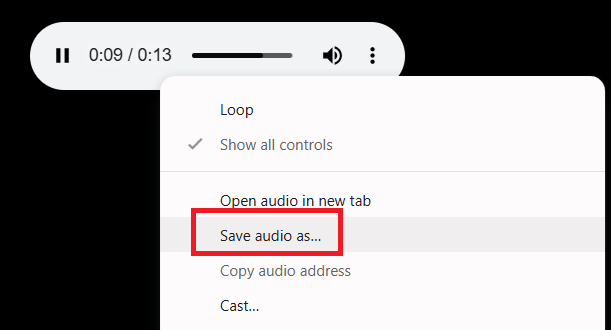
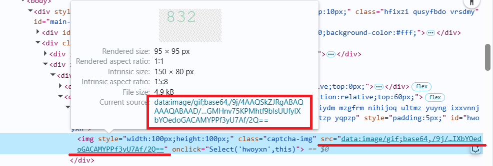

import Tabs from '@theme/Tabs';
import TabItem from '@theme/TabItem';
import ParamItem from '@theme/ParamItem';
import MethodItem from '@theme/MethodItem';
import MethodDescription from '@theme/MethodDescription';
import PriceBlock from '../../../../../src/theme/PriceBlock';
import PriceBlockWrap from '@theme/PriceBlockWrap';
import TaskImageWrapper from '@theme/TaskImageWrapper';
import TaskImageBlock from '@theme/TaskImageBlock';
import TaskImage from '@theme/TaskImage';
import { TaskImageText } from '../../../../../src/theme/TaskImageText';
import BlogLink from '@theme/BlogLink';

# ComplexImageTask Recognition

<TaskImageWrapper>
  <TaskImageBlock link="/pt-br/docs/captchas/ComplexImageTask-Recognition#oocl_rotate_new">
    <TaskImage></TaskImage>
    <TaskImageText title="Oocl_rotate_new" captchaId="complex-rec_oocl_rotate_new" />
  </TaskImageBlock>

  <TaskImageBlock link="/pt-br/docs/captchas/ComplexImageTask-Recognition#oocl_rotate_double_new">
    <TaskImage></TaskImage>
    <TaskImageText title="Oocl_rotate_double_new" captchaId="complex-rec_oocl_rotate_double_new" />
  </TaskImageBlock>

  <TaskImageBlock link="/pt-br/docs/captchas/ComplexImageTask-Recognition#betpunch_3x3_rotate">
    <TaskImage></TaskImage>
    <TaskImageText title="Betpunch_3x3_rotate request" captchaId="complex-rec_betpunch_3x3_rotate_request" />
  </TaskImageBlock>

  <TaskImageBlock link="/pt-br/docs/captchas/ComplexImageTask-Recognition#bls">
    <TaskImage></TaskImage>
    <TaskImageText  captchaId="complex-rec_bls" />
  </TaskImageBlock>

  <TaskImageBlock link="/docs/captchas/ComplexImageTask-Recognition#shein">
    <TaskImage></TaskImage>
    <TaskImageText title="shein" captchaId="complex-rec_oocl_rotate_new" />
  </TaskImageBlock>

  <TaskImageBlock link="/docs/captchas/ComplexImageTask-Recognition#baidu">
    <TaskImage></TaskImage>
    <TaskImageText title="baidu" captchaId="complex-rec_baidu" />
  </TaskImageBlock>

  <TaskImageBlock link="/docs/captchas/ComplexImageTask-Recognition#bills_audio">
    <TaskImage></TaskImage>
    <TaskImageText title="bills_audio" captchaId="complex-rec_bills_audio" />
  </TaskImageBlock>
</TaskImageWrapper>

:::warning **Atenção!**
O uso de servidores proxy para esta tarefa não é necessário.
:::


## Parâmetros de solicitação

<TabItem value="proxyless" label="ComplexImageTask (sem proxy)" default className="bordered-panel">
    <ParamItem title="type" required type="string" />
    **ComplexImageTask**

    ---

    <ParamItem title="class" required type="string" />
    **recognition**

    ---

    <ParamItem title="imagesBase64" required type="array" />
    Array de imagens codificadas em base64.
    Exemplo: [ “/9j/4AAQSkZJRgABAQEAAAAAAAD…”]

    ---

    <ParamItem title="Task (dentro da metadata)" required type="string" />
    Valores possíveis: `oocl_rotate_new` e outros <br />
    Nome da tarefa (<u>em inglês</u>).

  </TabItem>

## oocl_rotate_new

### Criar tarefa `oocl_rotate_new`

<PriceBlockWrap>
  <PriceBlock title="ComplexImageTask" captchaId="complex-rec_oocl_rotate_new" />
</PriceBlockWrap>

Na solicitação, passamos duas imagens: fundo e círculo.

<TabItem value="proxyless" label="RecaptchaV2TaskProxyless (sem proxy)" default className="method-panel">
<MethodItem>
  ```http
  https://api.capmonster.cloud/createTask
  ```
</MethodItem>
<MethodDescription>
**Solicitação**
```json
{
    "clientKey": "API_KEY",
    "task": {
        "type": "ComplexImageTask",
        "class": "recognition",
        "imagesBase64": [
			"{background_base64}",
			"{circle_base64}"
		],
        "metadata": {
            "Task": "oocl_rotate_new"
        }
    }
}
```

Exemplo de fundo (_background_base64_):


Exemplo de círculo (_circle_base64_):


**Resposta**

```json
{
  "errorId": 0,
  "taskId": 407533072
}
```

</MethodDescription>
</TabItem>

### Obter resultado da tarefa `oocl_rotate_new`

<TabItem value="proxyless" label="GeeTestTaskProxyless (sem proxy)" default className="method-panel-full">
    <MethodItem>
```http
https://api.capmonster.cloud/getTaskResult
```
    </MethodItem>
    <MethodDescription>
		**Solicitação**
		```json
		{
		  "clientKey":"API_KEY",
		  "taskId": 407533072
		}
		```
		**Resposta**
		Graus pelos quais o círculo deve ser girado no sentido horário.
		```json
		{
		  "errorId":0,
		  "status":"ready",
		  "errorCode":null,
		  "errorDescription":null,
		  "solution": 
		  {
			  "answer":[130.90909],
			  "metadata":{"AnswerType":"NumericArray"}
		  }		   
		}
		```
  </MethodDescription>
  </TabItem>

## oocl_rotate_double_new

### Criar tarefa `oocl_rotate_double_new`

<PriceBlockWrap>
  <PriceBlock title="ComplexImageTask" captchaId="complex-rec_oocl_rotate_double_new" />
</PriceBlockWrap>

Na solicitação, passamos três imagens: fundo, anel, círculo.

<TabItem value="proxyless" label="ComplexImageTask (sem proxy)" default className="method-panel">
<MethodItem>
  ```http
  https://api.capmonster.cloud/createTask
  ```
</MethodItem>
<MethodDescription>
**Solicitação**
```json
{ 
    "clientKey": "API_KEY",
    "task": {
        "type": "ComplexImageTask",
        "class": "recognition",
        "imagesBase64": [
			"{background_base64}",
			"{ring_base64}",
			"{circle_base64}"
		],
        "metadata": {
            "Task": "oocl_rotate_double_new"
        }
    }
}
```

Fundo (_background_base64_):


Anel (_ring_base64_):


Círculo (_circle_base64_):


**Resposta**

```json
{
  "errorId": 0,
  "taskId": 407533072
}
```

</MethodDescription>
</TabItem>

### Obter resultado da tarefa `oocl_rotate_double_new`

<TabItem value="proxyless" label="ComplexImageTask (sem proxy)" default className="method-panel-full">
    <MethodItem>
```http
https://api.capmonster.cloud/getTaskResult
```
    </MethodItem>
    <MethodDescription>
		**Solicitação**
		```json
		{
		  "clientKey":"API_KEY",
		  "taskId": 407533072
		}
		```
		**Resposta**
		Graus pelos quais o anel deve ser girado no sentido anti-horário e o círculo no sentido horário.
		```json
		{
		  "errorId":0,
		  "status":"ready",
		  "errorCode":null,
		  "errorDescription":null,
		  "solution": 
		  {
			  "answer":[130.90909],
			  "metadata":{"AnswerType":"NumericArray"}
		  }		   
		}
		```
  </MethodDescription>
  </TabItem>

## betpunch_3x3_rotate

### Criar tarefa `betpunch_3x3_rotate`

<PriceBlockWrap>
  <PriceBlock title="ComplexImageTask" captchaId="complex-rec_betpunch_3x3_rotate_request" />
</PriceBlockWrap>

Na solicitação, passamos nove imagens. As imagens devem ser passadas na seguinte ordem:


<TabItem value="proxyless" label="ComplexImageTask (sem proxy)" default className="method-panel">
<MethodItem>
  ```http
  https://api.capmonster.cloud/createTask
  ```
</MethodItem>
<MethodDescription>
**Solicitação**
```json
{ 
    "clientKey": "API_KEY",
    "task": {
        "type": "ComplexImageTask",
        "class": "recognition",
        "imagesBase64": [
			"{image_1_Base64}",
			"{image_2_Base64}",
			"{image_3_Base64}",
			"{image_4_Base64}",
			"{image_5_Base64}",
			"{image_6_Base64}",
			"{image_7_Base64}",
			"{image_8_Base64}",
			"{image_9_Base64}",
		],
        "metadata": {
            "Task": "betpunch_3x3_rotate"
        }
    }
}
```

**Resposta**

```json
{
  "errorId": 0,
  "taskId": 407533072
}
```

</MethodDescription>
</TabItem>

### Obter resultado da tarefa `betpunch_3x3_rotate`

<TabItem value="proxyless" label="ComplexImageTask (sem proxy)" default className="method-panel-full">
    <MethodItem>
```http
https://api.capmonster.cloud/getTaskResult
```
    </MethodItem>
    <MethodDescription>
		**Solicitação**
		```json
		{
		  "clientKey":"API_KEY",
		  "taskId": 407533072
		}
		```
		**Resposta**
		"answer":[X,X,X,X,X,X,X,X,X], onde X é um valor inteiro de 1 a 4 para cada imagem. 4 - significa que a imagem não precisa ser girada; 1-3 - o número de rotações no sentido anti-horário da imagem.
		```json
		{
			"errorId":0,
			"status":"ready",
			"errorCode":null,
			"errorDescription":null,
			"solution":
			{
				"answer":[4,4,4,4,4,3,1,2,2],
				"metadata":{"AnswerType":"NumericArray"}
			}
		}
		```
  </MethodDescription>
  </TabItem>
  
## bls
### Criar tarefa `bls`

<PriceBlockWrap>
  <PriceBlock title="Bls" captchaId="complex-rec_bls" />
</PriceBlockWrap>

Na solicitação, enviamos 9 imagens no formato base64.
Também passamos o valor buscado TaskArgument nos metadata.

<BlogLink url="https://capmonster.cloud/pt-BR/blog/news/bls-solve-extension" />

<TabItem value="proxyless" label="ComplexImageTask (without proxy)" default className="method-panel">
	<MethodItem>
		```http
		https://api.capmonster.cloud/createTask
		```
	</MethodItem>
	<MethodDescription>
		**Solicitação**
		```json
		{
			"clientKey":{{API_key}},
			"task": 
			{
				"type": "ComplexImageTask",
				"class": "recognition",
				"imagesBase64": [
					"image1_to_base64",
					"image2_to_base64",
					"image3_to_base64",
					"image4_to_base64",
					"image5_to_base64",
					"image6_to_base64",
					"image7_to_base64",
					"image8_to_base64",
					"image9_to_base64"
				],
				"metadata": {
					"Task": "bls_3x3",
					"TaskArgument": "123"
				}
			}
		}
		```

    	Exemplo de tarefa:

    	

    	Enviar imagens convertidas para base64:

    	
    	
    	
    	
    	
    	
    	
    	
    	

    	Para este exemplo: "TaskArgument": "546"

    	**Resposta**
    	```json
    	{
    	  "errorId":0,
    	  "taskId":143998457
    	}
    	```
    </MethodDescription>

</TabItem>

### Obter resultado da tarefa `bls`

<TabItem value="proxyless" label="ComplexImageTask (without proxy)" default className="method-panel-full">
	<MethodItem>
		```http
		https://api.capmonster.cloud/getTaskResult
		```
	</MethodItem>
	<MethodDescription>
		**Solicitação**
		```json
		{
		  "clientKey":"API_KEY",
		  "taskId": 143998457
		}
		```
		**Resposta**
		Um array de valores com elementos true ou false, dependendo se o número na imagem é o argumento buscado ou não. 
		```json
		{
		  "errorId":0,
		  "status":"ready",
		  "errorCode":null,
		  "errorDescription":null,
		  "solution": 
		  {
			"answer":[true,true,false,false,true,false,false,true,true],
			"metadata":{"AnswerType":"Grid"}
		  }
		}
		```
	</MethodDescription>
</TabItem>

## shein

### Criar tarefa `shein`

<PriceBlockWrap>
  <PriceBlock title="shein" captchaId="complex-rec_oocl_rotate_new" />
</PriceBlockWrap>

Na solicitação, passamos uma imagem no formato base64.

<TabItem value="proxyless" label="ComplexImageTask (without proxy)" default className="method-panel">
	<MethodItem>
		```http
		https://api.capmonster.cloud/createTask
		```
	</MethodItem>
	<MethodDescription>
		**Solicitação**
		```json
{
		    "clientKey": "API_KEY",
		    "task": {
			"type": "ComplexImageTask",
			"class": "recognition",
			"imagesBase64": [
			   "base64"
			],
			"metadata": {
			    "Task": "shein"
		        }
	        }
}
		```

    	Exemplo de tarefa:

    	
    	

    	**Resposta**
    	```json
    	{
    	  "errorId":0,
    	  "taskId":143998457
    	}
    	```
    </MethodDescription>

</TabItem>

### Obter resultado da tarefa `shein`

<TabItem value="proxyless" label="ComplexImageTask (without proxy)" default className="method-panel-full">
	<MethodItem>
		```http
		https://api.capmonster.cloud/getTaskResult
		```
	</MethodItem>
	<MethodDescription>
		**Solicitação**
		```json
		{
		  "clientKey":"API_KEY",
		  "taskId": 143998457
		}
		```
		**Resposta**
		Coordenadas a serem clicadas em uma ordem específica.  
		```json
{
    "solution":
	{
	    "answer":[{"X":68.99999964,"Y":201.954889},{"X":127.99999783999999,"Y":281.54887104},{"X":181.00000776,"Y":49.894734680000006}],
		"metadata":{"AnswerType":"Coordinate"}
	},
		"cost":0.0003,
		"status":"ready",
		"errorId":0,
		"errorCode":null,
		"errorDescription":null
}
		```
	</MethodDescription>
</TabItem>

## baidu

### Criar tarefa `baidu`

<PriceBlockWrap>
  <PriceBlock title="baidu" captchaId="complex-rec_baidu" />
</PriceBlockWrap>

:::warning **Atenção!**
No início do processo de resolução, podem ocorrer respostas temporárias *unsolvable*. Isso **não é um erro** – o captcha continuará a ser resolvido com sucesso após a inicialização.  
:::

Na solicitação, passamos uma imagem no formato base64.

<TabItem value="proxyless" label="ComplexImageTask (without proxy)" default className="method-panel">
	<MethodItem>
		```http
		https://api.capmonster.cloud/createTask
		```
	</MethodItem>
	<MethodDescription>
		**Solicitação**
		```json
		{
			"clientKey": "API_KEY",
			"task": 
			{
				"type": "ComplexImageTask",
				"class": "recognition",
				"imagesBase64": ["base64"],
				"metadata": {
					"Task": "baidu"
				}
			}
		}
		```

    	Exemplo de tarefa:

    	

    	**Resposta**
    	```json
    	{
    		"errorId":0,
    		"taskId":143998457
    	}
    	```
    </MethodDescription>

</TabItem>

### Obter resultado da tarefa `baidu`

<TabItem value="proxyless" label="ComplexImageTask (without proxy)" default className="method-panel-full">
	<MethodItem>
		```http
		https://api.capmonster.cloud/getTaskResult
		```
	</MethodItem>
	<MethodDescription>
		**Solicitação**
		```json
		{
			"clientKey":"API_KEY",
			"taskId": 143998457
		}
		```
		**Resposta**
		Os graus pelos quais a imagem precisa ser rotacionada no sentido horário.  
		```json
		{
			"solution":
			{
				"answer":[297],
				"metadata":{"AnswerType":"NumericArray"}
			},
			"cost":0.0005,
			"status":"ready",
			"errorId":0,
			"errorCode":null,
			"errorDescription":null
		}
		```
	</MethodDescription>
</TabItem>

---

## bills_audio

### Criar tarefa `bills_audio`

<PriceBlockWrap>
  <PriceBlock title="bills_audio" captchaId="complex-rec_bills_audio" />
</PriceBlockWrap>

O captcha de áudio `bills_audio` é uma versão sonora do "captcha de recibos", onde imagens ou dados gerados simulam recibos e contêm, por exemplo, números, valores e datas. Nesse tipo de tarefa, o usuário é solicitado a ouvir o arquivo de áudio e, com base nas informações ouvidas, confirmar a correção da entrada. Esse formato pode se parecer, por exemplo, com o seguinte:

 

<TabItem value="proxyless" label="ComplexImageTask (sem proxy)" default className="method-panel">
    <MethodItem>
    ```http
    https://api.capmonster.cloud/createTask
    ```
    </MethodItem>
    <MethodDescription>
    **Requisição**
    ```json
    {
        "clientKey": "API_KEY",
        "task": {
            "type": "ComplexImageTask",
            "class": "recognition",
            "imagesBase64": [
                "UklGRnjuAwBXQVZFZm10...f/2f/9/6z/vf8MAAAA"
            ],
            "metadata": {
                "Task": "bills_audio",
                "PayloadType": "Audio"
            }
        }
    }
    ```

    **Resposta**
    ```json
    {
        "errorId": 0,
        "taskId": 143998457
    }
    ```
    </MethodDescription>
</TabItem>

### Obter resultado da tarefa `bills_audio`

<TabItem value="proxyless" label="ComplexImageTask (sem proxy)" default className="method-panel-full">
    <MethodItem>
    ```http
    https://api.capmonster.cloud/getTaskResult
    ```
    </MethodItem>
    <MethodDescription>
    **Requisição**
    ```json
    {
        "clientKey": "API_KEY",
        "taskId": 143998457
    }
    ```
    **Resposta**  
    A resposta retorna os números extraídos do áudio.
    ```json
    {
        "solution": {
            "answer": [6, 8, 4, 1, 2, 3],
            "metadata": {"AnswerType": "Text"}
        },
        "cost": 0.0008,
        "status": "ready",
        "errorId": 0,
        "errorCode": null,
        "errorDescription": null
    }
    ```
    </MethodDescription>
</TabItem>

### Como obter o arquivo de áudio da página e convertê-lo para Base64

1. Abra a página do captcha e inicie o **DevTools**, depois vá para a aba **Network**.  
2. Ative o modo de áudio do captcha clicando no botão correspondente.  
3. Na lista de requisições, encontre um URL como:  
   `blob:https://example.com/3be79ac6-1b3d-43ef-9a8a-7ad8877b3606`  
4. Copie esse URL e abra-o na barra de endereços do navegador — o arquivo de áudio do captcha no formato **.wav** será exibido.





5. Salve o arquivo e converta-o de **.wav** para **Base64** da maneira que for mais conveniente — por exemplo, usando Node.js:

```JavaScript
const fs = require("fs");

// Caminho para o arquivo .wav de origem
const filePath = "C:\\Users\\User\\Downloads\\file-acbe-4fb3-9f8e-f989ba6c7fde.wav";

const fileBuffer = fs.readFileSync(filePath);

// Conversão para Base64
const base64 = fileBuffer.toString("base64");

// Salvando a string Base64 em um arquivo de texto
fs.writeFileSync("output.txt", base64);

console.log("O arquivo foi convertido com sucesso para Base64 e salvo como output.txt");
```

6. Use a string Base64 obtida na requisição para resolver o captcha no CapMonster Cloud.

---

## Como encontrar o Base64

Imagens em páginas web podem ser representadas como URL ou codificadas diretamente em formato Base64. Para encontrar o valor necessário, clique com o botão direito na imagem, selecione **Inspecionar** e examine cuidadosamente a seção **Elements** ou a grade de requisições de rede - lá você pode encontrar a URL ou o conteúdo codificado.

### Manualmente

1. Abra seu site onde o captcha aparece no navegador.
2. Clique com o botão direito no elemento do captcha e selecione **Inspecionar**.



### Automaticamente

Uma forma conveniente de automatizar a busca por todos os parâmetros necessários.  
Alguns parâmetros são regenerados a cada carregamento da página, então você precisará extraí-los através de um navegador — seja normal ou headless (por exemplo, usando **Playwright**).  
Como os valores dos parâmetros dinâmicos são de curta duração, o captcha deve ser resolvido imediatamente após a captura deles.

:::warning **Importante!**  
Os trechos de código fornecidos são exemplos básicos para familiarização com a extração dos parâmetros necessários. A implementação exata dependerá da sua página de captcha, sua estrutura e dos elementos/seletores HTML que ela utiliza.  
:::

<Tabs className="full-width-tabs filled-tabs request-tabs">

  <TabItem value="js" label="JavaScript" default className="method-panel">
    <details>
      <summary>Mostrar Código (Node.js)</summary>

      ```js
      import { chromium } from 'playwright';

      // Função para extrair base64 do src
      async function getBase64FromSrc(elementHandle) {
        const src = await elementHandle.getAttribute('src');
        if (src && src.startsWith('data:image')) {
          return src.split(',')[1];
        }
        return null;
      }

      // Função para obter base64 usando screenshot (se src não estiver em base64)
      async function elementToBase64(elementHandle) {
        const base64 = await getBase64FromSrc(elementHandle);
        if (base64) {
          return base64; // Se a imagem já estiver em base64, retorná-la
        }
        const buffer = await elementHandle.screenshot();
        return buffer.toString('base64');
      }

      // Função para converter array de elementos em array de strings base64
      async function multipleElementsToBase64(elements) {
        const base64Array = [];
        for (const el of elements) {
          const base64 = await elementToBase64(el);
          base64Array.push(base64);
        }
        return base64Array;
      }

      // -------------------------------------------------------------
      // Preparando base64 para diferentes tipos de captcha
      // -------------------------------------------------------------

      // 1. oocl_rotate_new (fundo + círculo)
      async function prepareOoclRotateNew(page) {
        const background = await page.$('img.background');
        const circle = await page.$('img.circle');

        const backgroundBase64 = await elementToBase64(background);
        const circleBase64 = await elementToBase64(circle);

        return { backgroundBase64, circleBase64 };
      }

      // 2. oocl_rotate_double_new (fundo + anel + círculo)
      async function prepareOoclRotateDoubleNew(page) {
        const background = await page.$('img.background');
        const ring = await page.$('img.ring');
        const circle = await page.$('img.circle');

        const backgroundBase64 = await elementToBase64(background);
        const ringBase64 = await elementToBase64(ring);
        const circleBase64 = await elementToBase64(circle);

        return { backgroundBase64, ringBase64, circleBase64 };
      }

      // 3. betpunch_3x3_rotate (9 pequenas imagens)
      async function prepareBetpunch3x3(page) {
        const sectors = await page.$$('img.sector');

        const sectorsBase64 = await multipleElementsToBase64(sectors);

        return { sectorsBase64 };
      }

      // 4. bls (9 pequenas imagens para clicar)
      async function prepareBls(page) {
        const sectors = await page.$$('img.sector');

        const sectorsBase64 = await multipleElementsToBase64(sectors);

        return { sectorsBase64 };
      }

      // 5. shein (1 imagem grande)
      async function prepareShein(page) {
        const captchaImage = await page.$('img.captcha');

        const captchaBase64 = await elementToBase64(captchaImage);

        return { captchaBase64 };
      }

      // Exemplo com Playwright
      async function run() {
        const browser = await chromium.launch();
        const page = await browser.newPage();
        await page.goto('https://example.com'); // Substituir pela URL real

        // Exemplo de obtenção de base64 para oocl_rotate_new
        const { backgroundBase64, circleBase64 } = await prepareOoclRotateNew(page);
        console.log('Base64 do fundo:', backgroundBase64);
        console.log('Base64 do círculo:', circleBase64);

        await browser.close();
      }

      run();
      ```
    </details>
  </TabItem>

  <TabItem value="python" label="Python" className="method-panel">
    <details>
      <summary>Mostrar Código</summary>

      ```python
      import base64
      import asyncio
      from playwright.async_api import async_playwright

      # Função para extrair base64 do src
      async def get_base64_from_src(element_handle):
          src = await element_handle.get_attribute("src")
          if src and src.startswith("data:image"):
              return src.split(",")[1]
          return None

      # Função para obter base64 usando screenshot (se src não estiver em base64)
      async def element_to_base64(element_handle):
          base64_str = await get_base64_from_src(element_handle)
          if base64_str:
              return base64_str  # Se a imagem já estiver em base64, retorná-la
          screenshot = await element_handle.screenshot()
          return base64.b64encode(screenshot).decode("utf-8")

      # Função para converter array de elementos em array de strings base64
      async def multiple_elements_to_base64(elements):
          base64_list = []
          for el in elements:
              base64_str = await element_to_base64(el)
              base64_list.append(base64_str)
          return base64_list

      # -------------------------------------------------------------
      # Preparando base64 para diferentes tipos de captcha
      # -------------------------------------------------------------

      # 1. oocl_rotate_new (fundo + círculo)
      async def prepare_oocl_rotate_new(page):
          background = await page.query_selector("img.background")
          circle = await page.query_selector("img.circle")

          background_base64 = await element_to_base64(background)
          circle_base64 = await element_to_base64(circle)

          return {"backgroundBase64": background_base64, "circleBase64": circle_base64}

      # 2. oocl_rotate_double_new (fundo + anel + círculo)
      async def prepare_oocl_rotate_double_new(page):
          background = await page.query_selector("img.background")
          ring = await page.query_selector("img.ring")
          circle = await page.query_selector("img.circle")

          background_base64 = await element_to_base64(background)
          ring_base64 = await element_to_base64(ring)
          circle_base64 = await element_to_base64(circle)

          return {"backgroundBase64": background_base64, "ringBase64": ring_base64, "circleBase64": circle_base64}

      # 3. betpunch_3x3_rotate (9 pequenas imagens)
      async def prepare_betpunch3x3(page):
          sectors = await page.query_selector_all("img.sector")
          sectors_base64 = await multiple_elements_to_base64(sectors)

          return {"sectorsBase64": sectors_base64}

      # 4. bls (9 pequenas imagens para clicar)
      async def prepare_bls(page):
          sectors = await page.query_selector_all("img.sector")
          sectors_base64 = await multiple_elements_to_base64(sectors)

          return {"sectorsBase64": sectors_base64}

      # 5. shein (1 imagem grande)
      async def prepare_shein(page):
          captcha_image = await page.query_selector("img.captcha")
          captcha_base64 = await element_to_base64(captcha_image)

          return {"captchaBase64": captcha_base64}

      # Exemplo com Playwright
      async def run():
          async with async_playwright() as p:
              browser = await p.chromium.launch()
              page = await browser.new_page()
              await page.goto("https://example.com")

              # Exemplo de obtenção de base64 para oocl_rotate_new
              result = await prepare_oocl_rotate_new(page)
              print(result)

              await browser.close()

      if __name__ == "__main__":
          asyncio.run(run())
      ```
    </details>
  </TabItem>

  <TabItem value="csharp" label="C#" className="method-panel">
    <details>
      <summary>Mostrar Código</summary>

      ```csharp
      using System;
      using System.Collections.Generic;
      using System.Threading.Tasks;
      using Microsoft.Playwright;

      class Program
      {
          // Função para extrair base64 do src
          private static async Task<string?> GetBase64FromSrcAsync(IElementHandle elementHandle)
          {
              var src = await elementHandle.GetAttributeAsync("src");
              if (!string.IsNullOrEmpty(src) && src.StartsWith("data:image"))
              {
                  return src.Split(',')[1];
              }
              return null;
          }

          // Função para obter base64 usando screenshot (se src não estiver em base64)
          private static async Task<string> ElementToBase64Async(IElementHandle elementHandle)
          {
              var base64Str = await GetBase64FromSrcAsync(elementHandle);
              if (base64Str != null)
              {
                  return base64Str; // Se a imagem já estiver em base64, retorná-la
              }

              var screenshot = await elementHandle.ScreenshotAsync();
              return Convert.ToBase64String(screenshot);
          }

          // Função para converter array de elementos em array de strings base64
          private static async Task<List<string>> MultipleElementsToBase64Async(IEnumerable<IElementHandle> elements)
          {
              var base64List = new List<string>();
              foreach (var el in elements)
              {
                  var base64Str = await ElementToBase64Async(el);
                  base64List.Add(base64Str);
              }
              return base64List;
          }

          // -------------------------------------------------------------
          // Preparando base64 para diferentes tipos de captcha
          // -------------------------------------------------------------

          // 1. oocl_rotate_new (fundo + círculo)
          private static async Task<Dictionary<string, string>> PrepareOoclRotateNewAsync(IPage page)
          {
              var background = await page.QuerySelectorAsync("img.background");
              var circle = await page.QuerySelectorAsync("img.circle");

              var backgroundBase64 = await ElementToBase64Async(background);
              var circleBase64 = await ElementToBase64Async(circle);

              return new Dictionary<string, string>
              {
                  ["backgroundBase64"] = backgroundBase64,
                  ["circleBase64"] = circleBase64
              };
          }

          // 2. oocl_rotate_double_new (fundo + anel + círculo)
          private static async Task<Dictionary<string, string>> PrepareOoclRotateDoubleNewAsync(IPage page)
          {
              var background = await page.QuerySelectorAsync("img.background");
              var ring = await page.QuerySelectorAsync("img.ring");
              var circle = await page.QuerySelectorAsync("img.circle");

              var backgroundBase64 = await ElementToBase64Async(background);
              var ringBase64 = await ElementToBase64Async(ring);
              var circleBase64 = await ElementToBase64Async(circle);

              return new Dictionary<string, string>
              {
                  ["backgroundBase64"] = backgroundBase64,
                  ["ringBase64"] = ringBase64,
                  ["circleBase64"] = circleBase64
              };
          }

          // 3. betpunch_3x3_rotate (9 pequenas imagens)
          private static async Task<Dictionary<string, List<string>>> PrepareBetpunch3x3Async(IPage page)
          {
              var sectors = await page.QuerySelectorAllAsync("img.sector");
              var sectorsBase64 = await MultipleElementsToBase64Async(sectors);

              return new Dictionary<string, List<string>>
              {
                  ["sectorsBase64"] = sectorsBase64
              };
          }

          // 4. bls (9 pequenas imagens para clicar)
          private static async Task<Dictionary<string, List<string>>> PrepareBlsAsync(IPage page)
          {
              var sectors = await page.QuerySelectorAllAsync("img.sector");
              var sectorsBase64 = await MultipleElementsToBase64Async(sectors);

              return new Dictionary<string, List<string>>
              {
                  ["sectorsBase64"] = sectorsBase64
              };
          }

          // 5. shein (1 imagem grande)
          private static async Task<Dictionary<string, string>> PrepareSheinAsync(IPage page)
          {
              var captchaImage = await page.QuerySelectorAsync("img.captcha");
              var captchaBase64 = await ElementToBase64Async(captchaImage);

              return new Dictionary<string, string>
              {
                  ["captchaBase64"] = captchaBase64
              };
          }

          public static async Task Main()
          {
              using var playwright = await Playwright.CreateAsync();
              var browser = await playwright.Chromium.LaunchAsync();
              var page = await browser.NewPageAsync();
              await page.GotoAsync("https://example.com");

              var result = await PrepareOoclRotateNewAsync(page);
              Console.WriteLine($"Tamanho do base64 do fundo: {result["backgroundBase64"].Length}");
              Console.WriteLine($"Tamanho do base64 do círculo: {result["circleBase64"].Length}");

              await browser.CloseAsync();
          }
      }
      ```
    </details>
  </TabItem>

</Tabs>

<details>
        <summary>Exemplo de Busca por Parâmetros oocl em Node.js</summary>

```js
import { chromium } from "playwright";

// Proxy (opcional)
// const proxyHost = "";
// const proxyUsername = "";
// const proxyPassword = "";

async function getBase64FromSrc(elementHandle) {
  const src = await elementHandle.getAttribute("src");
  if (src && src.startsWith("data:image")) {
    return src.split(",")[1];
  }
  return null;
}

async function elementToBase64(elementHandle) {
  const base64 = await getBase64FromSrc(elementHandle);
  if (base64) {
    return base64;
  }
  const buffer = await elementHandle.screenshot();
  return buffer.toString("base64");
}

async function extractVerifyImagesBase64(page) {
  const imgSelectors = [".verify-img-panel img", ".verify-sub-block img"];

  const imageHandles = (
    await Promise.all(imgSelectors.map((selector) => page.$$(selector)))
  ).flat();

  if (imageHandles.length === 0) {
    throw new Error(
      "Nenhuma imagem encontrada em verify-img-panel ou verify-sub-block."
    );
  }

  const imagesBase64 = [];
  for (const handle of imageHandles) {
    const base64 = await elementToBase64(handle);
    imagesBase64.push({
      src: await handle.getAttribute("src"),
      base64,
    });
  }

  return imagesBase64;
}

async function run() {
  const browser = await chromium.launch({
    headless: false,
    // proxy: {
    //   server: `http://${proxyHost}`,
    //   username: proxyUsername,
    //   password: proxyPassword,
    // },
  });

  const page = await browser.newPage();
  await page.goto(
    "https://example.com/registration/form?appurl=https://example.com"
  );

  try {
    const images = await extractVerifyImagesBase64(page);
    for (const { src, base64 } of images) {
      console.log("Fonte:", src);
      console.log("Base64:", base64);
    }
  } catch (err) {
    console.error(err.message);
  }

  await browser.close();
}

run();
```
</details>

## Usar biblioteca SDK

<Tabs className="full-width-tabs filled-tabs request-tabs" groupId="captcha-type">

  <TabItem value="js" label="JavaScript" default className="method-panel">

```js
// https://github.com/ZennoLab/capmonstercloud-client-js

import { CapMonsterCloudClientFactory, ClientOptions, ComplexImageTaskRecognitionRequest } from '@zennolab_com/capmonstercloud-client';

document.addEventListener('DOMContentLoaded', async () => {
  const cmcClient = CapMonsterCloudClientFactory.Create(
    new ClientOptions({ clientKey: '<sua chave API do capmonster.cloud>' })
  );
  console.log(await cmcClient.getBalance());

  const citRecognitionRequest = new ComplexImageTaskRecognitionRequest({
    imagesBase64: ['/9xwee/'], // Imagem em formato base64
    metaData: { Task: 'oocl_rotate' },
  });

  console.log(await cmcClient.Solve(citRecognitionRequest));
});
````

  </TabItem>

  <TabItem value="python" label="Python" className="method-panel">

```python
# https://github.com/ZennoLab/capmonstercloud-client-python

import asyncio
from capmonstercloudclient import CapMonsterClient, ClientOptions
from capmonstercloudclient.requests import RecognitionComplexImageTaskRequest

# Sua chave API do CapMonster Cloud
client_options = ClientOptions(api_key="sua_chave_api")
cap_monster_client = CapMonsterClient(options=client_options)

complexImage_request = RecognitionComplexImageTaskRequest(
    imagesBase64=[
        "/9xwee/"  # Imagem em formato base64
    ],
    metadata={"Task": "oocl_rotate"}
)

async def solve_captcha():
    solution = await cap_monster_client.solve_captcha(complexImage_request)
    return solution

responses = asyncio.run(solve_captcha())
print(responses)
```

  <BlogLink url="https://capmonster.cloud/ru/blog/re-1/python-recaptcha-v2"/>
  </TabItem>

  <TabItem value="csharp" label="C#" className="method-panel">

```csharp
// https://github.com/ZennoLab/capmonstercloud-client-dotnet

using Zennolab.CapMonsterCloud.Requests;
using Zennolab.CapMonsterCloud;

class Program
{
    static async Task MainComplexImageTaskRecognition(string[] args)
    {
        var clientOptions = new ClientOptions
        {
            ClientKey = "sua_chave_api" // Sua chave API do CapMonster Cloud 
        };

        var cmCloudClient = CapMonsterCloudClientFactory.Create(clientOptions);

        var recognitionCITRequest = new RecognitionComplexImageTaskRequest
        {
            ImagesBase64 = new List<string>
            {
                "/9j/4AAQSkZJRgABAQEAAAAAAAD…" // Imagem em formato base64
            },
            Metadata = new RecognitionComplexImageTaskRequest.RecognitionMetadata
            {
                Task = "oocl_rotate_new"
            }
        };

        var recognitionCITResult = await cmCloudClient.SolveAsync(recognitionCITRequest);

        if(recognitionCITResult.Solution.Answer.IsGrid)
            Console.WriteLine("Solução do Captcha: " + recognitionCITResult.Solution.Answer.GridAnswer);
        else if (recognitionCITResult.Solution.Answer.IsNumeric)
            Console.WriteLine("Solução do Captcha: " + recognitionCITResult.Solution.Answer.NumericAnswer);
    }
}
```

  </TabItem>

</Tabs>

