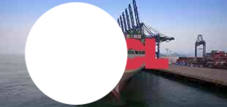
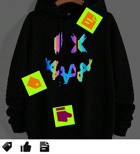

import Tabs from '@theme/Tabs';
import TabItem from '@theme/TabItem';
import ParamItem from '@theme/ParamItem';
import MethodItem from '@theme/MethodItem';
import MethodDescription from '@theme/MethodDescription'
import PriceBlock from '../../../../../src/theme/PriceBlock';
import PriceBlockWrap from '@theme/PriceBlockWrap';
import TaskImageWrapper from '@theme/TaskImageWrapper';
import TaskImageBlock from '@theme/TaskImageBlock';
import TaskImage from '@theme/TaskImage';
import { TaskImageText } from '../../../../../src/theme/TaskImageText';
import BlogLink from '@theme/BlogLink';


# ComplexImageTask Recognition

<TaskImageWrapper>
  <TaskImageBlock link="/pt-br/docs/captchas/ComplexImageTask-Recognition#oocl_rotate_new">
    <TaskImage>
      
    </TaskImage>
    <TaskImageText title="Oocl_rotate_new" name="complex-rec_oocl_rotate_new" />
  </TaskImageBlock>
  <TaskImageBlock link="/pt-br/docs/captchas/ComplexImageTask-Recognition#oocl_rotate_double_new">
    <TaskImage>
      
    </TaskImage>
    <TaskImageText title="Oocl_rotate_double_new" name="complex-rec_oocl_rotate_double_new" />
  </TaskImageBlock>
  <TaskImageBlock link="/pt-br/docs/captchas/ComplexImageTask-Recognition#betpunch_3x3_rotate">
    <TaskImage>
      
    </TaskImage>
    <TaskImageText title="Betpunch_3x3_rotate request" name="complex-rec_betpunch_3x3_rotate request" />
  </TaskImageBlock>
  <TaskImageBlock link="/pt-br/docs/captchas/ComplexImageTask-Recognition#bls">
    <TaskImage>
      
    </TaskImage>
    <TaskImageText title="Bls" name="bls" />
  </TaskImageBlock>
  <TaskImageBlock link="/docs/captchas/ComplexImageTask-Recognition#shein">
    <TaskImage>
      
    </TaskImage>
    <TaskImageText title="shein" name="complex-rec_oocl_rotate_new" />
  </TaskImageBlock>
</TaskImageWrapper>

## Parâmetros de solicitação
<TabItem value="proxyless" label="ComplexImageTask (sem proxy)" default className="bordered-panel">
    <ParamItem title="type" required type="string" />
    **ComplexImageTask**

    ---

    <ParamItem title="class" required type="string" />
    **recognition**

    ---

    <ParamItem title="imagesBase64" required type="array" />
    Array de imagens codificadas em base64.
    Exemplo: [ “/9j/4AAQSkZJRgABAQEAAAAAAAD…”]

    ---

    <ParamItem title="metadata.Task" required type="string" />
    Valores possíveis: `oocl_rotate_new` e outros <br />
    Nome da tarefa (<u>em inglês</u>).

  </TabItem>

## oocl_rotate_new
### Criar tarefa `oocl_rotate_new`

<PriceBlockWrap>
  <PriceBlock title="ComplexImageTask" name="complex-rec_oocl_rotate_new"/>
</PriceBlockWrap>

Na solicitação, passamos duas imagens: fundo e círculo.

<TabItem value="proxyless" label="RecaptchaV2TaskProxyless (sem proxy)" default className="method-panel">
<MethodItem>
  ```http
  https://api.capmonster.cloud/createTask
  ```
</MethodItem>
<MethodDescription>
**Solicitação**
```json
{
    "clientKey": "API_KEY",
    "task": {
        "type": "ComplexImageTask",
        "class": "recognition",
        "imagesBase64": [
			"{background_base64}",
			"{circle_base64}"
		],
        "metadata": {
            "Task": "oocl_rotate_new"
        }
    }
}
```

Exemplo de fundo (*background_base64*):


Exemplo de círculo (*circle_base64*):


**Resposta**
```json
{
  "errorId":0,
  "taskId":407533072
}
```

</MethodDescription>
</TabItem>


### Obter resultado da tarefa `oocl_rotate_new`

<TabItem value="proxyless" label="GeeTestTaskProxyless (sem proxy)" default className="method-panel-full">
    <MethodItem>
```http
https://api.capmonster.cloud/getTaskResult
```
    </MethodItem>
    <MethodDescription>
		**Solicitação**
		```json
		{
		  "clientKey":"API_KEY",
		  "taskId": 407533072
		}
		```
		**Resposta**
		Graus pelos quais o círculo deve ser girado no sentido horário.
		```json
		{
		  "errorId":0,
		  "status":"ready",
		  "errorCode":null,
		  "errorDescription":null,
		  "solution": 
		  {
			  "answer":[130.90909],
			  "metadata":{"AnswerType":"NumericArray"}
		  }		   
		}
		```
  </MethodDescription>
  </TabItem>

## oocl_rotate_double_new
### Criar tarefa `oocl_rotate_double_new`

<PriceBlockWrap>
  <PriceBlock title="ComplexImageTask" name="complex-rec_oocl_rotate_double_new"/>
</PriceBlockWrap>

Na solicitação, passamos três imagens: fundo, anel, círculo.
<TabItem value="proxyless" label="ComplexImageTask (sem proxy)" default className="method-panel">
<MethodItem>
  ```http
  https://api.capmonster.cloud/createTask
  ```
</MethodItem>
<MethodDescription>
**Solicitação**
```json
{ 
    "clientKey": "API_KEY",
    "task": {
        "type": "ComplexImageTask",
        "class": "recognition",
        "imagesBase64": [
			"{background_base64}",
			"{ring_base64}",
			"{circle_base64}"
		],
        "metadata": {
            "Task": "oocl_rotate_double_new"
        }
    }
}
```

Fundo (*background_base64*):



Anel (*ring_base64*):


Círculo (*circle_base64*):


**Resposta**
```json
{
  "errorId":0,
  "taskId":407533072
}
```

</MethodDescription>
</TabItem>


### Obter resultado da tarefa `oocl_rotate_double_new`

<TabItem value="proxyless" label="ComplexImageTask (sem proxy)" default className="method-panel-full">
    <MethodItem>
```http
https://api.capmonster.cloud/getTaskResult
```
    </MethodItem>
    <MethodDescription>
		**Solicitação**
		```json
		{
		  "clientKey":"API_KEY",
		  "taskId": 407533072
		}
		```
		**Resposta**
		Graus pelos quais o anel deve ser girado no sentido anti-horário e o círculo no sentido horário.
		```json
		{
		  "errorId":0,
		  "status":"ready",
		  "errorCode":null,
		  "errorDescription":null,
		  "solution": 
		  {
			  "answer":[130.90909],
			  "metadata":{"AnswerType":"NumericArray"}
		  }		   
		}
		```
  </MethodDescription>
  </TabItem>

## betpunch_3x3_rotate
### Criar tarefa `betpunch_3x3_rotate`

<PriceBlockWrap>
  <PriceBlock title="ComplexImageTask" name="complex-rec_betpunch_3x3_rotate request"/>
</PriceBlockWrap>

Na solicitação, passamos nove imagens. As imagens devem ser passadas na seguinte ordem:


<TabItem value="proxyless" label="ComplexImageTask (sem proxy)" default className="method-panel">
<MethodItem>
  ```http
  https://api.capmonster.cloud/createTask
  ```
</MethodItem>
<MethodDescription>
**Solicitação**
```json
{ 
    "clientKey": "API_KEY",
    "task": {
        "type": "ComplexImageTask",
        "class": "recognition",
        "imagesBase64": [
			"{image_1_Base64}",
			"{image_2_Base64}",
			"{image_3_Base64}",
			"{image_4_Base64}",
			"{image_5_Base64}",
			"{image_6_Base64}",
			"{image_7_Base64}",
			"{image_8_Base64}",
			"{image_9_Base64}",
		],
        "metadata": {
            "Task": "betpunch_3x3_rotate"
        }
    }
}
```

**Resposta**
```json
{
  "errorId":0,
  "taskId":407533072
}
```

</MethodDescription>
</TabItem>


### Obter resultado da tarefa `betpunch_3x3_rotate`

<TabItem value="proxyless" label="ComplexImageTask (sem proxy)" default className="method-panel-full">
    <MethodItem>
```http
https://api.capmonster.cloud/getTaskResult
```
    </MethodItem>
    <MethodDescription>
		**Solicitação**
		```json
		{
		  "clientKey":"API_KEY",
		  "taskId": 407533072
		}
		```
		**Resposta**
		"answer":[X,X,X,X,X,X,X,X,X], onde X é um valor inteiro de 1 a 4 para cada imagem. 4 - significa que a imagem não precisa ser girada; 1-3 - o número de rotações no sentido anti-horário da imagem.
		```json
		{
			"errorId":0,
			"status":"ready",
			"errorCode":null,
			"errorDescription":null,
			"solution":
			{
				"answer":[4,4,4,4,4,3,1,2,2],
				"metadata":{"AnswerType":"NumericArray"}
			}
		}
		```
  </MethodDescription>
  </TabItem>
  
## bls
### Criar tarefa `bls`

<PriceBlockWrap>
  <PriceBlock title="Bls" name="bls"/>
</PriceBlockWrap>

Na solicitação, enviamos 9 imagens no formato base64.
Também passamos o valor buscado TaskArgument nos metadados.

<BlogLink url="https://capmonster.cloud/pt-BR/blog/news/bls-solve-extension"/>

<TabItem value="proxyless" label="ComplexImageTask (without proxy)" default className="method-panel">
	<MethodItem>
		```http
		https://api.capmonster.cloud/createTask
		```
	</MethodItem>
	<MethodDescription>
		**Solicitação**
		```json
		{
			"clientKey":{{API_key}},
			"task": 
			{
				"type": "ComplexImageTask",
				"class": "recognition",
				"imagesBase64": [
					"image1_to_base64",
					"image2_to_base64",
					"image3_to_base64",
					"image4_to_base64",
					"image5_to_base64",
					"image6_to_base64",
					"image7_to_base64",
					"image8_to_base64",
					"image9_to_base64"
				],
				"metadata": {
					"Task": "bls_3x3",
					"TaskArgument": "123"
				}
			}
		}
		```

		Exemplo de tarefa:

		

		Enviar imagens convertidas para base64:
		
		
		
		
		
		
		
		
		
		
		
		Para este exemplo: "TaskArgument": "546"

		**Resposta**
		```json
		{
		  "errorId":0,
		  "taskId":143998457
		}
		```
	</MethodDescription>
</TabItem>

### Obter resultado da tarefa `bls`
<TabItem value="proxyless" label="ComplexImageTask (without proxy)" default className="method-panel-full">
	<MethodItem>
		```http
		https://api.capmonster.cloud/getTaskResult
		```
	</MethodItem>
	<MethodDescription>
		**Solicitação**
		```json
		{
		  "clientKey":"API_KEY",
		  "taskId": 143998457
		}
		```
		**Resposta**
		Um array de valores com elementos true ou false, dependendo se o número na imagem é o argumento buscado ou não. 
		```json
		{
		  "errorId":0,
		  "status":"ready",
		  "errorCode":null,
		  "errorDescription":null,
		  "solution": 
		  {
			"answer":[true,true,false,false,true,false,false,true,true],
			"metadata":{"AnswerType":"Grid"}
		  }
		}
		```
	</MethodDescription>
</TabItem>

## shein
### Criar tarefa `shein`

<PriceBlockWrap>
  <PriceBlock title="shein" name="complex-rec_oocl_rotate_new"/>
</PriceBlockWrap>

Na solicitação, passamos uma imagem no formato base64.

<TabItem value="proxyless" label="ComplexImageTask (without proxy)" default className="method-panel">
	<MethodItem>
		```http
		https://api.capmonster.cloud/createTask
		```
	</MethodItem>
	<MethodDescription>
		**Solicitação**
		```json
{
		    "clientKey": "API_KEY",
		    "task": {
			"type": "ComplexImageTask",
			"class": "recognition",
			"imagesBase64": [
			   "base64"
			],
			"metadata": {
			    "Task": "shein"
		        }
	        }
}
		```

		Exemplo de tarefa:

		
		

		**Resposta**
		```json
		{
		  "errorId":0,
		  "taskId":143998457
		}
		```
	</MethodDescription>
</TabItem>

### Obter resultado da tarefa `shein`
<TabItem value="proxyless" label="ComplexImageTask (without proxy)" default className="method-panel-full">
	<MethodItem>
		```http
		https://api.capmonster.cloud/getTaskResult
		```
	</MethodItem>
	<MethodDescription>
		**Solicitação**
		```json
		{
		  "clientKey":"API_KEY",
		  "taskId": 143998457
		}
		```
		**Resposta**
		Coordenadas a serem clicadas em uma ordem específica.  
		```json
{
    "solution":
	{
	    "answer":[{"X":68.99999964,"Y":201.954889},{"X":127.99999783999999,"Y":281.54887104},{"X":181.00000776,"Y":49.894734680000006}],
		"metadata":{"AnswerType":"Coordinate"}
	},
		"cost":0.0003,
		"status":"ready",
		"errorId":0,
		"errorCode":null,
		"errorDescription":null
}
		```
	</MethodDescription>
</TabItem>

## Usar biblioteca SDK
	<Tabs className="full-width-tabs filled-tabs request-tabs" groupId="captcha-type">
		<TabItem value="js" label="JavaScript" default className="method-panel">
			```js
			// https://github.com/ZennoLab/capmonstercloud-client-js

			import { CapMonsterCloudClientFactory, ClientOptions, ComplexImageTaskRecognitionRequest } from '@zennolab_com/capmonstercloud-client';

			document.addEventListener('DOMContentLoaded', async () => {
				const cmcClient = CapMonsterCloudClientFactory.Create(new ClientOptions({ clientKey: '<your capmonster.cloud API key>' }));
				console.log(await cmcClient.getBalance());
				
				const citRecognitionRequest = new ComplexImageTaskRecognitionRequest({
					imagesBase64: ['/9xwee/'],
					metaData: { Task: 'oocl_rotate' },
				});

				console.log(await cmcClient.Solve(citRecognitionRequest));
			});
			```
		</TabItem>
		
		<TabItem value="csharp" label="C#" className="method-panel">
			```csharp
			// https://github.com/ZennoLab/capmonstercloud-client-dotnet

			using Zennolab.CapMonsterCloud.Requests;
			using Zennolab.CapMonsterCloud;

			class Program
			{
				static async Task MainComplexImageTaskRecognition(string[] args)
				{
					var clientOptions = new ClientOptions
					{
						ClientKey = "your_api_key" // Replace with your CapMonster Cloud API key
					};

					var cmCloudClient = CapMonsterCloudClientFactory.Create(clientOptions);

					var recognitionCITRequest = new RecognitionComplexImageTaskRequest
					{
						ImagesBase64 = new List<string>
						{
							"/9j/4AAQSkZJRgABAQEAAAAAAAD…"
						},
						Metadata = new RecognitionComplexImageTaskRequest.RecognitionMetadata
						{
							Task = "oocl_rotate_new"
						}
					};

					var recognitionCITResult = await cmCloudClient.SolveAsync(recognitionCITRequest);

					if(recognitionCITResult.Solution.Answer.IsGrid)
						Console.WriteLine("Captcha Solution: " + recognitionCITResult.Solution.Answer.GridAnswer);
					else if (recognitionCITResult.Solution.Answer.IsNumeric)
						Console.WriteLine("Captcha Solution: " + recognitionCITResult.Solution.Answer.NumericAnswer);
				}
			}
			```
		</TabItem>
	</Tabs>