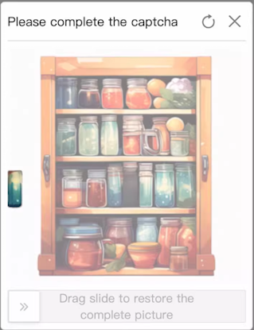

import Tabs from '@theme/Tabs';
import TabItem from '@theme/TabItem';
import ParamItem from '@theme/ParamItem';
import MethodItem from '@theme/MethodItem';
import ImageWrap from '@theme/ImageWrap';
import ImagesLayout from '@theme/ImagesLayout';
import MethodDescription from '@theme/MethodDescription'
import PriceBlock from '@theme/PriceBlock';
import PriceBlockWrap from '@theme/PriceBlockWrap';
import { ArticleHead } from '../../../../../src/theme/ArticleHead';

<ArticleHead slug="captchas/alibaba-task" />

# Alibaba Cloud Captcha

<PriceBlockWrap>
  <PriceBlock title="Alibaba Captcha" captchaId="alibabacaptcha"/>
</PriceBlockWrap>

## Exemplos de tarefas

A seguir estão exemplos de tipos de tarefas do Alibaba CAPTCHA que atualmente são suportados pelo serviço CapMonster Cloud:

<ImagesLayout gap="16px" columns={3}>
  <ImageWrap title="Puzzle CAPTCHA"></ImageWrap>
  <ImageWrap title="Image restoration CAPTCHA"></ImageWrap>
</ImagesLayout>

:::warning **Atenção!**
O CapMonster Cloud, por padrão, funciona com proxies integrados — já incluídos no custo do serviço. É necessário especificar seus próprios proxies apenas nos casos em que o site não aceita o token ou quando o acesso aos serviços integrados está restrito.

Se o proxy utiliza autenticação por IP, é necessário adicionar o endereço **65.21.190.34** à lista de permissões (whitelist).
:::

## Parâmetros da requisição

<TabItem value="proxy" label="CustomTask (ao usar proxy)" className="bordered-panel">

  <ParamItem title="type" required type="string" />
  **CustomTask**

  ---

  <ParamItem title="class" required type="string" />
  **alibaba**

   --- 

  <ParamItem title="websiteURL" required type="string" />
  URL completo da página com o CAPTCHA.

  ---

  <ParamItem title="sceneId (dentro de metadata)" required type="string" />

  Identificador do cenário do CAPTCHA, enviado no seguinte formato: `"sceneId":"1ww7426c4"` (veja [a seção correspondente](#sceneid) para saber como encontrar este valor)

  ---
  <ParamItem title="prefix (dentro de metadata)" required type="string" />

  Parâmetro de inicialização do CAPTCHA, enviado na URL da requisição usada para carregar o texto da tarefa na página.<br />
  Por exemplo, se a URL for: `https://dlw3kug.captcha-open.example.aliyuncs.com/`, então o valor do parâmetro `prefix` corresponde ao subdomínio — `dlw3kug`.

  ---
  <ParamItem title="userAgent" type="string" />
  
  User-Agent do navegador. <br />
  **Utilize apenas um User-Agent atual do Windows. O recomendado é:** `userAgentPlaceholder`

  ---

  <ParamItem title="proxyType" type="string" />
  **http** - proxy padrão http/https;<br />
  **https** - tente essa opção se "http" não funcionar (necessário para alguns proxies personalizados);<br />
  **socks4** - proxy socks4;<br />
  **socks5** - proxy socks5.

  ---

  <ParamItem title="proxyAddress" type="string" />
  <p>
    Endereço IP do proxy IPv4/IPv6. Não é permitido:
    - uso de proxies transparentes (aqueles que revelam o IP do cliente);
    - uso de proxies locais.
  </p>

  ---

  <ParamItem title="proxyPort" type="integer" />
  Porta do proxy.

  ---

  <ParamItem title="proxyLogin" type="string" />
  Login do proxy.

  ---

  <ParamItem title="proxyPassword" type="string" />
  Senha do proxy.

  ---

</TabItem>

## Método de criação da tarefa

<Tabs className="full-width-tabs filled-tabs request-tabs" groupId="captcha-type">
  <TabItem value="proxyless" label="CustomTask (sem proxy)" default className="method-panel">
    <MethodItem>
    ```http
    https://api.capmonster.cloud/createTask
    ```
    </MethodItem>
    <MethodDescription>
      
      **Requisição**
      ```json
      {
        "clientKey": "API_KEY",
        "task": {
          "type": "CustomTask",
          "class": "alibaba",
          "websiteURL": "https://www.example.com",
          "userAgent": "userAgentPlaceholder"
          "metadata": {
			"sceneId":"1ww7426c4",
			"prefix":"dlw3kug"
		}
	}
      ```

      **Resposta**
      ```json
      {
        "errorId": 0,
        "taskId": 407533077
      }
      ```
    </MethodDescription>
  </TabItem>

    <TabItem value="proxy" label="CustomTask (com proxy)" className="method-panel">
    <MethodItem>
      ```http
      https://api.capmonster.cloud/createTask
      ```
    </MethodItem>
    <MethodDescription>
      
      **Requisição**
      ```json
      {
        "clientKey": "API_KEY",
        "task": {
          "type": "CustomTask",
          "class": "alibaba",
          "websiteURL": "https://www.example.com",
          "userAgent": "userAgentPlaceholder"
          "metadata": {
			"sceneId":"1ww7426c4",
			"prefix":"dlw3kug",
          "proxyType": "http",
          "proxyAddress": "8.8.8.8",
          "proxyPort": 8080,
          "proxyLogin": "proxyLoginHere",
          "proxyPassword": "proxyPasswordHere"
        }
      }
      ```

      **Resposta**
      ```json
      {
        "errorId": 0,
        "taskId": 407533077
      }
      ```
    </MethodDescription>
  </TabItem>
</Tabs>

## Método de obter resultado da tarefa

Use o método [getTaskResult](../api/methods/get-task-result.mdx) para obter a solução do CAPTCHA Alibaba.

<TabItem value="proxyless" label="CustomTask (sem proxy)" default className="method-panel-full">
  <MethodItem>
    ```http
    https://api.capmonster.cloud/getTaskResult
    ```
  </MethodItem>
  <MethodDescription>

  **Requisição**
  ```json
  {
    "clientKey": "API_KEY",
    "taskId": 407533077
  }
```

**Resposta**

```json
{
  "errorId": 0,
  "errorCode": null,
  "errorDescription": null,
  "status": "ready",
  "solution": {
    "data": {
      "tokens": "{\"sceneId\":\"1ww7426c4\",\"certifyId\":\"kBjCxX2W2c\",\"deviceToken\":\"U0dfV0VCIzM3...wOGJkMjY=\",\"data\":\"JRMnX3B...EUQdCpLkqSj7THYNf3dn\"}"
    }
  }
}
```

  </MethodDescription>
</TabItem>

## Como encontrar todos os parâmetros necessários para criar uma tarefa

## `sceneId`

O `sceneId` pode ser obtido após resolver o CAPTCHA com sucesso uma vez:

1. Resolva o CAPTCHA manualmente no site.
2. Abra o **DevTools** → aba **Network**.
3. Encontre a requisição enviada após a verificação bem-sucedida (por exemplo: verify, check, validate).
4. No **Payload** ou na **Response**, localize o parâmetro `sceneId`.


Este parâmetro também pode ser encontrado usando a busca nas requisições de rede:

1. Abra a página com o CAPTCHA e vá para **DevTools** → aba **Network**.
3. Use a busca (Ctrl + F) com a palavra-chave `sceneId` ou `CaptchaSceneId`.


## `prefix`

O `prefix` pode ser obtido a partir da URL da requisição usada no site para carregar o texto da tarefa do CAPTCHA:

1. Abra a página com o CAPTCHA.
2. Encontre a requisição relacionada ao carregamento da tarefa (geralmente via **DevTools** → **Network**).

