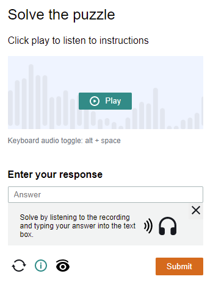

import Tabs from '@theme/Tabs';
import TabItem from '@theme/TabItem';
import ParamItem from '@theme/ParamItem';
import MethodItem from '@theme/MethodItem';
import MethodDescription from '@theme/MethodDescription'
import PriceBlock from '../../../../../src/theme/PriceBlock';
import PriceBlockWrap from '@theme/PriceBlockWrap';
import BlogLink from '@theme/BlogLink';

# AmazonTask | AWS WAF Captcha e Challenge

<PriceBlockWrap>
  <PriceBlock title="AmazonTask" captchaId="amazonwaf"/>
</PriceBlockWrap>

Resolvendo CAPTCHA e Challenge no AWS WAF

<BlogLink url="https://capmonster.cloud/pt-BR/blog/scraping/amazon-captcha-web-scraping"/>

:::warning **Atenção!**
Esta tarefa será executada usando nossos servidores proxy.
:::

### <span style={{fontSize: '1.5rem'}}>Possíveis variantes de captcha</span>




## Parâmetros da solicitação
## Opção 1
<TabItem value='proxyless' label='AmazonTaskProxyless (sem proxy)' default className='bordered-panel'>
    <ParamItem title='type' required type='string' />
    **AmazonTaskProxyless**

    --- 

    <ParamItem title='websiteURL' required type='string' />
    O endereço da página principal em que o captcha é resolvido.

    ---
	
	<ParamItem title='websiteKey' required type='string' />
    Pode ser encontrado no campo `apiKey` ao renderizar o captcha

    ---

    <ParamItem title='captchaScript' required type='string' />
    Link para jsapi.js na página html, com o formato \<Integration URL\>/jsapi.js

    ---

    <ParamItem title='cookieSolution' type='boolean' />
    Padrão **false**. Se você precisar de um cookie “aws-waf-token”, especifique um valor de **true**. Caso contrário, você receberá “captcha_voucher” e “existing_token” como resposta.

</TabItem>

## Opção 2
<TabItem value="proxyless" label="AmazonTaskProxyless (sem proxy)" default className="bordered-panel">
<ParamItem title="type" required type="string" />
**AmazonTaskProxyless**

---

<ParamItem title="websiteURL" required type="string" />
O endereço da página principal onde o captcha é resolvido.

---

<ParamItem title="challengeScript" required type="string" />
Link para o challenge.js (veja a descrição abaixo)

---

    <ParamItem title="captchaScript" type="string" />
    Link para captcha.js (talvez esteja faltando se você tiver apenas um challenge)

---

<ParamItem title="websiteKey" required type="string" />
Uma string que pode ser obtida de uma página HTML com captcha ou com JavaScript executando `window.gokuProps.key`

---

<ParamItem title="context" required type="string" />
Uma string que pode ser obtida de uma página HTML com captcha ou com JavaScript executando `window.gokuProps.context`

---

<ParamItem title="iv" required type="string" />
Uma string que pode ser obtida de uma página HTML com captcha ou com JavaScript executando `window.gokuProps.iv`

---

<ParamItem title="cookieSolution" type="boolean" />
Por padrão **false**. Se você precisar usar cookies "aws-waf-token", especifique o valor **true**. Caso contrário, você receberá em troca "captcha_voucher" e "existing_token".

</TabItem>

### Como obter os parâmetros websiteKey, context, iv e challengeScript
Ao acessar um site, você recebe uma resposta 405 e uma página HTML com um captcha. É dessa página que você pode obter todos os parâmetros:
 


## Métodos de criação de tarefas
## Opção 1
<TabItem value="proxyless" label="AmazonTaskProxyless (sem proxy)" default className="method-panel">
<MethodItem>
  ```http
  https://api.capmonster.cloud/createTask
  ```
</MethodItem>
<MethodDescription>
**Solicitação**
```json
{
			"clientKey": "API_KEY",
			"task": {
				"type": "AmazonTaskProxyless",
				"websiteURL": "https://example.com/index.html",
				"websiteKey": "h15hX7brbaRTR...Za1_1",
				"userAgent": "Mozilla/5.0 (Windows NT 10.0; Win64; x64) AppleWebKit/537.36 (KHTML, like Gecko) Chrome/134.0.0.0 Safari/537.36",
				"captchaScript": "https://234324vgvc23.yejk.captcha-sdk.awswaf.com/234324vgvc23/jsapi.js",
				"cookieSolution": true
			}
		}
		```
		**Resposta**
		```json
		{
		  "errorId":0,
		  "taskId":407533072
		}
		```
	</MethodDescription>
</TabItem>

## Opção 2
<TabItem value="proxyless" label="AmazonTaskProxyless (sem proxy)" default className="method-panel">
	<MethodItem>
		```http
		https://api.capmonster.cloud/createTask
		```
	</MethodItem>
	<MethodDescription>
		**Solicitação**
		```json
		{
			"clientKey": "API_KEY",
			"task": {
				"type": "AmazonTaskProxyless",
				"websiteURL": "https://example.com",
				"challengeScript": "https://41bcdd4fb3cb.610cd090.us-east-1.token.awswaf.com/41bcdd4fb3cb/0d21de737ccb/cd77baa6c832/challenge.js",
				"captchaScript": "https://41bcdd4fb3cb.610cd090.us-east-1.captcha.awswaf.com/41bcdd4fb3cb/0d21de737ccb/cd77baa6c832/captcha.js",
				"websiteKey": "AQIDA...wZwdADFLWk7XOA==",
				"context": "qoJYgnKsc...aormh/dYYK+Y=",
				"iv": "CgAAXFFFFSAAABVk",
				"cookieSolution": true
			}
		}
		```
		**Resposta**
		```json
		{
		  "errorId":0,
		  "taskId":407533072
		}
		```
	</MethodDescription>
</TabItem>

## Obter o resultado da tarefa
Use o método [getTaskResult](../api/methods/get-task-result.md) para obter a solução do AmazonTask.

<TabItem value="proxyless" label="GeeTestTaskProxyless (sem proxy)" default className="method-panel-full">
<MethodItem>
```http
https://api.capmonster.cloud/getTaskResult
```
</MethodItem>
<MethodDescription>
**Solicitação**
```json
{
  "clientKey":"API_KEY",
  "taskId": 407533072
}
```
**Resposta**
```json
{
    "errorId":0,
    "status":"ready",
    "solution": {
        "cookies": {
            "aws-waf-token": "10115f5b-ebd8-45c7-851e-cfd4f6a82e3e:EAoAua1QezAhAAAA:dp7sp2rXIRcnJcmpWOC1vIu+yq/A3EbR6b6K7c67P49usNF1f1bt/Af5pNcZ7TKZlW+jIZ7QfNs8zjjqiu8C9XQq50Pmv2DxUlyFtfPZkGwk0d27Ocznk18/IOOa49Rydx+/XkGA7xoGLNaUelzNX34PlyXjoOtL0rzYBxMAQy0D1tn+Q5u97kJBjs5Mytqu9tXPIPCTSn4dfXv5llSkv9pxBEnnhwz6HEdmdJMdfur+YRW1MgCX7i3L2Y0/CNL8kd8CEhTMzwyoXekrzBM="
        },
        "userAgent": "userAgentPlaceholder"
    }
}
```
</MethodDescription>
</TabItem>


## Usar biblioteca SDK

<Tabs className="full-width-tabs filled-tabs request-tabs" groupId="captcha-type">
	<TabItem value="js" label="JavaScript" default className="method-panel">
		```js
		// https://github.com/ZennoLab/capmonstercloud-client-js

		import { CapMonsterCloudClientFactory, ClientOptions, AmazonProxylessRequest } from '@zennolab_com/capmonstercloud-client';

		document.addEventListener('DOMContentLoaded', async () => {
			const cmcClient = CapMonsterCloudClientFactory.Create(new ClientOptions({ clientKey: '<your capmonster.cloud API key>' }));
			console.log(await cmcClient.getBalance());

			const amazonRequest = new AmazonProxylessRequest({
				websiteURL: 'https://example.com',
				websiteKey: 'websiteKey',
				challengeScript: 'https://41bcdd4fb3cb.610cd090.us-east-1.token.awswaf.com/41bcdd4fb3cb/0d21de737ccb/cd77baa6c832/challenge.js',
				captchaScript: 'https://41bcdd4fb3cb.610cd090.us-east-1.captcha.awswaf.com/41bcdd4fb3cb/0d21de737ccb/cd77baa6c832/captcha.js',
				context: 'qoJYgnKsc...aormh/dYYK+Y=',
				iv: 'CgAAXFFFFSAAABVk',
			});

			console.log(await cmcClient.Solve(amazonRequest));
		});
		```
	</TabItem>

  <TabItem value="python" label="Python" default className="method-panel">
    ```python
    # https://github.com/ZennoLab/capmonstercloud-client-python

    import asyncio
    from capmonstercloudclient import CapMonsterClient, ClientOptions
    from capmonstercloudclient.requests import AmazonWafProxylessRequest

    client_options = ClientOptions(api_key="your_api_key")  # Replace with your CapMonster Cloud API key
    cap_monster_client = CapMonsterClient(options=client_options)

    amazon_waf_request = AmazonWafProxylessRequest(
        websiteUrl="https://example.com",  # URL с CAPTCHA
        challengeScript="https://example.com/path/to/challenge.js",
        captchaScript="https://example.com/path/to/captcha.js",
        websiteKey="your_website_key",
        context="your_context_value",
        iv="your_iv_value",
        cookieSolution=False
    )

    async def solve_captcha():
        return await cap_monster_client.solve_captcha(amazon_waf_request)

    responses = asyncio.run(solve_captcha())
    print(responses)
    ```
  </TabItem>

  <TabItem value="csharp" label="C#" className="method-panel">
    ```csharp
    // https://github.com/ZennoLab/capmonstercloud-client-dotnet

    using Zennolab.CapMonsterCloud.Requests;
    using Zennolab.CapMonsterCloud;

    class Program
    {
        static async Task Main(string[] args)
        {
            var clientOptions = new ClientOptions
            {
                ClientKey = "your_api_key" // Replace with your CapMonster Cloud API key
            };

            var cmCloudClient = CapMonsterCloudClientFactory.Create(clientOptions);

            var amazonWafRequest = new AmazonWafProxylessRequest
            {
                WebsiteUrl = "https://example.com", // URL with the captcha
                ChallengeScript = "URL_of_challenge.js",
                CaptchaScript = "URL_of_captcha.js",
                WebsiteKey = "website_key",
                Context = "context_value",
                Iv = "iv_value",
                CookieSolution = false
            };

            var solveResult = await cmCloudClient.SolveAsync(amazonWafRequest);

            Console.WriteLine("ExistingToken: " + solveResult.Solution.ExistingToken); // Adjust based on your expected solution format
            Console.WriteLine("CaptchaVoucher: " + solveResult.Solution.CaptchaVoucher);
        }
    }
    ```
  </TabItem>
</Tabs>
