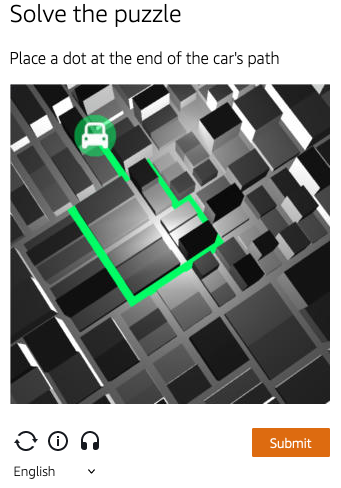
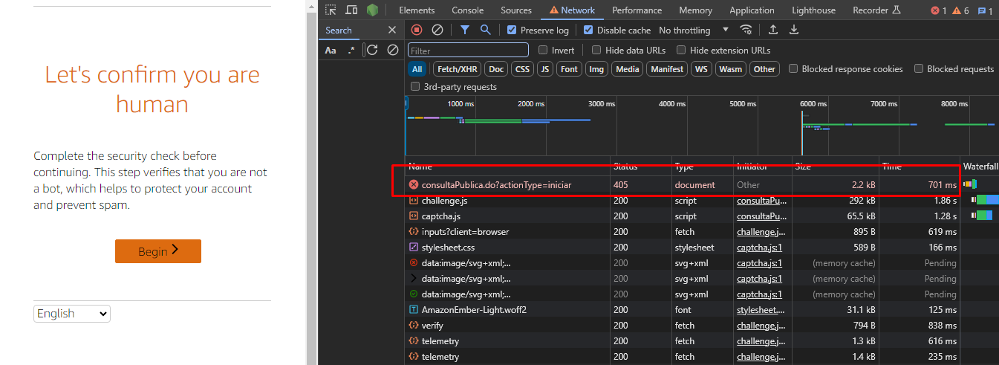
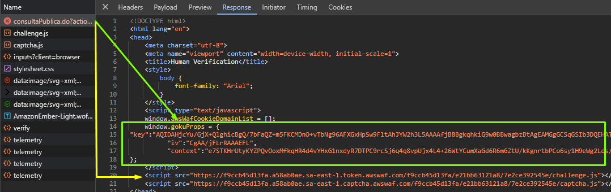

import Tabs from '@theme/Tabs';
import TabItem from '@theme/TabItem';
import ParamItem from '@theme/ParamItem';
import MethodItem from '@theme/MethodItem';
import MethodDescription from '@theme/MethodDescription'
import PriceBlock from '../../../../../src/theme/PriceBlock';
import PriceBlockWrap from '@theme/PriceBlockWrap';
import BlogLink from '@theme/BlogLink';

# AmazonTask | AWS WAF Captcha e Challenge

<PriceBlockWrap>
  <PriceBlock title="AmazonTask" captchaId="amazonwaf"/>
</PriceBlockWrap>

### <span style={{fontSize: '1.5rem'}}>Exemplos de tarefas</span>

<Tabs className="full-width-tabs">
  <TabItem value="waf1" label="Click" default>
    
  </TabItem>
  <TabItem value="waf2" label="Puzzle">
    
  </TabItem>
</Tabs>

Resolvendo CAPTCHA e Challenge no AWS WAF

<BlogLink url="https://capmonster.cloud/pt-BR/blog/scraping/amazon-captcha-web-scraping"/>

:::warning **Atenção!**
O CapMonster Cloud, por padrão, funciona com proxies integrados — já incluídos no custo do serviço. É necessário especificar seus próprios proxies apenas nos casos em que o site não aceita o token ou quando o acesso aos serviços integrados está restrito. Você pode entrar em contato com o [suporte técnico](https://helpdesk.zennolab.com/conversation/new) para esclarecer detalhes e verificar se os tokens estão sendo aceitos corretamente em um site específico.

Se o proxy utiliza autenticação por IP, é necessário adicionar o endereço **65.21.190.34** à lista de permissões (whitelist).
:::

## Parâmetros da solicitação
## Opção 1
<TabItem value="proxyless" label="AmazonTask (sem proxy)" default className="bordered-panel">
    <ParamItem title="type" required type="string" />
    **AmazonTask**

    --- 

    <ParamItem title="websiteURL" required type="string" />
    Endereço da página principal onde o captcha é resolvido.

    ---
	
    <ParamItem title="websiteKey" required type="string" />
    Pode ser encontrado no campo `apiKey` durante a renderização do captcha.

    ---

    <ParamItem title="captchaScript" required type="string" />
    Link para o jsapi.js na página HTML, tem a forma \<Integration URL\>/jsapi.js.

    ---

    <ParamItem title="cookieSolution" type="boolean" />
    O padrão é **false** — na resposta você receberá "captcha_voucher" e "existing_token".  
    Se precisar do cookie "aws-waf-token", defina como **true**.

    ---

    <ParamItem title="userAgent" type="string" />
    User-Agent do navegador. <br />
**Transmita apenas o UA atual do sistema operacional Windows. No momento, o válido é**: `userAgentPlaceholder`

    ---
    
  <ParamItem title="proxyType" type="string" />
  **http** - proxy http/https padrão;<br />
  **https** - use esta opção apenas se "http" não funcionar (necessário para alguns proxies customizados);<br />
  **socks4** - proxy socks4;<br />
  **socks5** - proxy socks5.

  ---

  <ParamItem title="proxyAddress" type="string" />
  <p>
    Endereço IPv4/IPv6 do proxy. Não é permitido:
    - uso de nomes de host;
    - proxies transparentes (onde o IP do cliente pode ser visto);
    - uso de proxies em máquinas locais.
  </p>

  ---

  <ParamItem title="proxyPort" type="integer" />
  Porta do proxy.

  ---

  <ParamItem title="proxyLogin" type="string" />
  Usuário do servidor proxy.

  ---

  <ParamItem title="proxyPassword" type="string" />
  Senha do servidor proxy.

  ---

</TabItem>

## Opção 2 
<TabItem value="proxyless" label="AmazonTaskProxyless (sem proxy)" default className="bordered-panel">
    <ParamItem title="type" required type="string" />
    **AmazonTask**

    --- 

    <ParamItem title="websiteURL" required type="string" />
    O endereço da página principal onde o captcha é resolvido.

    ---

    <ParamItem title="challengeScript" required type="string" />
    Link para o challenge.js (veja a descrição abaixo).

    ---

    <ParamItem title="websiteKey" required type="string" />
    Uma string que pode ser obtida a partir da página HTML do captcha ou via JavaScript: `window.gokuProps.key`.

    ---

    <ParamItem title="context" required type="string" />
    Uma string que pode ser obtida a partir da página HTML do captcha ou via JavaScript: `window.gokuProps.context`.

    ---

    <ParamItem title="iv" required type="string" />
    Uma string que pode ser obtida a partir da página HTML do captcha ou via JavaScript: `window.gokuProps.iv`.

    ---

    <ParamItem title="captchaScript" type="string" />
    Link para o captcha.js (pode estar ausente se houver apenas um challenge).

    ---

    <ParamItem title="cookieSolution" type="boolean" />
    O padrão é **false** — na resposta você receberá "captcha_voucher" e "existing_token".  
    Se precisar do cookie "aws-waf-token", defina como **true**.

    ---

  <ParamItem title="proxyType" type="string" />
  **http** - proxy http/https padrão;<br />
  **https** - use esta opção apenas se "http" não funcionar (necessário para alguns proxies customizados);<br />
  **socks4** - proxy socks4;<br />
  **socks5** - proxy socks5.

  ---

  <ParamItem title="proxyAddress" type="string" />
  <p>
    Endereço IPv4/IPv6 do proxy. Não é permitido:
    - uso de nomes de host;
    - proxies transparentes (onde o IP do cliente pode ser visto);
    - uso de proxies em máquinas locais.
  </p>

  ---

  <ParamItem title="proxyPort" type="integer" />
  Porta do proxy.

  ---

  <ParamItem title="proxyLogin" type="string" />
  Usuário do servidor proxy.

  ---

  <ParamItem title="proxyPassword" type="string" />
  Senha do servidor proxy.

---

</TabItem>

  ## Opção 3

Se o site usa um captcha invisível e somente `challenge.js` é carregado, use esta opção.  
Nesse caso, não é necessário enviar todos os parâmetros da opção 2 — eles podem ficar vazios. Envie apenas o valor de `challenge.js`.

<TabItem value="proxyless" label="AmazonTaskProxyless (sem proxy)" default className="bordered-panel">
    <ParamItem title="type" required type="string" />
    **AmazonTask**

    --- 

    <ParamItem title="websiteURL" required type="string" />
    Endereço da página principal onde o captcha é resolvido.

    ---

    <ParamItem title="challengeScript" required type="string" />
    Link para o challenge.js.

    ---

    <ParamItem title="captchaScript" required type="string" />
    Link para o captcha.js. Nesta opção, informe qualquer string.

    ---

    <ParamItem title="websiteKey" required type="string" />
    Informe qualquer string.

    ---

    <ParamItem title="context" required type="string" />
    Informe qualquer string.

    ---

    <ParamItem title="iv" required type="string" />
    Informe qualquer string.

    ---

    <ParamItem title="cookieSolution" type="boolean" />
    Defina como **true** para obter o "aws-waf token". 

    ---

  <ParamItem title="proxyType" type="string" />
  **http** - proxy http/https padrão;<br />
  **https** - use esta opção apenas se "http" não funcionar (necessário para alguns proxies customizados);<br />
  **socks4** - proxy socks4;<br />
  **socks5** - proxy socks5.

  ---

  <ParamItem title="proxyAddress" type="string" />
  <p>
    Endereço IPv4/IPv6 do proxy. Não é permitido:
    - uso de nomes de host;
    - proxies transparentes (onde o IP do cliente pode ser visto);
    - uso de proxies em máquinas locais.
  </p>

  ---

  <ParamItem title="proxyPort" type="integer" />
  Porta do proxy.

  ---

  <ParamItem title="proxyLogin" type="string" />
  Usuário do servidor proxy.

  ---

  <ParamItem title="proxyPassword" type="string" />
  Senha do servidor proxy.

---

</TabItem>


### Como obter os parâmetros `websiteKey`, `context`, `iv` e `challengeScript`
Ao navegar até o site, você recebe uma resposta **405** e uma página HTML com o captcha. É possível extrair todos os parâmetros dessa página:  
  
  


## Métodos de criação de tarefa
## Opção 1
<Tabs className="full-width-tabs filled-tabs request-tabs" groupId="captcha-type">
  <TabItem value="proxyless" label="AmazonTask (sem proxy)" default className="method-panel">
    <MethodItem>
      ```http
      https://api.capmonster.cloud/createTask
      ```
    </MethodItem>
    <MethodDescription>

    **Requisição**

    ```json
    {
      "clientKey": "API_KEY",
      "task": {
        "type": "AmazonTask",
        "websiteURL": "https://example.com/index.html",
        "websiteKey": "h15hX7brbaRTR...Za1_1",
        "userAgent": "userAgentPlaceholder",
        "captchaScript": "https://234324vgvc23.yejk.captcha-sdk.awswaf.com/234324vgvc23/jsapi.js",
        "cookieSolution": true
      }
    }
    ```

    **Resposta**

    ```json
    {
      "errorId": 0,
      "taskId": 407533072
    }
    ```

    </MethodDescription>
  </TabItem>

  <TabItem value="proxy" label="AmazonTask (com proxy)" className="method-panel">
    <MethodItem>
      ```http
      https://api.capmonster.cloud/createTask
      ```
    </MethodItem>
    <MethodDescription>

    **Requisição**

    ```json
    {
      "clientKey": "API_KEY",
      "task": {
        "type": "AmazonTask",
        "websiteURL": "https://example.com/index.html",
        "websiteKey": "h15hX7brbaRTR...Za1_1",
        "userAgent": "userAgentPlaceholder",
        "captchaScript": "https://234324vgvc23.yejk.captcha-sdk.awswaf.com/234324vgvc23/jsapi.js",
        "cookieSolution": true,
        "proxyType": "http",
        "proxyAddress": "8.8.8.8",
        "proxyPort": 8080,
        "proxyLogin": "proxyLoginHere",
        "proxyPassword": "proxyPasswordHere"
      }
    }
    ```

    **Resposta**

    ```json
    {
      "errorId": 0,
      "taskId": 407533072
    }
    ```

    </MethodDescription>
  </TabItem>
</Tabs>

## Opção 2
<Tabs className="full-width-tabs filled-tabs request-tabs" groupId="captcha-type">
  <TabItem value="proxyless" label="AmazonTask (sem proxy)" default className="method-panel">
    <MethodItem>
      ```http
      https://api.capmonster.cloud/createTask
      ```
    </MethodItem>
    <MethodDescription>

    **Requisição**

    ```json
    {
      "clientKey": "API_KEY",
      "task": {
        "type": "AmazonTask",
        "websiteURL": "https://example.com",
        "challengeScript": "https://41bcdd4fb3cb.610cd090.us-east-1.token.awswaf.com/41bcdd4fb3cb/0d21de737ccb/cd77baa6c832/challenge.js",
        "captchaScript": "https://41bcdd4fb3cb.610cd090.us-east-1.captcha.awswaf.com/41bcdd4fb3cb/0d21de737ccb/cd77baa6c832/captcha.js",
        "websiteKey": "AQIDA...wZwdADFLWk7XOA==",
        "context": "qoJYgnKsc...aormh/dYYK+Y=",
        "iv": "CgAAXFFFFSAAABVk",
        "cookieSolution": true
      }
    }
    ```

    **Resposta**

    ```json
    {
      "errorId": 0,
      "taskId": 407533072
    }
    ```

    </MethodDescription>
  </TabItem>

  <TabItem value="proxy" label="AmazonTask (com proxy)" className="method-panel">
    <MethodItem>
      ```http
      https://api.capmonster.cloud/createTask
      ```
    </MethodItem>
    <MethodDescription>

    **Requisição**

    ```json
    {
      "clientKey": "API_KEY",
      "task": {
        "type": "AmazonTask",
        "websiteURL": "https://example.com",
        "challengeScript": "https://41bcdd4fb3cb.610cd090.us-east-1.token.awswaf.com/41bcdd4fb3cb/0d21de737ccb/cd77baa6c832/challenge.js",
        "captchaScript": "https://41bcdd4fb3cb.610cd090.us-east-1.captcha.awswaf.com/41bcdd4fb3cb/0d21de737ccb/cd77baa6c832/captcha.js",
        "websiteKey": "AQIDA...wZwdADFLWk7XOA==",
        "context": "qoJYgnKsc...aormh/dYYK+Y=",
        "iv": "CgAAXFFFFSAAABVk",
        "cookieSolution": true,
        "proxyType": "http",
        "proxyAddress": "8.8.8.8",
        "proxyPort": 8080,
        "proxyLogin": "proxyLoginHere",
        "proxyPassword": "proxyPasswordHere"
      }
    }
    ```

    **Resposta**

    ```json
    {
      "errorId": 0,
      "taskId": 407533072
    }
    ```

    </MethodDescription>
  </TabItem>
</Tabs>

## Opção 3
<Tabs className="full-width-tabs filled-tabs request-tabs" groupId="captcha-type">
  <TabItem value="proxyless" label="AmazonTask (sem proxy)" default className="method-panel">
    <MethodItem>
      ```http
      https://api.capmonster.cloud/createTask
      ```
    </MethodItem>
    <MethodDescription>

    **Requisição**

    ```json
    {
      "clientKey": "API_KEY",
      "task": {
        "type": "AmazonTask",
        "websiteURL": "https://example.com",
        "challengeScript": "https://41bcdd4fb3cb.610cd090.us-east-1.token.awswaf.com/41bcdd4fb3cb/0d21de737ccb/cd77baa6c832/challenge.js",
        "captchaScript": "",
        "websiteKey": "",
        "context": "",
        "iv": "",
        "cookieSolution": true
      }
    }
    ```

    **Resposta**

    ```json
    {
      "errorId": 0,
      "taskId": 407533072
    }
    ```

    </MethodDescription>
  </TabItem>

  <TabItem value="proxy" label="AmazonTask (com proxy)" className="method-panel">
    <MethodItem>
      ```http
      https://api.capmonster.cloud/createTask
      ```
    </MethodItem>
    <MethodDescription>

    **Requisição**

    ```json
    {
      "clientKey": "API_KEY",
      "task": {
        "type": "AmazonTask",
        "websiteURL": "https://example.com",
        "challengeScript": "https://41bcdd4fb3cb.610cd090.us-east-1.token.awswaf.com/41bcdd4fb3cb/0d21de737ccb/cd77baa6c832/challenge.js",
        "captchaScript": "",
        "websiteKey": "",
        "context": "",
        "iv": "",
        "cookieSolution": true,
        "proxyType": "http",
        "proxyAddress": "8.8.8.8",
        "proxyPort": 8080,
        "proxyLogin": "proxyLoginHere",
        "proxyPassword": "proxyPasswordHere"
      }
    }
    ```

    **Resposta**

    ```json
    {
      "errorId": 0,
      "taskId": 407533072
    }
    ```

    </MethodDescription>
  </TabItem>
</Tabs>

## Obter o resultado da tarefa
Use o método [getTaskResult](../api/methods/get-task-result.md) para obter a solução do AmazonTask.

<TabItem value="proxyless" label="GeeTestTaskProxyless (sem proxy)" default className="method-panel-full">
<MethodItem>
```http
https://api.capmonster.cloud/getTaskResult
```
</MethodItem>
<MethodDescription>
**Solicitação**
```json
{
  "clientKey":"API_KEY",
  "taskId": 407533072
}
```
**Resposta**
```json
{
    "errorId":0,
    "status":"ready",
    "solution": {
        "cookies": {
            "aws-waf-token": "10115f5b-ebd8-45c7-851e-cfd4f6a82e3e:EAoAua1QezAhAAAA:dp7sp2rXIRcnJcmpWOC1vIu+yq/A3EbR6b6K7c67P49usNF1f1bt/Af5pNcZ7TKZlW+jIZ7QfNs8zjjqiu8C9XQq50Pmv2DxUlyFtfPZkGwk0d27Ocznk18/IOOa49Rydx+/XkGA7xoGLNaUelzNX34PlyXjoOtL0rzYBxMAQy0D1tn+Q5u97kJBjs5Mytqu9tXPIPCTSn4dfXv5llSkv9pxBEnnhwz6HEdmdJMdfur+YRW1MgCX7i3L2Y0/CNL8kd8CEhTMzwyoXekrzBM="
        },
        "userAgent": "userAgentPlaceholder"
    }
}
```
</MethodDescription>
</TabItem>

## Como encontrar todos os parâmetros necessários para a criação da tarefa

### Automaticamente

Uma forma conveniente de automatizar a busca por todos os parâmetros necessários.  
Alguns parâmetros são regenerados a cada carregamento da página, então você precisará extraí-los através de um navegador — seja normal ou headless (por exemplo, usando **Playwright**).  
Como os valores dos parâmetros dinâmicos são de curta duração, o captcha deve ser resolvido imediatamente após a captura deles.

:::warning **Importante!**  
Os trechos de código fornecidos são exemplos básicos para familiarização com a extração dos parâmetros necessários. A implementação exata dependerá da sua página de captcha, sua estrutura e dos elementos/seletores HTML que ela utiliza.  
:::

<Tabs className="full-width-tabs filled-tabs request-tabs">
  <TabItem value="js" label="JavaScript" default className="method-panel">
    <details>
      <summary>Mostrar código (Node.js)</summary>
      ```js
      import { chromium } from "playwright";

      const CAPTCHA_URL = "https://example.com";

      (async () => {
        const browser = await chromium.launch({ headless: false });
        const page = await browser.newPage();

        await page.goto(CAPTCHA_URL);

        const captchaParams = await page.evaluate(() => {
          const gokuProps = window.gokuProps || {};
          const scripts = Array.from(document.querySelectorAll("script"));

          return {
            websiteKey: gokuProps.key || "Não encontrado",
            context: gokuProps.context || "Não encontrado",
            iv: gokuProps.iv || "Não encontrado",
            challengeScriptUrl:
              scripts.find((script) => script.src.includes("challenge.js"))?.src ||
              "Não encontrado",
            captchaScriptUrl:
              scripts.find((script) => script.src.includes("captcha.js"))?.src ||
              "Não encontrado",
          };
        });

        console.log("Parâmetros do Captcha:", captchaParams);

        await browser.close();
      })();
      ```
    </details>
  </TabItem>

  <TabItem value="python" label="Python" className="method-panel">
  <details>
    <summary>Mostrar código</summary>
    ```python
    import asyncio
    from playwright.async_api import async_playwright

    CAPTCHA_URL = "https://example.com"

    async def main():
        async with async_playwright() as p:
            browser = await p.chromium.launch(headless=False)
            page = await browser.new_page()

            await page.goto(CAPTCHA_URL)

            captcha_params = await page.evaluate("""
                () => {
                    const gokuProps = window.gokuProps || {};
                    const scripts = Array.from(document.querySelectorAll('script'));

                    return {
                        websiteKey: gokuProps.key || "Não encontrado",
                        context: gokuProps.context || "Não encontrado",
                        iv: gokuProps.iv || "Não encontrado",
                        challengeScriptUrl: scripts.find(script => script.src.includes('challenge.js'))?.src || 
                            "Não encontrado",
                        captchaScriptUrl: scripts.find(script => script.src.includes('captcha.js'))?.src || 
                            "Não encontrado"
                    };
                }
            """)

            print("Parâmetros do Captcha:", captcha_params)

            await browser.close()

    asyncio.run(main())
    ```
  </details>
</TabItem>

  <TabItem value="csharp" label="C#" className="method-panel">
    <details>
      <summary>Mostrar código</summary>
      ```csharp
      using System;
      using System.Collections.Generic;
      using System.Threading.Tasks;
      using Microsoft.Playwright;

      class Program
      {
          public static async Task Main(string[] args)
          {
              const string CAPTCHA_URL = "https://example.com";

              using var playwright = await Playwright.CreateAsync();
              var browser = await playwright.Chromium.LaunchAsync(new BrowserTypeLaunchOptions
              {
                  Headless = false
              });

              var context = await browser.NewContextAsync();
              var page = await context.NewPageAsync();

              await page.GotoAsync(CAPTCHA_URL);

              var captchaParams = await page.EvaluateAsync<Dictionary<string, string>>(@"
                  (() => {
                      const gokuProps = window.gokuProps || {};
                      const scripts = Array.from(document.querySelectorAll('script'));
                      return {
                          websiteKey: gokuProps.key || 'Não encontrado',
                          context: gokuProps.context || 'Não encontrado',
                          iv: gokuProps.iv || 'Não encontrado',
                          challengeScriptUrl: scripts.find(script => script.src.includes('challenge.js'))?.src || 
                          'Não encontrado',
                          captchaScriptUrl: scripts.find(script => script.src.includes('captcha.js'))?.src || 
                          'Não encontrado'
                      };
                  })()
              ");

              Console.WriteLine("Parâmetros do Captcha:");
              foreach (var param in captchaParams)
              {
                  Console.WriteLine($"{param.Key}: {param.Value}");
              }

              await browser.CloseAsync();
          }
      }
      ```
    </details>
  </TabItem>
</Tabs>

## Usar biblioteca SDK

<Tabs className="full-width-tabs filled-tabs request-tabs" groupId="captcha-type">

  <TabItem value="js" label="JavaScript" default className="method-panel">

  ```js
  // https://github.com/ZennoLab/capmonstercloud-client-js

  import { CapMonsterCloudClientFactory, ClientOptions, AmazonRequest } from '@zennolab_com/capmonstercloud-client';

  document.addEventListener('DOMContentLoaded', async () => {
    const cmcClient = CapMonsterCloudClientFactory.Create(
      new ClientOptions({
        clientKey: '<sua chave API do capmonster.cloud>',
      })
    );

    console.log(await cmcClient.getBalance());

    // Opção 1. Sem proxy
    const amazonRequest = new AmazonRequest({
      websiteURL: 'https://example.com', // URL da página com captcha
      websiteKey: 'websiteKey', // Substitua pelo valor correto
      challengeScript: 'https://41bcdd4fb3cb.610cd090.us-east-1.token.awswaf.com/41bcdd4fb3cb/0d21de737ccb/cd77baa6c832/challenge.js',
      captchaScript: 'https://41bcdd4fb3cb.610cd090.us-east-1.captcha.awswaf.com/41bcdd4fb3cb/0d21de737ccb/cd77baa6c832/captcha.js',
      context: 'qoJYgnKsc...aormh/dYYK+Y=',
      iv: 'CgAAXFFFFSAAABVk',
    });

    /*
    // Opção 2. Com proxy
    const amazonRequest = new AmazonRequest({
      websiteURL: 'https://example.com',
      websiteKey: 'websiteKey', 
      challengeScript: 'https://41bcdd4fb3cb.610cd090.us-east-1.token.awswaf.com/41bcdd4fb3cb/0d21de737ccb/cd77baa6c832/challenge.js',
      captchaScript: 'https://41bcdd4fb3cb.610cd090.us-east-1.captcha.awswaf.com/41bcdd4fb3cb/0d21de737ccb/cd77baa6c832/captcha.js',
      context: 'qoJYgnKsc...aormh/dYYK+Y=',
      iv: 'CgAAXFFFFSAAABVk',
      proxyAddress: '8.8.8.8',
      proxyPort: 8080,
      proxyLogin: 'proxyLoginHere',
      proxyPassword: 'proxyPasswordHere',
    });
    */

    console.log(await cmcClient.Solve(amazonRequest));
  });
````

  </TabItem>

  <TabItem value="python" label="Python" className="method-panel">

```python
# https://github.com/ZennoLab/capmonstercloud-client-python

import asyncio
from capmonstercloudclient import CapMonsterClient, ClientOptions
from capmonstercloudclient.requests import AmazonWafRequest

# Especifique sua chave API do CapMonster Cloud
client_options = ClientOptions(api_key="sua_chave_api")  # Sua chave API do CapMonster Cloud
cap_monster_client = CapMonsterClient(options=client_options)

# Opção 1. Sem proxy
amazon_waf_request = AmazonWafRequest(
    websiteUrl="https://example.com", # URL da página com captcha
    challengeScript="https://example.com/path/to/challenge.js", # Substitua pelo valor correto  
    captchaScript="https://example.com/path/to/captcha.js",  
    websiteKey="sua_chave_site",                          
    context="valor_contexto",                             
    iv="valor_iv",                                       
    cookieSolution=False
)

# Opção 2. Com proxy
# Descomente o bloco abaixo e especifique os dados do proxy

# amazon_waf_request = AmazonWafRequest(
#     websiteUrl="https://example.com",
#     challengeScript="https://example.com/path/to/challenge.js",
#     captchaScript="https://example.com/path/to/captcha.js",
#     websiteKey="sua_chave_site",
#     context="valor_contexto",
#     iv="valor_iv",
#     cookieSolution=False,
#     proxyType="http",
#     proxyAddress="127.0.0.1",  
#     proxyPort=8080,             
#     proxyLogin="usuario",      
#     proxyPassword="senha"    
# )

async def solve_captcha():
    return await cap_monster_client.solve_captcha(amazon_waf_request)

response = asyncio.run(solve_captcha())
print(response)
```

  </TabItem>

  <TabItem value="csharp" label="C#" className="method-panel">

```csharp
// https://github.com/ZennoLab/capmonstercloud-client-dotnet

using System;
using System.Threading.Tasks;
using Zennolab.CapMonsterCloud;
using Zennolab.CapMonsterCloud.Requests;

class Program
{
    static async Task Main(string[] args)
    {
        // Sua chave API do CapMonster Cloud
        var clientOptions = new ClientOptions
        {
            ClientKey = "sua_chave_api" // Sua chave API do CapMonster Cloud
        };

        var cmCloudClient = CapMonsterCloudClientFactory.Create(clientOptions);

        // Opção 1: Sem proxy
        var amazonWafRequest = new AmazonWafRequest
        {
            WebsiteUrl = "https://example.com",   // URL da página com captcha
            ChallengeScript = "URL_do_challenge.js",   // Substitua pelo valor correto
            CaptchaScript = "URL_do_captcha.js",       
            WebsiteKey = "chave_site",                  
            Context = "valor_contexto",                   
            Iv = "valor_iv",                            
            CookieSolution = false
        };

        // Opção 2: Com proxy
        // Descomente o bloco abaixo e especifique os dados do proxy
        /*
        var amazonWafRequest = new AmazonWafRequest
        {
            WebsiteUrl = "https://example.com",
            ChallengeScript = "URL_do_challenge.js",
            CaptchaScript = "URL_do_captcha.js",
            WebsiteKey = "chave_site",
            Context = "valor_contexto",
            Iv = "valor_iv",
            CookieSolution = false,

            Proxy = new ProxyContainer(
                "8.8.8.8",            
                8080,                 
                ProxyType.Http,       
                "loginProxyAqui",     
                "senhaProxyAqui"   
            )
        };
        */

        var solveResult = await cmCloudClient.SolveAsync(amazonWafRequest);

        Console.WriteLine("ExistingToken: " + solveResult.Solution.ExistingToken);
        Console.WriteLine("CaptchaVoucher: " + solveResult.Solution.CaptchaVoucher);
    }
}
```

  </TabItem>

</Tabs>

