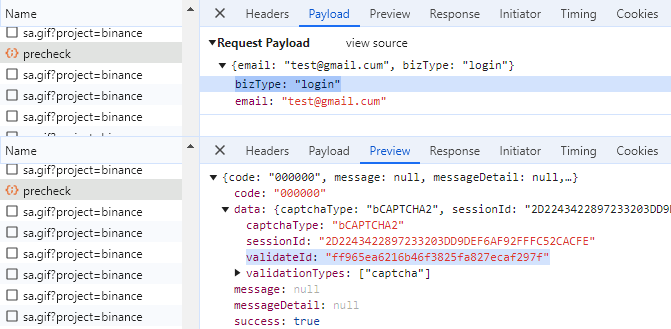

import Tabs from '@theme/Tabs';
import TabItem from '@theme/TabItem';
import ParamItem from '@theme/ParamItem';
import MethodItem from '@theme/MethodItem';
import MethodDescription from '@theme/MethodDescription'
import PriceBlock from '@theme/PriceBlock';
import PriceBlockWrap from '@theme/PriceBlockWrap';


# Binance - Binance captcha

<PriceBlockWrap>
  <PriceBlock title="Binance captcha" name="binanceToken"/>
</PriceBlockWrap>

:::warning **Atenção!**
* Esta tarefa será realizada utilizando nossos servidores proxy.
* Use apenas para fazer login com sua conta.
:::

## Parâmetros da solicitação
<TabItem value="proxyless" label="CustomTask (without proxy)" default className="bordered-panel">
    <ParamItem title="type" required type="string" />
    **BinanceTask**

    ---

    <ParamItem title="websiteURL" required type="string" />
    O endereço da página principal onde o CAPTCHA é resolvido.

    ---

    <ParamItem title="websiteKey" required type="string" />
    Um parâmetro exclusivo para a seção do seu site. O valor do parâmetro `bizId`, `bizType` ou `bizCode`. Ele pode ser obtido a partir do tráfego (veja a descrição abaixo).

    ---

    <ParamItem title="validateId" required type="string" />
    Uma chave dinâmica. O valor do parâmetro `validateId`, `securityId` ou `securityCheckResponseValidateId`. Ele pode ser obtido a partir do tráfego (veja a descrição abaixo).

    ---

    <ParamItem title="userAgent" type="string" />
    User-Agent do navegador. **Você pode fornecer o seu próprio ou especificar o último UA do sistema operacional Windows.**: `userAgentPlaceholder`

</TabItem>


### Como obter `websiteKey` e `validateId`
Habilite as ferramentas de desenvolvedor, vá para a aba "Network", ative o CAPTCHA e observe as requisições. Algumas delas conterão os valores dos parâmetros necessários.
Por exemplo, os parâmetros:

bizCode: "CMC_register",
securityId: "09295759baca4d4fbeae80d9ffeaefd8"

 

or 

bizId: "CMC_register", 
securityCheckResponseValidateId: "09295759baca4d4fbeae80d9ffeaefd8"

 

or 

bizType: "login",
validateId: "ff965ea6216b46f3825fa827ecaf297f"

 

or

bizId: "login", 
securityCheckResponseValidateId: "ff965ea6216b46f3825fa827ecaf297f"

 

Os parâmetros necessários para resolver o captcha podem ser obtidos executando JavaScript: 
	```json
		let originalBCaptcha = window.BCaptcha;
		let BCaptchaData;
		Object.defineProperty(window, 'BCaptcha', {
			get: function() {
				return function(args) {
					const BCaptcha = new originalBCaptcha(args);
					let BCaptchaShow = BCaptcha.__proto__.show
					BCaptcha.__proto__.show = function(args) {
						BCaptchaData = args;
						return 1;
					};
					return BCaptcha;
				}
			}
		});
	```
Em seguida, você pode recuperar os parâmetros, por exemplo, da seguinte forma `BCaptchaData.securityCheckResponseValidateId`.


## Criar método de tarefa
<TabItem value="proxyless" label="CustomTask (без прокси)" default className="method-panel">
	<MethodItem>
		```http
		https://api.capmonster.cloud/createTask
		```
	</MethodItem>
	<MethodDescription>
		**Solicitação**
		```json
		{
			"clientKey": "API_KEY",
			"task": 
			{
				"type": "BinanceTask",
				"websiteURL": "https://binance.com/login",
				"websiteKey": "login",
				"validateId": "cb0bfefa598b4c3887661fde54ecd57b",
				"userAgent": "userAgentPlaceholder"
			}
		}
		```
		**Resposta**
		```json
		{
			"errorId":0,
			"taskId":407533072
		}
		```
	</MethodDescription>
</TabItem>


## Obter resultado da tarefa
Use o método [getTaskResult](../api/methods/get-task-result.md) para obter a solução Binance.

<TabItem value="proxyless" label="CustomTask (without proxy)" default className="method-panel-full">
	<MethodItem>
		```http
		https://api.capmonster.cloud/getTaskResult
		```
	</MethodItem>
	<MethodDescription>
		**Solicitação**
		```json
		{
			"clientKey":"API_KEY",
			"taskId": 407533072
		}
		```
		**Resposta**
		```json
		{
			"errorId":0,
			"status":"ready",
			"solution": 
			{
				"token":"captcha#09ba4905a79f44f2a99e44f234439644-ioVA7neog7eRHCDAsC0MixpZvt5kc99maS943qIsquNP9D77",
				"userAgent":"userAgentPlaceholder"
			}
		}
		```
	</MethodDescription>
</TabItem>