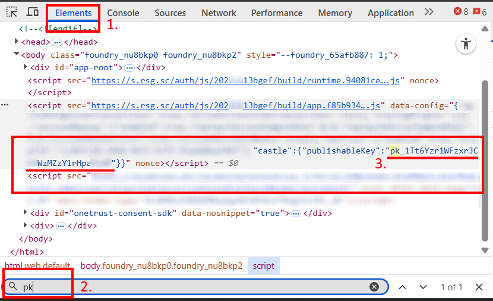
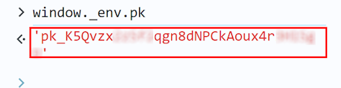
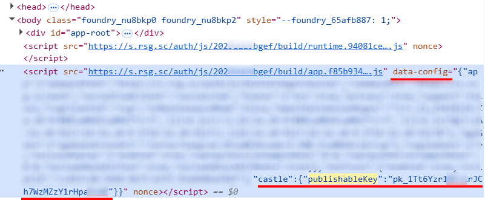
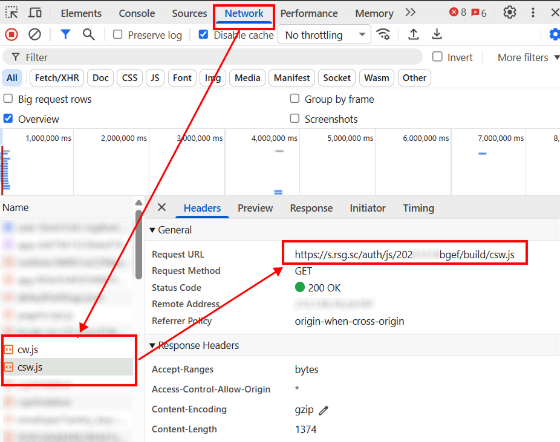

import Tabs from '@theme/Tabs';
import TabItem from '@theme/TabItem';
import ParamItem from '@theme/ParamItem';
import MethodItem from '@theme/MethodItem';
import MethodDescription from '@theme/MethodDescription'
import PriceBlock from '@theme/PriceBlock';
import PriceBlockWrap from '@theme/PriceBlockWrap';
import { ArticleHead } from '../../../../../src/theme/ArticleHead';

<ArticleHead slug="captchas/castle-task" />

# Castle

<PriceBlockWrap>
  <PriceBlock title="Castle" captchaId="castle"/>
</PriceBlockWrap>

Castle é um sistema de proteção de sites que bloqueia ataques automatizados e atividades suspeitas. Ele monitora o comportamento dos usuários e das requisições em tempo real, permanecendo praticamente imperceptível para visitantes comuns, manifestando-se apenas em casos de tráfego incomum ou em grande volume.


:::warning **Atenção!**
O CapMonster Cloud, por padrão, funciona com proxies integrados — já incluídos no custo do serviço. É necessário especificar seus próprios proxies apenas nos casos em que o site não aceita o token ou quando o acesso aos serviços integrados está restrito.

Se o proxy utiliza autenticação por IP, é necessário adicionar o endereço **65.21.190.34** à lista de permissões (whitelist).
:::

## Parâmetros da solicitação

<TabItem value="proxy" label="CastleTask" className="bordered-panel">
<ParamItem title="type" required type="string" />
**CustomTask**

---

<ParamItem title="class" required type="string" />
**Castle**

---

<ParamItem title="websiteURL" required type="string" />
A URL da página onde o Castle está localizado.

---

<ParamItem title="websiteKey" required type="string" />
**Publishable Key**, o identificador do Castle. Pode ser encontrado na página ou nos scripts do site.  
Exemplo: ```pk_1Tk5Yzr1WFzxrJCh7WzMZzY1rHpaOtdK```

---

<ParamItem title="wUrl (inside metadata)" required type="string" />
Link para `cw.js`, por exemplo: ```https://s.rsg.sc/auth/js/20251234bgef/build/cw.js```

---

<ParamItem title="swUrl (inside metadata)" required type="string" />
Link para `csw.js`, por exemplo: ```https://s.rsg.sc/auth/js/20251234bgef/build/cw.js```

---

<ParamItem title="count (inside metadata)" type="intenger" />
Número de tokens — o padrão é 1 (geração de 1 a 49 tokens Castle vinculados à mesma sessão do navegador, ou seja, com o mesmo identificador `__cuid`).  
Se for especificado um valor maior que 49, será retornado o número máximo permitido de tokens — 49 — e o custo será calculado com base nessa quantidade.

---

<ParamItem title="userAgent" type="string" />
User-Agent do navegador. <br />
**Transmita apenas o UA atual do sistema operacional Windows. No momento, o válido é**: `userAgentPlaceholder`

---

<ParamItem title="proxyType" type="string" />
**http** - proxy http/https comum;<br />
**https** - tente esta opção apenas se "http" não funcionar (necessário para alguns proxies personalizados);<br />
**socks4** - proxy socks4;<br />
**socks5** - proxy socks5.

---

<ParamItem title="proxyAddress" type="string" />
<p>
Endereço IP do proxy IPv4/IPv6. Não é permitido:
- uso de proxies transparentes (que revelem o IP do cliente);
- uso de proxies em máquinas locais.
</p>

---

<ParamItem title="proxyPort" type="integer" />
Porta do proxy.

---

<ParamItem title="proxyLogin" type="string" />
Login do servidor proxy.

---

<ParamItem title="proxyPassword" type="string" />
Senha do servidor proxy.

</TabItem>

## Método para criar tarefa

<Tabs className="full-width-tabs filled-tabs request-tabs" groupId="captcha-type">

  <TabItem value="proxyless" label="CustomTask (sem proxy)" default className="method-panel">
    <MethodItem>
      ```http
      https://api.capmonster.cloud/createTask
      ```
    </MethodItem>
    <MethodDescription>
      **Solicitação**
      ```json
      {
		"type": "CustomTask",
		"Class": "Castle",
		"websiteURL": "https://www.example.com/",
		"websiteKey": "pk_1Tk5Yzr1WFzxrJCh7WzMZzY1rHpaOtdK",
		"userAgent": "userAgentPlaceholder",
		"metadata": {
			"wUrl": "https://s.rsg.sc/auth/js/20251234bgef/build/cw.js",
			"swUrl": "https://s.rsg.sc/auth/js/20251234bgef/build/csw.js",
			"count":1
		}
}
        ```
        **Resposta**
        ```json
        {
            "errorId": 0,
            "taskId": 123456789
        }
        ```
        </MethodDescription>
    </TabItem>

 <TabItem value="proxy" label="CustomTask (com proxy)" className="method-panel">
    <MethodItem>
      ```http
      https://api.capmonster.cloud/createTask
      ```
    </MethodItem>
    <MethodDescription>
      **Solicitação**
      ```json
      {
		"type": "CustomTask",
		"Class": "Castle",
		"websiteURL": "https://www.example.com/",
		"websiteKey": "pk_1Tk5Yzr1WFzxrJCh7WzMZzY1rHpaOtdK",
		"userAgent": "userAgentPlaceholder",
		"metadata": {
			"wUrl": "https://s.rsg.sc/auth/js/20251234bgef/build/cw.js",
			"swUrl": "https://s.rsg.sc/auth/js/20251234bgef/build/csw.js",
			"count":1
		}
          "proxyType": "http",
          "proxyAddress": "8.8.8.8",
          "proxyPort": 8080,
          "proxyLogin": "proxyLoginHere",
          "proxyPassword": "proxyPasswordHere"
        }
      }
      ```

      **Resposta**
      ```json
      {
        "errorId": 0,
        "taskId": 407533072
      }
      ```
    </MethodDescription>
  </TabItem>

</Tabs>

## Método para obter o resultado da tarefa

Utilize o método [getTaskResult](../api/methods/get-task-result.mdx) para obter a solução TenDI.

<TabItem value="proxyless" label="CustomTask (sem proxy)" default className="method-panel-full">
	<MethodItem>
		```http
		https://api.capmonster.cloud/getTaskResult
		```
	</MethodItem>
	<MethodDescription>
		**Requisição**
		```json
		{
		  "clientKey":"API_KEY",
		  "taskId": 407533072
		}
		```
		**Resposta**
		```json
        {
          "errorId":0,
          "status":"ready",
          "solution":  {
              "data":
          {
            "tokens":["Q05Ap...H7nYn", "cn9xW...aFl_4", ...]
          },
              "domains": {
                  "www.example.com": {
                      "cookies": {
                          "__cuid": "6883480a9ab7442d9f97da7307d6ea9c"
                      }
                  }
              }
          }
      }
		```
	</MethodDescription>
</TabItem>

## Como encontrar os parâmetros do captcha

### `pk (websiteKey)`

**Opção 1:**

1. Abra a página com Castle e inicie as **Ferramentas do Desenvolvedor**, vá para a aba **Elements**.
2. Abra a busca (Ctrl + F) e insira as palavras-chave **pk** ou **publishableKey**.
3. Encontre o parâmetro `Publishable Key` entre os elementos da página ou nos scripts conectados.



**Opção 2:**

Se o site utilizar o objeto ```window._env```:


Copie o valor de `pk` ou execute o seguinte comando no console do navegador: ```window._env.pk```



**Opção 3:**

Se o `pk` estiver contido em `data-config`:



Copie o valor de `pk` ou use o seguinte código no console do navegador:

```javascript
const script = document.querySelector('script[data-config]');
const config = JSON.parse(script.dataset.config);
config.castle.publishableKey;
````

---

### `cw.js` e `csw.js`

Nas **Ferramentas do Desenvolvedor**, vá para a aba **Network**, ative o Castle e analise as requisições de rede. Encontre as requisições para os arquivos `cw.js` e `csw.js` e copie suas URLs.



