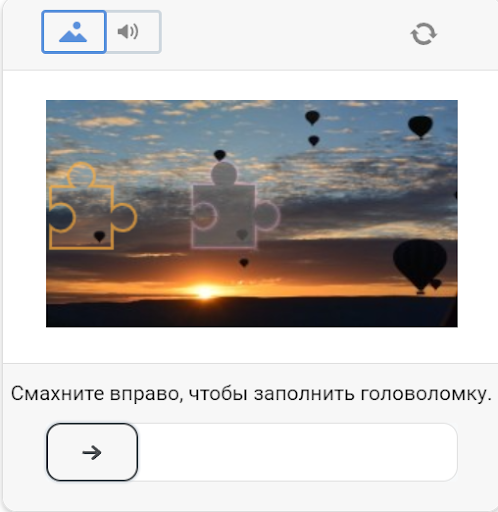
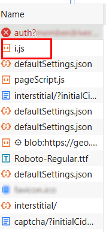
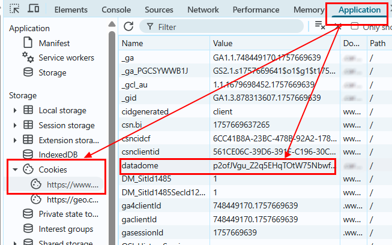
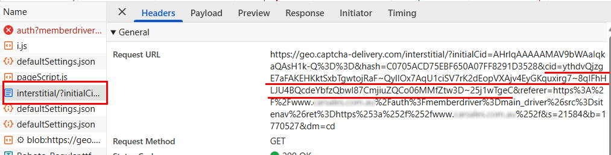

import Tabs from '@theme/Tabs';
import TabItem from '@theme/TabItem';
import ParamItem from '@theme/ParamItem';
import MethodItem from '@theme/MethodItem';
import MethodDescription from '@theme/MethodDescription'
import PriceBlock from '../../../../../src/theme/PriceBlock';
import PriceBlockWrap from '@theme/PriceBlockWrap';
import { ArticleHead } from '../../../../../src/theme/ArticleHead';

<ArticleHead slug="captchas/datadome" />

# DataDome

<PriceBlockWrap>
  <PriceBlock title="DataDome" captchaId="datadome"/>
</PriceBlockWrap>

Este tipo de captcha geralmente exige que o usuário resolva um quebra-cabeça movendo um slider para verificação.



:::warning **Atenção!**

* Para executar esta tarefa, utilize **os seus próprios proxies**.

* Se o proxy usar autenticação por IP, é necessário adicionar o endereço **65.21.190.34** à lista de permissões (whitelist).

* Após a resolução, você receberá **cookies especiais**, que devem ser adicionados ao navegador.
:::

## Parâmetros da solicitação

<TabItem value="proxyless" label="CustomTask (without proxy)" default className="bordered-panel">
    <ParamItem title="type" required type="string" />
    **CustomTask**
    
---

<ParamItem title="class" required type="string" />
**DataDome**

---

<ParamItem title="websiteURL" required type="string" />
URL da página principal onde o captcha será resolvido.

---

<ParamItem title="captchaUrl (dentro de metadata)" required="required" type="string" />
`"captchaUrl"` - link para o captcha. Normalmente no formato: `"https://geo.captcha-delivery.com/captcha/?initialCid=..."`.

---

<ParamItem title="datadomeCookie (dentro de metadata)" required type="string" />
Seus cookies do DataDome. Podem ser obtidos na página usando `document.cookie` (se os cookies não tiverem a flag *HttpOnly*), no cabeçalho da requisição Set-Cookie: "datadome=...", ou diretamente do código HTML `initialCid` ([*veja exemplos de como encontrar datadomeCookie*](#como-encontrar-datadomecookie)).

---

<ParamItem title="proxyType" required type="string" />
**http** - proxy http/https padrão;<br />
**https** - use apenas se "http" não funcionar (necessário para alguns proxies customizados);<br />
**socks4** - proxy socks4;<br />
**socks5** - proxy socks5.

---

<ParamItem title="proxyAddress" required type="string" />
<p>
  Endereço IPv4/IPv6 do proxy. Não permitido:
    - proxies transparentes (onde o IP do cliente é visível);
    - proxies em máquinas locais.
</p>

---

<ParamItem title="proxyPort" required type="integer" />
Porta do proxy.

---

<ParamItem title="proxyLogin" required type="string" />
Login do servidor proxy.

---

<ParamItem title="proxyPassword" required type="string" />
Senha do servidor proxy.

---

<ParamItem title="userAgent" type="string" />
User-Agent do navegador. <br />
**Transmita apenas o UA atual do sistema operacional Windows. No momento, o válido é**: `userAgentPlaceholder`

---

</TabItem>

## Método para criar tarefa

:::warning **Importante**
Durante o carregamento da página, o DataDome pode usar um de dois scripts: `c.js` ou `i.js`.
Se `c.js` for usado no site alvo, os cookies extraídos podem não funcionar na verificação. Antes de resolver, verifique qual script está carregado (**DevTools → Network / HTML**).
:::

**Opção com `c.js`:**


**Opção com `i.js`:**



<TabItem value="proxyless" label="CustomTask (sem proxy)" default className="method-panel">
	<MethodItem>
		```http
		https://api.capmonster.cloud/createTask
		```
	</MethodItem>
	<MethodDescription>
		**Requisição**
```json
{
  "clientKey": "API_KEY",
  "task": {
    "type": "CustomTask",
    "class": "DataDome",
    "websiteURL": "https://example.com",
    "userAgent": "userAgentPlaceholder",
    "metadata": {
      "captchaUrl": "https://geo.captcha-delivery.com/interstitial/?initialCid=AHrlqAAAAAMA9UvsL58YLqIAXNLFPg%3D%3D&hash=C0705ACD75EBF650A07FF8291D3528&cid=7sfa5xUfDrR4bQTp1c2mhtiD7jj9TXExcQypjdNAxKVFyIi1S9tE0~_mqLa2EFpOuzxKcZloPllsNHjNnqzD9HmBA4hEv7SsEyPYEidCBvjZEaDyfRyzefFfolv0lAHM&referer=https%3A%2F%2Fwww.example.com.au%2F&s=6522&b=978936&dm=cm",
      "datadomeCookie": "datadome=VYUWrgJ9ap4zmXq8Mgbp...64emvUPeON45z"
    },
    "proxyType": "http",
    "proxyAddress": "123.45.67.89",
    "proxyPort": 8080,
    "proxyLogin": "proxyUsername",
    "proxyPassword": "proxyPassword"
  }
}
```
		**Resposta**
		```json
		{
		  "errorId":0,
		  "taskId":407533072
		}
		```
	</MethodDescription>
</TabItem>

## Método para obter o resultado da tarefa

Use o método [getTaskResult](../api/methods/get-task-result.mdx) para obter a solução do captcha DataDome.

<TabItem value="proxyless" label="CustomTask (sem proxy)" default className="method-panel-full">
	<MethodItem>
		```http
		https://api.capmonster.cloud/getTaskResult
		```
	</MethodItem>
	<MethodDescription>
		**Requisição**
		```json
		{
		  "clientKey":"API_KEY",
		  "taskId": 407533072
		}
		```
		**Resposta**

```json
{
  "errorId": 0,
  "status": "ready",
  "solution": {
    "domains": {
      "www.example.com": {
        "cookies": {
          "datadome": "P1w0VnjFcTFslfps0J4FaPpY_QPbPBW4MeYxj4LW~pztIfJiSSuBPr8oQTUHzdrfgv137FbOBd3kCUOOgny7LhIkhm5e1qdtzYM4s2e46U_qfERK4KiCy22MOSIDsDyh"
        },
        "localStorage": null
      }
    },
    "url": null,
    "fingerprint": null,
    "headers": null,
    "data": null
  }
}
```
</MethodDescription>
</TabItem>

## Como encontrar `datadomeCookie`

### Usando DevTools

**Opção 1:**

1. Abra o site protegido pelo DataDome no navegador (Chrome, Firefox).

2. Pressione F12 → vá para a aba **Application** → **Cookies**.

3. Encontre o domínio do site (ex.: [www.example.com](http://www.example.com)).

Entre os cookies, procure a chave `datadome` — este é o parâmetro `datadomeCookie` necessário.



**Opção 2:**

1. Abra o site onde o captcha DataDome é ativado.

2. Vá para **DevTools → Network**, recarregue a página e encontre a requisição que carrega a página com `initialCid`.

Exemplo de URL:

`https://geo.captcha-delivery.com/interstitial/?initialCid=...&hash=...&cid=...`



ou:

3. Abra a **Response** dessa requisição. No código HTML, encontre o objeto:

`var ddm = { ... };`

4. Dentro deste objeto, localize o parâmetro `cid`. Seu valor é o `datadomeCookie` atual.


**Opção 3:**

1. Abra o site onde o captcha DataDome é ativado.

2. Vá para **DevTools → Network**, recarregue a página e encontre uma requisição com status **403**.

3. Vá para a aba **Headers → Response Headers**. Nos cabeçalhos, encontre `Set-Cookie:` e copie o valor do parâmetro `datadome` (`datadome=<valor>`).


## Usar biblioteca SDK

<Tabs className="full-width-tabs filled-tabs request-tabs" groupId="captcha-type">
  <TabItem value="js" label="JavaScript" default className="method-panel">
  <details>
      <summary>Mostrar Código (para navegador)</summary>
    ```js
    // https://github.com/ZennoLab/capmonstercloud-client-js

    import { CapMonsterCloudClientFactory, ClientOptions, DataDomeRequest } from '@zennolab_com/capmonstercloud-client';

    const API_KEY = "YOUR_API_KEY"; // Insira sua chave de API do CapMonster Cloud

    document.addEventListener("DOMContentLoaded", async () => {
        const client = CapMonsterCloudClientFactory.Create(
            new ClientOptions({ clientKey: API_KEY })
        );

        // Se necessário, você pode verificar o saldo 
        const balance = await client.getBalance();
        console.log("Balance:", balance);

        // DataDome é resolvido apenas com seus proxies
        const proxy = {
            proxyType: "http",
            proxyAddress: "123.45.67.89",
            proxyPort: 8080,
            proxyLogin: "username",
            proxyPassword: "password"
        };

        const datadomeRequest = new DataDomeRequest({
            _class: 'DataDome',
            websiteURL: "https://example.com/", // URL da página com a captcha
            userAgent: "userAgentPlaceholder",
            proxy,
            metadata: {
                captchaUrl: "https://geo.captcha-delivery.com/interstitial/?initialCid=AHrlqAAAAAMA9UvsL58YLqIAXNLFPg%3D%3D&hash=C0705ACD75EBF650A07FF8291D3528&cid=7sfa5xUfDrR4bQTp1c2mhtiD7jj9TXExcQypjdNAxKVFyIi1S9tE0~_mqLa2EFpOuzxKcZloPllsNHjNnqzD9HmBA4hEv7SsEyPYEidCBvjZEaDyfRyzefFfolv0lAHM&referer=https%3A%2F%2Fwww.example.com.au%2F&s=6522&b=978936&dm=cm",
                datadomeCookie: "datadome=VYUWrgJ9ap4zmXq8Mgbp...64emvUPeON45z"
            }
        });

        const result = await client.Solve(datadomeRequest);
        console.log("Solution:", result);
    });
    ```
    </details>

<details>
      <summary>Mostrar Código (Node.js)</summary>
```javascript
// https://github.com/ZennoLab/capmonstercloud-client-js

import { CapMonsterCloudClientFactory, ClientOptions, DataDomeRequest } from '@zennolab_com/capmonstercloud-client';

const API_KEY = "YOUR_API_KEY"; // Insira sua chave de API do CapMonster Cloud

async function solveDataDome() {
    const client = CapMonsterCloudClientFactory.Create(
        new ClientOptions({ clientKey: API_KEY })
    );

    // Se necessário, você pode verificar o saldo 
    const balance = await client.getBalance();
    console.log("Balance:", balance);

    // DataDome é resolvido apenas com seus proxies
    const proxy = {
        proxyType: "http",
        proxyAddress: "123.45.67.89",
        proxyPort: 8080,
        proxyLogin: "username",
        proxyPassword: "password"
    };

    const datadomeRequest = new DataDomeRequest({
        _class: 'DataDome',
        websiteURL: "https://example.com/", // URL da página com a captcha
        userAgent: "userAgentPlaceholder",
        proxy,
        metadata: {
            captchaUrl: "https://geo.captcha-delivery.com/interstitial/?initialCid=AHrlqAAAAAMA9UvsL58YLqIAXNLFPg%3D%3D&hash=C0705ACD75EBF650A07FF8291D3528&cid=7sfa5xUfDrR4bQTp1c2mhtiD7jj9TXExcQypjdNAxKVFyIi1S9tE0~_mqLa2EFpOuzxKcZloPllsNHjNnqzD9HmBA4hEv7SsEyPYEidCBvjZEaDyfRyzefFfolv0lAHM&referer=https%3A%2F%2Fwww.example.com.au%2F&s=6522&b=978936&dm=cm",
            datadomeCookie: "datadome=VYUWrgJ9ap4zmXq8Mgbp...64emvUPeON45z"
        }
    });

    const result = await client.Solve(datadomeRequest);
    console.log("Solution:", result);
}

solveDataDome().catch(console.error);
```
</details>
  </TabItem>

  <TabItem value="python" label="Python" className="method-panel">
  <details>
      <summary>Mostrar Código</summary>
    ```python
   # https://github.com/ZennoLab/capmonstercloud-client-python

  import asyncio
  from capmonstercloudclient import CapMonsterClient, ClientOptions
  from capmonstercloudclient.requests import DataDomeCustomTaskRequest
  from capmonstercloudclient.requests.baseRequestWithProxy import ProxyInfo

  API_KEY = "YOUR_API_KEY"  # Insira sua chave de API do CapMonster Cloud

  async def solve_datadome_captcha():
      client_options = ClientOptions(api_key=API_KEY)
      cap_monster_client = CapMonsterClient(options=client_options)

      # DataDome é resolvido apenas com seus proxies
      proxy = ProxyInfo(
          proxyType="http",
          proxyAddress="123.45.67.89",
          proxyPort=8080,
          proxyLogin="username",
          proxyPassword="password"
      )

      # Criando a tarefa DataDome
      datadome_request = DataDomeCustomTaskRequest(
          websiteUrl="https://example.com",  # URL da página com a captcha
          metadata={
              "datadomeCookie": "datadome=VYUWrgJ9ap4zmXq8Mgbp...64emvUPeON45z", 
              "captchaUrl": "https://geo.captcha-delivery.com/interstitial/?initialCid=AHrlqAAAAAMA9UvsL58YLqIAXNLFPg%3D%3D&hash=C0705ACD75EBF650A07FF8291D3528&cid=7sfa5xUfDrR4bQTp1c2mhtiD7jj9TXExcQypjdNAxKVFyIi1S9tE0~_mqLa2EFpOuzxKcZloPllsNHjNnqzD9HmBA4hEv7SsEyPYEidCBvjZEaDyfRyzefFfolv0lAHM&referer=https%3A%2F%2Fwww.example.com.au%2F&s=6522&b=978936&dm=cm"
          },
          proxy=proxy,
          userAgent="userAgentPlaceholder"
      )

      # Se necessário, você pode verificar o saldo 
      balance = await cap_monster_client.get_balance()
      print("Balance:", balance)

      result = await cap_monster_client.solve_captcha(datadome_request)
      print("Solution:", result)

  asyncio.run(solve_datadome_captcha())
    ```
    </details>
  </TabItem>
  
	{/* <TabItem value="csharp" label="C#" className="method-panel">
		```csharp
		// https://github.com/ZennoLab/capmonstercloud-client-dotnet

		using Zennolab.CapMonsterCloud.Requests;
		using Zennolab.CapMonsterCloud;

		class Program
		{
			static async Task MainDatadome(string[] args)
			{
				var clientOptions = new ClientOptions
				{
					ClientKey = "your_api_key" // Replace with your CapMonster Cloud API key
				};

				var cmCloudClient = CapMonsterCloudClientFactory.Create(clientOptions);

				var DataDomeRequest = new DataDomeCustomTaskRequest(datadomeCookie: "datadome=6BvxqELMoorFNoo7GT1...JyfP_mhz", captchaUrl: "https://example.com", htmlPageBase64: "PGh0bWw+PGhlYWQ+PHRpdGxlPmJs...N0E5QTA1")
				{
					WebsiteUrl = "https://example.com",
					UserAgent = "Mozilla/5.0 (iPhone; CPU iPhone OS 17_5_1 like Mac OS X) AppleWebKit/605.1.15 (KHTML, like Gecko) Version/17.5.1 Mobile/21F90 Safari/604.1", // Use the current userAgent
				};

				var DataDomeResult = await cmCloudClient.SolveAsync(DataDomeRequest);

				Console.WriteLine("Captcha Solution: " + JsonSerializer.Serialize(DataDomeResult.Solution));
			}
		}
		```
	</TabItem> */}
</Tabs>

