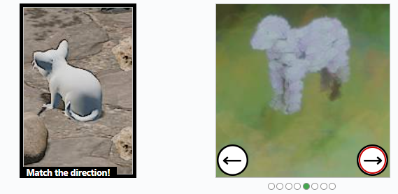
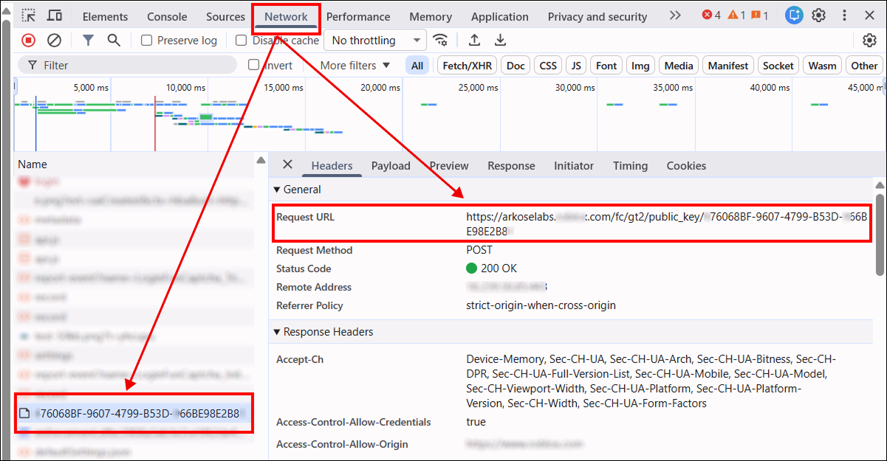
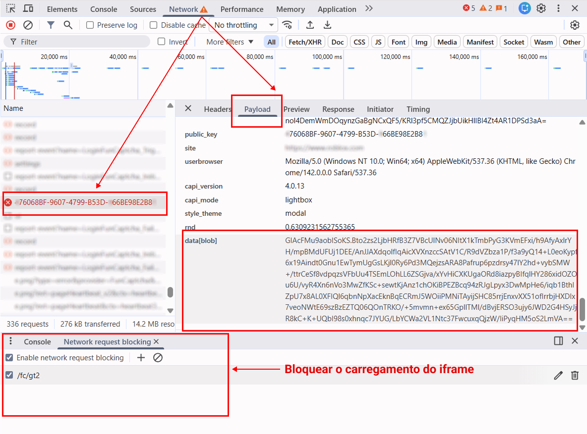

import Tabs from '@theme/Tabs';
import TabItem from '@theme/TabItem';
import ParamItem from '@theme/ParamItem';
import MethodItem from '@theme/MethodItem';
import MethodDescription from '@theme/MethodDescription'
import PriceBlock from '@theme/PriceBlock';
import PriceBlockWrap from '@theme/PriceBlockWrap';
import { ArticleHead } from '../../../../../src/theme/ArticleHead';

<ArticleHead slug="captchas/funcaptcha-task" />

# FunCaptcha

<PriceBlockWrap>
  <PriceBlock title="FunCaptcha" captchaId="funcaptcha"/>
</PriceBlockWrap>



:::warning **Atenção!**
O CapMonster Cloud, por padrão, funciona com proxies integrados — já incluídos no custo do serviço. É necessário especificar seus próprios proxies apenas nos casos em que o site não aceita o token ou quando o acesso aos serviços integrados está restrito.

Se o proxy utiliza autenticação por IP, é necessário adicionar o endereço **65.21.190.34** à lista de permissões (whitelist).
:::

## Parâmetros da solicitação

<TabItem value="proxy" label="FunCaptchaTask" className="bordered-panel">
<ParamItem title="type" required type="string" />
**FunCaptchaTask**

---

<ParamItem title="websiteURL" required type="string" />
A URL da página onde o captcha está localizado.

---

<ParamItem title="websitePublicKey" required type="string" />
Chave do FunCaptcha (valor *public key* ou *pk*).

---

<ParamItem title="data" type="string" />
Parâmetro adicional. Obrigatório se o site usar *data[blob]*. <br />
**Importante:** Não carregue o iframe do captcha para extrair o `blob`. Depois que o captcha for carregado, o valor se torna inválido.

---

<ParamItem title="funcaptchaApiJSSubdomain" type="string" />
Subdomínio da Arkose Labs (valor *surl*). Especifique apenas se for diferente do padrão: `client-api.arkoselabs.com`.
**Importante:** Indique apenas o domínio, sem o prefixo `https://`.

---

<ParamItem title="userAgent" type="string" />
User-Agent do navegador. <br />
**Informe apenas um UA atual do Windows. Exemplo atual:** `userAgentPlaceholder`.

---

<ParamItem title="cookies" type="string" />
Informe cookies adicionais no formato:

```

cookieName1=value1; cookieName2=value2

````

---

<ParamItem title="proxyType" type="string" />
**http** - proxy http/https comum;<br />
**https** - tente esta opção apenas se "http" não funcionar (necessário para alguns proxies personalizados);<br />
**socks4** - proxy socks4;<br />
**socks5** - proxy socks5.

---

<ParamItem title="proxyAddress" type="string" />
Endereço IP do proxy IPv4/IPv6. Não é permitido:   
- uso de proxies transparentes (que revelem o IP do cliente);  
- uso de proxies em máquinas locais.

---

<ParamItem title="proxyPort" type="integer" />
Porta do proxy.

---

<ParamItem title="proxyLogin" type="string" />
Login do servidor proxy.

---

<ParamItem title="proxyPassword" type="string" />
Senha do servidor proxy.

---
</TabItem>

## Criar método de tarefa

<Tabs className="full-width-tabs filled-tabs request-tabs" groupId="captcha-type">
<TabItem value="proxyless" label="FunCaptchaTask (sem proxy)" default className="method-panel">
<MethodItem>
```http
https://api.capmonster.cloud/createTask
````

</MethodItem>
<MethodDescription>
**Requisição**
```json
{
  "clientKey": "API_KEY",
  "task": {
    "type": "FunCaptchaTask",
    "websiteURL": "https://www.example.com",
    "websitePublicKey": "EX72CCFB-26EX-40E5-91E6-85EX70BE98ED",
    "funcaptchaApiJSSubdomain": "example-api.arkoselabs.com",
    "data": "{\"blob\":\"nj9UbL+yio7goOlTQ/b64t.ayrrBnP6kPgzlKYCP/kv491lKS...Wot/7gjpyIxs7VYb0+QuRcfQ/t6bzh5pXDkOFSskA/V/ITSVZSAlglIplLcdreZ4PE8skfMU6k1Q\"}",
    "userAgent": "userAgentPlaceholder"
  }
}
```
**Resposta**
```json
{
  "errorId":0,
  "taskId":407533077
}
```
</MethodDescription>
</TabItem>

<TabItem value="proxy" label="FunCaptchaTask (com proxy)" default className="method-panel">
<MethodItem>
```http
https://api.capmonster.cloud/createTask
```
</MethodItem>
<MethodDescription>
**Requisição**
```json
{
  "clientKey": "API_KEY",
  "task": {
    "type": "FunCaptchaTask",
    "websiteURL": "https://www.example.com",
    "websitePublicKey": "EX72CCFB-26EX-40E5-91E6-85EX70BE98ED",
    "funcaptchaApiJSSubdomain": "example-api.arkoselabs.com",
    "data": "{\"blob\":\"nj9UbL+yio7goOlTQ/b64t.ayrrBnP6kPgzlKYCP/kv491lKS...Wot/7gjpyIxs7VYb0+QuRcfQ/t6bzh5pXDkOFSskA/V/ITSVZSAlglIplLcdreZ4PE8skfMU6k1Q\"}",
    "userAgent": "userAgentPlaceholder",
    "proxyType": "http",
    "proxyAddress": "8.8.8.8",
    "proxyPort": 8080,
    "proxyLogin": "proxyLoginHere",
    "proxyPassword": "proxyPasswordHere"
  }
}
```
**Resposta**
```json
{
  "errorId":0,
  "taskId":407533077
}
```
</MethodDescription>
</TabItem>
</Tabs>

## Obter resultado da tarefa
Use o método [getTaskResult](../api/methods/get-task-result.mdx) para obter a solução FunCaptcha.

<TabItem value="proxyless" label="FunCaptchaTask (sem proxy)" default className="method-panel-full">
<MethodItem>
```http
https://api.capmonster.cloud/getTaskResult
```
</MethodItem>
<MethodDescription>
**Requisição**
```json
{
  "clientKey": "API_KEY",
  "taskId": 407533077
}
```

**Resposta**

```json
{
  "errorId": 0,
  "errorCode": null,
  "errorDescription": null,
  "solution": {
    "token": "337187b9f57678923.5060184402|r=us-west-2|lang=en|pk=EX72CCFB-26EX-40E5-91E6-85EX70BE98ED|at=40|ag=101|cdn_url=https%3A%2F%2Fclient-api.arkoselabs.com%2Fcdn%2Ffc|surl=https%3A%2F%2Fclient-api.arkoselabs.com|smurl=https%3A%2F%2Fclient-api.arkoselabs.com%2Fcdn%2Ffc%2Fassets%2Fstyle-manager",
    "userAgent": "userAgentPlaceholder"
  },
  "status": "ready"
}
```

</MethodDescription>
</TabItem>

## Encontrando os parâmetros do FunCaptcha

### `websitePublicKey` e `funcaptchaApiJSSubdomain`

Abra o DevTools → **Elements** e encontre o input oculto com ID `verification-token` ou `FunCaptcha-Token`. Eles contêm os valores de `pk` (*websitePublicKey*) e `surl` (*funcaptchaApiJSSubdomain*).

Obtenha os parâmetros via console:

```js
const v = document.querySelector("#verification-token, #FunCaptcha-Token").value;
const p = Object.fromEntries(v.split("|").map(x => x.split("=")));
console.log("pk:", p.pk);
console.log("surl:", decodeURIComponent(p.surl));
```

### `data (blob)`

Se o site usar um parâmetro adicional `blob`, você pode obtê-lo da seguinte forma:

#### 1. Identificar a fonte dos dados

O parâmetro `blob` pode estar em:

* **Atributos HTML**: por exemplo, `data-blob` ou outros atributos `data-*`.


* **Resposta JSON da API**: retornada após uma ação do usuário (por exemplo, clique ou solicitação do captcha).

* **Parâmetro de consulta na URL dentro do JSON**: às vezes o `blob` é passado como parte da URL.

#### 2. Executar a requisição

* **GET request** para a página onde o captcha é exibido,
  ou
* **POST request** para a API que retorna os dados do captcha.

> **Importante:** Não carregue o iframe do captcha para extrair o `blob`. Depois que o captcha for carregado, o parâmetro se torna inválido.

#### 3. Extrair o parâmetro

* Se a resposta for **HTML** — use regex ou uma ferramenta de análise HTML para localizar o atributo.
* Se a resposta for **JSON** — obtenha o valor da chave correspondente (ex.: `data.blob`).
* Se o `blob` estiver em uma **URL** — analise os parâmetros da query para extrair o valor.

<div style={{ fontSize: '110%' }}>
  **Você também pode encontrar o parâmetro `blob` e seu valor usando os requests de rede no DevTools:**
</div>

1. Vá para a página com o captcha, abra o DevTools e acione o captcha para que apareça.
   Em seguida, abra a aba **Network** e encontre um request como:
   `https://arkoselabs.example.com/fc/gt2/public_key/176068BF-9607-4799-B53D-366BE98E2B84`

   

2. Bloqueie o carregamento do iframe do captcha para obter um `blob` válido.
   Para fazer isso, pressione **Ctrl + Shift + P** (em navegadores Chromium), digite **Enable network request blocking**, habilite o bloqueio de requests e adicione um padrão como:
   `/fc/gt2`

   Após recarregar a página, o iframe será bloqueado. Copie o valor do parâmetro `blob` e use-o na sua requisição para resolver o captcha.

   

## Resolução automática do FunCaptcha com `data[blob]`

Os exemplos em JavaScript (Node.js), Python e C# mostram como usar o Playwright para extrair os parâmetros `public_key` e `blob`, criar uma tarefa no CapMonster Cloud e obter o token de solução do captcha.
Você pode implementar a mesma lógica usando outras ferramentas de automação ou teste.

---

<TabItem value="js" label="JavaScript" default className="method-panel">
<details>
<summary>Node.js</summary>

```javascript
// npm install playwright

const { chromium } = require("playwright");

const apiKey = "YOUR_API_KEY"; // Chave de API do CapMonster Cloud
const websiteURL = "https://www.example.com/"; // Página com FunCaptcha

// Aguarda o request do FunCaptcha, verifica e extrai public_key e blob
async function captureBlobAndPublicKey(page) {
    return new Promise(resolve => {
        page.on("request", req => {
            const url = req.url();

            // Verifica se o request está relacionado à inicialização do FunCaptcha
            if (url.includes("/fc/gt2/public_key/")) {
                const publicKey = url.split("/fc/gt2/public_key/")[1].split("/")[0];
                const post = req.postData();

                // Verifica se há blob nos dados do POST e extrai
                if (post && post.includes("data[blob]")) {
                    const params = new URLSearchParams(post);
                    const blob = params.get("data[blob]");

                    console.log("Extracted blob:", blob);
                    console.log("Extracted public_key:", publicKey);

                    resolve({ blob, publicKey });
                }
            }
        });
    });
}

// Cria uma FunCaptchaTask no CapMonster Cloud e envia os parâmetros
async function createTask(blob, publicKey) {
    const task = {
        type: "FunCaptchaTask",
        websiteURL,
        websitePublicKey: publicKey,
        data: JSON.stringify({ blob }),
        userAgent: "userAgentPlaceholder"
    };

    const res = await fetch("https://api.capmonster.cloud/createTask", {
        method: "POST",
        headers: { "Content-Type": "application/json" },
        body: JSON.stringify({ clientKey: apiKey, task })
    });

    const json = await res.json();

    // Verifica a resposta do CapMonster Cloud e aguarda taskId
    if (!json.taskId) {
        console.error("createTask error:", json);
        process.exit(1);
    }

    console.log("Task created:", json.taskId);
    return json.taskId;
}

// Aguarda a solução da tarefa
async function getTaskResult(taskId) {
    while (true) {
        const res = await fetch("https://api.capmonster.cloud/getTaskResult", {
            method: "POST",
            headers: { "Content-Type": "application/json" },
            body: JSON.stringify({ clientKey: apiKey, taskId })
        });

        const json = await res.json();

        // Verifica se a solução está pronta
        if (json.status === "ready") return json.solution;

        console.log("Processing...");
        await new Promise(r => setTimeout(r, 2500));
    }
}

(async () => {
    const browser = await chromium.launch({ headless: false });
    const page = await browser.newPage();

    // Bloqueia o iframe do captcha
    await page.route("**/fc/gt2/**", route => route.abort());

    console.log("Opening page...");
    await page.goto(websiteURL, { waitUntil: "domcontentloaded" });

    console.log("Capturing public_key + blob...");

    /**
     * IMPORTANTE!
     * NESTA ETAPA, VOCÊ PRECISA DISPARAR O CAPTCHA.
     * - clicar em Login / Sign up
     * - inserir email / username
     * - aguardar o FunCaptcha aparecer
     *
     * Exemplo:
     * await page.click('text="Create account"');
     * await page.waitForTimeout(1000);
     */

    const { blob, publicKey } = await captureBlobAndPublicKey(page);

    // Verifica se os parâmetros foram extraídos com sucesso
    if (!blob || !publicKey) {
        console.error("Failed to extract blob or public_key");
        await browser.close();
        return;
    }

    console.log("Creating CapMonster task...");
    const taskId = await createTask(blob, publicKey);

    console.log("Waiting for solution...");
    const solution = await getTaskResult(taskId);

    // Obtém o token final
    console.log("CAPTCHA SOLVED");
    console.log("Token:", solution.token);

    await browser.close();
})();
```

</details>
</TabItem>

---

<TabItem value="python" label="Python" className="method-panel">
<details>
<summary>Python</summary>

```python
# pip install playwright
# playwright install

import asyncio
import json
import time
import requests
from playwright.async_api import async_playwright

API_KEY = "YOUR_API_KEY"  # Chave de API do CapMonster Cloud
WEBSITE_URL = "https://www.example.com/"  # Página com FunCaptcha

# Aguarda o request do FunCaptcha, intercepta e extrai public_key e blob
async def capture_blob_and_public_key(page):
    future = asyncio.Future()

    async def on_request(request):
        url = request.url

        # Verifica se o request está relacionado à inicialização do FunCaptcha
        if "/fc/gt2/public_key/" in url:
            public_key = url.split("/fc/gt2/public_key/")[1].split("/")[0]
            post_data = request.post_data

            # Verifica se há blob nos dados do POST
            if post_data and "data[blob]" in post_data:
                params = dict(x.split("=") for x in post_data.split("&"))
                blob = params.get("data[blob]")

                print("Extracted blob:", blob)
                print("Extracted public_key:", public_key)

                future.set_result((blob, public_key))

    # Inscreve-se nos requests de rede
    page.on("request", on_request)
    return await future

# Cria uma FunCaptchaTask no CapMonster Cloud e envia os parâmetros
def create_task(blob, public_key):
    task = {
        "type": "FunCaptchaTask",
        "websiteURL": WEBSITE_URL,
        "websitePublicKey": public_key,
        "data": json.dumps({"blob": blob}),  # Envia blob
        "userAgent": "userAgentPlaceholder"
    }

    res = requests.post(
        "https://api.capmonster.cloud/createTask",
        json={"clientKey": API_KEY, "task": task},
        headers={"Content-Type": "application/json"}
    )

    data = res.json()

    # Verifica se a criação da tarefa foi bem-sucedida
    if "taskId" not in data:
        raise Exception(f"createTask error: {data}")

    print("Task created:", data["taskId"])
    return data["taskId"]

# Aguarda a solução da tarefa no CapMonster Cloud
def get_task_result(task_id):
    while True:
        res = requests.post(
            "https://api.capmonster.cloud/getTaskResult",
            json={"clientKey": API_KEY, "taskId": task_id},
            headers={"Content-Type": "application/json"}
        )

        data = res.json()

        # Verifica o status da tarefa
        if data.get("status") == "ready":
            return data["solution"]

        print("Processing...")
        time.sleep(2.5)

async def main():
    async with async_playwright() as p:
        browser = await p.chromium.launch(headless=False)
        page = await browser.new_page()

        # Bloqueia o iframe do FunCaptcha
        await page.route("**/fc/gt2/**", lambda route: route.abort())

        print("Opening page...")
        await page.goto(WEBSITE_URL, wait_until="domcontentloaded")

        print("Capturing public_key + blob...")

        # ------------------------------------------------------------------
        # IMPORTANTE!
        # NESTA ETAPA, VOCÊ PRECISA DISPARAR O CAPTCHA.
        # - clicar em Login / Sign up
        # - inserir email / username
        # - aguardar o FunCaptcha aparecer
        #
        # Exemplo:
        # await page.click("text=Sign up")
        # await page.wait_for_timeout(1000)
        # ------------------------------------------------------------------

        blob, public_key = await capture_blob_and_public_key(page)

        # Verifica se os parâmetros foram extraídos com sucesso
        if not blob or not public_key:
            print("Failed to extract blob or public_key")
            await browser.close()
            return

        print("Creating CapMonster task...")
        task_id = create_task(blob, public_key)

        print("Waiting for solution...")
        solution = get_task_result(task_id)

        # Token final do FunCaptcha
        print("CAPTCHA SOLVED")
        print("Token:", solution["token"])

        await browser.close()

# Executa
asyncio.run(main())
```

</details>
</TabItem>

---

<TabItem value="js" label="JavaScript" default className="method-panel">
<details>
<summary>C#</summary>

```csharp
// dotnet add package Microsoft.Playwright

using Microsoft.Playwright;
using System.Text;
using System.Text.Json;
using System.Net.Http;
using System.Threading.Tasks;

class Program
{
    private static readonly string ApiKey = "YOUR_API_KEY";   // Chave de API do CapMonster Cloud
    private static readonly string WebsiteURL = "https://www.example.com/"; // Página com FunCaptcha
    private static readonly HttpClient http = new HttpClient();

    // Aguarda o request de rede do FunCaptcha, procura por public_key + blob
    static TaskCompletionSource<(string blob, string publicKey)> blobTcs;

    static async Task Main()
    {
        blobTcs = new TaskCompletionSource<(string, string)>();

        using var playwright = await Playwright.CreateAsync();
        var browser = await playwright.Chromium.LaunchAsync(new BrowserTypeLaunchOptions
        {
            Headless = false
        });

        var page = await browser.NewPageAsync();

        // Bloqueia o iframe do FunCaptcha
        await page.RouteAsync("**/fc/gt2/**", route => route.AbortAsync());

        // Inscreve-se nos requests de rede
        page.Request += OnRequest;

        Console.WriteLine("Opening page...");
        await page.GotoAsync(WebsiteURL, new PageGotoOptions
        {
            WaitUntil = WaitUntilState.DOMContentLoaded
        });

        Console.WriteLine("Capturing public_key + blob...");

        // ---------------------------------------------------------------
        // IMPORTANTE!
        // NESTA ETAPA, VOCÊ PRECISA DISPARAR O CAPTCHA.
        // - clicar em Login / Sign up
        // - inserir credenciais
        // - aguardar o FunCaptcha aparecer
        //
        // Exemplo:
        // await page.ClickAsync("text=Sign up");
        // await page.WaitForTimeoutAsync(1500);
        // ---------------------------------------------------------------

        var (blob, publicKey) = await blobTcs.Task;

        if (blob == null || publicKey == null)
        {
            Console.WriteLine("Failed to extract blob or public_key");
            await browser.CloseAsync();
            return;
        }

        Console.WriteLine("Creating CapMonster task...");
        var taskId = await CreateTask(blob, publicKey);

        Console.WriteLine("Waiting for solution...");
        var solution = await GetTaskResult(taskId);

        Console.WriteLine("CAPTCHA SOLVED");
        Console.WriteLine("Token: " + solution);

        await browser.CloseAsync();
    }

    // Handler de requests de rede — procura por public_key + blob
    private static async void OnRequest(object sender, IRequest request)
    {
        string url = request.Url;

        // Verifica se o request está relacionado ao FunCaptcha
        if (url.Contains("/fc/gt2/public_key/"))
        {
            string publicKey = url.Split("/fc/gt2/public_key/")[1].Split("/")[0];
            string postData = request.PostData;

            // Verifica se há blob nos dados do POST
            if (!string.IsNullOrEmpty(postData) && postData.Contains("data[blob]"))
            {
                var parts = postData.Split('&');
                string blob = null;

                foreach (var part in parts)
                {
                    if (part.StartsWith("data[blob]="))
                        blob = part.Substring("data[blob]=".Length);
                }

                Console.WriteLine("Extracted blob: " + blob);
                Console.WriteLine("Extracted public_key: " + publicKey);

                blobTcs.TrySetResult((blob, publicKey));
            }
        }
    }

    // Cria uma FunCaptchaTask no CapMonster Cloud
    private static async Task<int> CreateTask(string blob, string publicKey)
    {
        var task = new
        {
            type = "FunCaptchaTask",
            websiteURL = WebsiteURL,
            websitePublicKey = publicKey,
            data = JsonSerializer.Serialize(new { blob }),
            userAgent = "userAgentPlaceholder"
        };

        var payload = new
        {
            clientKey = ApiKey,
            task
        };

        var content = new StringContent(JsonSerializer.Serialize(payload), Encoding.UTF8, "application/json");
        var res = await http.PostAsync("https://api.capmonster.cloud/createTask", content);
        var json = JsonDocument.Parse(await res.Content.ReadAsStringAsync());

        if (!json.RootElement.TryGetProperty("taskId", out var taskIdProp))
        {
            throw new Exception("createTask error: " + json.RootElement.ToString());
        }

        int taskId = taskIdProp.GetInt32();
        Console.WriteLine("Task created: " + taskId);

        return taskId;
    }

    // Aguarda a solução da tarefa no CapMonster Cloud
    private static async Task<string> GetTaskResult(int taskId)
    {
        while (true)
        {
            var payload = new
            {
                clientKey = ApiKey,
                taskId
            };

            var content = new StringContent(JsonSerializer.Serialize(payload), Encoding.UTF8, "application/json");
            var res = await http.PostAsync("https://api.capmonster.cloud/getTaskResult", content);
            var json = JsonDocument.Parse(await res.Content.ReadAsStringAsync());

            if (json.RootElement.GetProperty("status").GetString() == "ready")
            {
                return json.RootElement.GetProperty("solution").GetProperty("token").GetString();
            }

            Console.WriteLine("Processing...");
            await Task.Delay(2500);
        }
    }
}
```

</details>
</TabItem>
