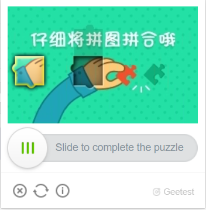
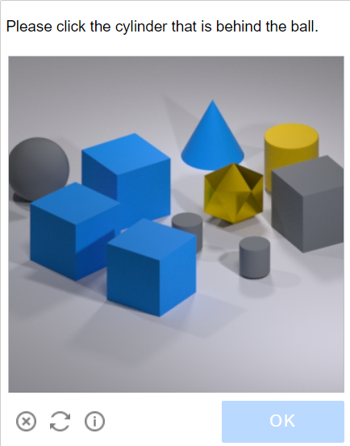
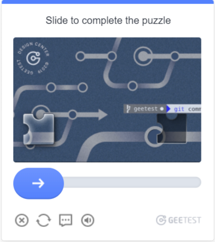

---
sidebar_position: 4
sidebar_label: GeeTestTask
---

import Tabs from '@theme/Tabs';
import TabItem from '@theme/TabItem';
import ParamItem from '@theme/ParamItem';
import MethodItem from '@theme/MethodItem';
import MethodDescription from '@theme/MethodDescription'
import PriceBlock from '@theme/PriceBlock';
import PriceBlockWrap from '@theme/PriceBlockWrap';


# GeeTestTask

<PriceBlockWrap>
  <PriceBlock title="GeeTestTask" name="geeTestToken"/>
</PriceBlockWrap>

Este tipo de tarefa é para resolver captcha GeeTest usando seus proxies.
Sua aplicação deve enviar o endereço do site, chave de domínio público (`gt`), chave (`challenge`) e proxy.

O resultado da resolução do problema são três ou cinco tokens para enviar o formulário.

:::warning **Atenção!**
Proxies com autorização de IP ainda não são suportados.
:::

:::info
- Os parâmetros `gt`, `challenge` e `geetestApiServerSubdomain` são mais frequentemente encontrados dentro da função JavaScript `initGeetest`.
- Você também pode vê-los no código HTML da página. Você pode encontrá-los no bloco `<sсript>`, que aparece após a página estar totalmente carregada no navegador.
  
V3


V4 (captcha_id = gt)


:::

<br />

## <span style={{fontSize: '2.25rem'}}>GeeTest V3</span>

### <span style={{fontSize: '1.5rem'}}>Possíveis variantes de captcha</span>

<Tabs className="full-width-tabs">
  <TabItem value="intelligent" label="Modo Inteligente" default className="bordered-panel">
    
  </TabItem>
  <TabItem value="slide" label="CAPTCHA de Deslizamento" className="bordered-panel">
    
  </TabItem>
  <TabItem value="icon" label="CAPTCHA de Ícone" className="bordered-panel">
    
  </TabItem>
  <TabItem value="space" label="CAPTCHA de Espaço" className="bordered-panel">
    
  </TabItem>
</Tabs>

### <span style={{fontSize: '1.5rem'}}>Parâmetros de solicitação</span>

<Tabs className="full-width-tabs filled-tabs" groupId="captcha-type">
<TabItem value="proxyless" label="GeeTestTaskProxyless (sem proxy)" default className="bordered-panel">
    <ParamItem title="type" required type="string" />
    **GeeTestTaskProxyless**

    ---

    <ParamItem title="websiteURL" required type="string" />
    Endereço da página onde o captcha é resolvido.

    ---

    <ParamItem title="gt" required type="string" />
    A chave identificadora do GeeTest `gt` para o domínio. Valor estático, raramente atualizado.

    ---

    <ParamItem title="challenge" required="required apenas para V3" type="string" />
    <p>
    Uma chave dinâmica.<br />Cada vez que nossa API é chamada, precisamos obter um novo valor de chave. Se o captcha for carregado na página, o valor `challenge` não será mais válido e você receberá o [erro](../api/api-errors.md) `ERROR_TOKEN_EXPIRED`. <br />
    Você será cobrado por tarefas com erro `ERROR_TOKEN_EXPIRED`.
    É necessário examinar as solicitações e encontrar aquela em que este valor é retornado e, antes de cada criação da tarefa de reconhecimento, executar esta solicitação e analisar o desafio a partir dela.
    </p>

    ---

    <ParamItem title="version" type="integer" required="required apenas para V4"/>
    3

    ---

    <ParamItem title="geetestApiServerSubdomain" type="string" />
    Servidor de subdomínio da API GeeTest (deve ser diferente de api.geetest.com). <br />Parâmetro opcional. Pode ser necessário para alguns sites.

    ---

    <ParamItem title="geetestGetLib" type="string" />
    Caminho para o script do captcha para exibi-lo na página. <br /> Parâmetro opcional. Pode ser necessário para alguns sites. <br />Enviar JSON como string.

    ---

    <ParamItem title="userAgent" type="string" />
    User-Agent do navegador usado para reconhecer o captcha.
  </TabItem>
  <TabItem value="proxy" label="GeeTestTask (usando proxy)" className="bordered-panel">
    <ParamItem title="type" required type="string" />
    **GeeTestTask**

    ---

    <ParamItem title="websiteURL" required type="string" />
    Endereço da página onde o captcha é resolvido.

    ---

    <ParamItem title="gt" required type="string" />
    A chave identificadora do GeeTest `gt` para o domínio. Valor estático, raramente atualizado.

    ---

    <ParamItem title="challenge" required="required apenas para V3" type="string" />
    <p>
    Uma chave dinâmica.<br />Cada vez que nossa API é chamada, precisamos obter um novo valor de chave. Se o captcha for carregado na página, o valor `challenge` não será mais válido e você receberá o [erro](../api/api-errors.md) `ERROR_TOKEN_EXPIRED`. <br />
    Você será cobrado por tarefas com erro `ERROR_TOKEN_EXPIRED`.
    É necessário examinar as solicitações e encontrar aquela em que este valor é retornado e, antes de cada criação da tarefa de reconhecimento, executar esta solicitação e analisar o desafio a partir dela.
    </p>

    ---

    <ParamItem title="version" type="integer" required="required apenas para V4"/>
    3

    ---

    <ParamItem title="geetestApiServerSubdomain" type="string" />
    Servidor de subdomínio da API GeeTest (deve ser diferente de api.geetest.com). <br />Parâmetro opcional. Pode ser necessário para alguns sites.

    ---

    <ParamItem title="geetestGetLib" type="string" />
    Caminho para o script do captcha para exibi-lo na página. <br /> Parâmetro opcional. Pode ser necessário para alguns sites. <br />Enviar JSON como string.

    ---

    <ParamItem title="proxyType" required type="string" />
    **http** - proxy http/https comum;<br />**https** - tente esta opção apenas se "http" não funcionar (necessário para alguns proxies personalizados);<br />**socks4** - proxy socks4;<br />**socks5** - proxy socks5.

    ---

    <ParamItem title="proxyAddress" required type="string" />
    <p>
      Endereço IP proxy IPv4/IPv6. Não permitido:
      - uso de nomes de host;
      - uso de proxies transparentes (onde você pode ver o IP do cliente);
      - uso de proxies em máquinas locais.
    </p>

    ---

    <ParamItem title="proxyPort" required type="integer" />
    Porta proxy.

    ---

    <ParamItem title="proxyLogin" type="string" />
    Login do servidor proxy.

    ---

    <ParamItem title="proxyPassword" type="string" />
    Senha do servidor proxy.

    ---

    <ParamItem title="userAgent" type="string" />
    User-Agent do navegador usado para reconhecer o captcha.
  </TabItem>
  
</Tabs>


### <span style={{fontSize: '1.5rem'}}>Criar tarefa</span>

<Tabs className="full-width-tabs filled-tabs request-tabs" groupId="captcha-type">
<TabItem value="proxyless" label="GeeTestTaskProxyless (sem proxy)" default className="method-panel">
    <MethodItem>
      ```http
      https://api.capmonster.cloud/createTask
      ```
    </MethodItem>
<MethodDescription>
**Solicitação**
```json
{
    "clientKey":"SUA_CHAVE_API_CAPMONSTER_CLOUD",
    "task":
    {
        "type":"GeeTestTaskProxyless",
        "websiteURL":"https://www.geetest.com/en/demo",
        "gt":"022397c99c9f646f6477822485f30404",
        "challenge":"7f044f48bc951ecfbfc03842b5e1fe59"

    }
}
```
**Resposta**
```json
{
  "errorId":0,
  "taskId":407533072
}
```

</MethodDescription>
</TabItem>
<TabItem value="proxy" label="GeeTestTask (usando proxy)" className="method-panel">
<MethodItem>
```http
https://api.capmonster.cloud/createTask
```
</MethodItem>
<MethodDescription>
**Requisição**
```json
{
  "clientKey":"YOUR_CAPMONSTER_CLOUD_API_KEY",
  "task": {
    "type":"GeeTestTask",
    "websiteURL":"https://www.geetest.com/en/demo",
    "gt":"022397c99c9f646f6477822485f30404",
    "challenge":"7f044f48bc951ecfbfc03842b5e1fe59",
    "proxyType":"http",
    "proxyAddress":"8.8.8.8",
    "proxyPort":8080,
    "proxyLogin":"proxyLoginHere",
    "proxyPassword":"proxyPasswordHere",
    "userAgent":"userAgentPlaceholder"
  }
}
```
**Resposta**
```json
{
  "errorId":0,
  "taskId":407533072
}
```
</MethodDescription>
</TabItem>

</Tabs>


Use o método [getTaskResult](../api/methods/get-task-result.md) para obter o resultado do reconhecimento do GeeTest. Dependendo da carga do sistema, você receberá uma resposta em um intervalo de 10 s a 30 s.

### <span style={{fontSize: '1.5rem'}}>Obter resultado da tarefa</span>


<TabItem value="proxyless" label="GeeTestTaskProxyless (sem proxy)" default className="method-panel-full">
<MethodItem>
```http
https://api.capmonster.cloud/getTaskResult
```
</MethodItem>
<MethodDescription>
**Requisição**
```json
{
  "clientKey":"API_KEY",
  "taskId": 407533072
}
```
**Resposta**
```json
{
  "errorId":0,
  "status":"ready",
  "solution": {
    "challenge":"0f759dd1ea6c4wc76cedc2991039ca4f23",
    "validate":"6275e26419211d1f526e674d97110e15",
    "seccode":"510cd9735583edcb158601067195a5eb|jordan"
  }
}
```
</MethodDescription>
</TabItem>

<br />

<table><tr>
<th><b>Propriedade</b></th><th><b>Tipo</b></th><th><b>Descrição</b></th>
</tr>
<tr><td>challenge</td><td>String</td><td rowspan="3">Todos os três parâmetros são necessários ao enviar o formulário no site de destino.</td></tr>
<tr><td>validate</td><td>String</td></tr>
<tr><td>seccode</td><td>String</td></tr>
</table>

### <span style={{fontSize: '1.5rem'}}>Usar biblioteca SDK</span>

<Tabs className="full-width-tabs filled-tabs request-tabs" groupId="captcha-type">
  <TabItem value="js" label="JavaScript" default className="method-panel">
    ```js
    // https://github.com/ZennoLab/capmonstercloud-client-js

    import { CapMonsterCloudClientFactory, ClientOptions, GeeTestProxylessRequest, /*GeeTestRequest*/ } from '@zennolab_com/capmonstercloud-client';

    document.addEventListener('DOMContentLoaded', async () => {
      const cmcClient = CapMonsterCloudClientFactory.Create(new ClientOptions({ clientKey: '<your capmonster.cloud API key>' }));
      console.log(await cmcClient.getBalance());

      const geetestV3Request = new GeeTestProxylessRequest({
        websiteURL: 'https://example.com/geetest.php',
        gt: '81dc9bdb52d04dc20036dbd8313ed055',
        challenge: 'd93591bdf7860e1e4ee2fca799911215',
      });

      // const geetestV3Request = new GeeTestRequest({
      //   websiteURL: 'https://example.com/geetest.php',
      //   gt: '81dc9bdb52d04dc20036dbd8313ed055',
      //   challenge: 'd93591bdf7860e1e4ee2fca799911215',
      //   userAgent: 'userAgentPlaceholder',
      //   proxyType: 'https',
      //   proxyAddress: 'https://proxy.com',
      //   proxyPort: 6045,
      //   proxyLogin: 'login',
      //   proxyPassword: 'password',
      // });

      console.log(await cmcClient.Solve(geetestV3Request));
    });
    ```
  </TabItem>

  <TabItem value="python" label="Python" className="method-panel">
    ```python
    # https://github.com/ZennoLab/capmonstercloud-client-python

    # GeeTestV3Proxyless:

    import asyncio
    from capmonstercloudclient import CapMonsterClient, ClientOptions
    from capmonstercloudclient.requests import GeetestProxylessRequest

    client_options = ClientOptions(api_key="your_api_key")  # Replace with your CapMonsterCloud API key
    cap_monster_client = CapMonsterClient(options=client_options)

    geetest_request = GeetestProxylessRequest(
        websiteUrl="https://example.com",  # Website with the captcha
        gt="your_gt_value",  # Replace with the 'gt' parameter
        challenge="your_challenge_value"  # Replace with the 'challenge' parameter
    )

    async def solve_captcha():
        return await cap_monster_client.solve_captcha(geetest_request)

    responses = asyncio.run(solve_captcha())
    print(responses)
    ```

    ```python
    # Geetest V3

    import asyncio
    from capmonstercloudclient import CapMonsterClient, ClientOptions
    from capmonstercloudclient.requests import GeetestRequest

    client_options = ClientOptions(api_key="your_api_key")  # Replace with your CapMonsterCloud API key
    cap_monster_client = CapMonsterClient(options=client_options)

    geetest_request = GeetestRequest(
        websiteUrl="https://example.com",  # Website with the captcha
        gt="your_gt_value",  
        challenge="your_challenge_value",  
        proxyType="http",  # Type of proxy (http, https, socks4, socks5)
        proxyAddress="8.8.8.8",  
        proxyPort=8080,  
        proxyLogin="proxyLoginHere",  
        proxyPassword="proxyPasswordHere", 
        user_agent="Mozilla/5.0 (Windows NT 10.0; Win64; x64) AppleWebKit/537.36 (KHTML, like Gecko) Chrome/130.0.0.0 Safari/537.36"  # Use the current userAgent
    )

    async def solve_captcha():
        return await cap_monster_client.solve_captcha(geetest_request)

    responses = asyncio.run(solve_captcha())
    print(responses)
    ```
  </TabItem>

  <TabItem value="csharp" label="C#" className="method-panel">
    ```csharp
    // https://github.com/ZennoLab/capmonstercloud-client-dotnet

    // GeeTestV3Proxyless:

    using Zennolab.CapMonsterCloud.Requests;
    using Zennolab.CapMonsterCloud;

    class Program
    {
        static async Task Main(string[] args)
        {
            var clientOptions = new ClientOptions
            {
                ClientKey = "your_api_key" // Replace with your CapMonster Cloud API key
            };

            var cmCloudClient = CapMonsterCloudClientFactory.Create(clientOptions);

            var geetestRequest = new GeeTestProxylessRequest
            {
                WebsiteUrl = "https://example.com/demo/geetest", // URL with the captcha
                Gt = "your_gt_value", // Replace with the actual gt value
                Challenge = "your_challenge_value" // Replace with the actual challenge value
            };

            var geetestResult = await cmCloudClient.SolveAsync(geetestRequest);

            Console.WriteLine("Captcha Solution:");
            Console.WriteLine($"Challenge: {geetestResult.Solution.Challenge}");
            Console.WriteLine($"Validate:  {geetestResult.Solution.Validate}");
            Console.WriteLine($"SecCode:   {geetestResult.Solution.SecCode}");
        }
    }
    ```

    ```csharp
    // Geetest V3

    using Zennolab.CapMonsterCloud.Requests;
    using Zennolab.CapMonsterCloud;

    class Program
    {
        static async Task Main(string[] args)
        {
            var clientOptions = new ClientOptions
            {
                ClientKey = "your_api_key" // Replace with your CapMonster Cloud API key
            };

            var cmCloudClient = CapMonsterCloudClientFactory.Create(clientOptions);

            var geetestRequest = new GeeTestRequest
            {
                WebsiteUrl = "https://example.com/demo/geetest", // URL with the captcha
                Gt = "your_gt_value", // Replace with the actual gt value
                Challenge = "your_challenge_value",
                ProxyType = ProxyType.Http,
                ProxyAddress = "8.8.8.8",
                ProxyPort = 8080,
                ProxyLogin = "proxyLoginHere",
                ProxyPassword = "proxyPasswordHere"
            };

            var geetestResult = await cmCloudClient.SolveAsync(geetestRequest);

            Console.WriteLine("Captcha Solution:");
            Console.WriteLine($"Challenge: {geetestResult.Solution.Challenge}");
            Console.WriteLine($"Validate:  {geetestResult.Solution.Validate}");
            Console.WriteLine($"SecCode:   {geetestResult.Solution.SecCode}");
        }
    }
    ```
  </TabItem>  
</Tabs>

<br />

## <span style={{fontSize: '2.25rem'}}>GeeTest V4</span>

### <span style={{fontSize: '1.5rem'}}>Possível variante de captcha</span>




### <span style={{fontSize: '1.5rem'}}>Parâmetros de requisição</span>

<Tabs className="full-width-tabs filled-tabs" groupId="captcha-type">
<TabItem value="proxyless" label="GeeTestTaskProxyless (sem proxy)" default className="bordered-panel">
<ParamItem title="type" required type="string" />
**GeeTestTaskProxyless**

---

<ParamItem title="websiteURL" required type="string" />
Endereço da página onde o captcha está sendo resolvido.

---

<ParamItem title="gt" required type="string" />
A chave do identificador GeeTest para o domínio - o parâmetro `captcha_id`.

---

<ParamItem title="version" type="integer" required="required only for V4"/>
4

---

<ParamItem title="geetestApiServerSubdomain" type="string" />
Subdomínio do servidor API GeeTest (deve ser diferente de api.geetest.com). <br />Parâmetro opcional. Pode ser necessário para alguns sites.

---

<ParamItem title="geetestGetLib" type="string" />
Caminho para o script captcha para exibi-lo na página. <br />Parâmetro opcional. Pode ser necessário para alguns sites. <br />Enviar JSON como string.

---

<ParamItem title="initParameters" type="object" />
Parâmetros adicionais para a versão 4, usados junto com "riskType" (tipo de captcha/características de sua verificação).

---

<ParamItem title="userAgent" type="string" />
User-Agent do navegador usado para reconhecer o captcha.
</TabItem>
<TabItem value="proxy" label="GeeTestTask (usando proxy)" className="bordered-panel">
<ParamItem title="type" required type="string" />
**GeeTestTask**

---

<ParamItem title="websiteURL" required type="string" />
Endereço da página onde o captcha está sendo resolvido.

---

<ParamItem title="gt" required type="string" />
A chave do identificador GeeTest para o domínio - o parâmetro `captcha_id`.

---

<ParamItem title="version" type="integer" required="required only for V4"/>
4

---

<ParamItem title="geetestApiServerSubdomain" type="string" />
Subdomínio do servidor API GeeTest (deve ser diferente de api.geetest.com). <br />Parâmetro opcional. Pode ser necessário para alguns sites.

---

<ParamItem title="geetestGetLib" type="string" />
Caminho para o script captcha para exibi-lo na página. <br />Parâmetro opcional. Pode ser necessário para alguns sites. <br />Enviar JSON como string.

---

<ParamItem title="initParameters" type="object" />
Parâmetros adicionais para a versão 4, usados junto com “riskType” (tipo de captcha/características de sua verificação).

---

<ParamItem title="proxyType" required type="string" />
**http** - proxy http/https comum;<br />**https** - tente essa opção apenas se "http" não funcionar (necessário para alguns proxies personalizados);<br />**socks4** - proxy socks4;<br />**socks5** - proxy socks5.

---

<ParamItem title="proxyAddress" required type="string" />
<p>
Endereço IP do proxy IPv4/IPv6. Não permitido:
- uso de nomes de host;
- uso de proxies transparentes (onde é possível ver o IP do cliente);
- uso de proxies em máquinas locais.
</p>

---

<ParamItem title="proxyPort" required type="integer" />
Porta do proxy.

---

<ParamItem title="proxyLogin" type="string" />
Login do servidor proxy.

---

<ParamItem title="proxyPassword" type="string" />
Senha do servidor proxy.

---

<ParamItem title="userAgent" type="string" />
User-Agent do navegador usado para reconhecer o captcha.
</TabItem>

</Tabs>


### <span style={{fontSize: '1.5rem'}}>Método de criação de tarefa</span>


<Tabs className="full-width-tabs filled-tabs request-tabs" groupId="captcha-type">
<TabItem value="proxyless" label="GeeTestTaskProxyless (sem proxy)" default className="method-panel">
<MethodItem>
```http
https://api.capmonster.cloud/createTask
```
</MethodItem>
<MethodDescription>
**Requisição**
```json
{
    "clientKey":"YOUR_CAPMONSTER_CLOUD_API_KEY",
    "task":
    {
        "type":"GeeTestTaskProxyless",
        "websiteURL":"https://gt4.geetest.com/",
        "gt":"54088bb07d2df3c46b79f80300b0abbe",
        "version": 4,
        "initParameters": {
          "riskType": "slide"
        }
    }
}
```

**Resposta**
```json
{
  "errorId":0,
  "taskId":407533072
}
```

</MethodDescription>
</TabItem>
<TabItem value="proxy" label="GeeTestTask (usando proxy)" className="method-panel">
<MethodItem>
```http
https://api.capmonster.cloud/createTask
```
</MethodItem>
<MethodDescription>
**Requisição**
```json
{
  "clientKey":"YOUR_CAPMONSTER_CLOUD_API_KEY",
  "task": {
    "type":"GeeTestTask",
    "websiteURL":"https://gt4.geetest.com/",
    "gt":"54088bb07d2df3c46b79f80300b0abbe",
    "version": 4,
    "initParameters": {
      "riskType": "slide"
    },
    "proxyType":"http",
    "proxyAddress":"8.8.8.8",
    "proxyPort":8080,
    "proxyLogin":"proxyLoginHere",
    "proxyPassword":"proxyPasswordHere",
    "userAgent":"userAgentPlaceholder"
	
  }
}
```

**Resposta**
```json
{
  "errorId":0,
  "taskId":407533072
}
```
</MethodDescription>
</TabItem>

</Tabs>

Use o [getTaskResult](../api/methods/get-task-result.md) para obter o resultado do reconhecimento GeeTest. Dependendo da carga do sistema, você receberá uma resposta em um intervalo de 10 s a 30 s.

### <span style={{fontSize: '1.5rem'}}>Método de obtenção do resultado da tarefa</span>

<TabItem value="proxyless" label="GeeTestTaskProxyless (sem proxy)" default className="method-panel-full">
<MethodItem>
```http
https://api.capmonster.cloud/getTaskResult
```
</MethodItem>
<MethodDescription>
**Requisição**
```json
{
  "clientKey":"API_KEY",
  "taskId": 407533072
}
```
**Resposta**
```json
{
  "errorId":0,
  "status":"ready",
  "solution": {
    "captcha_id":"f5c2ad5a8a3cf37192d8b9c039950f79",
    "lot_number":"bcb2c6ce2f8e4e9da74f2c1fa63bd713",
    "pass_token":"edc7a17716535a5ae624ef4707cb6e7e478dc557608b068d202682c8297695cf",
    "gen_time":"1683794919",
    "captcha_output":"XwmTZEJCJEnRIJBlvtEAZ662T...[cut]...SQ3fX-MyoYOVDMDXWSRQig56"
  }
}
```
</MethodDescription>
</TabItem>

<br />

<table>
<tr>
<th><b>Propriedade</b></th><th><b>Tipo</b></th><th><b>Descrição</b></th>
</tr>
<tr>
<td>captcha_id</td><td>String</td><td rowspan="5">Todos os cinco parâmetros são necessários ao enviar o formulário no site de destino.<br />input[name=captcha_id]<br />input[name=lot_number]<br />input[name=pass_token]<br />input[name=gen_time]<br />input[name=captcha_output]</td>
</tr>
<tr><td>lot_number</td><td>String</td></tr>
<tr><td>pass_token</td><td>String</td></tr>
<tr><td>gen_time</td><td>String</td></tr>
<tr><td>captcha_output</td><td>String</td></tr>
</table>


### <span style={{fontSize: '1.5rem'}}>Usar a biblioteca SDK</span>

<Tabs className="full-width-tabs filled-tabs request-tabs" groupId="captcha-type">
  <TabItem value="js" label="JavaScript" default className="method-panel">
    ```js
    // https://github.com/ZennoLab/capmonstercloud-client-js

    import { CapMonsterCloudClientFactory, ClientOptions, GeeTestProxylessRequest, /*GeeTestRequest*/ } from '@zennolab_com/capmonstercloud-client';

    document.addEventListener('DOMContentLoaded', async () => {
      const cmcClient = CapMonsterCloudClientFactory.Create(new ClientOptions({ clientKey: '<your capmonster.cloud API key>' }));
      console.log(await cmcClient.getBalance());

      const geetestV4Request = new GeeTestProxylessRequest({
        websiteURL: 'https://example.com/geetest.php',
        gt: '81dc9bdb52d04dc20036dbd8313ed055',
        challenge: 'd93591bdf7860e1e4ee2fca799911215',
        version: '4',
        initParameters: {
          riskType: 'slide',
        },
      });

      // const geetestV4Request = new GeeTestRequest({
      //   websiteURL: 'https://example.com/geetest.php',
      //   gt: '81dc9bdb52d04dc20036dbd8313ed055',
      //   challenge: 'd93591bdf7860e1e4ee2fca799911215',
      //   version: '4',
      //   initParameters: {
      //     riskType: 'slide',
      //   },
      //   userAgent: 'userAgentPlaceholder',
      //   proxyType: 'https',
      //   proxyAddress: 'https://proxy.com',
      //   proxyPort: 6045,
      //   proxyLogin: 'login',
      //   proxyPassword: 'p@ssword',
      // })

      console.log(await cmcClient.Solve(geetestV4Request));
    });
    ```
  </TabItem>
  
  <TabItem value="python" label="Python" className="method-panel">
    ```python
    # https://github.com/ZennoLab/capmonstercloud-client-python

    # GeeTestV4Proxyless
    import asyncio
    from capmonstercloudclient import CapMonsterClient, ClientOptions
    from capmonstercloudclient.requests import GeetestProxylessRequest

    client_options = ClientOptions(api_key = "your_api_key")  # Replace with your CapMonsterCloud API key
    cap_monster_client = CapMonsterClient(options = client_options)

    gee_test_request = GeetestProxylessRequest(
        websiteUrl    = "https://example.com/",  # Website with the captcha 
        gt            = "54088bb07d2df3c46b79f80300b0abbe",  
        version       = 4,  
        initParameters = {
            "riskType": "slide"
        }
    )

    async def solve_captcha():
        return await cap_monster_client.solve_captcha(gee_test_request)

    responses = asyncio.run(solve_captcha())
    print(responses)
    ```

    ```python
    # GeeTestV4
    import asyncio
    from capmonstercloudclient import CapMonsterClient, ClientOptions
    from capmonstercloudclient.requests import GeetestRequest

    client_options = ClientOptions(api_key = "your_api_key")  # Replace with your CapMonsterCloud API key
    cap_monster_client = CapMonsterClient(options = client_options)

    gee_test_request = GeetestRequest(
        websiteUrl    = "https://example.com/",  # Website with the captcha
        gt            = "54088bb07d2df3c46b79f80300b0abbe",  
        version       = 4,  
        initParameters = {
            "riskType": "slide"
        },
        proxyType     = "http",  # Type of proxy (http, https, socks4, socks5)
        proxyAddress  = "8.8.8.8",  
        proxyPort     = 8080, 
        proxyLogin    = "proxyLoginHere",  
        proxyPassword = "proxyPasswordHere",
        user_agent    = "Mozilla/5.0 (Windows NT 10.0; Win64; x64) AppleWebKit/537.36 (KHTML, like Gecko) Chrome/130.0.0.0 Safari/537.36"  # Use the current userAgent
    )

    async def solve_captcha():
        return await cap_monster_client.solve_captcha(gee_test_request)

    responses = asyncio.run(solve_captcha())
    print(responses)
    ```
  </TabItem>
  
  <TabItem value="csharp" label="C#" className="method-panel">
    ```csharp
    // https://github.com/ZennoLab/capmonstercloud-client-dotnet

    // GeeTestV4Proxyless
    using Zennolab.CapMonsterCloud.Requests;
    using Zennolab.CapMonsterCloud;

    class Program
    {
        static async Task Main(string[] args)
        {
            var clientOptions = new ClientOptions
            {
                ClientKey = "your_api_key" // Replace with your CapMonster Cloud API key
            };

            var cmCloudClient = CapMonsterCloudClientFactory.Create(clientOptions);

            var geetestRequest = new GeeTestProxylessRequest
            {
                WebsiteUrl = "https://example.com/", // Website with the captcha
                Gt = "54088bb07d2df3c46b79f80300b0abbe",
                Version = 4,
                InitParameters = new Dictionary<string, string> { { "riskType", "slide" } }
            };

            var geetestResult = await cmCloudClient.SolveAsync(geetestRequest);

            Console.WriteLine("Captcha Solution:");
            Console.WriteLine($"CaptchaId: {geetestResult.Solution.CaptchaId}");
            Console.WriteLine($"LotNumber: {geetestResult.Solution.LotNumber}");
            Console.WriteLine($"PassToken: {geetestResult.Solution.PassToken}");
            Console.WriteLine($"GenTime: {geetestResult.Solution.GenTime}");
            Console.WriteLine($"CaptchaOutput: {geetestResult.Solution.CaptchaOutput}");
        }
    }
    ```

    ```csharp
    // Geetest V4
    using Zennolab.CapMonsterCloud.Requests;
    using Zennolab.CapMonsterCloud;

    class Program
    {
        static async Task Main(string[] args)
        {
            var clientOptions = new ClientOptions
            {
                ClientKey = "your_api_key" // Replace with your CapMonster Cloud API key
            };

            var cmCloudClient = CapMonsterCloudClientFactory.Create(clientOptions);

            var geetestRequest = new GeeTestRequest
            {
                WebsiteUrl = "https://example.com/", // Website with the captcha
                Gt = "54088bb07d2df3c46b79f80300b0abbe", // Replace with the correct gt value
                Version = 4,
                InitParameters = new Dictionary<string, string> { { "riskType", "slide" } },
                ProxyType = ProxyType.Http,
                ProxyAddress = "8.8.8.8",
                ProxyPort = 8080,
                ProxyLogin = "proxyLoginHere",
                ProxyPassword = "proxyPasswordHere"
            };

            var geetestResult = await cmCloudClient.SolveAsync(geetestRequest);

            Console.WriteLine("Captcha Solution:");
            Console.WriteLine($"CaptchaId: {geetestResult.Solution.CaptchaId}");
            Console.WriteLine($"LotNumber: {geetestResult.Solution.LotNumber}");
            Console.WriteLine($"PassToken: {geetestResult.Solution.PassToken}");
            Console.WriteLine($"GenTime: {geetestResult.Solution.GenTime}");
            Console.WriteLine($"CaptchaOutput: {geetestResult.Solution.CaptchaOutput}");
        }
    }
    ```
  </TabItem>
</Tabs>