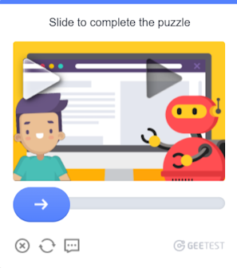

import Tabs from '@theme/Tabs';
import TabItem from '@theme/TabItem';
import ParamItem from '@theme/ParamItem';
import MethodItem from '@theme/MethodItem';
import MethodDescription from '@theme/MethodDescription'
import PriceBlock from '../../../../../src/theme/PriceBlock';
import PriceBlockWrap from '@theme/PriceBlockWrap';
import { ArticleHead } from '../../../../../src/theme/ArticleHead';

<ArticleHead slug="captchas/geetest-task" />

# GeeTest

<PriceBlockWrap>
  <PriceBlock title="GeeTestTask" captchaId="geetest"/>
</PriceBlockWrap>

 

Este tipo de tarefa é para resolver captcha GeeTest usando seus proxies.
Sua aplicação deve enviar o endereço do site, chave de domínio público (`gt`), chave (`challenge`) e proxy.

O resultado da resolução do problema são três ou cinco tokens para enviar o formulário.

:::warning **Atenção!**
O CapMonster Cloud, por padrão, funciona com proxies integrados — já incluídos no custo do serviço. É necessário especificar seus próprios proxies apenas nos casos em que o site não aceita o token ou quando o acesso aos serviços integrados está restrito.

Proxies com autorização de IP ainda não são suportados.
:::

:::info
- Os parâmetros `gt`, `challenge` e `geetestApiServerSubdomain` são mais frequentemente encontrados dentro da função JavaScript `initGeetest`.
- Você também pode vê-los no código HTML da página. Você pode encontrá-los no bloco `<sсript>`, que aparece após a página estar totalmente carregada no navegador.
  
V3


V4 (captcha_id = gt)


:::

<br />

## <span style={{fontSize: '2.25rem'}}>GeeTest V3</span>

### <span style={{fontSize: '1.5rem'}}>Possíveis variantes de captcha</span>

<Tabs className="full-width-tabs">
  <TabItem value="intelligent" label="Modo Inteligente" default className="bordered-panel">
    
  </TabItem>
  <TabItem value="slide" label="CAPTCHA de Deslizamento" className="bordered-panel">
    
  </TabItem>
  <TabItem value="icon" label="CAPTCHA de Ícone" className="bordered-panel">
    
  </TabItem>
  <TabItem value="space" label="CAPTCHA de Espaço" className="bordered-panel">
    
  </TabItem>
</Tabs>

### <span style={{fontSize: '1.5rem'}}>Parâmetros de solicitação</span>

  <TabItem value="proxy" label="GeeTestTask (com proxy)" className="bordered-panel">
    <ParamItem title="type" required type="string" />
    **GeeTestTask**

    ---

    <ParamItem title="websiteURL" required type="string" />
    Endereço da página onde o captcha é resolvido. O URL correto é sempre passado para o Referer na solicitação https://api-na.geetest.com/gettype.php? Por exemplo: Estamos em https://example.com#login, mas vemos que o captcha não está de fato inicializado lá, mas em https://example.com.

    ---

    <ParamItem title="gt" required type="string" />
    A chave identificadora do GeeTest `gt` para o domínio. Valor estático, raramente atualizado.

    ---

    <ParamItem title="challenge" required="required apenas para V3" type="string" />
    <p>
    Uma chave dinâmica.<br />Cada vez que nossa API é chamada, precisamos obter um novo valor de chave. Se o captcha for carregado na página, o valor `challenge` não será mais válido e você receberá o [erro](../api/api-errors.mdx) `ERROR_TOKEN_EXPIRED`. <br />
    Você será cobrado por tarefas com erro `ERROR_TOKEN_EXPIRED`.
    É necessário examinar as solicitações e encontrar aquela em que este valor é retornado e, antes de cada criação da tarefa de reconhecimento, executar esta solicitação e analisar o desafio a partir dela.
    </p>

    ---

    <ParamItem title="version" type="integer" required="required apenas para V4"/>
    3

    ---

    <ParamItem title="geetestApiServerSubdomain" type="string" />
    Servidor de subdomínio da API GeeTest (deve ser diferente de api.geetest.com). <br />Parâmetro opcional. Pode ser necessário para alguns sites.

    ---

    <ParamItem title="geetestGetLib" type="string" />
    Caminho para o script do captcha para exibi-lo na página. <br /> Parâmetro opcional. Pode ser necessário para alguns sites. <br />Enviar JSON como string.

    ---

    <ParamItem title="proxyType" type="string" />
    **http** - proxy http/https comum;<br />**https** - tente esta opção apenas se "http" não funcionar (necessário para alguns proxies personalizados);<br />**socks4** - proxy socks4;<br />**socks5** - proxy socks5.

    ---

    <ParamItem title="proxyAddress" type="string" />
    <p>
      Endereço IP proxy IPv4/IPv6. Não permitido:
      - uso de proxies transparentes (onde você pode ver o IP do cliente);
      - uso de proxies em máquinas locais.
    </p>

    ---

    <ParamItem title="proxyPort" type="integer" />
    Porta proxy.

    ---

    <ParamItem title="proxyLogin" type="string" />
    Login do servidor proxy.

    ---

    <ParamItem title="proxyPassword" type="string" />
    Senha do servidor proxy.

    ---

    <ParamItem title="userAgent" type="string" />
    User-Agent do navegador. <br />
**Transmita apenas o UA atual do sistema operacional Windows. No momento, o válido é**: `userAgentPlaceholder`

  </TabItem>


### <span style={{fontSize: '1.5rem'}}>Criar tarefa</span>

<Tabs className="full-width-tabs filled-tabs request-tabs" groupId="captcha-type">
<TabItem value="proxyless" label="GeeTestTask (sem proxy)" default className="method-panel">
    <MethodItem>
      ```http
      https://api.capmonster.cloud/createTask
      ```
    </MethodItem>
<MethodDescription>
**Solicitação**
```json
{
    "clientKey":"SUA_CHAVE_API_CAPMONSTER_CLOUD",
    "task":
    {
        "type":"GeeTestTask",
        "websiteURL":"https://www.geetest.com/en/demo",
        "gt":"022397c99c9f646f6477822485f30404",
        "challenge":"7f044f48bc951ecfbfc03842b5e1fe59",
		"geetestApiServerSubdomain":"api-na.geetest.com"

    }
}
```
**Resposta**
```json
{
  "errorId":0,
  "taskId":407533072
}
```

</MethodDescription>
</TabItem>
<TabItem value="proxy" label="GeeTestTask (com proxy)" className="method-panel">
<MethodItem>
```http
https://api.capmonster.cloud/createTask
```
</MethodItem>
<MethodDescription>
**Requisição**
```json
{
  "clientKey":"YOUR_CAPMONSTER_CLOUD_API_KEY",
  "task": {
    "type":"GeeTestTask",
    "websiteURL":"https://www.geetest.com/en/demo",
    "gt":"022397c99c9f646f6477822485f30404",
    "challenge":"7f044f48bc951ecfbfc03842b5e1fe59",
	"geetestApiServerSubdomain":"api-na.geetest.com",
    "proxyType":"http",
    "proxyAddress":"8.8.8.8",
    "proxyPort":8080,
    "proxyLogin":"proxyLoginHere",
    "proxyPassword":"proxyPasswordHere",
    "userAgent":"userAgentPlaceholder"
  }
}
```
**Resposta**
```json
{
  "errorId":0,
  "taskId":407533072
}
```
</MethodDescription>
</TabItem>

</Tabs>


Use o método [getTaskResult](../api/methods/get-task-result.mdx) para obter o resultado do reconhecimento do GeeTest. Dependendo da carga do sistema, você receberá uma resposta em um intervalo de 10 s a 30 s.

### <span style={{fontSize: '1.5rem'}}>Obter resultado da tarefa</span>


<TabItem value="proxyless" label="GeeTestTask (sem proxy)" default className="method-panel-full">
<MethodItem>
```http
https://api.capmonster.cloud/getTaskResult
```
</MethodItem>
<MethodDescription>
**Requisição**
```json
{
  "clientKey":"API_KEY",
  "taskId": 407533072
}
```
**Resposta**
```json
{
  "errorId":0,
  "status":"ready",
  "solution": {
    "challenge":"0f759dd1ea6c4wc76cedc2991039ca4f23",
    "validate":"6275e26419211d1f526e674d97110e15",
    "seccode":"510cd9735583edcb158601067195a5eb|jordan"
  }
}
```
</MethodDescription>
</TabItem>

<br />

<table><tr>
<th><b>Propriedade</b></th><th><b>Tipo</b></th><th><b>Descrição</b></th>
</tr>
<tr><td>challenge</td><td>String</td><td rowspan="3">Todos os três parâmetros são necessários ao enviar o formulário no site de destino.</td></tr>
<tr><td>validate</td><td>String</td></tr>
<tr><td>seccode</td><td>String</td></tr>
</table>

## Como Encontrar Todos os Parâmetros Necessários para a Criação da Tarefa

### Manualmente

1. Abra seu site onde o captcha aparece no navegador.
2. Clique com o botão direito no elemento do captcha e selecione **Inspecionar**.

Todos os parâmetros podem ser encontrados em *init-params* entre as requisições:


### Automaticamente

Para automatizar a extração dos parâmetros, eles podem ser obtidos via **navegador** (normal ou headless, por exemplo, usando **Playwright**) ou diretamente a partir de **requisições HTTP**. Como os valores dos parâmetros dinâmicos têm curta duração, recomenda-se utilizá-los imediatamente após a extração.

:::warning **Importante!**
Os trechos de código fornecidos são exemplos básicos para aprendizado sobre como extrair os parâmetros necessários. A implementação exata dependerá do seu site com captcha, sua estrutura e os elementos HTML e seletores utilizados.
:::

<Tabs className="full-width-tabs filled-tabs request-tabs">
  <TabItem value="js" label="JavaScript" default className="method-panel">
    <details>
      <summary>Mostrar código (no navegador)</summary>

      ```js
      (function detectGeeTestV3Browser() {
        const t = Date.now();
        const url = `https://example.com/api/v1/captcha/gee-test/init-params?t=${t}`;

        fetch(url)
          .then(res => res.json())
          .then(data => {
            const { gt, challenge } = data;
            if (gt && challenge) {
              console.log("GeeTest v3 detectado:");
              console.log({ gt, challenge });
            } else {
              console.log("Falha ao encontrar os parâmetros gt/challenge");
            }
          })
          .catch(err => console.error("Erro na requisição:", err));
      })();
      ```
    </details>

    <details>
      <summary>Mostrar código (Node.js)</summary>

      ```js
      async function detectGeeTestV3() {
        const result = {
          version: null,
          data: {},
        };

        const t = Date.now(); // Obter timestamp atual
        try {
          const response = await fetch(
            `https://example.com/api/v1/captcha/gee-test/init-params?t=${t}`
          );

          if (response.ok) {
            const data = await response.json();
            const challenge = data.challenge;
            const gt = data.gt;

            if (gt && challenge) {
              result.version = "v3";
              result.data = { gt, challenge };
              console.log(result.data);
            } else {
              console.log("Erro: gt ou challenge ausentes");
            }
          } else {
            console.log("Erro: status de resposta inválido", response.status);
          }
        } catch (error) {
          console.error("Falha na requisição", error);
        }

        return result;
      }

      detectGeeTestV3();
      ```
    </details>
  </TabItem>

  <TabItem value="python" label="Python" className="method-panel">
    <details>
      <summary>Mostrar código</summary>

      ```python
      import requests
      import asyncio
      import time

      async def detect_gee_test_v3():
        result = {
            'version': None,
            'data': {},
        }

        t = int(time.time() * 1000)
        response = requests.get(f'https://example.com/api/v1/captcha/gee-test/init-params?t={t}')
        
        if response.status_code == 200:
            data = response.json()
            challenge = data.get('challenge')
            gt = data.get('gt')

            if gt and challenge:
                result['version'] = 'v3'
                result['data'] = {'gt': gt, 'challenge': challenge}
                print(result['data'])
            else:
                print('erro')

        return result

      asyncio.run(detect_gee_test_v3())
      ```
    </details>
  </TabItem>

  <TabItem value="csharp" label="C#" className="method-panel">
    <details>
      <summary>Mostrar código</summary>

      ```csharp
      using System;
      using System.Net.Http;
      using System.Threading.Tasks;
      using Newtonsoft.Json.Linq;

      class Program
      {
          static async Task DetectGeeTestV3()
          {
              var result = new
              {
                  version = (string)null,
                  data = new { gt = (string)null, challenge = (string)null },
              };

              using (var client = new HttpClient())
              {
                  long t = DateTimeOffset.Now.ToUnixTimeMilliseconds();
                  var url = $"https://example.com/api/v1/captcha/gee-test/init-params?t={t}";

                  var response = await client.GetAsync(url);

                  if (response.IsSuccessStatusCode)
                  {
                      var responseContent = await response.Content.ReadAsStringAsync();
                      var data = JObject.Parse(responseContent);
                      var challenge = data["challenge"]?.ToString();
                      var gt = data["gt"]?.ToString();

                      if (!string.IsNullOrEmpty(gt) && !string.IsNullOrEmpty(challenge))
                      {
                          result = new
                          {
                              version = "v3",
                              data = new { gt = gt, challenge = challenge }
                          };
                          Console.WriteLine($"GT: {gt}, Challenge: {challenge}");
                      }
                      else
                      {
                          Console.WriteLine("Erro: Parâmetros necessários ausentes.");
                      }
                  }
                  else
                  {
                      Console.WriteLine("Erro: Falha ao obter resposta.");
                  }
              }
          }

          static async Task Main(string[] args)
          {
              await DetectGeeTestV3();
          }
      }
      ```
    </details>
  </TabItem>
</Tabs>

## <span style={{fontSize: '1.5rem'}}>Usar biblioteca SDK</span>

<Tabs className="full-width-tabs filled-tabs request-tabs" groupId="captcha-type">
  <TabItem value="js" label="JavaScript" default className="method-panel">
  <details>
      <summary>Mostrar Código (para navegador)</summary>
    ```js
    // https://github.com/ZennoLab/capmonstercloud-client-js

    import { 
        CapMonsterCloudClientFactory, 
        ClientOptions, 
        GeeTestRequest 
    } from '@zennolab_com/capmonstercloud-client';

    const API_KEY = "YOUR_API_KEY"; // Insira sua chave de API do CapMonster Cloud

    document.addEventListener('DOMContentLoaded', async () => {
        const client = CapMonsterCloudClientFactory.Create(
            new ClientOptions({ clientKey: API_KEY })
        );

        // Se necessário, você pode verificar o saldo
        const balance = await client.getBalance();
        console.log("Balance:", balance);

        // Exemplo básico sem proxy
        // O CapMonster Cloud usa automaticamente seus próprios proxies
        let geetestRequest = new GeeTestRequest({
            websiteURL: "https://example.com/geetest.php", // URL da página com captcha
            gt: "81dc9bdb52d04dc20036dbd8313ed055",       // Substitua pelo valor correto
            challenge: "d93591bdf7860e1e4ee2fca799911215" // Substitua pelo valor correto
        });

        // Exemplo de uso do seu próprio proxy
        // Descomente este bloco se quiser usar um proxy personalizado

        /*
        const proxy = {
            proxyType: "https",
            proxyAddress: "123.45.67.89",
            proxyPort: 8080,
            proxyLogin: "username",
            proxyPassword: "password"
        };

        geetestRequest = new GeeTestRequest({
            websiteURL: "https://example.com/geetest.php",
            gt: "81dc9bdb52d04dc20036dbd8313ed055",
            challenge: "d93591bdf7860e1e4ee2fca799911215",
            proxy,
            userAgent: "userAgentPlaceholder"
        });
        */

        const result = await client.Solve(geetestRequest);
        console.log("Solution:", result);
    });
    ```
    </details>

    <details>
      <summary>Mostrar Código (Node.js)</summary>
```javascript
// https://github.com/ZennoLab/capmonstercloud-client-js

import { CapMonsterCloudClientFactory, ClientOptions, GeeTestRequest } from '@zennolab_com/capmonstercloud-client';

const API_KEY = "YOUR_API_KEY"; // Insira sua chave de API do CapMonster Cloud

async function solveGeeTest() {
    const client = CapMonsterCloudClientFactory.Create(
        new ClientOptions({ clientKey: API_KEY })
    );

    // Se necessário, você pode verificar o saldo
    const balance = await client.getBalance();
    console.log("Balance:", balance);

    // Exemplo básico sem proxy
    // O CapMonster Cloud usa automaticamente seus próprios proxies
    let geetestRequest = new GeeTestRequest({
        websiteURL: "https://example.com/geetest.php", // URL da página com captcha
        gt: "81dc9bdb52d04dc20036dbd8313ed055",       // Substitua pelo valor correto
        challenge: "d93591bdf7860e1e4ee2fca799911215" // Substitua pelo valor correto
    });

    // Exemplo de uso do seu próprio proxy
    // Descomente este bloco se quiser usar um proxy personalizado

    /*
    const proxy = {
        proxyType: "https",
        proxyAddress: "123.45.67.89",
        proxyPort: 8080,
        proxyLogin: "username",
        proxyPassword: "password"
    };

    geetestRequest = new GeeTestRequest({
        websiteURL: "https://example.com/geetest.php",
        gt: "81dc9bdb52d04dc20036dbd8313ed055",
        challenge: "d93591bdf7860e1e4ee2fca799911215",
        proxy,
        userAgent: "userAgentPlaceholder"
    });
    */

    const result = await client.Solve(geetestRequest);
    console.log("Solution:", result);
}

solveGeeTest().catch(console.error);
```
</details>
  </TabItem>

  <TabItem value="python" label="Python" className="method-panel">
  <details>
      <summary>Mostrar Código</summary>
    ```python
    # https://github.com/ZennoLab/capmonstercloud-client-python

    import asyncio
    from capmonstercloudclient import CapMonsterClient, ClientOptions
    from capmonstercloudclient.requests import GeetestRequest
    # from capmonstercloudclient.requests.baseRequestWithProxy import ProxyInfo   # Descomente se quiser usar um proxy personalizado

    API_KEY = "YOUR_API_KEY"  # Insira sua chave de API do CapMonster Cloud

    async def solve_geetest():
        client_options = ClientOptions(api_key=API_KEY)
        cap_monster_client = CapMonsterClient(options=client_options)

        # Exemplo básico sem proxy
        # O CapMonster Cloud usa automaticamente seus próprios proxies
        geetest_request = GeetestRequest(
            websiteUrl="https://example.com",
            gt="81dc9bdb52d04dc20036dbd8313ed055",
            challenge="d93591bdf7860e1e4ee2fca799911215"
        )

        # Exemplo de uso do seu próprio proxy
        # Descomente este bloco se quiser usar um proxy personalizado

        # proxy = ProxyInfo(
        #     proxyType="http",
        #     proxyAddress="123.45.67.89",
        #     proxyPort=8080,
        #     proxyLogin="username",
        #     proxyPassword="password"
        # )

        # geetest_request = GeetestRequest(
        #     websiteUrl="https://example.com",
        #     gt="81dc9bdb52d04dc20036dbd8313ed055",
        #     challenge="d93591bdf7860e1e4ee2fca799911215",
        #     proxy=proxy,
        #     userAgent="userAgentPlaceholder"
        # )

        # Se necessário, você pode verificar o saldo
        balance = await cap_monster_client.get_balance()
        print("Balance:", balance)

        result = await cap_monster_client.solve_captcha(geetest_request)
        print("Solution:", result)

    asyncio.run(solve_geetest())
    ```
    </details>
  </TabItem>

  <TabItem value="csharp" label="C#" className="method-panel">
<details>
      <summary>Mostrar Código</summary>
    ```csharp
    // https://github.com/ZennoLab/capmonstercloud-client-dotnet

    using System;
    using System.Threading.Tasks;
    using Zennolab.CapMonsterCloud;
    using Zennolab.CapMonsterCloud.Requests;

    class Program
    {
        static async Task Main(string[] args)
        {
            // Insira sua chave de API do CapMonster Cloud
            var clientOptions = new ClientOptions
            {
                ClientKey = "YOUR_API_KEY"
            };

            var cmCloudClient = CapMonsterCloudClientFactory.Create(clientOptions);

            // Se necessário, você pode verificar o saldo
            var balance = await cmCloudClient.GetBalanceAsync();
            Console.WriteLine("Balance: " + balance);

            // Exemplo básico sem proxy
            // O CapMonster Cloud usa automaticamente seus próprios proxies
            var geetestRequest = new GeeTestRequest
            {
                WebsiteUrl = "https://example.com/demo/geetest", // URL da página com o captcha
                Gt = "your_gt_value",                             // Substitua pelo valor correto
                Challenge = "your_challenge_value"               // Substitua pelo valor correto
            };

            // Exemplo de uso do seu próprio proxy
            // Descomente este bloco se quiser usar um proxy personalizado
            /*
            var geetestRequest = new GeeTestRequest
            {
                WebsiteUrl = "https://example.com/demo/geetest", // URL da página com o captcha
                Gt = "your_gt_value",  
                Challenge = "your_challenge_value",

                Proxy = new ProxyContainer(
                    "123.45.67.89", 
                    8080,           
                    ProxyType.Http,    
                    "username",  
                    "password"
                )
            };
            */

            var geetestResult = await cmCloudClient.SolveAsync(geetestRequest);

            Console.WriteLine("Solution:");
            Console.WriteLine($"Challenge: {geetestResult.Solution.Challenge}");
            Console.WriteLine($"Validate:  {geetestResult.Solution.Validate}");
            Console.WriteLine($"SecCode:   {geetestResult.Solution.SecCode}");
        }
    }
    ```
    </details>
  </TabItem>  
</Tabs>

<br />

## <span style={{fontSize: '2.25rem'}}>GeeTest V4</span>

### <span style={{fontSize: '1.5rem'}}>Possível variante de captcha</span>


### <span style={{fontSize: '1.5rem'}}>Parâmetros de requisição</span>

<TabItem value="proxy" label="GeeTestTask (usando proxy)" className="bordered-panel">
<ParamItem title="type" required type="string" />
**GeeTestTask**

---

<ParamItem title="websiteURL" required type="string" />
Endereço da página onde o captcha está sendo resolvido.

---

<ParamItem title="gt" required type="string" />
A chave do identificador GeeTest para o domínio - o parâmetro `captcha_id`.

---

<ParamItem title="version" type="integer" required="required only for V4"/>
4

---

<ParamItem title="geetestApiServerSubdomain" type="string" />
Subdomínio do servidor API GeeTest (deve ser diferente de api.geetest.com). <br />Parâmetro opcional. Pode ser necessário para alguns sites.

---

<ParamItem title="geetestGetLib" type="string" />
Caminho para o script captcha para exibi-lo na página. <br />Parâmetro opcional. Pode ser necessário para alguns sites. <br />Enviar JSON como string.

---

<ParamItem title="initParameters" type="object" />
Parâmetros adicionais para a versão 4, usados junto com “riskType” (tipo de captcha/características de sua verificação).

---

<ParamItem title="proxyType" type="string" />
**http** - proxy http/https comum;<br />**https** - tente essa opção apenas se "http" não funcionar (necessário para alguns proxies personalizados);<br />**socks4** - proxy socks4;<br />**socks5** - proxy socks5.

---

<ParamItem title="proxyAddress" type="string" />
<p>
Endereço IP do proxy IPv4/IPv6. Não permitido:
- uso de proxies transparentes (onde é possível ver o IP do cliente);
- uso de proxies em máquinas locais.
</p>

---

<ParamItem title="proxyPort" type="integer" />
Porta do proxy.

---

<ParamItem title="proxyLogin" type="string" />
Login do servidor proxy.

---

<ParamItem title="proxyPassword" type="string" />
Senha do servidor proxy.

---

<ParamItem title="userAgent" type="string" />
User-Agent do navegador. <br />
**Transmita apenas o UA atual do sistema operacional Windows. No momento, o válido é**: `userAgentPlaceholder`
</TabItem>


### <span style={{fontSize: '1.5rem'}}>Método de criação de tarefa</span>


<Tabs className="full-width-tabs filled-tabs request-tabs" groupId="captcha-type">
<TabItem value="proxyless" label="GeeTestTask (sem proxy)" default className="method-panel">
<MethodItem>
```http
https://api.capmonster.cloud/createTask
```
</MethodItem>
<MethodDescription>
**Requisição**
```json
{
    "clientKey":"YOUR_CAPMONSTER_CLOUD_API_KEY",
    "task":
    {
        "type":"GeeTestTask",
        "websiteURL":"https://gt4.geetest.com/",
        "gt":"54088bb07d2df3c46b79f80300b0abbe",
        "version": 4,
        "initParameters": {
          "riskType": "slide"
        }
    }
}
```

**Resposta**
```json
{
  "errorId":0,
  "taskId":407533072
}
```

</MethodDescription>
</TabItem>
<TabItem value="proxy" label="GeeTestTask (com proxy)" className="method-panel">
<MethodItem>
```http
https://api.capmonster.cloud/createTask
```
</MethodItem>
<MethodDescription>
**Requisição**
```json
{
  "clientKey":"YOUR_CAPMONSTER_CLOUD_API_KEY",
  "task": {
    "type":"GeeTestTask",
    "websiteURL":"https://gt4.geetest.com/",
    "gt":"54088bb07d2df3c46b79f80300b0abbe",
    "version": 4,
    "initParameters": {
      "riskType": "slide"
    },
    "proxyType":"http",
    "proxyAddress":"8.8.8.8",
    "proxyPort":8080,
    "proxyLogin":"proxyLoginHere",
    "proxyPassword":"proxyPasswordHere",
    "userAgent":"userAgentPlaceholder"
	
  }
}
```

**Resposta**
```json
{
  "errorId":0,
  "taskId":407533072
}
```
</MethodDescription>
</TabItem>

</Tabs>

Use o [getTaskResult](../api/methods/get-task-result.mdx) para obter o resultado do reconhecimento GeeTest. Dependendo da carga do sistema, você receberá uma resposta em um intervalo de 10 s a 30 s.

### <span style={{fontSize: '1.5rem'}}>Método de obtenção do resultado da tarefa</span>

<TabItem value="proxyless" label="GeeTestTask (sem proxy)" default className="method-panel-full">
<MethodItem>
```http
https://api.capmonster.cloud/getTaskResult
```
</MethodItem>
<MethodDescription>
**Requisição**
```json
{
  "clientKey":"API_KEY",
  "taskId": 407533072
}
```
**Resposta**
```json
{
  "errorId":0,
  "status":"ready",
  "solution": {
    "captcha_id":"f5c2ad5a8a3cf37192d8b9c039950f79",
    "lot_number":"bcb2c6ce2f8e4e9da74f2c1fa63bd713",
    "pass_token":"edc7a17716535a5ae624ef4707cb6e7e478dc557608b068d202682c8297695cf",
    "gen_time":"1683794919",
    "captcha_output":"XwmTZEJCJEnRIJBlvtEAZ662T...[cut]...SQ3fX-MyoYOVDMDXWSRQig56"
  }
}
```
</MethodDescription>
</TabItem>

<br />

<table>
<tr>
<th><b>Propriedade</b></th><th><b>Tipo</b></th><th><b>Descrição</b></th>
</tr>
<tr>
<td>captcha_id</td><td>String</td><td rowspan="5">Todos os cinco parâmetros são necessários ao enviar o formulário no site de destino.<br />input[name=captcha_id]<br />input[name=lot_number]<br />input[name=pass_token]<br />input[name=gen_time]<br />input[name=captcha_output]</td>
</tr>
<tr><td>lot_number</td><td>String</td></tr>
<tr><td>pass_token</td><td>String</td></tr>
<tr><td>gen_time</td><td>String</td></tr>
<tr><td>captcha_output</td><td>String</td></tr>
</table>

## Como Encontrar Todos os Parâmetros Necessários para a Criação da Tarefa

### Manualmente

1. Abra seu site onde o captcha aparece no navegador.  
2. Clique com o botão direito no elemento do captcha e selecione **Inspecionar**.

Os parâmetros podem ser carregados em *load?callback*:


### Automaticamente

Uma forma conveniente de automatizar a busca por todos os parâmetros necessários.  
Alguns parâmetros são regenerados toda vez que a página carrega, então você precisará extraí-los através de um navegador — seja normal ou headless (por exemplo, usando **Playwright**).  
Como os valores dos parâmetros dinâmicos têm vida curta, o captcha deve ser resolvido imediatamente após recuperá-los.

:::warning **Importante!**  
Os trechos de código fornecidos são exemplos básicos para familiarização com a extração dos parâmetros necessários. A implementação exata dependerá da sua página de captcha, sua estrutura e os elementos/seletores HTML que ela utiliza.  
:::

<Tabs className="full-width-tabs filled-tabs request-tabs">
  <TabItem value="js" label="JavaScript" default className="method-panel">
    <details>
      <summary>Mostrar código (no navegador)</summary>

      ```js
      (function() {
        function getQueryParams(url) {
          const params = new URLSearchParams(new URL(url).search);
          const captchaId = params.get('captcha_id');
          const challenge = params.get('challenge');
          const riskType = params.get('risk_type');
          return { captchaId, challenge, riskType };
        }

        const observer = new PerformanceObserver((list) => {
          const entries = list.getEntriesByType('resource');
          entries.forEach((entry) => {
            if (entry.name.includes('https://gcaptcha4.geetest.com/load?')) {
              const { captchaId, challenge, riskType } = getQueryParams(entry.name);
              if (captchaId && challenge) {
                console.log('GeeTest v4 detectado (via PerformanceObserver):');
                console.log({ captchaId, challenge, riskType });
              }
            }
          });
        });

        observer.observe({ type: 'resource', buffered: true });
      })();
      ```
    </details>

    <details>
      <summary>Mostrar código (Node.js)</summary>

      ```js
      import { chromium } from "playwright";

      async function detectGeeTestV4(pageUrl) {
        const result = { version: null, data: {} };

        const browser = await chromium.launch({ headless: false });
        const context = await browser.newContext();
        const page = await context.newPage();

        page.on("response", async (response) => {
          const url = response.url();
          if (url.includes("https://gcaptcha4.geetest.com/load?")) {
            const urlParams = new URLSearchParams(url.split("?")[1]);
            const captchaId = urlParams.get("captcha_id");
            const challenge = urlParams.get("challenge");
            const riskType = urlParams.get("risk_type");

            if (captchaId && challenge && !result.version) {
              result.version = "v4";
              result.data = {
                captchaId: captchaId,
                challenge: challenge,
                riskType: riskType,
              };
              console.log("GeeTest v4 detectado:");
              console.log(result.data);
            }
          }
        });

        await page.goto(pageUrl, { waitUntil: "networkidle" });
        await page.waitForTimeout(20000);

        if (!result.version) {
          console.log("erro");
        }

        await browser.close();
        return result;
      }

      detectGeeTestV4("https://example.com").then((result) => {
        console.log(result);
      });
      ```
    </details>
  </TabItem>

  <TabItem value="python" label="Python" className="method-panel">
    <details>
      <summary>Mostrar código</summary>

      ```python
      import asyncio
      from playwright.async_api import async_playwright
      from urllib.parse import urlparse, parse_qs

      async def detect_geetest_v4(page_url):
          result = {"version": None, "data": {}}

          async with async_playwright() as p:
              browser = await p.chromium.launch(headless=False)
              context = await browser.new_context()
              page = await context.new_page()

              async def on_request(request):
                  url = request.url
                  if "https://gcaptcha4.geetest.com/load?" in url:
                      query = parse_qs(urlparse(url).query)
                      captcha_id = query.get("captcha_id", [None])[0]
                      challenge = query.get("challenge", [None])[0]
                      risk_type = query.get("risk_type", [None])[0]

                      if captcha_id and challenge and not result["version"]:
                          result["version"] = "v4"
                          result["data"] = {
                              "captchaId": captcha_id,
                              "challenge": challenge,
                              "riskType": risk_type
                          }
                          print("GeeTest v4 detectado:")
                          print(result["data"])

              context.on("request", on_request)

              await page.goto(page_url, wait_until="networkidle")
              await asyncio.sleep(10)

              if not result["version"]:
                  print("erro")

              await browser.close()
              return result

      asyncio.run(detect_geetest_v4("https://www.example.com"))
      ```
    </details>
  </TabItem>

  <TabItem value="csharp" label="C#" className="method-panel">
    <details>
      <summary>Mostrar código</summary>

      ```csharp
      using System;
      using System.Threading.Tasks;
      using Microsoft.Playwright;
      using System.Web;

      class Program
      {
          public static async Task Main(string[] args)
          {
              var result = new
              {
                  Version = (string)null,
                  Data = new
                  {
                      CaptchaId = (string)null,
                      Challenge = (string)null,
                      RiskType = (string)null
                  }
              };

              using var playwright = await Playwright.CreateAsync();
              var browser = await playwright.Chromium.LaunchAsync(new BrowserTypeLaunchOptions
              {
                  Headless = false
              });

              var context = await browser.NewContextAsync();
              var page = await context.NewPageAsync();

              page.Request += (_, request) =>
              {
                  var url = request.Url;

                  if (url.Contains("https://gcaptcha4.geetest.com/load?"))
                  {
                      var uri = new Uri(url);
                      var queryParams = HttpUtility.ParseQueryString(uri.Query);
                      var captchaId = queryParams.Get("captcha_id");
                      var challenge = queryParams.Get("challenge");
                      var riskType = queryParams.Get("risk_type");

                      if (!string.IsNullOrEmpty(captchaId) && !string.IsNullOrEmpty(challenge))
                      {
                          Console.WriteLine("GeeTest v4 detectado:");
                          Console.WriteLine($"CaptchaId: {captchaId}");
                          Console.WriteLine($"Challenge: {challenge}");
                          Console.WriteLine($"RiskType: {riskType}");
                      }
                  }
              };

              await page.GotoAsync("https://www.example.com/", new PageGotoOptions
              {
                  WaitUntil = WaitUntilState.NetworkIdle
              });

              await Task.Delay(10000);

              await browser.CloseAsync();
          }
      }
      ```
    </details>
  </TabItem>
</Tabs>

## <span style={{fontSize: '1.5rem'}}>Usar biblioteca SDK</span>

<Tabs className="full-width-tabs filled-tabs request-tabs" groupId="captcha-type">
  <TabItem value="js" label="JavaScript" default className="method-panel">
  <details>
      <summary>Mostrar Código (para navegador)</summary>
    ```js
    // https://github.com/ZennoLab/capmonstercloud-client-js

    import { 
        CapMonsterCloudClientFactory, 
        ClientOptions, 
        GeeTestRequest 
    } from '@zennolab_com/capmonstercloud-client';

    const API_KEY = "YOUR_API_KEY"; // Insira sua chave de API do CapMonster Cloud

    document.addEventListener('DOMContentLoaded', async () => {
        const client = CapMonsterCloudClientFactory.Create(
            new ClientOptions({ clientKey: API_KEY })
        );

        // Se necessário, você pode verificar o saldo
        const balance = await client.getBalance();
        console.log("Balance:", balance);

        // Exemplo básico sem proxy
        // O CapMonster Cloud usa automaticamente seus próprios proxies
        let geetestRequest = new GeeTestRequest({
            websiteURL: "https://example.com/geetest.php", // URL da página com o captcha
            gt: "81dc9bdb52d04dc20036dbd8313ed055",
            challenge: "d93591bdf7860e1e4ee2fca799911215",
            version: "4",
            initParameters: { riskType: "slide" }
        });

        // Exemplo de uso do seu próprio proxy
        // Descomente este bloco se quiser usar um proxy personalizado

        /*
        const proxy = {
            proxyType: "https",
            proxyAddress: "123.45.67.89",
            proxyPort: 8080,
            proxyLogin: "username",
            proxyPassword: "password"
        };

        geetestRequest = new GeeTestRequest({
            websiteURL: "https://example.com/geetest.php",
            gt: "81dc9bdb52d04dc20036dbd8313ed055",
            challenge: "d93591bdf7860e1e4ee2fca799911215",
            version: "4",
            initParameters: { riskType: "slide" },
            proxy,
            userAgent: "userAgentPlaceholder"
        });
        */

        const result = await client.Solve(geetestRequest);
        console.log("Solution:", result);
    });
    ```
    </details>

    <details>
      <summary>Mostrar Código (Node.js)</summary>
```javascript
// https://github.com/ZennoLab/capmonstercloud-client-js

import { CapMonsterCloudClientFactory, ClientOptions, GeeTestRequest } from '@zennolab_com/capmonstercloud-client';

const API_KEY = "YOUR_API_KEY"; // Insira sua chave de API do CapMonster Cloud

async function solveGeeTest() {
    const client = CapMonsterCloudClientFactory.Create(
        new ClientOptions({ clientKey: API_KEY })
    );

    // Se necessário, você pode verificar o saldo
    const balance = await client.getBalance();
    console.log("Balance:", balance);

    // Exemplo básico sem proxy
    // O CapMonster Cloud usa automaticamente seus próprios proxies
    let geetestRequest = new GeeTestRequest({
        websiteURL: "https://example.com/geetest.php", // URL da página com o captcha
        gt: "81dc9bdb52d04dc20036dbd8313ed055",
        challenge: "d93591bdf7860e1e4ee2fca799911215",
        version: "4",                                 
        initParameters: { riskType: "slide" }
    });

    // Exemplo de uso do seu próprio proxy
    // Descomente este bloco se quiser usar um proxy personalizado

    /*
    const proxy = {
        proxyType: "https",
        proxyAddress: "123.45.67.89",
        proxyPort: 8080,
        proxyLogin: "username",
        proxyPassword: "password"
    };

    geetestRequest = new GeeTestRequest({
        websiteURL: "https://example.com/geetest.php",
        gt: "81dc9bdb52d04dc20036dbd8313ed055",
        challenge: "d93591bdf7860e1e4ee2fca799911215",
        version: "4",
        initParameters: { riskType: "slide" },
        proxy,
        userAgent: "userAgentPlaceholder"
    });
    */

    const result = await client.Solve(geetestRequest);
    console.log("Solution:", result);
}

solveGeeTest().catch(console.error);
```
</details>
  </TabItem>
  
  <TabItem value="python" label="Python" className="method-panel">
<details>
      <summary>Mostrar Código</summary>
    ```python
    # https://github.com/ZennoLab/capmonstercloud-client-python

    import asyncio
    from capmonstercloudclient import CapMonsterClient, ClientOptions
    from capmonstercloudclient.requests import GeetestRequest
    # from capmonstercloudclient.requests.baseRequestWithProxy import ProxyInfo  # Descomente se planeja usar proxies personalizados

    API_KEY = "YOUR_API_KEY"  # Insira sua chave de API do CapMonster Cloud

    async def solve_geetest_v4():
        client_options = ClientOptions(api_key=API_KEY)
        cap_monster_client = CapMonsterClient(options=client_options)

        # Exemplo básico sem proxy
        # O CapMonster Cloud usa automaticamente seus próprios proxies
        geetest_request = GeetestRequest(
            websiteUrl="https://example.com/",
            gt="54088bb07d2df3c46b79f80300b0abbe",
            version=4,
            initParameters={
                "riskType": "slide"
            }
        )

        # Exemplo de uso do seu próprio proxy
        # Descomente este bloco se quiser usar um proxy personalizado

        # proxy = ProxyInfo(
        #     proxyType="http",
        #     proxyAddress="123.45.67.89",
        #     proxyPort=8080,
        #     proxyLogin="username",
        #     proxyPassword="password"
        # )

        # geetest_request = GeetestRequest(
        #     websiteUrl="https://example.com/",
        #     gt="54088bb07d2df3c46b79f80300b0abbe",
        #     version=4,
        #     initParameters={
        #         "riskType": "slide"
        #     },
        #     proxy=proxy,
        #     userAgent="userAgentPlaceholder"
        # )

        # Se necessário, você pode verificar o saldo
        balance = await cap_monster_client.get_balance()
        print("Balance:", balance)

        result = await cap_monster_client.solve_captcha(geetest_request)
        print("Solution:", result)

    asyncio.run(solve_geetest_v4())
    ```
    </details>
  </TabItem>
  
  <TabItem value="csharp" label="C#" className="method-panel">
  <details>
      <summary>Mostrar Código</summary>
    ```csharp
    // https://github.com/ZennoLab/capmonstercloud-client-dotnet

    using System;
    using System.Collections.Generic;
    using System.Threading.Tasks;
    using Zennolab.CapMonsterCloud;
    using Zennolab.CapMonsterCloud.Requests;

    class Program
    {
        static async Task Main(string[] args)
        {
            // Insira sua chave de API do CapMonster Cloud
            var clientOptions = new ClientOptions
            {
                ClientKey = "YOUR_API_KEY"
            };

            var cmCloudClient = CapMonsterCloudClientFactory.Create(clientOptions);

            // Se necessário, você pode verificar o saldo
            var balance = await cmCloudClient.GetBalanceAsync();
            Console.WriteLine("Balance: " + balance);

            // Exemplo básico sem proxy
            // O CapMonster Cloud usa automaticamente seus próprios proxies
            var geetestRequest = new GeeTestRequest
            {
                WebsiteUrl = "https://example.com/", // URL da página com a captcha
                Gt = "54088bb07d2df3c46b79f80300b0abbe",
                Version = 4,                             
                InitParameters = new Dictionary<string, string> { { "riskType", "slide" } } // Parâmetro adicional para V4
            };

            // Exemplo de uso do seu próprio proxy
            // Descomente este bloco se quiser usar um proxy personalizado
            /*
            var geetestRequest = new GeeTestRequest
            {
                WebsiteUrl = "https://example.com/",
                Gt = "54088bb07d2df3c46b79f80300b0abbe",
                Version = 4,
                InitParameters = new Dictionary<string, string> { { "riskType", "slide" } },

                Proxy = new ProxyContainer(
                    "123.45.67.89", 
                    8080,           
                    ProxyType.Http,    
                    "username",   
                    "password" 
                )
            };
            */

            var geetestResult = await cmCloudClient.SolveAsync(geetestRequest);

            Console.WriteLine("Solution:");
            Console.WriteLine($"CaptchaId:     {geetestResult.Solution.CaptchaId}");
            Console.WriteLine($"LotNumber:     {geetestResult.Solution.LotNumber}");
            Console.WriteLine($"PassToken:     {geetestResult.Solution.PassToken}");
            Console.WriteLine($"GenTime:       {geetestResult.Solution.GenTime}");
            Console.WriteLine($"CaptchaOutput: {geetestResult.Solution.CaptchaOutput}");
        }
    }
    ```
    </details>
  </TabItem>
</Tabs>

## Características da solução GeeTest em app.gal\*\*.com

:::warning **Atenção!**
Esta seção é **apenas relevante para o captcha GeeTest no site `app.gal**.com`**. Estes valores não devem ser usados em outros sites.
:::

<details>
  <summary>Quando usar o campo <code>challenge</code>?</summary>

Para o site **`app.gal**.com`**, é necessário especificar o valor do campo `challenge` de acordo com a ação a ser realizada. Se este campo não for especificado, o valor padrão **`AddTypedCredentialItems`** será usado, mas isso não serve para todos os cenários.

Lista de valores possíveis para `challenge`:

| Ação no site `app.gal**.com`        | Valor do challenge          |
| ----------------------------------- | --------------------------- |
| Enviar código por e-mail            | `SendEmailCode`             |
| Confirmar ação (por exemplo, login) | `SendVerifyCode`            |
| Resgatar recompensa                 | `ClaimUserTask`             |
| Abrir caixa misteriosa              | `OpenMysteryBox`            |
| Comprar na GGShop                   | `BuyGGShop`                 |
| Preparar compra de bilhetes         | `PrepareBuyGGRaffleTickets` |
| Adicionar credenciais               | `AddTypedCredentialItems`   |
| Criar ticket de suporte             | `CreateReportTicket`        |
| Participar de atividade             | `PrepareParticipate`        |
| Atualizar dados de credenciais      | `RefreshCredentialValue`    |
| Sincronizar dados                   | `SyncCredentialValue`       |
| Login via redes sociais             | `GetSocialAuthUrl`          |

> O valor de `challenge` deve corresponder ao `operationName` visível nas requisições de rede (`Network`) no DevTools.


</details>

<details>
  <summary>Exemplo de envio de tarefa</summary>

```json
{
  "type": "GeeTestTaskProxyless",
  "websiteURL": "https://app.gal**.com/accountSetting/social",
  "gt": "244bcb8b9846215df5af4c624a750db4",
  "challenge": "SendVerifyCode"
}
```

> Observação: A chave GT para gal\*\*.com é sempre `244bcb8b9846215df5af4c624a750db4`. Este valor pode ser mantido como padrão.

</details>

<details>
  <summary>Exemplo de resposta</summary>

```json
{
  "errorId": 0,
  "errorCode": null,
  "errorDescription": null,
  "solution": {
    "lot_number": "e0c84aab60867ad1316f8606d31ab58d2a54d8a4ca8e78b9339abd8ea62967cb",
    "captcha_output": "7DlZW2dul...cbEA5uIbwg==",
    "pass_token": "ce024389a0926e0d1081792c83e0c46f882084e45e95afa0e148fd03aed3ae10",
    "gen_time": "1753158042",
    "encryptedData": ""
  },
  "status": "ready"
}
```

O campo `encryptedData` no site geralmente está vazio, pois a lógica do cliente o ignora. Embora o valor seja retornado via WebAssembly, na prática ele não é utilizado.

</details>
