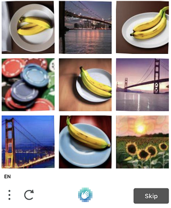

import Tabs from '@theme/Tabs';
import TabItem from '@theme/TabItem';
import ParamItem from '@theme/ParamItem';
import MethodItem from '@theme/MethodItem';
import MethodDescription from '@theme/MethodDescription'
import PriceBlock from '@theme/PriceBlock';
import PriceBlockWrap from '@theme/PriceBlockWrap';
import { ArticleHead } from '../../../../../src/theme/ArticleHead';

<ArticleHead slug="captchas/hcaptcha-task" />

# HCaptchaTask

<PriceBlockWrap>
  <PriceBlock title="hCaptcha" name="hCaptchaToken"/>
  <PriceBlock title="hCaptcha Enterprise" name="hCaptchaEnterpriseToken"/>
</PriceBlockWrap>


O objeto contém dados para a tarefa de resolver o hCaptcha. Para fornecer uma universalidade sólida na resolução desse tipo de tarefa, reproduzimos cada parte do ambiente utilizado para a tarefa de automação que você planeja concluir. Isso inclui: acesso ao proxy, user-agent do navegador, cookies (opcionalmente). Essa abordagem eliminará todos os possíveis obstáculos que possam surgir no futuro.

Esse tipo de captcha pode demorar um pouco mais para ser resolvido do que um captcha de imagem comum, mas essa questão é compensada pelo fato de que o valor de g-captcha-response que enviamos a você é válido pelos próximos 60 segundos após resolvermos seu Captcha.

**Importante!** Se você estiver enfrentando problemas com a aceitação do token hcaptcha, entre em contato com o suporte da CapMonster Cloud com a URL e sitekey fornecidos. Tentaremos resolver esse problema o mais rápido possível.

## Parâmetros da solicitação

<Tabs className="full-width-tabs filled-tabs" groupId="captcha-type">
<TabItem value="proxyless" label="HCaptchaTaskProxyless (sem proxy)" default className="bordered-panel">
    <ParamItem title="type" required type="string" />
    **HCaptchaTaskProxyless**

    ---

    <ParamItem title="websiteURL" required type="string" />
    Endereço de uma página da web com hCaptcha.

    ---

    <ParamItem title="websiteKey" required type="string" />
    Chave do site hCaptcha.

    ---

    <ParamItem title="isInvisible" type="boolean" />
    Use true para a versão invisível do hCaptcha.

    ---

    <ParamItem title="data" type="string" />
    <p>Dados personalizados usados em algumas implementações do hCaptcha, principalmente com `isInvisible=true`.</p>

    ---

    <ParamItem title="userAgent" type="string" />
    **Forneça apenas o UA real do sistema operacional Windows. Agora é:** userAgentPlaceholder

    ---

    <ParamItem title="cookies" type="string" />
    <p>Cookies adicionais que devemos usar durante a interação com a página de destino.</p><p>**Formato**: cookiename1=cookievalue1; cookiename2=cookievalue2</p>

    ---

    <ParamItem title="fallbackToActualUA" type="boolean" />
    <p>**true** - ao especificar este parâmetro, ignoramos o User Agent irrelevante que os usuários enviam na solicitação e retornamos o nosso próprio (relevante) com getTaskResult. Isso melhorará a aceitação de tokens.</p><p>**false** - inserimos o User Agent especificado na solicitação. Se o User Agent for inválido, você receberá um erro ERROR_WRONG_USERAGENT (USERAGENT EXPIRED no log).</p>

  </TabItem>
  <TabItem value="proxy" label="HCaptchaTask (usando proxy)" className="bordered-panel">
    <ParamItem title="type" required type="string" />
    **HCaptchaTask**

    ---

    <ParamItem title="websiteURL" required type="string" />
    Endereço de uma página da web com hCaptcha.

    ---

    <ParamItem title="websiteKey" required type="string" />
    Chave do site hCaptcha.

    ---

    <ParamItem title="isInvisible" type="boolean" />
    Use true para a versão invisível do hCaptcha.

    ---

    <ParamItem title="data" type="string" />
    <p>Dados personalizados usados em algumas implementações do hCaptcha, principalmente com `isInvisible=true`.</p>

    ---

    <ParamItem title="userAgent" type="string" />
    **Forneça apenas o UA real do sistema operacional Windows. Agora é:** userAgentPlaceholder

    ---

    <ParamItem title="cookies" type="string" />
    <p>Cookies adicionais que devemos usar durante a interação com a página de destino.</p><p>**Formato**: cookiename1=cookievalue1; cookiename2=cookievalue2</p>

    ---

    <ParamItem title="fallbackToActualUA" type="boolean" />
    <p>**true** - ao especificar este parâmetro, ignoramos o User Agent irrelevante que os usuários enviam na solicitação e retornamos o nosso próprio (relevante) com getTaskResult. Isso melhorará a aceitação de tokens.</p><p>**false** - inserimos o User Agent especificado na solicitação. Se o User Agent for inválido, você receberá um erro ERROR_WRONG_USERAGENT (USERAGENT EXPIRED no log).</p>

    ---

    <ParamItem title="proxyType" required type="string" />
    **http** - proxy http/https comum;<br />**https** - tente esta opção apenas se "http" não funcionar (necessário para alguns proxies personalizados);<br />**socks4** - proxy socks4;<br />**socks5** - proxy socks5.

    ---

    <ParamItem title="proxyAddress" required type="string" />
    <p>
      Endereço IP do proxy IPv4/IPv6. Não é permitido:
      - uso de nomes de host;
      - uso de proxies transparentes (onde é possível ver o IP do cliente);
      - uso de proxies em máquinas locais.
    </p>

    ---

    <ParamItem title="proxyPort" required type="integer" />
    Porta do proxy.

    ---

    <ParamItem title="proxyLogin" type="string" />
    Login do servidor proxy.

    ---

    <ParamItem title="proxyPassword" type="string" />
    Senha do servidor proxy.

  </TabItem>
  
</Tabs>

**Tipos Suportados**<br/>
Os tipos de imagem suportados são os seguintes:

|||
| :- | :- |
|||
|||
||


## Método Create task

<Tabs className="full-width-tabs filled-tabs request-tabs" groupId="captcha-type">
<TabItem value="proxyless" label="HCaptchaTaskProxyless (sem proxy)" default className="method-panel">
    <MethodItem>
      ```http
      https://api.capmonster.cloud/createTask
      ```
    </MethodItem>
<MethodDescription>
**Solicitação**
```json
{
    "clientKey":"API_KEY",
    "task":
    {
        "type":"HCaptchaTaskProxyless",
        "websiteURL":"https://lessons.zennolab.com/captchas/hcaptcha/?level=easy",
        "websiteKey":"472fc7af-86a4-4382-9a49-ca9090474471",
        "userAgent": "userAgentPlaceholder",
        "fallbackToActualUA":true
    }
}
```
**Resposta**
```json
{
  "errorId":0,
  "taskId":407533072
}
```

</MethodDescription>
  </TabItem>
  <TabItem value="proxy" label="HCaptchaTask (usando proxy)" className="method-panel">
<MethodItem>
  ```http
  https://api.capmonster.cloud/createTask
  ```
</MethodItem>
<MethodDescription>
**Solicitação**
```json
{
    "clientKey":"API_KEY",
    "task":
    {
        "type":"HCaptchaTask",
        "websiteURL":"https://lessons.zennolab.com/captchas/hcaptcha/?level=easy",
        "websiteKey":"472fc7af-86a4-4382-9a49-ca9090474471",
        "userAgent": "userAgentPlaceholder",
        "fallbackToActualUA":true,
        "proxyType":"http",
        "proxyAddress":"8.8.8.8",
        "proxyPort":8080,
        "proxyLogin":"proxyLoginHere",
        "proxyPassword":"proxyPasswordHere"
    }
}
```
**Resposta**
```json
{
  "errorId":0,
  "taskId":407533072
}
```
</MethodDescription>
  </TabItem>
  
</Tabs>


## Método Get task result
Use o método [getTaskResult](../api/methods/get-task-result.md) para solicitar a resposta do hCaptcha. Você receberá uma resposta no período de 10 a 80 segundos, dependendo da carga de trabalho do serviço.

<TabItem value="proxyless" label="GeeTestTaskProxyless (sem proxy)" default className="method-panel-full">
    <MethodItem>
```http
https://api.capmonster.cloud/getTaskResult
```
    </MethodItem>
    <MethodDescription>
**Solicitação**
```json
{
  "clientKey":"API_KEY",
  "taskId": 407533072
}
```
**Resposta**
```json
{
  "errorId":0,
  "status":"ready",
  "solution": {
    "gRecaptchaResponse": "P1_eyJ0eXAiOiJKV1QiLCJhbGciOiJIUzI1NiJ9.hKdwYXNza2V5xQb9JvlblBqjTdKpourvlRNpOZLvJb0yJRmsXVFVjyxFWlL1wdYBXaPyFtnxwy2ukbMgwWn62-cjSc98Iw2XIPYWg5MNDKS4_7tBIhjY0PienoKy1...",
    "respKey": "E0_eyJ0eXAiOiJKV1QiLCJhbGciOiJIUzI1NiJ9.eyJkYXRhIjoidjQ3RjlqZGFYTllFQXlZZFYyRTlaWlBVQUdLaFpPakpRNjBXRTljVW40VnY3NnhuN2V3R0wwVWd1MW1Wai90WEdoYmt5a2NqVGlGdWpsSlpmVjcza...",
    "userAgent": "userAgentPlaceholder"
  }
}
```
  </MethodDescription>
  </TabItem>

<br />

|**Propriedade**|**Tipo**|**Descrição**|
| :- | :- | :- |
|gRecaptchaResponse|String|Hash que deve ser inserido no formulário de envio do hCaptcha no site de destino.|
|userAgent|String|Durante o envio, você deve usar o mesmo *User Agent* com o qual o hCaptcha foi resolvido.|
|respKey|String|O resultado da função "window.hcaptcha.getRespKey()" quando disponível. Alguns sites usam esse valor para verificação adicional.|


## Usar biblioteca SDK

<Tabs className="full-width-tabs filled-tabs request-tabs" groupId="captcha-type">
  <TabItem value="js" label="JavaScript" default className="method-panel">
    ```js
    // https://github.com/ZennoLab/capmonstercloud-client-js

    import { CapMonsterCloudClientFactory, ClientOptions, HCaptchaRequest } from '@zennolab_com/capmonstercloud-client';

    document.addEventListener('DOMContentLoaded', async () => {
      const cmcClient = CapMonsterCloudClientFactory.Create(new ClientOptions({ clientKey: '<your capmonster.cloud API key>' }));
      console.log(await cmcClient.getBalance());

      const hCaptchaRequest = new HCaptchaRequest({
        websiteURL: 'https://lessons.zennolab.com/captchas/hcaptcha/?level=easy',
        websiteKey: '472fc7af-86a4-4382-9a49-ca9090474471',
        isInvisible: true,
        data: 'some data',
        proxyType: 'https',
        proxyAddress: 'https://proxy.com',
        proxyPort: 6045,
        proxyLogin: 'login',
        proxyPassword: 'password',
      });

      console.log(await cmcClient.Solve(hCaptchaRequest));
    });
    ```
  </TabItem>

  <TabItem value="python" label="Python" className="method-panel">
    ```python
    # https://github.com/ZennoLab/capmonstercloud-client-python

    # HCaptchaProxyless

    import asyncio
    from capmonstercloudclient import CapMonsterClient, ClientOptions
    from capmonstercloudclient.requests import HcaptchaProxylessRequest

    client_options = ClientOptions(api_key="your_api_key")  # Replace with your CapMonster Cloud API key
    cap_monster_client = CapMonsterClient(options=client_options)

    hcaptcha_request = HcaptchaProxylessRequest(
        websiteUrl="https://lessons.zennolab.com/captchas/hcaptcha/?level=easy",  # Website with the captcha
        websiteKey="472fc7af-86a4-4382-9a49-ca9090474471",  # Replace with your websiteKey
        userAgent="Mozilla/5.0 (Windows NT 10.0; Win64; x64) AppleWebKit/537.36 (KHTML, like Gecko) Chrome/130.0.0.0 Safari/537.36",  # Use the current userAgent
        fallbackToActualUA=True
    )

    async def solve_captcha():
        return await cap_monster_client.solve_captcha(hcaptcha_request)

    responses = asyncio.run(solve_captcha())
    print(responses)
    ```

    ```python
    # HCaptcha

    import asyncio
    from capmonstercloudclient import CapMonsterClient, ClientOptions
    from capmonstercloudclient.requests import HcaptchaRequest

    client_options = ClientOptions(api_key="your_api_key")  # Replace with your CapMonster Cloud API key
    cap_monster_client = CapMonsterClient(options=client_options)

    hcaptcha_request = HcaptchaRequest(
        websiteUrl="https://lessons.zennolab.com/captchas/hcaptcha/?level=easy",  # Website with the captcha
        websiteKey="472fc7af-86a4-4382-9a49-ca9090474471",  # Replace with your websiteKey
        userAgent="Mozilla/5.0 (Windows NT 10.0; Win64; x64) AppleWebKit/537.36 (KHTML, like Gecko) Chrome/130.0.0.0 Safari/537.36",  # Use the current userAgent
        proxyType="http",  # Type of proxy (http, https, socks4, socks5)
        proxyAddress="8.8.8.8",
        proxyPort=8080,
        proxyLogin="proxyLoginHere",
        proxyPassword="proxyPasswordHere",
        fallbackToActualUA=True
    )

    async def solve_captcha():
        return await cap_monster_client.solve_captcha(hcaptcha_request)

    responses = asyncio.run(solve_captcha())
    print(responses)
    ```
  </TabItem>

  <TabItem value="csharp" label="C#" className="method-panel">
    ```csharp
    // https://github.com/ZennoLab/capmonstercloud-client-dotnet

    // HCaptchaProxyless:

    using Zennolab.CapMonsterCloud.Requests;
    using Zennolab.CapMonsterCloud;

    class Program
    {
        static async Task Main(string[] args)
        {
            var clientOptions = new ClientOptions
            {
                ClientKey = "your_api_key" // Replace with your CapMonster Cloud API key
            };

            var cmCloudClient = CapMonsterCloudClientFactory.Create(clientOptions);

            var hcaptchaRequest = new HCaptchaProxylessRequest
            {
                WebsiteUrl = "https://lessons.zennolab.com/captchas/hcaptcha/?level=easy",
                WebsiteKey = "472fc7af-86a4-4382-9a49-ca9090474471",
            };
            var hcaptchaResult = await cmCloudClient.SolveAsync(hcaptchaRequest);

            Console.WriteLine("Captcha Solution: " + hcaptchaResult.Solution.Value);
        }
    }
    ```

    ```csharp
    // HCaptcha:

    using Zennolab.CapMonsterCloud.Requests;
    using Zennolab.CapMonsterCloud;

    class Program
    {
        static async Task Main(string[] args)
        {
            var clientOptions = new ClientOptions
            {
                ClientKey = "your_api_key" // Replace with your CapMonster Cloud API key
            };

            var cmCloudClient = CapMonsterCloudClientFactory.Create(clientOptions);

            var hcaptchaRequest = new HCaptchaRequest
            {
                WebsiteUrl = "https://lessons.zennolab.com/captchas/hcaptcha/?level=easy",
                WebsiteKey = "472fc7af-86a4-4382-9a49-ca9090474471",
                ProxyType = ProxyType.Http,
                ProxyAddress = "8.8.8.8",
                ProxyPort = 8080,
                ProxyLogin = "proxyLoginHere",
                ProxyPassword = "proxyPasswordHere"
            };

            var hcaptchaResult = await cmCloudClient.SolveAsync(hcaptchaRequest);

            Console.WriteLine("Captcha Solution: " + hcaptchaResult.Solution.Value);
        }
    }
    ```
  </TabItem>  
</Tabs>