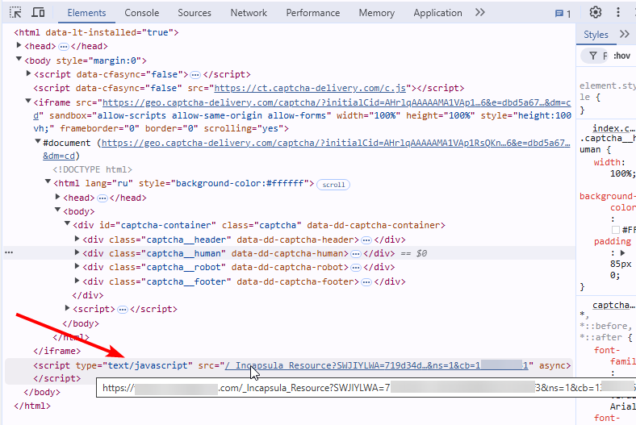

import Tabs from '@theme/Tabs';
import TabItem from '@theme/TabItem';
import ParamItem from '@theme/ParamItem';
import MethodItem from '@theme/MethodItem';
import MethodDescription from '@theme/MethodDescription'
import PriceBlock from '@theme/PriceBlock';
import PriceBlockWrap from '@theme/PriceBlockWrap';

# Imperva (Incapsula)

<PriceBlockWrap>
  <PriceBlock title="Imperva" name="Imperva"/>
</PriceBlockWrap>

:::warning **Atenção!**
A solução Imperva (Incapsula), disponível no CapMonster Cloud, é fornecida exclusivamente para testar e analisar o desempenho em seus próprios recursos web. O uso dessa solução em sites de terceiros é estritamente proibido e viola a política de uso do serviço.
:::


## Parâmetros da solicitação

<TabItem value="proxyless" label="CustomTask (without proxy)" default className="bordered-panel">
    <ParamItem title="type" required type="string" />
    **CustomTask**

    ---

    <ParamItem title="class" required type="string" />
    **Imperva**

    ---

    <ParamItem title="websiteURL" required type="string" />
    O endereço da página principal onde o Incapsula está localizado.

    ---
    <ParamItem title="metadata.incapsulaScriptBase64" required="required" type="string" />
    `"incapsulaScriptBase64": "..."` - o conteúdo em base64 do script JavaScript do Incapsula. Para obter este valor, você precisa acessar a página do script em https://site.com/_Incapsula_Resource?SWJIYLWA=719...3&ns=1&cb=1...1
	
	
	
	O conteúdo do script carregado por este src deve ser codificado no formato base64. Este será o valor para o parâmetro incapsulaScriptBase64.

    ---

    <ParamItem title="metadata.incapsulaSessionCookie" required type="string" />
	Seus cookies do Incapsula. Você pode obtê-los na página usando "document.cookie" ou no cabeçalho da solicitação Set-Cookie: "incap_sess_*=..." 
	
	

    ---

    <ParamItem title="userAgent" type="string" />
	User-Agent do navegador. <br />
	**Passe apenas o UA real. O atual é**: Mozilla/5.0 (iPhone; CPU iPhone OS 17_5_1 like Mac OS X) AppleWebKit/605.1.15 (KHTML, like Gecko) Version/17.5.1 Mobile/21F90 Safari/604.1
</TabItem>


## Criar método de tarefa

<TabItem value="proxyless" label="CustomTask (without proxy)" default className="method-panel">
	<MethodItem>
		```http
		https://api.capmonster.cloud/createTask
		```
	</MethodItem>
	<MethodDescription>
		**Solicitação**
		```json
		{
			"clientKey": "API_KEY",
			"task": {
				"type": "CustomTask",
				"class": "Imperva",
				"websiteURL": "site.com",
				"userAgent": "Mozilla/5.0 (iPhone; CPU iPhone OS 17_5_1 like Mac OS X) AppleWebKit/605.1.15 (KHTML, like Gecko) Version/17.5.1 Mobile/21F90 Safari/604.1",
				"metadata": {
					"incapsulaScriptBase64": "dmFyIF8weGQ2ZmU9Wydce..eDUzXHg2YVx4NGYnKV09XzB4Mjk3MTIxO319KCkpOw==",
					"incapsulaSessionCookie": "l/LsGnrvyB9lNhXI8borDKa2IGcAAAAAX0qAEHheCWuNDquzwb44cw="
				}
			}
		}
		```
		**Resposta**
		```json
		{
		  "errorId":0,
		  "taskId":407533072
		}
		```
	</MethodDescription>
</TabItem>


## Obter resultado da tarefa
Use o método [getTaskResult](../api/methods/get-task-result.md) para obter a solução Imperva.

<TabItem value="proxyless" label="CustomTask (without proxy)" default className="method-panel-full">
	<MethodItem>
		```http
		https://api.capmonster.cloud/getTaskResult
		```
	</MethodItem>
	<MethodDescription>
		**Solicitação**
		```json
		{
		  "clientKey":"API_KEY",
		  "taskId": 407533072
		}
		```
		**Resposta**
		```json
		{
			"errorId":0,
			"status":"ready",
			"solution": {
				"domains": {
					"site.com": {
						"cookies": {
							"___utmvc": "NMB+nRa4inxXNeXuhPl9w4opzdo2afqlceX5uMBLwrduDVo64yb4KunkabEeLYXmKZuVhloliIv6fWevXUcT1WJiFklg9AghMBMkDFjDAEtAnK639bNQi/ob8l+hp/5wf/WpTQcIkG8F9VifAEcZG7MxawsEpYJxkLji4vDSUbGuHPNf5CzIyEzATfw6UVBRiLiDdUvFWboxszG1T5aUrwQYgIlmm1B2X5ZZW4BzwN3k8Md5J+jIdllfdTaxK9JQfuqYQCdT/g5mifg2TPbrwVQeN14avfo1xQr88Mh+m4oclb0yR6VJp2vaVktDSIe2cwCZ3sKKYE0rzkCpcJb9530gRCOT3YxCtyU4Qqg6yRIf8Rk4q/KRSC8/VJ9ezreZ221mURm4FnFH+OF0PqjAiLd/lVK6oTO6BIet4ykEKCtch9EVk0hgGJieaG1F1Nt5haZcSNjGBa15wPyD2OFZe0kI7VBopsUyWqiD0Ydun6+WD/7aDHROngJj0VIZjSuOnQuVQDK2Vcw9gTVvvqwnDhR28ff0gj5b+LAkvrykfgO/AQO0K/DNCF0HgmWIMiSJeoohCpCa/UArU8tDtETnuxGKGaaJOsGKsPtOS5VRQlyRa+D0inSAVY77lpWF5+9SOS+Ioxlq3r8ovFosR33OOcBCEgAlrkdTNNKvK27mWNwmi+ccKkyuJw5Gtk3SEsYNZ75KU/ok+sKBZM5OIsrmp9ivj+nx0oi7yQf6q0Oksbwr2xTFANsIfpoOJBIMylVSCRGwEbpoN4+IJitczOtb8D/TmfHx5P1td0NWTli7UhqFSADS0CcH+vfBos4nucByHjMxkiKuGcudydlZ4IAzl4j0EhZb9OjqJsVe6NIosjwYuqVWHI6BKpRz4FnaqvW+fbEgNj/SmOrEJ/BbKsOOikJNDw6E6BznYT8oQaV6y5p+HFfut+fP3ocrgdMEjoA16oBDfj0rHopZtpJRk2ss41MOA4XyNbfzXVxotTjUXQnuSJXKqp5n4LUD2nFGFpKTwPOT5bTiFiXyHCwNzscRmlfnv38sjG76999auML2YaK1y1wi4sm9fhrbCJuJ9cSSUAMVyeCJhF6BBZ7K1xcGYsougAqbO+oHt/v2J0dnDBAgqQz43nHMNH0yduHWDZUoFsFGqLU8k9a/YYgznEWQDbXnbXAkLziOTNer9FijatGSGm/USO+Gu6TwbmiCfoRoCtm4LOv0aKpzCh48bVdpgEgU3cKLnY970QqnpcB2HCWyawyWMgW3lpXqRKvCbPXo9kiyIBAssNG+HY4URXrwZnhJsnomsipaxKCyRmAUrGjxxFNe0D7vbXn9uY6KnjlJ01Z2T1f3WgwBTBv1QrJsy33KZPkpKLK4VXmtVwD/NBgtgJx7f2xZrKsqrwS3nwa9nYaA9cbS6h4Akl0Ssruv5bwhcVjd7t5fdnCvH59L7emUBEhWV4GpE9owdZpXbWbW0Sq/ZXWe9QX/g4wKTcSJLDBA+T4tegikJv0NWm1aMI2RMJ58Y38JsWKJnkNgjbHAJ7SuVsAtBY3FBbVYLNlC41ZCs8Ygt5W4HNP5B0tRJxEvzqkdbMPg48oVO9AjohmqSPKaXq1TqRTUEatTvt0LD0Uo6v8FFGbCjuuc0kkq4zslsHxEPcB4PY1UKd5/Xw2ttU2ZeGOBIsG+HVTww2yPCYUNH1orKqEwt5H7oMApKWAy1J4lESr1RUbHCBHj7OikFvg4+clNBDGp0wCk+PigPFFNVWBfxtFwJSCZQTUuev1HpdMz/nEiUSPRL3xFbFDH+Ucmdn8lzwCj2EZSY4Zb8cBT92RzbjjcQoH51pgaSjTn5f9m496SyAu34aqTeGU+fYipD5UsWv5r2csBCVJWKm94Ds1QY3JkIkym69IRWoi3j1PKOKxIKX1QTiMqq+8GEgMgwrXYRhzBAmfp19h/ScvxYdiy0q4z6XzJ0pFs1h1bA+6oqqPOqUvrLVbMP1MM7LZKYlhUyJ70KRsrc13y9fLbJV0Znst7cKhi2RGKbU/8anFlzswtjnDD7Upuw/uO3rfedi33X9NFxUw6+pgUYur8ZWQWY3Gm4kX+ANW0upV4K4y/pj5BcZtCKVSXQ/XcLqWkSOt7acbitnrqOgJdw5LmSBhmB+dZwEMzMdUVhRtDt4+oC5DIgtC0B8FhxFX/BzHv6Gh2eO6HJHmXepSpH3csGFpQyJM/5VgNs0wNFPvl1PDA8GAQsu+bGWLGIycSA+XSZVdsRdnegdRIPi0ktOLsAs+ZIZXebkOCMnZytLnrxmfLkAQVtYoy0Qoh9Bv6QOQsxDUZrRu43oaVC/MLuzhftcv/ZhFtCj6IvqWuCHOUp+zLVpzCyiPvN/5eVoVJrY0Jq/Ky8WLUabkJh4h2CiS+9jipESYH+Tu2qsz3V/pR7swfW8zAwp8a4Hzl+8/eGea9X9NY1htqeqw/BJ3ALeozpaA833KZ4HeWrxLRennaqiOvTSkGKDKJsnT6zRQbMw6geAjXk7EMnZBTgTfrBUqpmCYsExQRiyP7DEEcpgTe3+ry9YzLLFevuyvwBYVI7pmc+AeWBNbcl3e7EwdeKZiprQgt7mASx2KRtkgUzNxH8OiPGvVMrJPYSWxUMgFrwVgxvV1kMb/PEVr0YXoFjccRQwWdsxoMizqBWALnYODaJwwl6RZraZIyPVp3ptW4mCWZCWTg+fFdeUWwzGfC312KHggGX2yntQV/iIE5kQWbk72JFP7Xf3it4XdFWBynaojzykDFXODTCEwGB1NIbmO+aVirjv0Rs6ZoKpxSMB+KHd4/TWRpZ2VzdD0xOTE0NDAscz02NzdiOTY4YjdmYTE5M2FjOTk4N2E5YThhMjljN2E4NjYzNWY4NWIxOWM3NTg4ODQ5NWFjOGE4MmE4OTU2OGEwNzI2ODlkODc4MWIwNmU3MQ==; Max-Age=31536000; Domain=.site.com; Path=/; Secure; SameSite=Lax"
						}
					}
				}
			}
		}
		```
	</MethodDescription>
</TabItem>

## Access denied

Error 16 - este erro está relacionado ao uso de servidores proxy que não correspondem à geolocalização exigida.
