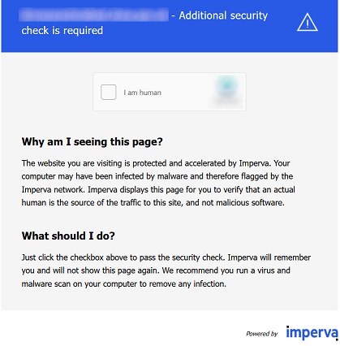

import Tabs from '@theme/Tabs';
import TabItem from '@theme/TabItem';
import ParamItem from '@theme/ParamItem';
import MethodItem from '@theme/MethodItem';
import MethodDescription from '@theme/MethodDescription'
import PriceBlock from '../../../../../src/theme/PriceBlock';
import PriceBlockWrap from '@theme/PriceBlockWrap';
import BlogLink from '@theme/BlogLink';
import { ArticleHead } from '../../../../../src/theme/ArticleHead';

<ArticleHead slug="captchas/incapsula" />

# Imperva (Incapsula)

<PriceBlockWrap>
  <PriceBlock title="Imperva" captchaId="imperva"/>
</PriceBlockWrap>



<BlogLink url="https://capmonster.cloud/pt-BR/blog/news/imperva-incapsula-news"/>

:::warning **Atenção!**

* Para executar esta tarefa, utilize **os seus próprios proxies**.

* Se o proxy usar autenticação por IP, é necessário adicionar o endereço **65.21.190.34** à lista de permissões (whitelist).

* Após a resolução, você receberá **cookies especiais**, que devem ser adicionados ao navegador.
:::


## Parâmetros da solicitação

<br />
<span style={{ fontSize: "15px", fontWeight: 700 }}>
>  IMPORTANTE: alguns valores de parâmetros são dinâmicos — eles mudam a cada renderização da página que contém Imperva.  
> Extraia-os imediatamente antes de criar a tarefa para evitar erros durante a resolução.  
> Veja exemplos de extração automática de parâmetros na seção [Como encontrar todos os parâmetros necessários para criar uma tarefa](#como-encontrar-todos-os-parâmetros-necessários-para-criar-uma-tarefa).
</span>
<br />


<TabItem value="proxyless" label="CustomTask (without proxy)" default className="bordered-panel">

<ParamItem title="type" required type="string" />
**CustomTask**

---

<ParamItem title="class" required type="string" />
**Imperva**

---

<ParamItem title="websiteURL" required type="string" />
O endereço da página principal onde o Incapsula está localizado.

---

<ParamItem title="incapsulaScriptUrl (dentro da metadata)" required type="string" />
`"incapsulaScriptUrl": "_Incapsula_Resource?SWJIYLWA=719d34d31c8e3a6e6fffd425f7e032f3"` - Nome do arquivo JS do Incapsula.

---

<ParamItem title="incapsulaCookies (dentro da metadata)" required type="string" />
Seus cookies do Incapsula. Eles podem ser obtidos na página usando `document.cookie` ou no cabeçalho da requisição `Set-Cookie`: `"incap_sess_*=...; visid_incap_*=..."` (veja o exemplo de requisição `/createTask`). 


---

<ParamItem title="proxyType" required type="string" />
**http** - proxy http/https comum;<br />
**https** - tente esta opção apenas se "http" não funcionar (necessário para alguns proxies personalizados);<br />
**socks4** - proxy socks4;<br />
**socks5** - proxy socks5.

---

<ParamItem title="proxyAddress" required type="string" />
Endereço IP do proxy IPv4/IPv6. Não é permitido:   
- uso de proxies transparentes (que revelem o IP do cliente);  
- uso de proxies em máquinas locais.

---

<ParamItem title="proxyPort" required type="integer" />
Porta do proxy.

---

<ParamItem title="proxyLogin" required type="string" />
Login do servidor proxy.

---

<ParamItem title="proxyPassword" required type="string" />
Senha do servidor proxy.

---
<ParamItem title="reese84UrlEndpoint (dentro da metadata)" type="string" />
O nome do endpoint para onde a impressão digital reese84 é enviada pode ser encontrado entre as solicitações e termina com `?d=site.com`.


---

<ParamItem title="userAgent" type="string" />
User-Agent do navegador. <br />
**Transmita apenas o UA atual do sistema operacional Windows. No momento, o válido é**: `userAgentPlaceholder`

</TabItem>


## Criar método de tarefa

<TabItem value="proxyless" label="CustomTask (sem proxy)" default className="method-panel">
  <MethodItem>

```http
https://api.capmonster.cloud/createTask
````

  </MethodItem>

  <MethodDescription>

**Solicitação**

```json
{
  "clientKey": "API_KEY",
  "task": {
    "type": "CustomTask",
    "class": "Imperva",
    "websiteURL": "https://example.com",
    "userAgent": "userAgentPlaceholder",
    "metadata": {
      "incapsulaScriptUrl": "_Incapsula_Resource?SWJIYLWA=719d34d31c8e3a6e6fffd425f7e032f3",
      "incapsulaCookies": "incap_ses_1166_2930313=br7iX33ZNCtf3HlpEXcuEDzz72cAAAAA0suDnBGrq/iA0J4oERYzjQ==; visid_incap_2930313=P3hgPVm9S8Oond1L0sXhZqfK72cAAAAAQUIPAAAAAABoMSY9xZ34RvRseJRiY6s+;",
      "reese84UrlEndpoint": "Built-with-the-For-hopence-Hurleysurfecting-the-"
    },
    "proxyType": "http",
    "proxyAddress": "8.8.8.8",
    "proxyPort": 8080,
    "proxyLogin": "proxyLoginHere",
    "proxyPassword": "proxyPasswordHere"
  }
}
```

**Resposta**

```json
{
  "errorId": 0,
  "taskId": 407533072
}
```

  </MethodDescription>
</TabItem>

## Obter resultado da tarefa
Use o método [getTaskResult](../api/methods/get-task-result.mdx) para obter a solução Imperva.

<TabItem value="proxyless" label="CustomTask (without proxy)" default className="method-panel-full">
	<MethodItem>
		```http
		https://api.capmonster.cloud/getTaskResult
		```
	</MethodItem>
	<MethodDescription>
		**Solicitação**
		```json
		{
		  "clientKey":"API_KEY",
		  "taskId": 407533072
		}
		```
		**Resposta**
```json
{
  "errorId":0,
  "status":"ready",
  "solution": {
    "domains": {
      "https://example.com": {
        "cookies": {
          "___utmvc": "NMB+nRa4inxXNeXuhPl9w4opzdo...E4OTU2OGEwNzI2ODlkODc4MWIwNmU3MQ==; Max-Age=31536000; Domain=.site.com; Path=/; Secure; SameSite=Lax"
        }
      }
    }
  }
}
```
	</MethodDescription>
</TabItem>

## Access denied

Error 16 - este erro está relacionado ao uso de servidores proxy que não correspondem à geolocalização exigida.

## Como encontrar todos os parâmetros necessários para criar uma tarefa

### Automaticamente

Para automatizar a extração dos parâmetros, eles podem ser obtidos via **navegador** (normal ou headless, por exemplo, usando **Playwright**) ou diretamente a partir de **requisições HTTP**. Como os valores dos parâmetros dinâmicos têm curta duração, recomenda-se utilizá-los imediatamente após a extração.

:::warning **Importante!**
Os trechos de código fornecidos são exemplos básicos para aprendizado sobre como extrair os parâmetros necessários. A implementação exata dependerá do seu site com captcha, sua estrutura e os elementos HTML e seletores utilizados.
:::

<Tabs className="full-width-tabs filled-tabs request-tabs">
  <TabItem value="js" label="JavaScript" default className="method-panel">
    <details>
      <summary>Mostrar código (Node.js)</summary>
      ```js
      import { chromium } from "playwright";

      (async () => {
        const browser = await chromium.launch({ headless: false });
        const page = await browser.newPage();

        await page.goto("https://www.example.com/");

        // Extraia o atributo src do iframe com id main-iframe
        const iframeSrc = await page.$eval("#main-iframe", (iframe) =>
          iframe.getAttribute("src")
        );
        console.log("src do iframe:", iframeSrc);

        // Obtenha todos os cookies
        const cookies = await page.context().cookies();

        // Filtre cookies que começam com visid_incap_ ou incap_ses_
        const filteredCookies = cookies.filter(
          (cookie) =>
            cookie.name.startsWith("visid_incap_") ||
            cookie.name.startsWith("incap_ses_")
        );

        filteredCookies.forEach((cookie) => {
          console.log(`${cookie.name}=${cookie.value}`);
        });

        await browser.close();
      })();
      ```
    </details>
  </TabItem>

  <TabItem value="python" label="Python" className="method-panel">
    <details>
      <summary>Mostrar código</summary>
      ```python
      import asyncio
      from playwright.async_api import async_playwright

      async def main():
          async with async_playwright() as p:
              browser = await p.chromium.launch(headless=False)
              page = await browser.new_page()

              await page.goto("https://www.example.com/")

              # Extraia o atributo src do iframe com id main-iframe
              iframe_src = await page.locator("#main-iframe").get_attribute("src")
              print("src do iframe:", iframe_src)  # Exibe o valor do src

              # Obtenha todos os cookies
              cookies = await page.context.cookies()

              # Filtre cookies que começam com visid_incap_ ou incap_ses_
              filtered_cookies = [
                  cookie for cookie in cookies
                  if cookie["name"].startswith("visid_incap_") or cookie["name"].startswith("incap_ses_")
              ]

              for cookie in filtered_cookies:
                  print(f"{cookie['name']}={cookie['value']}")

              await browser.close()

      asyncio.run(main())
      ```
    </details>
  </TabItem>

  <TabItem value="csharp" label="C#" className="method-panel">
    <details>
      <summary>Mostrar código</summary>
      ```csharp
      using System;
      using System.Linq;
      using System.Threading.Tasks;
      using Microsoft.Playwright;

      class Program
      {
          public static async Task Main(string[] args)
          {
              var playwright = await Playwright.CreateAsync();
              var browser = await playwright.Chromium.LaunchAsync(new BrowserTypeLaunchOptions { Headless = false });
              var page = await browser.NewPageAsync();

              await page.GotoAsync("https://www.example.com/");

              // Extraia o atributo src do iframe com id main-iframe
              var iframeSrc = await page.GetAttributeAsync("#main-iframe", "src");
              Console.WriteLine("src do iframe: " + iframeSrc); // Exibe o valor do src

              // Obtenha todos os cookies
              var cookies = await page.Context.CookiesAsync();

              // Filtre cookies que começam com visid_incap_ ou incap_ses_
              var filteredCookies = cookies.Where(cookie =>
                  cookie.Name.StartsWith("visid_incap_") || cookie.Name.StartsWith("incap_ses_"));

              foreach (var cookie in filteredCookies)
              {
                  Console.WriteLine($"{cookie.Name}={cookie.Value}");
              }

              await browser.CloseAsync();
          }
      }
      ```
    </details>
  </TabItem>
</Tabs>

## Usar biblioteca SDK

<Tabs className="full-width-tabs filled-tabs request-tabs" groupId="captcha-type">

  <TabItem value="js" label="JavaScript" default className="method-panel">
<details>
      <summary>Mostrar Código (para navegador)</summary>
  ```js
  // https://github.com/ZennoLab/capmonstercloud-client-js

import { CapMonsterCloudClientFactory, ClientOptions, ImpervaRequest } from '@zennolab_com/capmonstercloud-client';

const API_KEY = "YOUR_API_KEY"; // Insira sua chave de API do CapMonster Cloud

document.addEventListener("DOMContentLoaded", async () => {
    const cmcClient = CapMonsterCloudClientFactory.Create(
        new ClientOptions({ clientKey: API_KEY })
    );

    // Se necessário, você pode verificar o saldo
    const balance = await cmcClient.getBalance();
    console.log("Balance:", balance);

    const proxy = {
        proxyType: "http",
        proxyAddress: "123.45.67.89",
        proxyPort: 8080,
        proxyLogin: "username",
        proxyPassword: "password"
    };

    // Configuração da tarefa Imperva (Incapsula)
    const impervaRequest = new ImpervaRequest({
        websiteURL: "https://example.com/", // URL da sua página protegida pelo Imperva
        metadata: {
            incapsulaScriptUrl: "_Incapsula_Resource?SWJIYLWA=719d34d31c8e3a6e6fffd425f7e032f3",
            incapsulaCookies: "incap_ses_1166_2930313=br7iX33ZNCtf3HlpEXcuEDzz72cAAAAA0suDnBGrq/iA0J4oERYzjQ==; visid_incap_2930313=P3hgPVm9S8Oond1L0sXhZqfK72cAAAAAQUIPAAAAAABoMSY9xZ34RvRseJRiY6s+;"
        },
        proxy
    });

    const result = await cmcClient.Solve(impervaRequest);
    console.log("Solution:", result.solution);
});
```
</details>

<details>
      <summary>Mostrar Código (Node.js)</summary>
```javascript
// https://github.com/ZennoLab/capmonstercloud-client-js

import { CapMonsterCloudClientFactory, ClientOptions, ImpervaRequest } from '@zennolab_com/capmonstercloud-client';

async function main() {
    const cmcClient = CapMonsterCloudClientFactory.Create(
        new ClientOptions({ clientKey: 'YOUR_API_KEY' }) // Insira sua chave de API do CapMonster Cloud
    );

    // Se necessário, você pode verificar o saldo
    const balance = await cmcClient.getBalance();
    console.log('Balance:', balance);

    const proxy = {
        proxyType: "http",
        proxyAddress: '123.45.67.89',
        proxyPort: 8080,
        proxyLogin: 'username',
        proxyPassword: 'password'
    };

    // Configuração da tarefa Imperva (Incapsula)
    const impervaRequest = new ImpervaRequest({
        websiteURL: 'https://example.com/', // URL da sua página protegida pelo Imperva
        metadata: {
            incapsulaScriptUrl: '_Incapsula_Resource?SWJIYLWA=719d34d31c8e3a6e6fffd425f7e032f3',
            incapsulaCookies: 'incap_ses_1166_2930313=br7iX33ZNCtf3HlpEXcuEDzz72cAAAAA0suDnBGrq/iA0J4oERYzjQ==; visid_incap_2930313=P3hgPVm9S8Oond1L0sXhZqfK72cAAAAAQUIPAAAAAABoMSY9xZ34RvRseJRiY6s+;',
        },
        proxy,
    });

    const result = await cmcClient.Solve(impervaRequest);
    console.log('Solution:', result.solution);
}

main().catch(console.error);
```
</details>
  </TabItem>

  <TabItem value="python" label="Python" className="method-panel">
<details>
      <summary>Mostrar Código</summary>
```python
# https://github.com/ZennoLab/capmonstercloud-client-python

import asyncio
from capmonstercloudclient import CapMonsterClient, ClientOptions
from capmonstercloudclient.requests import ImpervaCustomTaskRequest
from capmonstercloudclient.requests.baseRequestWithProxy import ProxyInfo

API_KEY = "YOUR_API_KEY"  # Insira sua chave de API do CapMonster Cloud

async def solve_imperva_captcha():
    client_options = ClientOptions(api_key=API_KEY)
    cap_monster_client = CapMonsterClient(options=client_options)

    # Configuração do seu próprio proxy
    proxy = ProxyInfo(
        proxyType="http",
        proxyAddress="123.45.67.89",
        proxyPort=8080,
        proxyLogin="username",
        proxyPassword="password"
    )

    # Configuração da tarefa Imperva (Incapsula)
    imperva_request = ImpervaCustomTaskRequest(
        websiteUrl="https://example.com",
        metadata={
            "incapsulaScriptUrl": "_Incapsula_Resource?SWJIYLWA=719d34d31c8e3a6e6fffd425f7e032f3",
            "incapsulaCookie": "incap_ses_1166_2930313=br7iX33ZNCtf3HlpEXcuEDzz72cAAAAA0suDnBGrq/iA0J4oERYzjQ==; visid_incap_2930313=P3hgPVm9S8Oond1L0sXhZqfK72cAAAAAQUIPAAAAAABoMSY9xZ34RvRseJRiY6s+;",
            "reese84UrlEndpoint": "Built-with-the-For-hopence-Hurleysurfecting-the-"
        },
        proxy=proxy
    )

    # Se necessário, você pode verificar o saldo
    balance = await cap_monster_client.get_balance()
    print("Balance:", balance)

    result = await cap_monster_client.solve_captcha(imperva_request)
    print("Solution:", result)

asyncio.run(solve_imperva_captcha())
```
</details>
  </TabItem>

</Tabs>


