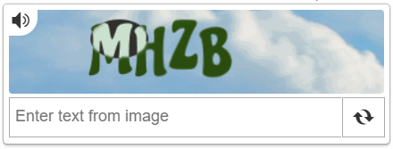
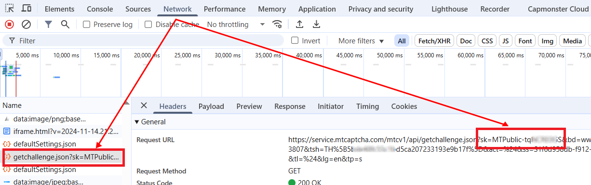

import Tabs from '@theme/Tabs';
import TabItem from '@theme/TabItem';
import ParamItem from '@theme/ParamItem';
import MethodItem from '@theme/MethodItem';
import MethodDescription from '@theme/MethodDescription'
import PriceBlock from '@theme/PriceBlock';
import PriceBlockWrap from '@theme/PriceBlockWrap';

# MTCaptcha

<PriceBlockWrap>
  <PriceBlock title="MTCaptcha task" captchaId="mtcaptcha"/>
</PriceBlockWrap>



:::warning **Atenção!**
O CapMonster Cloud, por padrão, funciona com proxies integrados — já incluídos no custo do serviço. É necessário especificar seus próprios proxies apenas nos casos em que o site não aceita o token ou quando o acesso aos serviços integrados está restrito.

Se o proxy utiliza autenticação por IP, é necessário adicionar o endereço **65.21.190.34** à lista de permissões (whitelist).
:::

## Parâmetros da solicitação

<TabItem value="proxy" label="MTCaptchaTask" className="bordered-panel">
<ParamItem title="type" required type="string" />
**MTCaptchaTask**

---

<ParamItem title="websiteURL" required type="string" />
Endereço da página onde o captcha é resolvido.

---

<ParamItem title="websiteKey" required type="string" />
Chave do MTcaptcha, enviada na solicitação nos parâmetros como `sk` (*veja exemplo abaixo de como encontrá-la*).

---

<ParamItem title="pageAction" type="string" />
O parâmetro *action* é enviado como `act` e aparece na validação do token. Informe-o apenas se o valor for diferente do padrão - **%24**.  
Exemplo em HTML:
```

<script>
var mtcaptchaConfig = {
      "sitekey": "MTPublic-abCDEFJAB",
      "action": "login"
};
</script>

````

---

<ParamItem title="isInvisible" type="bool" />
**true**, se o captcha for invisível, ou seja, com campo oculto para confirmação. Em caso de suspeita de bot, uma verificação extra é disparada.

---

<ParamItem title="userAgent" type="string" />
User-Agent do navegador. <br />
**Transmita apenas o UA atual do sistema operacional Windows. No momento, o válido é**: `userAgentPlaceholder`

---

<ParamItem title="proxyType" type="string" />
**http** - proxy http/https comum;<br />
**https** - tente esta opção apenas se "http" não funcionar (necessário para alguns proxies personalizados);<br />
**socks4** - proxy socks4;<br />
**socks5** - proxy socks5.

---

<ParamItem title="proxyAddress" type="string" />
<p>
Endereço IP do proxy IPv4/IPv6. Não é permitido:
- uso de proxies transparentes (que revelem o IP do cliente);
- uso de proxies em máquinas locais.
</p>

---

<ParamItem title="proxyPort" type="integer" />
Porta do proxy.

---

<ParamItem title="proxyLogin" type="string" />
Login do servidor proxy.

---

<ParamItem title="proxyPassword" type="string" />
Senha do servidor proxy.

</TabItem>

## Método para criar tarefa
<Tabs className="full-width-tabs filled-tabs request-tabs" groupId="captcha-type">
<TabItem value="proxyless" label="MTCaptchaTask (sem proxy)" default className="method-panel">
<MethodItem>
```http
https://api.capmonster.cloud/createTask
````

</MethodItem>
<MethodDescription>
**Solicitação**
```json
{
  "clientKey": "API_KEY",
  "task": 
  {
    "type": "MTCaptchaTask",
    "websiteURL": "https://www.example.com",
    "websiteKey": "MTPublic-abCDEFJAB",
    "isInvisible": false,
    "pageAction": "login"
  }
}
```
**Resposta**
```json
{
  "errorId":0,
  "taskId":407533077
}
```
</MethodDescription>
</TabItem>

<TabItem value="proxy" label="MTCaptchaTask (com proxy)" default className="method-panel">
<MethodItem>
```http
https://api.capmonster.cloud/createTask
```
</MethodItem>
<MethodDescription>
**Solicitação**
```json
{
  "clientKey": "API_KEY",
  "task": 
  {
    "type": "MTCaptchaTask",
    "websiteURL": "https://www.example.com",
    "websiteKey": "MTPublic-abCDEFJAB",
    "isInvisible": false,
    "pageAction": "login",
    "proxyType":"http",
    "proxyAddress":"8.8.8.8",
    "proxyPort":8080,
    "proxyLogin":"proxyLoginHere",
    "proxyPassword":"proxyPasswordHere"
  }
}
```
**Resposta**
```json
{
  "errorId":0,
  "taskId":407533077
}
```
</MethodDescription>
</TabItem>
</Tabs>

## Método para obter o resultado da tarefa

Use o método [getTaskResult](../api/methods/get-task-result.md) para obter a solução do captcha MTCaptcha.

<TabItem value="proxyless" label="CustomTask (sem proxy)" default className="method-panel-full">
<MethodItem>
```http
https://api.capmonster.cloud/getTaskResult
```
</MethodItem>
<MethodDescription>
**Solicitação**
```json
{
  "clientKey": "API_KEY",
  "taskId": 407533077
}
```

**Resposta**

```json
{
  "errorId": 0,
  "errorCode": null,
  "errorDescription": null,
  "solution": {
    "token": "v1(155506dc,c8c2e356,MTPublic-abCDEFJAB,70f03532a53...5FSDA**)"
  },
  "status": "ready"
}
```

</MethodDescription>
</TabItem>

## Como encontrar os parâmetros do captcha

### websiteKey

Este parâmetro pode ser encontrado na aba **Network** das *Ferramentas de Desenvolvedor*.
Procure por solicitações que comecem, por exemplo, com `getchallenge.json` — o parâmetro **sk** corresponde ao `websiteKey`.



### pageAction

A mesma solicitação também inclui o parâmetro `pageAction`: o valor desejado é passado como **act**.
Por padrão é **%24**; se for diferente (por exemplo, *..\&act=login&...*), especifique-o ao criar a tarefa.


## Usar biblioteca SDK

<Tabs className="full-width-tabs filled-tabs request-tabs" groupId="captcha-type">

  <TabItem value="js" label="JavaScript" default className="method-panel">

  ```js
  // https://github.com/ZennoLab/capmonstercloud-client-js

  import { CapMonsterCloudClientFactory, ClientOptions, MTCaptchaRequest } from '@zennolab_com/capmonstercloud-client';

  document.addEventListener('DOMContentLoaded', async () => {
    const cmcClient = CapMonsterCloudClientFactory.Create(
      new ClientOptions({ clientKey: '<sua chave API do capmonster.cloud>' })
    );

    console.log(await cmcClient.getBalance());

    const mtcaptchaRequest = new MTCaptchaRequest({
      websiteURL: 'https://www.example.com',     // URL da página com captcha 
      websiteKey: 'MTPublic-abCDEFJAB',          // Substitua pelo valor correto
      isInvisible: false,                         // "true" se o captcha for invisível
      pageAction: 'login',
      /*
      // Se precisar usar um proxy:
      proxy: {
        type: 'http',
        address: '127.0.0.1',
        port: 8000,
        login: 'usuario',
        password: 'senha'
      }
      */
    });

    console.log(await cmcClient.Solve(mtcaptchaRequest));
  });
````

  </TabItem>

  <TabItem value="python" label="Python" default className="method-panel">

```python
# https://github.com/ZennoLab/capmonstercloud-client-python

import asyncio
from capmonstercloudclient import CapMonsterClient, ClientOptions
from capmonstercloudclient.requests import MTCaptchaRequest

# Sua chave API do CapMonster Cloud
client_options = ClientOptions(api_key="API_KEY")
cap_monster_client = CapMonsterClient(options=client_options)

# Opção 1: Sem proxy
mtcaptcha_request = MTCaptchaRequest(
    websiteUrl="https://www.example.com", # URL da página com captcha 
    websiteKey="MTPublic-abCDEFJAB", # Substitua pelo valor correto
    isInvisible=False,   # "true" se o captcha for invisível
    pageAction="login"
)

# Opção 2: Com proxy
# Descomente se precisar usar um proxy

# mtcaptcha_request = MTCaptchaRequest(
#     websiteUrl="https://www.example.com",
#     websiteKey="MTPublic-abCDEFJAB",
#     isInvisible=False,
#     pageAction="login",
#     proxyType="http",
#     proxyAddress="123.45.67.89",
#     proxyPort=8000,
#     proxyLogin="usuarioProxy",
#     proxyPassword="senhaProxy"
# )

async def solve_captcha():
    return await cap_monster_client.solve_captcha(mtcaptcha_request)

responses = asyncio.run(solve_captcha())
print(responses)
```

  </TabItem>

  <TabItem value="csharp" label="C#" className="method-panel">

```csharp
// https://github.com/ZennoLab/capmonstercloud-client-dotnet

using System;
using System.Threading.Tasks;
using Zennolab.CapMonsterCloud;
using Zennolab.CapMonsterCloud.Requests;

class Program
{
    static async Task Main(string[] args)
    {
        // Sua chave API do CapMonster Cloud
        var clientOptions = new ClientOptions
        {
            ClientKey = "sua_chave_api"
        };

        var cmCloudClient = CapMonsterCloudClientFactory.Create(clientOptions);

        // Opção 1: MTCaptcha sem proxy
        var mtcaptchaRequest = new MTCaptchaTaskRequest
        {
            WebsiteUrl = "https://www.example.com", // URL da página com captcha 
            WebsiteKey = "MTPublic-tqNCRE0GS", // Substitua pelo valor correto
            Invisible = false,  // "true" se o captcha for invisível
            PageAction = "login",
            UserAgent = "userAgentPlaceholder" // Use o UserAgent atual
        };

        // Opção 2: MTCaptcha com proxy
        // Descomente se precisar usar um proxy
        /*
        var mtcaptchaRequest = new MTCaptchaTaskRequest
        {
            WebsiteUrl = "https://www.example.com",
            WebsiteKey = "MTPublic-tqNCRE0GS",
            Invisible = false,
            PageAction = "login",
            UserAgent = "userAgentPlaceholder",

            Proxy = new ProxyContainer(
                "123.45.67.89",
                8080,
                ProxyType.Http,
                "usuarioProxy",
                "senhaProxy"
            )
        };
        */

        var mtcaptchaResult = await cmCloudClient.SolveAsync(mtcaptchaRequest);

        Console.WriteLine("Solução MTCaptcha: " + mtcaptchaResult.Solution.Value);
    }
}
```

  </TabItem>

</Tabs>

