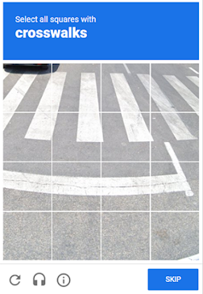
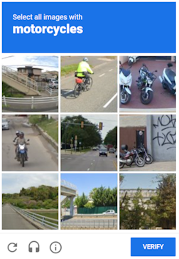
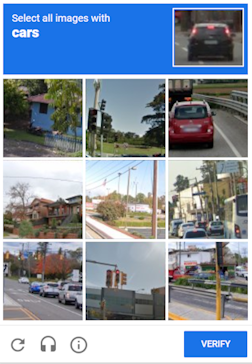

---
sidebar_position: 0
sidebar_label: RecaptchaV2
---

import Tabs from '@theme/Tabs';
import TabItem from '@theme/TabItem';
import ParamItem from '@theme/ParamItem';
import MethodItem from '@theme/MethodItem';
import MethodDescription from '@theme/MethodDescription'
import PriceBlock from '../../../../../src/theme/PriceBlock';
import PriceBlockWrap from '@theme/PriceBlockWrap';
import BlogLink from '@theme/BlogLink';
import { ArticleHead } from '../../../../../src/theme/ArticleHead';

<ArticleHead slug="captchas/no-captcha-task" />

# RecaptchaV2Task

<PriceBlockWrap>
  <PriceBlock title="RecaptchaV2Task" captchaId="rc2"/>
</PriceBlockWrap>

  

Este objeto contém dados para a solução do captcha Google ReCaptcha2. Para garantir a universalidade da solução desse tipo de captcha, você precisa usar todos os dados utilizados na automação do preenchimento do formulário na página de destino, incluindo proxies, o user-agent do navegador e cookies. Isso ajuda a evitar problemas quando o Google altera o código de seu captcha.

Esse tipo de captcha pode ser resolvido um pouco mais lentamente do que um captcha de imagem comum, mas esse problema é compensado pelo fato de que o valor `g-recaptcha-response` que enviamos para você é válido pelos próximos 60 segundos após resolvermos seu ReCaptcha2.

<BlogLink url="https://capmonster.cloud/pt-BR/blog/re-1/how-to-bypass-recaptcha-v2-using-capmonster-cloud"/>

:::warning **Atenção!**
O CapMonster Cloud usa proxies integrados por padrão, que são adequados para a maioria dos sites.
**Se o token for rejeitado pelo servidor**, você deve tentar novamente usando seus próprios proxies — isso aumenta a chance de verificação bem-sucedida.

Procedimento recomendado:

* Primeiro, resolva o captcha sem proxies.

* Se o token for rejeitado pelo site de destino, tente novamente usando seus próprios proxies.

Se o proxy utiliza autenticação por IP, é necessário adicionar o endereço **65.21.190.34** à lista de permissões (whitelist).
:::


## Parâmetros da solicitação

<TabItem value="proxy" label="RecaptchaV2Task (com proxy)" className="bordered-panel">
<ParamItem title="type" required type="string" />
**RecaptchaV2Task**

---

<ParamItem title="websiteURL" required type="string" />
Endereço da página da web com captcha.

---

<ParamItem title="websiteKey" required type="string" />
Chave do site do Recaptcha.<br />`<div class="g-recaptcha" data-sitekey="THIS_ONE"></div>`

---

<ParamItem title="recaptchaDataSValue" type="string" />
Algumas implementações personalizadas podem conter o parâmetro adicional "data-s" no div do ReCaptcha2, que na verdade é um token de uso único e deve ser coletado toda vez que você quiser resolver um ReCaptcha2.<br />`<div class="g-recaptcha" data-sitekey="sitekey" data-s="THIS_ONE"></div>`

---

<ParamItem title="userAgent" type="string" />
User-Agent do navegador usado na emulação. É necessário que você use uma assinatura de um navegador moderno, caso contrário, o Google pedirá para você "atualizar seu navegador".

---

<ParamItem title="cookies" type="string" />
Cookies adicionais que devemos usar durante a interação com a página de destino ou com o Google.<br /><p>**Formato**: cookiename1=cookievalue1; cookiename2=cookievalue2</p>

---

<ParamItem title="isInvisible" type="bool" />
true se o captcha for invisível, ou seja, tem um campo oculto para confirmação, sem caixa de seleção. Se um bot for suspeito, uma verificação adicional será chamada.

---

<ParamItem title="proxyType" type="string" />
**http** - proxy regular http/https;<br />**https** - use essa opção apenas se "http" não funcionar (necessário para alguns proxies personalizados);<br />**socks4** - proxy socks4;<br />**socks5** - proxy socks5.

---

<ParamItem title="proxyAddress" type="string" />
<p>
Endereço IP do proxy IPv4/IPv6. Não permitido:
- uso de proxies transparentes (onde é possível ver o IP do cliente);
- uso de proxies em máquinas locais.
</p>

---

<ParamItem title="proxyPort" type="integer" />
Porta do proxy.

---

<ParamItem title="proxyLogin" type="string" />
Login do servidor proxy.

---

<ParamItem title="proxyPassword" type="string" />
Senha do servidor proxy.

</TabItem>

## Método para criar tarefa

<Tabs className="full-width-tabs filled-tabs request-tabs" groupId="captcha-type">
<TabItem value="proxyless" label="RecaptchaV2Task (sem proxy)" default className="method-panel">
<MethodItem>
  ```http
  https://api.capmonster.cloud/createTask
  ```
</MethodItem>
<MethodDescription>
**Solicitação**
```json
{
  "clientKey":"API_KEY",
  "task": {
    "type":"RecaptchaV2Task",
    "websiteURL":"https://lessons.zennolab.com/captchas/recaptcha/v2_simple.php?level=high",
    "websiteKey":"6Lcg7CMUAAAAANphynKgn9YAgA4tQ2KI_iqRyTwd"
  }
}
```
**Resposta**
```json
{
  "errorId":0,
  "taskId":407533072
}
```

</MethodDescription>
</TabItem>
<TabItem value="proxy" label="RecaptchaV2Task (com proxy)" className="method-panel">
<MethodItem>
  ```http
  https://api.capmonster.cloud/createTask
  ```
</MethodItem>
<MethodDescription>
**Solicitação**
```json
{
  "clientKey":"API_KEY",
  "task": {
    "type":"RecaptchaV2Task",
    "websiteURL":"https://lessons.zennolab.com/captchas/recaptcha/v2_simple.php?level=high",
    "websiteKey":"6Lcg7CMUAAAAANphynKgn9YAgA4tQ2KI_iqRyTwd",
    "proxyType":"http",
    "proxyAddress":"8.8.8.8",
    "proxyPort":8080,
    "proxyLogin":"proxyLoginHere",
    "proxyPassword":"proxyPasswordHere",
    "userAgent":"userAgentPlaceholder"
  }
}
```
**Resposta**
```json
{
  "errorId":0,
  "taskId":407533072
}
```
</MethodDescription>
</TabItem>

</Tabs>

## Método para obter o resultado da tarefa

:::warning **Aviso!**
Em alguns sites, é importante que o UserAgent corresponda ao usado ao resolver o captcha. Portanto, se o CapMonster Cloud retornar um UserAgent junto com o token, **sempre** aplique-o ao enviar o formulário ou confirmar a solução na página de destino.
:::

Use o método [getTaskResult](../api/methods/get-task-result.mdx) para solicitar a resposta para o ReCaptcha2. Você receberá uma resposta em 100 ms, dependendo da carga do serviço.

<TabItem value="proxyless" label="RecaptchaV2Task (sem proxy)" default className="method-panel-full">
<MethodItem>
```http
https://api.capmonster.cloud/getTaskResult
```
</MethodItem>
<MethodDescription>
**Solicitação**
```json
{
  "clientKey":"API_KEY",
  "taskId": 407533072
}
```
**Resposta**
```json
{
  "errorId":0,
  "status":"ready",
  "solution": {
    "gRecaptchaResponse":"3AHJ_VuvYIBNBW5yyv0zRYJ75VkOKvhKj9_xGBJKnQimF72rfoq3Iy-DyGHMwLAo6a3"
  }
}
```

   Para alguns sites, a resposta pode ser assim (use o UserAgent retornado ao confirmar a solução):
 
		```json
		{
		  "errorId":0,
		  "status":"ready",
		  "solution": {
			"userAgent": "Mozilla/5.0 (Windows NT 10.0; Win64; x64) AppleWebKit/537.36 (KHTML, like Gecko) Chrome/139.0.0.0 Safari/537.36", 
                "gRecaptchaResponse": "0cAFcWeA5Y3...hF8UWA", 
                "cookies": {"nocookies": "true"}}"
		  }
		}
		```

</MethodDescription>
</TabItem>

<br />

|**Propriedade**|**Tipo**|**Descrição**|
| :- | :- | :- |
|gRecaptchaResponse|String|Hash que deve ser inserido no formulário de envio do Recaptcha2 em `<textarea id="g-recaptcha-response" ..></textarea>`. Possui um comprimento de 500 a 2190 bytes.

## Como Encontrar Todos os Parâmetros Necessários para a Criação da Tarefa

### Manualmente

1. Abra seu site onde o captcha aparece no navegador.
2. Clique com o botão direito no elemento do captcha e selecione **Inspecionar**.

#### websiteKey (data-sitekey)

**Aba "Elements"**: procure um elemento `<div class="g-recaptcha">` na página. Copie o valor do atributo *data-sitekey*, por exemplo:


**Aba "Network"**:

Abra a aba **Network** e recarregue a página com o captcha. Procure uma requisição como a abaixo (o valor de **k** é o *data-sitekey*):


#### recaptchaDataSValue (se usado)

Se a página contiver um atributo *data-s*, encontre-o no HTML:


#### isInvisible

**Aba "Network"**: se o captcha for invisível, o elemento conterá o atributo *size="invisible"*, por exemplo:


### Automaticamente

Uma forma conveniente de automatizar a busca por todos os parâmetros necessários.  
Alguns parâmetros são regenerados a cada carregamento da página, então você precisará extraí-los através de um navegador — seja normal ou headless (por exemplo, usando **Playwright**).  
Como os valores dos parâmetros dinâmicos são de curta duração, o captcha deve ser resolvido imediatamente após a captura deles.

:::warning **Importante!**  
Os trechos de código fornecidos são exemplos básicos para familiarização com a extração dos parâmetros necessários. A implementação exata dependerá da sua página de captcha, sua estrutura e dos elementos/seletores HTML que ela utiliza.  
:::

<Tabs className="full-width-tabs filled-tabs request-tabs">
  <TabItem value="js" label="JavaScript" default className="method-panel">
    <details>
      <summary>Mostrar Código (para navegador)</summary>

      ```js
      (() => {
        const iframeEl = document.querySelector('iframe[src^="https://www.google.com/recaptcha/api2/anchor?"]');
        const captchaUrl = iframeEl?.getAttribute('src');

        if (captchaUrl) {
          const urlParams = new URLSearchParams(captchaUrl.split('?')[1]);
          
          const sitekey = urlParams.get('k');
          const size = urlParams.get('size');
          
          const isInvisible = size === 'invisible';

          const sitekeyEl = document.querySelector('[data-sitekey]');
          const datasEl = document.querySelector('[data-s]');
          const datas = datasEl?.getAttribute('data-s');

          console.log({
            sitekey: sitekey || sitekeyEl?.getAttribute('data-sitekey'),
            datas,
            isInvisible
          });
        }
      })();
      ```
    </details>

    <details>
      <summary>Mostrar Código (Node.js)</summary>

      ```js
      import { chromium } from "playwright";

      (async () => {
        const browser = await chromium.launch({ headless: false });
        const page = await browser.newPage();

        await page.goto("https://example.com");

        await page.waitForSelector('iframe[src^="https://www.google.com/recaptcha/api2/anchor?"]');

        const captchaData = await page.evaluate(() => {
          const iframeEl = document.querySelector('iframe[src^=
          "https://www.google.com/recaptcha/api2/anchor?"]');
          const captchaUrl = iframeEl?.getAttribute("src");

          if (captchaUrl) {
            const urlParams = new URLSearchParams(captchaUrl.split("?")[1]);
            const sitekey = urlParams.get("k");
            const size = urlParams.get("size");
            const isInvisible = size === "invisible";

            const sitekeyEl = document.querySelector("[data-sitekey]");
            const datasEl = document.querySelector("[data-s]");
            const datas = datasEl?.getAttribute("data-s");

            return {
              sitekey: sitekey || sitekeyEl?.getAttribute("data-sitekey"),
              datas,
              isInvisible,
            };
          }
          return null;
        });

        console.log(captchaData);
        await browser.close();
      })();
      ```
    </details>
  </TabItem>

  <TabItem value="python" label="Python" className="method-panel">
    <details>
      <summary>Mostrar Código</summary>

      ```python
      import asyncio
      from urllib.parse import urlparse, parse_qs
      from playwright.async_api import async_playwright

      def parse_recaptcha_url(url):
          parsed_url = urlparse(url)
          params = parse_qs(parsed_url.query)
          sitekey = params.get('k', [None])[0]
          size = params.get('size', [None])[0]
          return sitekey, size == 'invisible'

      async def main():
          async with async_playwright() as p:
              browser = await p.chromium.launch(headless=True)
              page = await browser.new_page()
              await page.goto("https://example.com", timeout=60000)
              captcha_url = await page.locator('iframe[
              src^="https://www.google.com/recaptcha/api2/anchor?"]').get_attribute('src')
              if captcha_url:
                  sitekey, is_invisible = parse_recaptcha_url(captcha_url)
                  print({"sitekey": sitekey, "isInvisible": is_invisible})
              await browser.close()

      asyncio.run(main())
      ```
    </details>
  </TabItem>

  <TabItem value="csharp" label="C#" className="method-panel">
    <details>
      <summary>Mostrar Código</summary>

      ```csharp
      using Microsoft.Playwright;
      using System;
      using System.Linq;
      using System.Threading.Tasks;
      using System.Web;

      class Program
      {
          static (string sitekey, bool isInvisible) ParseRecaptchaUrl(string url)
          {
              var uri = new Uri(url);
              var queryParams = HttpUtility.ParseQueryString(uri.Query);
              return (queryParams["k"], queryParams["size"] == "invisible");
          }

          static async Task Main(string[] args)
          {
              var playwright = await Playwright.CreateAsync();
              var browser = await playwright.Chromium.LaunchAsync(
                new BrowserTypeLaunchOptions { Headless = true });
              var page = await browser.NewPageAsync();
              await page.GotoAsync("https://example.com", new PageGotoOptions { Timeout = 60000 });
              var captchaUrl = await page.Locator(
                "iframe[src^='https://www.google.com/recaptcha/api2/anchor?']").GetAttributeAsync("src");
              if (captchaUrl != null)
              {
                  var (sitekey, isInvisible) = ParseRecaptchaUrl(captchaUrl);
                  Console.WriteLine($"{{\"sitekey\": \"{sitekey}\", \"isInvisible\": {isInvisible}}}");
              }
              await browser.CloseAsync();
          }
      }
      ```
    </details>
  </TabItem>
</Tabs>

## Usar biblioteca SDK

<Tabs className="full-width-tabs filled-tabs request-tabs" groupId="captcha-type">
  <TabItem value="js" label="JavaScript" default className="method-panel">
    ```js
    // https://github.com/ZennoLab/capmonstercloud-client-js

    import { CapMonsterCloudClientFactory, ClientOptions, RecaptchaV2Request } 
      from '@zennolab_com/capmonstercloud-client';

    document.addEventListener('DOMContentLoaded', async () => {

      const cmcClient = CapMonsterCloudClientFactory.Create(
        new ClientOptions({ clientKey: '<sua chave API do capmonster.cloud>' })
      );

      console.log(await cmcClient.getBalance());

      const recaptchaV2Request = new RecaptchaV2Request({
        websiteURL: 'https://lessons.zennolab.com/captchas/recaptcha/v2_simple.php?level=high', // URL da página com o captcha
        websiteKey: '6Lcg7CMUAAAAANphynKgn9YAgA4tQ2KI_iqRyTwd', // Substitua pelo valor correto
      });

      // Opção com proxy (se necessário)
      // Descomente o bloco abaixo e preencha os detalhes do proxy

      /*
      const recaptchaV2Request = new RecaptchaV2Request({
        websiteURL: 'https://lessons.zennolab.com/captchas/recaptcha/v2_simple.php?level=high',
        websiteKey: '6Lcg7CMUAAAAANphynKgn9YAgA4tQ2KI_iqRyTwd',
        proxyType: 'http',           // Tipo de proxy: http, https, socks4, socks5
        proxyAddress: '8.8.8.8',     
        proxyPort: 8080,             
        proxyLogin: 'proxyLoginAqui',
        proxyPassword: 'proxyPasswordAqui',
        userAgent: 'userAgentPlaceholder',
      });
      */

      console.log(await cmcClient.Solve(recaptchaV2Request));
    });
    ```
    <BlogLink url="https://capmonster.cloud/pt-BR/blog/re-1/javascript-recaptcha-v2"/>
  </TabItem>

  <TabItem value="python" label="Python" className="method-panel">
    ```python
    # https://github.com/ZennoLab/capmonstercloud-client-python

    import asyncio
    from capmonstercloudclient import CapMonsterClient, ClientOptions
    from capmonstercloudclient.requests import RecaptchaV2Request

    # Insira sua chave API do CapMonster Cloud
    client_options = ClientOptions(api_key="sua_chave_api")  
    cap_monster_client = CapMonsterClient(options=client_options)

    # Opção 1: Sem proxy

    recaptcha2_request = RecaptchaV2Request(
        websiteUrl="https://lessons.zennolab.com/captchas/recaptcha/v2_simple.php?level=high",  # URL da página com o captcha
        websiteKey="6Lcg7CMUAAAAANphynKgn9YAgA4tQ2KI_iqRyTwd"  # Substitua pelo valor correto
    )

    # Opção 2: Com proxy
    # Descomente se precisar usar um proxy

    # recaptcha2_request = RecaptchaV2Request(
    #     websiteUrl="https://lessons.zennolab.com/captchas/recaptcha/v2_simple.php?level=high",
    #     websiteKey="6Lcg7CMUAAAAANphynKgn9YAgA4tQ2KI_iqRyTwd",
    #     proxyType="http",                
    #     proxyAddress="8.8.8.8",         
    #     proxyPort=8080,                 
    #     proxyLogin="proxyLoginAqui",     
    #     proxyPassword="proxyPasswordAqui", 
    #     userAgent="userAgentPlaceholder"
    # )

    async def solve_captcha():
        return await cap_monster_client.solve_captcha(recaptcha2_request)

    # Executar
    response = asyncio.run(solve_captcha())
    print(response)
    ```
    <BlogLink url="https://capmonster.cloud/pt-BR/blog/re-1/python-recaptcha-v2"/>
  </TabItem>

  <TabItem value="csharp" label="C#" className="method-panel">
    ```csharp
    // https://github.com/ZennoLab/capmonstercloud-client-dotnet

    using System;
    using System.Threading.Tasks;
    using Zennolab.CapMonsterCloud;
    using Zennolab.CapMonsterCloud.Requests;

    class Program
    {
        static async Task Main(string[] args)
        {
            // Sua chave API do CapMonster Cloud
            var clientOptions = new ClientOptions
            {
                ClientKey = "sua_chave_api"
            };

            var cmCloudClient = CapMonsterCloudClientFactory.Create(clientOptions);

            // Opção 1: Sem proxy

            var recaptchaV2Request = new RecaptchaV2Request
            {
                WebsiteUrl = "https://lessons.zennolab.com/captchas/recaptcha/v2_simple.php?level=high", // URL da página com o captcha
                WebsiteKey = "6Lcg7CMUAAAAANphynKgn9YAgA4tQ2KI_iqRyTwd"  // Substitua pelo valor correto
            };

            // Opção 2: Com proxy
            // Descomente se precisar usar um proxy
            /*
            var recaptchaV2Request = new RecaptchaV2Request
            {
                WebsiteUrl = "https://lessons.zennolab.com/captchas/recaptcha/v2_simple.php?level=high",
                WebsiteKey = "6Lcg7CMUAAAAANphynKgn9YAgA4tQ2KI_iqRyTwd",

                Proxy = new ProxyContainer(
                    "8.8.8.8",        
                    8080,              
                    ProxyType.Http,    
                    "proxyLoginAqui", 
                    "proxyPasswordAqui"
                )
            };
            */

            var recaptchaV2Result = await cmCloudClient.SolveAsync(recaptchaV2Request);

            Console.WriteLine("Solução do captcha: " + recaptchaV2Result.Solution.Value);
        }
    }
    ```
    <BlogLink url="https://capmonster.cloud/pt-BR/blog/re-1/c-recaptcha-v2"/>
  </TabItem>
</Tabs>
