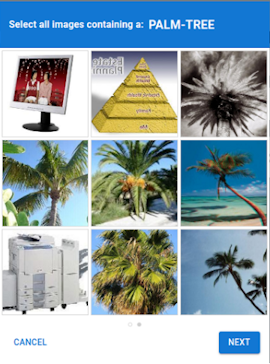

import Tabs from '@theme/Tabs';
import TabItem from '@theme/TabItem';
import ParamItem from '@theme/ParamItem';
import MethodItem from '@theme/MethodItem';
import MethodDescription from '@theme/MethodDescription'
import PriceBlock from '../../../../../src/theme/PriceBlock';
import PriceBlockWrap from '@theme/PriceBlockWrap';
import { ArticleHead } from '../../../../../src/theme/ArticleHead';

<ArticleHead slug="captchas/prosopo-task" />

# Prosopo Procaptcha

<PriceBlockWrap>
  <PriceBlock title="Prosopo captcha" captchaId="prosopo"/>
</PriceBlockWrap>



:::warning **Atenção!**
O CapMonster Cloud, por padrão, funciona com proxies integrados — já incluídos no custo do serviço. É necessário especificar seus próprios proxies apenas nos casos em que o site não aceita o token ou quando o acesso aos serviços integrados está restrito.

Se o proxy utiliza autenticação por IP, é necessário adicionar o endereço **65.21.190.34** à lista de permissões (whitelist).
:::

O método automático de resolução de CAPTCHA baseado em tokens Prosopo Procaptcha.

## Parâmetros da solicitação

  <TabItem value="proxy" label="ProsopoTask (com proxy)" default className="bordered-panel">

    <ParamItem title="type" required type="string" />
    **ProsopoTask**

    ---

    <ParamItem title="websiteURL" required type="string" />
    A URL completa da página do CAPTCHA.

    ---

    <ParamItem title="websiteKey" required type="string" />
    O valor do parâmetro `siteKey` encontrado na página.

	---

	<ParamItem title="proxyType" type="string" />
	**http** - proxy regular http/https;<br />**https** - use essa opção apenas se "http" não funcionar (necessário para alguns proxies personalizados);<br />**socks4** - proxy socks4;<br />**socks5** - proxy socks5.

	---

	<ParamItem title="proxyAddress" type="string" />
	<p>
	Endereço IP do proxy IPv4/IPv6. Não permitido:
	- uso de proxies transparentes (onde é possível ver o IP do cliente);
	- uso de proxies em máquinas locais.
	</p>

	---

	<ParamItem title="proxyPort" type="integer" />
	Porta do proxy.

	---

	<ParamItem title="proxyLogin" type="string" />
	Login do servidor proxy.

	---

	<ParamItem title="proxyPassword" type="string" />
	Senha do servidor proxy.

  </TabItem>


## Criar método de tarefa
<Tabs className="full-width-tabs filled-tabs request-tabs" groupId="captcha-type">
  <TabItem value="proxyless" label="ProsopoTask (sem proxy)" default className="method-panel">
	<MethodItem>
		```http
		https://api.capmonster.cloud/createTask
		```
	</MethodItem>
	<MethodDescription>
		**Solicitação**
		```json
		{
			"clientKey": "API_KEY",
			"task": 
			{
				"type": "ProsopoTask",
				"websiteURL": "https://www.example.com",
				"websiteKey": "5EZU3LG31uzq1Mwi8inwqxmfvFDpj7VzwDnZwj4Q3syyxBwV"
			}
		}
		```
		**Resposta**
		```json
		{
			"errorId":0,
			"taskId":407533077
		}
		```
	</MethodDescription>
  </TabItem>

  <TabItem value="proxy" label="ProsopoTask (com proxy)" default className="method-panel">
	<MethodItem>
		```http
		https://api.capmonster.cloud/createTask
		```
	</MethodItem>
	<MethodDescription>
		**Solicitação**
		```json
		{
			"clientKey": "API_KEY",
			"task": 
			{
				"type": "ProsopoTask",
				"websiteURL": "https://www.example.com",
				"websiteKey": "5EZU3LG31uzq1Mwi8inwqxmfvFDpj7VzwDnZwj4Q3syyxBwV",
				"proxyType":"http",
				"proxyAddress":"8.8.8.8",
				"proxyPort":8080,
				"proxyLogin":"proxyLoginHere",
				"proxyPassword":"proxyPasswordHere"
			}
		}
		```
		**Resposta**
		```json
		{
			"errorId":0,
			"taskId":407533077
		}
		```
	</MethodDescription>
  </TabItem>
</Tabs>


## Obter resultado da tarefa
Use o método [getTaskResult](../api/methods/get-task-result.mdx) para obter a solução Prosopo.

<TabItem value="proxyless" label="CustomTask (without proxy)" default className="method-panel-full">
	<MethodItem>
		```http
		https://api.capmonster.cloud/getTaskResult
		```
	</MethodItem>
	<MethodDescription>
		**Solicitação**
		```json
		{
			"clientKey":"API_KEY",
			"taskId": 407533077
		}
		```
		**Resposta**
		```json
		{
			"errorId":0,
			"status":"ready",
			"solution": 
			{
				"token": "0x00016c68747470733a2f2f70726f6e6f6465332e70726f736f706f2e696fc0354550516f4d5a454463354c704e376774784d4d7a5950547a4136..."
			}
		}
		```
	</MethodDescription>
</TabItem>

## Como encontrar o websiteKey

1. Abra o site onde a captcha Prosopo é exibida.

2. Vá para **Ferramentas de Desenvolvedor** (**DevTools**) → **Network**, recarregue a página e localize a requisição que carrega a `image` (por exemplo, a requisição de API `https://example.prosopo.io/v1/prosopo/provider/client/captcha/image`).

3. Em **Request Headers**, encontre o parâmetro `Prosopo-Site-Key`, copie seu valor e use-o ao criar a requisição.


## Usar biblioteca SDK

<Tabs className="full-width-tabs filled-tabs request-tabs" groupId="captcha-type">

  <TabItem value="js" label="JavaScript" default className="method-panel">
<details>
      <summary>Mostrar Código (para navegador)</summary>
```js
// https://github.com/ZennoLab/capmonstercloud-client-js

import { CapMonsterCloudClientFactory, ClientOptions, ProsopoRequest } from '@zennolab_com/capmonstercloud-client';

const API_KEY = "YOUR_API_KEY"; // Insira sua chave de API do CapMonster Cloud

document.addEventListener("DOMContentLoaded", async () => {
    const client = CapMonsterCloudClientFactory.Create(
        new ClientOptions({ clientKey: API_KEY })
    );

    // Exemplo básico sem proxy
    // O CapMonster Cloud usa automaticamente seus próprios proxies
    let prosopoRequest = new ProsopoRequest({
        websiteURL: "https://www.example.com",       // URL da página com ProCaptcha
        websiteKey: "5EZU3LG31uzq1Mwi8inwqxmfvFDpj7VzwDnZwj4Q3syyxBwV" // Sua sitekey do ProCaptcha (chave pública)
    });

    // Exemplo de uso do seu próprio proxy
    // Descomente este bloco se quiser usar um proxy personalizado
    /*
    const proxy = {
        proxyType: "http",
        proxyAddress: "123.45.67.89",
        proxyPort: 8000,
        proxyLogin: "username",
        proxyPassword: "password"
    };

    prosopoRequest = new ProsopoRequest({
        websiteURL: "https://www.example.com",      
        websiteKey: "5EZU3LG31uzq1Mwi8inwqxmfvFDpj7VzwDnZwj4Q3syyxBwV",
        proxy,
        userAgent: "userAgentPlaceholder"
    });
    */

    // Se necessário, você pode verificar o saldo
    const balance = await client.getBalance();
    console.log("Balance:", balance);

    const result = await client.Solve(prosopoRequest);
    console.log("Solution:", result);
});
```
</details>

<details>
      <summary>Mostrar Código (Node.js)</summary>
```javascript
// https://github.com/ZennoLab/capmonstercloud-client-js

import { CapMonsterCloudClientFactory, ClientOptions, ProsopoRequest } from '@zennolab_com/capmonstercloud-client';

const API_KEY = "YOUR_API_KEY";  // Insira sua chave de API do CapMonster Cloud

async function solveProCaptcha() {
    const client = CapMonsterCloudClientFactory.Create(
        new ClientOptions({ clientKey: API_KEY })
    );

    // Exemplo básico sem proxy
    // O CapMonster Cloud usa automaticamente seus próprios proxies
    let prosopoRequest = new ProsopoRequest({
        websiteURL: "https://www.example.com",       // URL da página com ProCaptcha
        websiteKey: "5EZU3LG31uzq1Mwi8inwqxmfvFDpj7VzwDnZwj4Q3syyxBwV" // Sua sitekey do ProCaptcha (chave pública)
    });

    // Exemplo de uso do seu próprio proxy
    // Descomente este bloco se quiser usar um proxy personalizado
    /*
    const proxy = {
        proxyType: "http",
        proxyAddress: "123.45.67.89",
        proxyPort: 8000,
        proxyLogin: "username",
        proxyPassword: "password"
    };

    prosopoRequest = new ProsopoRequest({
        websiteURL: "https://www.example.com",      
        websiteKey: "5EZU3LG31uzq1Mwi8inwqxmfvFDpj7VzwDnZwj4Q3syyxBwV",
        proxy,
        userAgent: "userAgentPlaceholder"
    });
    */

    // Se necessário, você pode verificar o saldo
    const balance = await client.getBalance();
    console.log("Balance:", balance);

    const result = await client.Solve(prosopoRequest);
    console.log("Solution:", result);
}

solveProCaptcha().catch(console.error);
```
</details>

  </TabItem>

  <TabItem value="python" label="Python" default className="method-panel">
<details>
      <summary>Mostrar Código</summary>
```python
# https://github.com/ZennoLab/capmonstercloud-client-python

import asyncio
from capmonstercloudclient import CapMonsterClient, ClientOptions
from capmonstercloudclient.requests import ProsopoTaskRequest
# from capmonstercloudclient.requests.baseRequestWithProxy import ProxyInfo  # Descomente se você planeja usar um proxy

API_KEY = "YOUR_API_KEY"  # Insira sua chave de API do CapMonster Cloud

async def solve_prosopo_captcha():
    client_options = ClientOptions(api_key=API_KEY)
    cap_monster_client = CapMonsterClient(options=client_options)

    # Exemplo básico sem proxy
    # O CapMonster Cloud usa automaticamente seus próprios proxies
    prosopo_request = ProsopoTaskRequest(
        websiteUrl="https://www.example.com",  
        websiteKey="5EZU3LG31uzq1Mwi8inwqxmfvFDpj7VzwDnZwj4Q3syyxBwV"
    )

    # Exemplo de uso do seu próprio proxy
    # Descomente este bloco se quiser usar um proxy personalizado
    # proxy = ProxyInfo(
    #     proxyType="http",
    #     proxyAddress="123.45.67.89",
    #     proxyPort=8080,
    #     proxyLogin="username",
    #     proxyPassword="password"
    # )
    #
    # prosopo_request = ProsopoTaskRequest(
    #     websiteUrl="https://www.example.com",
    #     websiteKey="5EZU3LG31uzq1Mwi8inwqxmfvFDpj7VzwDnZwj4Q3syyxBwV",
    #     proxy=proxy
    # )

    # Se necessário, você pode verificar o saldo
    balance = await cap_monster_client.get_balance()
    print("Balance:", balance)

    result = await cap_monster_client.solve_captcha(prosopo_request)
    print("Solution:", result)

asyncio.run(solve_prosopo_captcha())
```
</details>
  </TabItem>

  <TabItem value="csharp" label="C#" className="method-panel">
<details>
      <summary>Mostrar Código</summary>
```csharp
// https://github.com/ZennoLab/capmonstercloud-client-dotnet

using System;
using System.Threading.Tasks;
using Zennolab.CapMonsterCloud;
using Zennolab.CapMonsterCloud.Requests;

class Program
{
    static async Task Main(string[] args)
    {
        // Insira sua chave de API do CapMonster Cloud
        var clientOptions = new ClientOptions
        {
            ClientKey = "YOUR_API_KEY"
        };

        var cmCloudClient = CapMonsterCloudClientFactory.Create(clientOptions);

        // Exemplo básico sem proxy
        // O CapMonster Cloud usa automaticamente seus próprios proxies
        var prosopoRequest = new ProsopoTaskRequest
        {
            WebsiteUrl = "https://www.example.com",      // URL da página com ProCaptcha
            WebsiteKey = "5DCKg3w9AvDW92uBzRWrvTiWsu573bTzYmFny8EkXQZxsBib", // Sua sitekey do ProCaptcha (chave pública)

            UserAgent = "userAgentPlaceholder"
        };

        // Exemplo de uso do seu próprio proxy
        // Descomente este bloco se quiser usar um proxy personalizado
        /*
        prosopoRequest = new ProsopoTaskRequest
        {
            WebsiteUrl = "https://www.example.com",
            WebsiteKey = "5DCKg3w9AvDW92uBzRWrvTiWsu573bTzYmFny8EkXQZxsBib",
            UserAgent = "userAgentPlaceholder",

            Proxy = new ProxyContainer(
                "123.45.67.89",   
                8080,             
                ProxyType.Http,  
                "username", 
                "password"
            )
        };
        */

        // Se necessário, você pode verificar o saldo
        var balance = await cmCloudClient.GetBalanceAsync();
        Console.WriteLine("Balance: " + balance);

        var prosopoResult = await cmCloudClient.SolveAsync(prosopoRequest);

        Console.WriteLine("ProCaptcha Solution: " + prosopoResult.Solution.Value);
    }
}
```
</details>
  </TabItem>

</Tabs>
