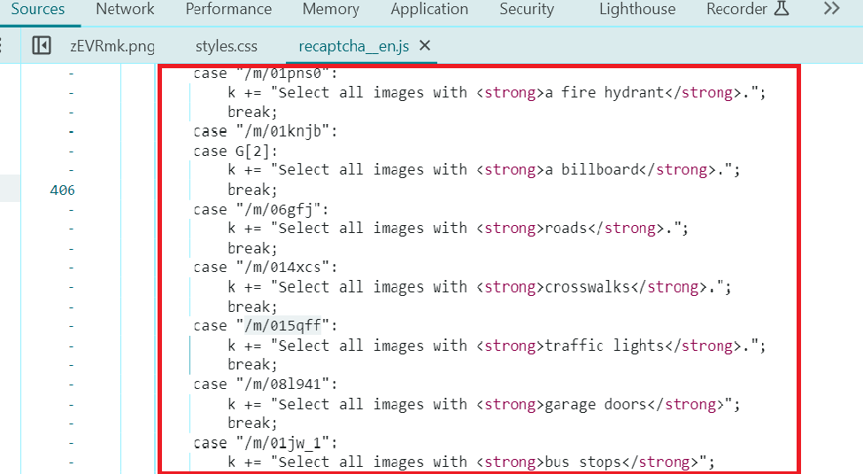

---
sidebar_position: 4
sidebar_label: reCAPTCHA (click)
---

import Tabs from '@theme/Tabs';
import TabItem from '@theme/TabItem';
import ParamItem from '@theme/ParamItem';
import MethodItem from '@theme/MethodItem';
import MethodDescription from '@theme/MethodDescription'
import PriceBlock from '../../../../../src/theme/PriceBlock';
import PriceBlockWrap from '@theme/PriceBlockWrap';
import { ArticleHead } from '../../../../../src/theme/ArticleHead';

<ArticleHead slug="captchas/recaptcha-click" />

# ComplexImageTask Recaptcha

<PriceBlockWrap>
  <PriceBlock title="reCAPTCHA 2 (3x3)" captchaId="complex-rc2_3x3"/>
  <PriceBlock title="reCAPTCHA 2 (3x3)" captchaId="complex-rc2_3x3_dynamic"/>
  <PriceBlock title="reCAPTCHA 2 (4x4)" captchaId="complex-rc2_4x4"/>
</PriceBlockWrap>

:::warning **Atenção!**
O uso de servidores proxy para esta tarefa não é necessário.
:::


O objeto contém dados sobre a tarefa para resolver o ReCaptcha2 do Google.


## Parâmetros da solicitação
<TabItem value="proxyless" label="RecaptchaV2EnterpriseTaskProxyless (sem proxy)" default className="bordered-panel">
    <ParamItem title="type" required type="string" />
    **ComplexImageTask**

    ---

    <ParamItem title="class" required type="string" />
    **recaptcha**

    ---

    <ParamItem title="imageUrls" required="required (se imagesBase64 não estiver preenchido)" type="array" />
    Imagem única 4x4, [3x3](https://i.postimg.cc/yYjg75Kv/payloadtraffic.jpg) ou uma nova parte de captcha 1x1 (em um array).
    Exemplo: [“[https://i.postimg.cc/yYjg75Kv/img1.jpg](https://i.postimg.cc/yYjg75Kv/payloadtraffic.jpg)”]\

    ---

    <ParamItem title="imagesBase64" required="required (se imageUrls não estiver preenchido)" type="array" />
    Imagem única 4x4, [3x3](https://i.postimg.cc/yYjg75Kv/payloadtraffic.jpg) ou uma nova parte de captcha 1x1 no formato base64 (em um array).
    Exemplo: [ “/9j/4AAQSkZJRgABAQEAAAAAAAD…”]

    ---

    <ParamItem title="Grid (dentro da metadata)" required type="string" />
    Tamanho da grade de imagem.
    Valores possíveis: 4x4, 3x3, 1x1

    ---

    <ParamItem title="TaskDefinition (dentro da metadata)" required="required (se Task não estiver preenchido)" type="string" />
    <p>Valor técnico que define o tipo de tarefa</p><p>**Como obter TaskDefinition**</p><p>Os dados podem ser encontrados nas respostas das solicitações `/recaptcha/{recaptchaApi}/reload` ou `/recaptcha/{recaptchaApi}/userverify`, onde recaptchaApi é "enterprise" ou "api2" dependendo do tipo de Recaptcha. A resposta contém json, onde pode-se obter uma lista de TaskDefinitions para captchas carregados.</p>

    ---

    <ParamItem title="Task (dentro da metadata)" required="required (se TaskDefinition não estiver preenchido)" type="string" />
    Valores possíveis: `Click on traffic lights` e outros <br />
    Nome da tarefa (<u>em inglês</u>).

    ---

    <ParamItem title="userAgent" type="string" />
    O User-Agent do navegador a ser utilizado ao carregar imagens, se os links foram passados em imageUrls. É necessário usar uma assinatura de navegador moderna, caso contrário o Google retornará um erro pedindo para atualizar o navegador.

    ---

    <ParamItem title="websiteURL" type="string" />
    URL da página onde o captcha está sendo resolvido.
  </TabItem>

### Descrição dos parâmetros

**imageUrls**: links para imagens.

**imagesBase64**: imagens no formato Base64.

**Grid (dentro da metadata)**: metadata adicionais relacionados aos tamanhos da grade de imagens.

**TaskDefinition (dentro da metadata)**: identificador/tipo da descrição da tarefa, por exemplo: `/m/015qff` significa "Click on traffic lights".



**Task (dentro da metadata)**: metadata adicionais relacionados à tarefa.

**userAgent**: informações sobre o agente do usuário. Atual userAgent: userAgentPlaceholder

**websiteURL**: endereço da página da web com o captcha.

## Criar tarefa


<TabItem value="proxyless" label="RecaptchaV2TaskProxyless (sem proxy)" default className="method-panel">
<MethodItem>
  ```http
  https://api.capmonster.cloud/createTask
  ```
</MethodItem>
<MethodDescription>
**Solicitação**
```json
{
  "clientKey":"API_KEY",
  "task": {
    "type": "ComplexImageTask",
    "class": "recaptcha",
    "imageUrls":[ "https://i.postimg.cc/yYjg75Kv/payloadtraffic.jpg" ],
    "metadata": {
      "Task": "Click on traffic lights",
      "Grid": "3x3",
      "TaskDefinition": "/m/015qff"
    },
    "userAgent": "userAgentPlaceholder",
    "websiteUrl": "https://lessons.zennolab.com/captchas/recaptcha/v2_simple.php?level=middle"
  }
}
```
**Resposta**
```json
{
  "errorId":0,
  "taskId":407533072
}
```

</MethodDescription>
</TabItem>


## Obter resultado da tarefa
Use o método [getTaskResult](../api/methods/get-task-result.mdx) para obter a solução do captcha. Dependendo da carga do sistema, você receberá uma resposta em um intervalo de tempo de 300ms a 6s.

<TabItem value="proxyless" label="GeeTestTaskProxyless (sem proxy)" default className="method-panel-full">
    <MethodItem>
```http
https://api.capmonster.cloud/getTaskResult
```
    </MethodItem>
    <MethodDescription>
**Solicitação**
```json
{
  "clientKey":"API_KEY",
  "taskId": 407533072
}
```
**Resposta**
```json
{
  "errorId":0,
  "status":"ready",
  "solution": {
    "answer": [ false, false, false, false, true, false, false, false, false ]
  }
}
```
  </MethodDescription>
  </TabItem>

<br />

|**Propriedade**|**Tipo**|**Descrição**|
| :- | :- | :- |
|answer|Array|Lista com valores booleanos, "true" significa que você precisa clicar na imagem correspondente a essa posição.|

## Como Encontrar Todos os Parâmetros Necessários para a Criação da Tarefa

### Manualmente

1. Abra seu site onde o captcha aparece no navegador.
2. Clique com o botão direito no elemento do captcha e selecione **Inspecionar**.

#### websitekey:

O processo é semelhante a encontrar o websitekey para [ReCaptchaV2Task](https://docs.capmonster.cloud/pt-br/docs/captchas/no-captcha-task#como-encontrar-todos-os-parâmetros-necessários-para-a-criação-da-tarefa) e [ReCaptchaV2Enterprise](https://docs.capmonster.cloud/pt-br/docs/captchas/recaptcha-v2-enterprise-task#como-encontrar-todos-os-parâmetros-necessários-para-a-criação-da-tarefa).

#### imageUrls:

Encontre a URL nos atributos do elemento:


Você também pode obter a URL completa da imagem clicando com o botão direito na imagem e selecionando **Abrir imagem em uma nova guia**. Em seguida, copie a URL diretamente da barra de endereços do navegador.


#### Task (dentro da metadata)

Descrição da tarefa. Clique com o botão direito no texto da tarefa e, nas **Ferramentas do Desenvolvedor**, encontre o elemento correspondente na estrutura da página:


### Automaticamente

Para automatizar a extração dos parâmetros, eles podem ser obtidos via **navegador** (normal ou headless, por exemplo, usando **Playwright**) ou diretamente a partir de **requisições HTTP**. Como os valores dos parâmetros dinâmicos têm curta duração, recomenda-se utilizá-los imediatamente após a extração.

:::warning **Importante!**
Os trechos de código fornecidos são exemplos básicos para aprendizado sobre como extrair os parâmetros necessários. A implementação exata dependerá do seu site com captcha, sua estrutura e os elementos HTML e seletores utilizados.
:::

<Tabs className="full-width-tabs filled-tabs request-tabs">
  <TabItem value="js" label="JavaScript" default className="method-panel">
    <details>
      <summary>Mostrar código (para navegador)</summary>
      ```js
      const img = document.querySelector('img.rc-image-tile-33') || document.querySelector('img.rc-image-tile-44');
      const src = img ? img.src : null;
      console.log(src);

      // Descrição da tarefa
      const descEl =
        document.querySelector('.rc-imageselect-desc-no-canonical') ||
        document.querySelector('.rc-imageselect-desc');

      const taskDescription = descEl
        ? descEl.textContent.trim()
        : 'Descrição da tarefa não encontrada';

      console.log(taskDescription);

      // Número de blocos visíveis
      const tiles = document.querySelectorAll('.rc-imageselect-tile');
      const visibleTiles = Array.from(tiles).filter(tile => tile.offsetParent !== null);

      const tileCount = visibleTiles.length;

      let gridSize;
      if (tileCount === 9) {
        gridSize = '3x3';
      } else if (tileCount === 16) {
        gridSize = '4x4';
      } else if (tileCount === 25) {
        gridSize = '5x5';
      } else {
        gridSize = 'Desconhecido';
      }

      console.log(`Tamanho da grade: ${gridSize}`);
      ```
    </details>
    <details>
      <summary>Mostrar código (Node.js)</summary>
      ```js
      import { chromium } from "playwright";

      async function extractCaptchaInfo() {
        const browser = await chromium.launch({ headless: false });
        const page = await browser.newPage();

        const url =
          "https://lessons.zennolab.com/captchas/recaptcha/v2_simple.php?level=high";
        await page.goto(url);

        const frames = page.frames();
        const checkboxFrame = frames.find((f) => f.url().includes("api2/anchor"));

        if (!checkboxFrame) {
          console.error("Iframe de checkbox para reCAPTCHA não encontrado");
          await browser.close();
          return;
        }

        const checkbox = await checkboxFrame.waitForSelector("#recaptcha-anchor", {
          timeout: 5000,
        });
        await checkbox.click();

        await page.waitForTimeout(1000);
        const updatedFrames = page.frames();
        const challengeFrame = updatedFrames.find((f) =>
          f.url().includes("api2/bframe")
        );

        if (!challengeFrame) {
          console.error("Iframe de desafio para reCAPTCHA não encontrado");
          await browser.close();
          return;
        }

        // Imagem
        const img =
          (await challengeFrame.$("img.rc-image-tile-33")) ||
          (await challengeFrame.$("img.rc-image-tile-44"));
        const src = img ? await img.getAttribute("src") : null;
        console.log("Imagem:", src);

        // Tarefa
        try {
          await challengeFrame.waitForSelector(
            ".rc-imageselect-desc-no-canonical, .rc-imageselect-desc",
            {
              timeout: 5000,
            }
          );
          const taskDescription = await challengeFrame.$eval(
            ".rc-imageselect-desc-no-canonical, .rc-imageselect-desc",
            (el) => {
              const strong = el.querySelector("strong");
              const text = strong ? strong.textContent.trim() : "Não encontrado";
              return text;
            }
          );
          console.log("Tarefa: selecione todas as imagens com:", taskDescription);
        } catch (error) {
          console.log("Descrição da tarefa não encontrada.");
        }

        // Tamanho da grade
        const tiles = await challengeFrame.$$(".rc-imageselect-tile");
        const visibleTiles = await Promise.all(tiles.map((tile) => tile.isVisible()));
        const tileCount = visibleTiles.filter(Boolean).length;

        let gridSize;
        if (tileCount === 9) {
          gridSize = "3x3";
        } else if (tileCount === 16) {
          gridSize = "4x4";
        } else if (tileCount === 25) {
          gridSize = "5x5";
        } else {
          gridSize = "Desconhecido";
        }

        console.log(`Tamanho da grade: ${gridSize}`);

        await browser.close();
      }

      extractCaptchaInfo();
      ```
    </details>
  </TabItem>

  <TabItem value="python" label="Python" className="method-panel">
    <details>
      <summary>Mostrar código</summary>
      ```python
      import asyncio
      from playwright.async_api import async_playwright

      async def extract_captcha_info():
          async with async_playwright() as p:
              browser = await p.chromium.launch(headless=False)
              page = await browser.new_page()

              await page.goto("https://lessons.zennolab.com/captchas/recaptcha/v2_simple.php?level=high")

              # Encontrar o iframe do checkbox
              checkbox_frame = next((f for f in page.frames if "api2/anchor" in f.url), None)
              if not checkbox_frame:
                  print("Iframe de checkbox para reCAPTCHA não encontrado")
                  await browser.close()
                  return

              checkbox = await checkbox_frame.wait_for_selector("#recaptcha-anchor", timeout=5000)
              await checkbox.click()

              await page.wait_for_timeout(1000)

              # Encontrar o iframe de desafio
              challenge_frame = next((f for f in page.frames if "api2/bframe" in f.url), None)
              if not challenge_frame:
                  print("Iframe de desafio para reCAPTCHA não encontrado")
                  await browser.close()
                  return

              # Imagem: procurar por classes rc-image-tile-33 ou rc-image-tile-44
              img = await challenge_frame.query_selector("img.rc-image-tile-33") or await challenge_frame.query_selector("img.rc-image-tile-44")
              src = await img.get_attribute("src") if img else None
              print("Imagem:", src)

              # Tarefa
              try:
                  await challenge_frame.wait_for_selector(".rc-imageselect-desc-no-canonical, .rc-imageselect-desc", timeout=5000)
                  task_text = await challenge_frame.eval_on_selector(
                      ".rc-imageselect-desc-no-canonical, .rc-imageselect-desc",
                      "el => el.querySelector('strong')?.textContent?.trim() || 'Não encontrado'"
                  )
                  print("Tarefa: selecione todas as imagens com:", task_text)
              except:
                  print("Descrição da tarefa não encontrada.")

              # Tamanho da grade
              tiles = await challenge_frame.query_selector_all(".rc-imageselect-tile")
              visible_count = 0
              for tile in tiles:
                  if await tile.is_visible():
                      visible_count += 1

              if visible_count == 9:
                  grid = "3x3"
              elif visible_count == 16:
                  grid = "4x4"
              elif visible_count == 25:
                  grid = "5x5"
              else:
                  grid = "Desconhecido"

              print("Tamanho da grade:", grid)
              await browser.close()

      asyncio.run(extract_captcha_info())
      ```
    </details>
  </TabItem>

  <TabItem value="csharp" label="C#" className="method-panel">
    <details>
      <summary>Mostrar código</summary>
      ```csharp
      using System;
      using System.Linq;
      using System.Threading.Tasks;
      using Microsoft.Playwright;

      class Program
      {
          public static async Task Main()
          {
              using var playwright = await Playwright.CreateAsync();
              var browser = await playwright.Chromium.LaunchAsync(new() { Headless = false });
              var page = await browser.NewPageAsync();

              await page.GotoAsync("https://lessons.zennolab.com/captchas/recaptcha/v2_simple.php?level=high");

              var checkboxFrame = page.Frames.FirstOrDefault(f => f.Url.Contains("api2/anchor"));
              if (checkboxFrame == null)
              {
                  Console.WriteLine("Iframe de checkbox para reCAPTCHA não encontrado");
                  await browser.CloseAsync();
                  return;
              }

              var checkbox = await checkboxFrame.WaitForSelectorAsync("#recaptcha-anchor");
              await checkbox.ClickAsync();

              await page.WaitForTimeoutAsync(1000);

              var challengeFrame = page.Frames.FirstOrDefault(f => f.Url.Contains("api2/bframe"));
              if (challengeFrame == null)
              {
                  Console.WriteLine("Iframe de desafio para reCAPTCHA não encontrado");
                  await browser.CloseAsync();
                  return;
              }

              // Procurar imagem com classes rc-image-tile-33 ou rc-image-tile-44
              var img = await challengeFrame.QuerySelectorAsync("img.rc-image-tile-33") ?? await challengeFrame.QuerySelectorAsync("img.rc-image-tile-44");
              var src = img != null ? await img.GetAttributeAsync("src") : null;
              Console.WriteLine("Imagem: " + src);

              try
              {
                  await challengeFrame.WaitForSelectorAsync(".rc-imageselect-desc-no-canonical, .rc-imageselect-desc");
                  var taskText = await challengeFrame.EvalOnSelectorAsync<string>(
                      ".rc-imageselect-desc-no-canonical, .rc-imageselect-desc",
                      @"el => {
                          const strong = el.querySelector('strong');
                          return strong ? strong.textContent.trim() : 'Não encontrado';
                      }");
                  Console.WriteLine("Tarefa: selecione todas as imagens com: " + taskText);
              }
              catch
              {
                  Console.WriteLine("Descrição da tarefa não encontrada.");
              }

              var tiles = await challengeFrame.QuerySelectorAllAsync(".rc-imageselect-tile");
              int visibleCount = 0;
              foreach (var tile in tiles)
              {
                  if (await tile.IsVisibleAsync())
                      visibleCount++;
              }

              string gridSize = visibleCount switch
              {
                  9 => "3x3",
                  16 => "4x4",
                  25 => "5x5",
                  _ => "Desconhecido"
              };

              Console.WriteLine("Tamanho da grade: " + gridSize);
              await browser.CloseAsync();
          }
      }
      ```
    </details>
  </TabItem>
</Tabs>

## Usar biblioteca SDK

<Tabs className="full-width-tabs filled-tabs request-tabs" groupId="captcha-type">
  <TabItem value="js" label="JavaScript" default className="method-panel">
  <details>
      <summary>Mostrar Código (para navegador)</summary>
    ```js
    // https://github.com/ZennoLab/capmonstercloud-client-js

    import { CapMonsterCloudClientFactory, ClientOptions, ComplexImageRecaptchaRequest } from '@zennolab_com/capmonstercloud-client';

    document.addEventListener('DOMContentLoaded', async () => {
        const cmcClient = CapMonsterCloudClientFactory.Create(
            new ClientOptions({ clientKey: 'YOUR_API_KEY' }) // Insira sua chave de API do CapMonster Cloud
        );

        // Se necessário, você pode verificar o saldo
        const balance = await cmcClient.getBalance();
        console.log("Balance:", balance);

        const complexImageRecaptchaRequest = new ComplexImageRecaptchaRequest({
            imageUrls: ['https://i.postimg.cc/yYjg75Kv/payloadtraffic.jpg'], // Substitua pelos valores reais
            metaData: {
                Grid: '3x3',
                Task: 'Please click each image containing a mountain',
                TaskDefinition: '/m/015qff'
            },
            websiteURL: 'https://lessons.zennolab.com/captchas/recaptcha/v2_simple.php?level=middle' // URL da página com o captcha
        });

        const result = await cmcClient.Solve(complexImageRecaptchaRequest);
        console.log("Solution:", result);
    });
    ```
    </details>

    <details>
      <summary>Mostrar Código (Node.js)</summary>
```javascript
// https://github.com/ZennoLab/capmonstercloud-client-js

import { CapMonsterCloudClientFactory, ClientOptions, ComplexImageRecaptchaRequest } from '@zennolab_com/capmonstercloud-client';

const API_KEY = "YOUR_API_KEY"; // Insira sua chave de API do CapMonster Cloud

async function solveComplexImageRecaptcha() {
    const cmcClient = CapMonsterCloudClientFactory.Create(
        new ClientOptions({ clientKey: API_KEY })
    );

    // Se necessário, você pode verificar o saldo
    const balance = await cmcClient.getBalance();
    console.log("Balance:", balance);

    const complexImageRecaptchaRequest = new ComplexImageRecaptchaRequest({
        imageUrls: ['https://i.postimg.cc/yYjg75Kv/payloadtraffic.jpg'], // Substitua pelos valores reais
        metaData: {
            Grid: '3x3',
            Task: 'Please click each image containing a mountain',
            TaskDefinition: '/m/015qff'
        },
        websiteURL: 'https://lessons.zennolab.com/captchas/recaptcha/v2_simple.php?level=middle' // URL da página com o captcha
    });

    const result = await cmcClient.Solve(complexImageRecaptchaRequest);
    console.log("Solution:", result);
}

solveComplexImageRecaptcha().catch(console.error);
```
</details>
	
  </TabItem>
  
  <TabItem value="python" label="Python" className="method-panel">
  <details>
      <summary>Mostrar Código</summary>
    ```python
    # https://github.com/ZennoLab/capmonstercloud-client-python

    import asyncio
    from capmonstercloudclient import CapMonsterClient, ClientOptions
    from capmonstercloudclient.requests import RecaptchaComplexImageTaskRequest

    # Insira sua chave de API do CapMonster Cloud
    client_options = ClientOptions(api_key="YOUR_API_KEY")
    cap_monster_client = CapMonsterClient(options=client_options)

    complex_image_recaptcha_request = RecaptchaComplexImageTaskRequest(
        imagesUrls=["https://i.postimg.cc/yYjg75Kv/payloadtraffic.jpg"],  # Substitua pelos valores reais
        metadata={
            "Task": "Click on traffic lights",
            "Grid": "3x3",
            "TaskDefinition": "/m/015qff",
            "websiteUrl": "https://lessons.zennolab.com/captchas/recaptcha/v2_simple.php?level=middle"  # URL da página com o captcha
        }
    )

    async def solve_captcha():
        # Se necessário, você pode verificar o saldo
        balance = await cap_monster_client.get_balance()
        print("Balance:", balance)

        solution = await cap_monster_client.solve_captcha(complex_image_recaptcha_request)
        return solution

    responses = asyncio.run(solve_captcha())
    print("Solution:", responses)
    ```
</details>
	
  </TabItem>
  
  <TabItem value="csharp" label="C#" className="method-panel">
  <details>
      <summary>Mostrar Código</summary>
    ```csharp
    // https://github.com/ZennoLab/capmonstercloud-client-dotnet

    using System;
    using System.Threading.Tasks;
    using Zennolab.CapMonsterCloud.Requests;
    using Zennolab.CapMonsterCloud;

    class Program
    {
        static async Task Main(string[] args)
        {
            var clientOptions = new ClientOptions
            {
                ClientKey = "YOUR_API_KEY" // Insira sua chave de API do CapMonster Cloud
            };

            var cmCloudClient = CapMonsterCloudClientFactory.Create(clientOptions);

            // Se necessário, você pode verificar o saldo
            var balance = await cmCloudClient.GetBalanceAsync();
            Console.WriteLine("Balance: " + balance);

            var complexImageRecaptchaRequest = new RecaptchaComplexImageTaskRequest
            {
                ImageUrls = new[] { "https://i.postimg.cc/yYjg75Kv/payloadtraffic.jpg" }, // Substitua pelos valores reais
                Metadata = new RecaptchaComplexImageTaskRequest.RecaptchaMetadata
                {
                    Task = "Click on traffic lights",
                    Grid = RecaptchaComplexImageTaskRequest.RecaptchaMetadata.GridSize.Grid3x3,
                    TaskDefinition = "/m/015qff"
                }
            };

            var complexImageRecaptchaResult = await cmCloudClient.SolveAsync(complexImageRecaptchaRequest);

            Console.WriteLine("Captcha Solution: " + string.Join(", ", complexImageRecaptchaResult.Solution.Answer));
        }
    }
    ```
    </details>
	
  </TabItem>
</Tabs>
