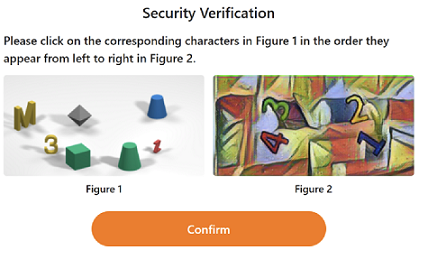
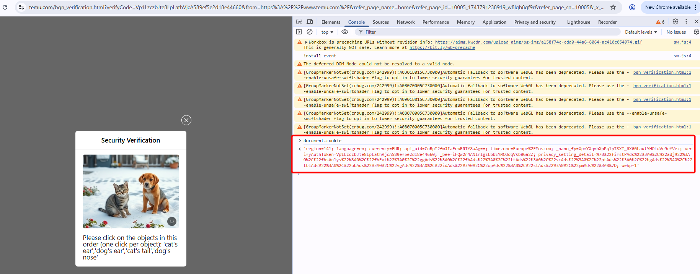

import Tabs from '@theme/Tabs';
import TabItem from '@theme/TabItem';
import ParamItem from '@theme/ParamItem';
import MethodItem from '@theme/MethodItem';
import MethodDescription from '@theme/MethodDescription'
import PriceBlock from '../../../../../src/theme/PriceBlock';
import PriceBlockWrap from '@theme/PriceBlockWrap';
import { ArticleHead } from '../../../../../src/theme/ArticleHead';

<ArticleHead slug="captchas/temu-task" />

# Temu

<PriceBlockWrap>
  <PriceBlock title="Temu captcha" captchaId="temu"/>
</PriceBlockWrap>

## Exemplos de tarefas

<Tabs className="full-width-tabs">
  <TabItem value="temu" label="Slider" default>
    
  </TabItem>
  <TabItem value="temu1" label="Clique">
    
  </TabItem>
</Tabs>

:::warning **Atenção!**
O CapMonster Cloud, por padrão, funciona com proxies integrados — já incluídos no custo do serviço. É necessário especificar seus próprios proxies apenas nos casos em que o site não aceita o token ou quando o acesso aos serviços integrados está restrito.

Se o proxy utiliza autenticação por IP, é necessário adicionar o endereço **65.21.190.34** à lista de permissões (whitelist).
:::

## Parâmetros da solicitação

<TabItem value="proxyless" label="CustomTask (without proxy)" default className="bordered-panel">
    <ParamItem title="type" required type="string" />
    **CustomTask**

    ---

    <ParamItem title="class" required type="string" />
    **Temu**

    ---

    <ParamItem title="websiteURL" required type="string" />
    A URL completa da página onde a CAPTCHA está carregada ( https://www.example.com/bgn_verification.html?....... )

    ---
    <ParamItem title="cookie (dentro da metadata)" required="required" type="string" />
    Cookies obtidos via `document.cookie` na página onde a CAPTCHA está carregada

    ---

    <ParamItem title="userAgent" type="string" />
    User-Agent do navegador. <br />
**Transmita apenas o UA atual do sistema operacional Windows. No momento, o válido é**: `userAgentPlaceholder`


    ---

<ParamItem title="proxyType" type="string" />
**http** - proxy http/https comum;<br />
**https** - tente esta opção apenas se "http" não funcionar (necessário para alguns proxies personalizados);<br />
**socks4** - proxy socks4;<br />
**socks5** - proxy socks5.

---

<ParamItem title="proxyAddress" type="string" />
<p>
Endereço IP do proxy IPv4/IPv6. Não é permitido:
- uso de proxies transparentes (que revelem o IP do cliente);
- uso de proxies em máquinas locais.
</p>

---

<ParamItem title="proxyPort" type="integer" />
Porta do proxy.

---

<ParamItem title="proxyLogin" type="string" />
Login do servidor proxy.

---

<ParamItem title="proxyPassword" type="string" />
Senha do servidor proxy.

</TabItem>


## Método de criação de tarefa

<Tabs className="full-width-tabs filled-tabs request-tabs" groupId="captcha-type">

<TabItem value="proxyless" label="CustomTask (sem proxy)" default className="method-panel">
	<MethodItem>
		```http
		https://api.capmonster.cloud/createTask
		```
	</MethodItem>
	<MethodDescription>
		**Solicitação**
		```json
		{
			"clientKey": "API_KEY",
			"task": {
				"type": "CustomTask",
				"class": "Temu",
				"websiteURL": "https://www.example.com/bgn_verification.html?verifyCode=7PRQIzDznoFE67ecZYtRTw394f6185143a4af80&from=https%3A%2F%2Fwww.example.com%2F&refer_page_name=home&refer_page_id=10005_1743074140645_cwb6un82rq&refer_page_sn=10005&_x_sessn_id=xmp1zuyv7y",
				"userAgent": "userAgentPlaceholder",
				"metadata": {
					"cookie": "region=141; language=en; currency=EUR; api_uid=CnBpI2fwFW2BogBITHVYAg==; timezone=Europe%2FMoscow; _nano_fp=XpmYXqmJnqX8npXblT_T6~7rkpA2LDnz2BPFuT5m; privacy_setting_detail=%7B%22firstPAds%22%3A0%2C%22adj%22%3A0%2C%22fbsAnlys%22%3A0%2C%22fbEvt%22%3A0%2C%22ggAds%22%3A0%2C%22fbAds%22%3A0%2C%22ttAds%22%3A0%2C%22scAds%22%3A0%2C%22ptAds%22%3A0%2C%22bgAds%22%3A0%2C%22tblAds%22%3A0%2C%22obAds%22%3A0%2C%22vgAds%22%3A0%2C%22idAds%22%3A0%2C%22opAds%22%3A0%2C%22stAds%22%3A0%2C%22pmAds%22%3A0%7D; webp=1; _bee=pgoBlKp038lBhEyoQ4yXnuNrw1X5va2U; verifyAuthToken=QkZmx2TJFbSuuRVD_MKJmA0b84fe3df183da8ab"
				}
			}
		}
		```
		**Resposta**
		```json
		{
		  "errorId":0,
		  "taskId":407533072
		}
		```
	</MethodDescription>
</TabItem>

<TabItem value="proxy" label="CustomTask (com proxy)" default className="method-panel">
	<MethodItem>
		```http
		https://api.capmonster.cloud/createTask
		```
	</MethodItem>
	<MethodDescription>
		**Solicitação**
		```json
		{
			"clientKey": "API_KEY",
			"task": {
				"type": "CustomTask",
				"class": "Temu",
				"websiteURL": "https://www.example.com/bgn_verification.html?verifyCode=7PRQIzDznoFE67ecZYtRTw394f6185143a4af80&from=https%3A%2F%2Fwww.example.com%2F&refer_page_name=home&refer_page_id=10005_1743074140645_cwb6un82rq&refer_page_sn=10005&_x_sessn_id=xmp1zuyv7y",
				"userAgent": "userAgentPlaceholder",
				"metadata": {
					"cookie": "region=141; language=en; currency=EUR; api_uid=CnBpI2fwFW2BogBITHVYAg==; timezone=Europe%2FMoscow; _nano_fp=XpmYXqmJnqX8npXblT_T6~7rkpA2LDnz2BPFuT5m; privacy_setting_detail=%7B%22firstPAds%22%3A0%2C%22adj%22%3A0%2C%22fbsAnlys%22%3A0%2C%22fbEvt%22%3A0%2C%22ggAds%22%3A0%2C%22fbAds%22%3A0%2C%22ttAds%22%3A0%2C%22scAds%22%3A0%2C%22ptAds%22%3A0%2C%22bgAds%22%3A0%2C%22tblAds%22%3A0%2C%22obAds%22%3A0%2C%22vgAds%22%3A0%2C%22idAds%22%3A0%2C%22opAds%22%3A0%2C%22stAds%22%3A0%2C%22pmAds%22%3A0%7D; webp=1; _bee=pgoBlKp038lBhEyoQ4yXnuNrw1X5va2U; verifyAuthToken=QkZmx2TJFbSuuRVD_MKJmA0b84fe3df183da8ab"
				},
				"proxyType": "http",
				"proxyAddress": "8.8.8.8",
				"proxyPort": 8080,
				"proxyLogin": "proxyLoginHere",
				"proxyPassword": "proxyPasswordHere"
			}
		}
		```
		**Resposta**
		```json
		{
		  "errorId":0,
		  "taskId":407533072
		}
		```
	</MethodDescription>
</TabItem>

</Tabs>

## Método para obter o resultado da tarefa
Use o método [getTaskResult](../api/methods/get-task-result.mdx) para obter a solução Temu.

**Importante!** Após receber a solução, você deve limpar os cookies e definir os novos cookies obtidos. 

<TabItem value="proxyless" label="CustomTask (without proxy)" default className="method-panel-full">
	<MethodItem>
		```http
		https://api.capmonster.cloud/getTaskResult
		```
	</MethodItem>
	<MethodDescription>
		**Solicitação**
		```json
		{
		  "clientKey":"API_KEY",
		  "taskId": 407533072
		}
		```
		**Resposta**
		```json
		{
			"errorId": 0,
			"status": "ready",
			"solution": {
				"domains": {
					"www.example.com": {
						"cookies": {
							"privacy_setting_detail": "%7B%22firstPAds%22%3A1%2C%22adj%22%3A1%2C%22fbsAnlys%22%3A1%2C%22fbEvt%22%3A1%2C%22ggAds%22%3A1%2C%22fbAds%22%3A1%2C%22ttAds%22%3A1%2C%22scAds%22%3A1%2C%22ptAds%22%3A1%2C%22bgAds%22%3A1%2C%22tblAds%22%3A1%2C%22obAds%22%3A1%2C%22vgAds%22%3A1%2C%22idAds%22%3A1%2C%22opAds%22%3A1%2C%22stAds%22%3A1%2C%22pmAds%22%3A1%7D",
							"region": "211",
							"language": "en",
							"currency": "USD",
							"api_uid": "Chgx+mflQkR0G1THhRQIAg",
							"webp": "1",
							"_nano_fp": "XpmYXq98nqUaXpdano_AT7Nbb0dRwziAaAq~s8do",
							"verifyAuthToken": "8VhdGgRPTJaJ0t6msEcXlA598e207617867ac4b",
							"timezone": "America/Buenos_Aires",
							"_bee": "FJBIpQvZnnUGDlamFfP08tIpG1Uyiap2"
						}
					}
				}
			},
		}
		```
	</MethodDescription>
</TabItem>

### Como obter o parâmetro cookie (dentro da metadata)
O valor do parâmetro `cookie` pode ser obtido na página da CAPTCHA via a propriedade `document.cookie`.
 

## Como encontrar todos os parâmetros necessários para a criação da tarefa

### Automaticamente

Para automatizar a extração dos parâmetros, eles podem ser obtidos via **navegador** (normal ou headless, por exemplo, usando **Playwright**) ou diretamente a partir de **requisições HTTP**. Como os valores dos parâmetros dinâmicos têm curta duração, recomenda-se utilizá-los imediatamente após a extração.

:::warning **Importante!**
Os trechos de código fornecidos são exemplos básicos para aprendizado sobre como extrair os parâmetros necessários. A implementação exata dependerá do seu site com captcha, sua estrutura e os elementos HTML e seletores utilizados.
:::

<Tabs className="full-width-tabs filled-tabs request-tabs">
  <TabItem value="js" label="JavaScript" default className="method-panel">
    <details>
      <summary>Mostrar código (Node.js)</summary>

      ```js
      import { chromium } from 'playwright';

      (async () => {
        const browser = await chromium.launch();
        const page = await browser.newPage();

        await page.goto('https://example.com');

        // Obter cookies
        const cookies = await page.context().cookies();
        console.log('Cookies:', cookies);

        await browser.close();
      })();
      ```
    </details>
  </TabItem>

  <TabItem value="python" label="Python" className="method-panel">
    <details>
      <summary>Mostrar código</summary>

      ```python
      import asyncio
      from playwright.async_api import async_playwright

      async def run():
          async with async_playwright() as p:
              browser = await p.chromium.launch()
              page = await browser.new_page()

              await page.goto('https://example.com')

              # Obter cookies
              cookies = await page.context.cookies()
              print('Cookies:', cookies)

              await browser.close()

      asyncio.run(run())
      ```
    </details>
  </TabItem>

  <TabItem value="csharp" label="C#" className="method-panel">
    <details>
      <summary>Mostrar código</summary>

      ```csharp
      using System;
      using System.Linq;
      using System.Threading.Tasks;
      using Microsoft.Playwright;

      class Program
      {
          public static async Task Main()
          {
              using var playwright = await Playwright.CreateAsync();
              var browser = await playwright.Chromium.LaunchAsync(new BrowserTypeLaunchOptions
              {
                  Headless = true
              });

              var context = await browser.NewContextAsync();
              var page = await context.NewPageAsync();

              await page.GotoAsync("https://example.com");

              var cookies = await context.CookiesAsync();
              Console.WriteLine("Cookies:");
              foreach (var cookie in cookies)
              {
                  Console.WriteLine($"{cookie.Name}: {cookie.Value}");
              }

              await browser.CloseAsync();
          }
      }
      ```
    </details>
  </TabItem>
</Tabs>

## Usar biblioteca SDK

<Tabs className="full-width-tabs filled-tabs request-tabs" groupId="captcha-type">

  <TabItem value="js" label="JavaScript" default className="method-panel">
<details>
      <summary>Mostrar Código (para navegador)</summary>
  ```js
  // https://github.com/ZennoLab/capmonstercloud-client-js

import { CapMonsterCloudClientFactory, ClientOptions, TemuRequest } from '@zennolab_com/capmonstercloud-client';

const API_KEY = "YOUR_API_KEY";  // Insira sua chave de API do CapMonster Cloud

document.addEventListener("DOMContentLoaded", async () => {
    const client = CapMonsterCloudClientFactory.Create(
        new ClientOptions({ clientKey: API_KEY })
    );

    // Exemplo básico sem proxy
    // O CapMonster Cloud usa automaticamente seus próprios proxies
    let temuRequest = new TemuRequest({
        class: "Temu",
        websiteURL: "https://www.example.com/bgn_verification.html?verifyCode=",  // URL da página com Temu
        userAgent: "userAgentPlaceholder",                                       // Use um UserAgent atual
        metadata: {
            cookie: "region=141; language=en; currency=EUR; api_uid=CnBpI2fwFW2BogBITHVYAg==; timezone=Europe%2FMoscow; _nano_fp=XpmYXqmJnqX8npXblT_T6~7rkpA2LDnz2BPFuT5m; privacy_setting_detail=%7B%22firstPAds%22%3A0%2C%22adj%22%3A0%2C%22fbsAnlys%22%3A0%2C%22fbEvt%22%3A0%2C%22ggAds%22%3A0%2C%22fbAds%22%3A0%2C%22ttAds%22%3A0%2C%22scAds%22%3A0%2C%22ptAds%22%3A0%2C%22bgAds%22%3A0%2C%22tblAds%22%3A0%2C%22obAds%22%3A0%2C%22vgAds%22%3A0%2C%22idAds%22%3A0%2C%22opAds%22%3A0%2C%22stAds%22%3A0%2C%22pmAds%22%3A0%7D; webp=1; _bee=pgoBlKp038lBhEyoQ4yXnuNrw1X5va2U; verifyAuthToken=QkZmx2TJFbSuuRVD_MKJmA0b84fe3df183da8ab"
        }
    });

    // Exemplo de uso do seu próprio proxy
    // Descomente este bloco se quiser usar um proxy personalizado
    /*
    const proxy = {
        proxyType: "http",
        proxyAddress: "123.45.67.89",
        proxyPort: 8080,
        proxyLogin: "user",
        proxyPassword: "password"
    };

    temuRequest = new TemuRequest({
        class: "Temu",
        websiteURL: "https://www.example.com/bgn_verification.html?verifyCode=",
        userAgent: "userAgentPlaceholder",
        metadata: {
            cookie: "region=141; language=en; currency=EUR; api_uid=CnBpI2fwFW2BogBITHVYAg==; timezone=Europe%2FMoscow"
        },
        proxy
    });
    */

    // Se necessário, você pode verificar o saldo
    const balance = await client.getBalance();
    console.log("Balance:", balance);

    const result = await client.Solve(temuRequest);
    console.log("Solution:", result);
});
```
</details>

<details>
      <summary>Mostrar Código (Node.js)</summary>
```javascript
// https://github.com/ZennoLab/capmonstercloud-client-js

import { CapMonsterCloudClientFactory, ClientOptions, TemuRequest } from '@zennolab_com/capmonstercloud-client';

const API_KEY = "YOUR_API_KEY";  // Insira sua chave de API do CapMonster Cloud

async function solveTemuCaptcha() {
    const client = CapMonsterCloudClientFactory.Create(
        new ClientOptions({ clientKey: API_KEY })
    );

    // Exemplo básico sem proxy
    // O CapMonster Cloud usa automaticamente seus próprios proxies
    let temuRequest = new TemuRequest({
        class: "Temu",
        websiteURL: "https://www.example.com/bgn_verification.html?verifyCode=",  // URL da página com Temu
        userAgent: "userAgentPlaceholder",                                       // Use um UserAgent atual
        metadata: {
            cookie: "region=141; language=en; currency=EUR; api_uid=CnBpI2fwFW2BogBITHVYAg==; timezone=Europe%2FMoscow; _nano_fp=XpmYXqmJnqX8npXblT_T6~7rkpA2LDnz2BPFuT5m; privacy_setting_detail=%7B%22firstPAds%22%3A0%2C%22adj%22%3A0%2C%22fbsAnlys%22%3A0%2C%22fbEvt%22%3A0%2C%22ggAds%22%3A0%2C%22fbAds%22%3A0%2C%22ttAds%22%3A0%2C%22scAds%22%3A0%2C%22ptAds%22%3A0%2C%22bgAds%22%3A0%2C%22tblAds%22%3A0%2C%22obAds%22%3A0%2C%22vgAds%22%3A0%2C%22idAds%22%3A0%2C%22opAds%22%3A0%2C%22stAds%22%3A0%2C%22pmAds%22%3A0%7D; webp=1; _bee=pgoBlKp038lBhEyoQ4yXnuNrw1X5va2U; verifyAuthToken=QkZmx2TJFbSuuRVD_MKJmA0b84fe3df183da8ab"
        }
    });

    // Exemplo de uso do seu próprio proxy
    // Descomente este bloco se quiser usar um proxy personalizado
    /*
    const proxy = {
        proxyType: "http",
        proxyAddress: "123.45.67.89",
        proxyPort: 8080,
        proxyLogin: "user",
        proxyPassword: "password"
    };

    temuRequest = new TemuRequest({
        class: "Temu",
        websiteURL: "https://www.example.com/bgn_verification.html?verifyCode=",
        userAgent: "userAgentPlaceholder",
        metadata: {
            cookie: "region=141; language=en; currency=EUR; api_uid=CnBpI2fwFW2BogBITHVYAg==; timezone=Europe%2FMoscow"
        },
        proxy
    });
    */

    // Se necessário, você pode verificar o saldo
    const balance = await client.getBalance();
    console.log("Balance:", balance);

    const result = await client.Solve(temuRequest);
    console.log("Solution:", result);
}

solveTemuCaptcha().catch(console.error);
```
</details>

  </TabItem>

  <TabItem value="python" label="Python" default className="method-panel">
<details>
      <summary>Mostrar Código</summary>
```python
# https://github.com/ZennoLab/capmonstercloud-client-python

import asyncio
from capmonstercloudclient import CapMonsterClient, ClientOptions
from capmonstercloudclient.requests import TemuCustomTaskRequest
# from capmonstercloudclient.requests.baseRequestWithProxy import ProxyInfo  # Descomente se planeja usar proxy

API_KEY = "YOUR_API_KEY"  # Insira sua chave de API do CapMonster Cloud

async def solve_temu_captcha():
    client_options = ClientOptions(api_key=API_KEY)
    cap_monster_client = CapMonsterClient(options=client_options)

    # Exemplo básico sem proxy
    # O CapMonster Cloud usa automaticamente seus próprios proxies
    temu_request = TemuCustomTaskRequest(
        websiteUrl="https://www.example.com/bgn_verification.html?verifyCode=",  # URL da página com Temu
        userAgent="userAgentPlaceholder",                                       # Use um UserAgent atual
        metadata={
            "cookie": "region=141; language=en; currency=EUR; api_uid=CnBpI2fwFW2BogBITHVYAg==; timezone=Europe%2FMoscow; _nano_fp=XpmYXqmJnqX8npXblT_T6~7rkpA2LDnz2BPFuT5m; privacy_setting_detail=%7B%22firstPAds%22%3A0%2C%22adj%22%3A0%2C%22fbsAnlys%22%3A0%2C%22fbEvt%22%3A0%2C%22ggAds%22%3A0%2C%22fbAds%22%3A0%2C%22ttAds%22%3A0%2C%22scAds%22%3A0%2C%22ptAds%22%3A0%2C%22bgAds%22%3A0%2C%22tblAds%22%3A0%2C%22obAds%22%3A0%2C%22vgAds%22%3A0%2C%22idAds%22%3A0%2C%22opAds%22%3A0%2C%22stAds%22%3A0%2C%22pmAds%22%3A0%7D; webp=1; _bee=pgoBlKp038lBhEyoQ4yXnuNrw1X5va2U; verifyAuthToken=QkZmx2TJFbSuuRVD_MKJmA0b84fe3df183da8ab"
        }
    )

    # Exemplo de uso do seu próprio proxy
    # Descomente este bloco se quiser usar um proxy personalizado

    # proxy = ProxyInfo(
    #     proxyType="http",
    #     proxyAddress="123.45.67.89",
    #     proxyPort=8080,
    #     proxyLogin="username",
    #     proxyPassword="password"
    # )
    #
    # temu_request = TemuCustomTaskRequest(
    #     websiteUrl="https://www.example.com/bgn_verification.html?verifyCode=",
    #     userAgent="userAgentPlaceholder",
    #     metadata={ "cookie": "..." },
    #     proxy=proxy
    # )

    # Se necessário, você pode verificar o saldo
    balance = await cap_monster_client.get_balance()
    print("Balance:", balance)

    result = await cap_monster_client.solve_captcha(temu_request)
    print("Solution:", result)

asyncio.run(solve_temu_captcha())
```
</details>
  </TabItem>

  <TabItem value="csharp" label="C#" className="method-panel">

<details>
      <summary>Mostrar Código</summary>
```csharp
// https://github.com/ZennoLab/capmonstercloud-client-dotnet

using System;
using System.Threading.Tasks;
using Zennolab.CapMonsterCloud;
using Zennolab.CapMonsterCloud.Requests;

class Program
{
    static async Task Main(string[] args)
    {
        // Insira sua chave de API do CapMonster Cloud
        var clientOptions = new ClientOptions
        {
            ClientKey = "YOUR_API_KEY"
        };

        var cmCloudClient = CapMonsterCloudClientFactory.Create(clientOptions);

        // Exemplo básico sem proxy
        // O CapMonster Cloud usa automaticamente seus próprios proxies
        var temuRequest = new TemuCustomTaskRequest(
            cookie: "region=141; language=en; currency=EUR; api_uid=CnBpI2fwFW2BogBITHVYAg==; timezone=Europe%2FMoscow; _nano_fp=XpmYXqmJnqX8npXblT_T6~7rkpA2LDnz2BPFuT5m; privacy_setting_detail=%7B%22firstPAds%22%3A0%2C%22adj%22%3A0%2C%22fbsAnlys%22%3A0%2C%22fbEvt%22%3A0%2C%22ggAds%22%3A0%2C%22fbAds%22%3A0%2C%22ttAds%22%3A0%2C%22scAds%22%3A0%2C%22ptAds%22%3A0%2C%22bgAds%22%3A0%2C%22tblAds%22%3A0%2C%22obAds%22%3A0%2C%22vgAds%22%3A0%2C%22idAds%22%3A0%2C%22opAds%22%3A0%2C%22stAds%22%3A0%2C%22pmAds%22%3A0%7D; webp=1; _bee=pgoBlKp038lBhEyoQ4yXnuNrw1X5va2U; verifyAuthToken=QkZmx2TJFbSuuRVD_MKJmA0b84fe3df183da8ab"
        )
        {
            WebsiteUrl = "https://www.example.com/bgn_verification.html?verifyCode=", // URL страницы с капчей
            UserAgent = "userAgentPlaceholder"                                       // Use um UserAgent atual
        };

        // Exemplo de uso do seu próprio proxy
        // Descomente este bloco se quiser usar um proxy personalizado
        /*
        temuRequest = new TemuCustomTaskRequest(
            cookie: "...long cookie..."
        )
        {
            WebsiteUrl = "https://www.example.com/bgn_verification.html?verifyCode=",
            UserAgent = "userAgentPlaceholder",
            Proxy = new ProxyContainer(
                "123.45.67.89",
                8080,
                ProxyType.Http,
                "proxyLogin",
                "proxyPassword"
            )
        };
        */

        // Se necessário, você pode verificar o saldo
        var balance = await cmCloudClient.GetBalanceAsync();
        Console.WriteLine("Balance: " + balance);

        var temuResult = await cmCloudClient.SolveAsync(temuRequest);

        Console.WriteLine("Temu Solution: " + temuResult.Solution.Domains);
    }
}
```
</details>
  </TabItem>

</Tabs>

